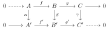
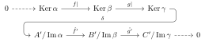
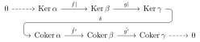
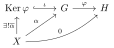
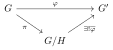
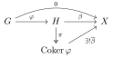
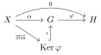

---
categories:
- Mathematics
tags:
- Algebra
- Category Theory
- Note
title: "Year of the Snake, Snake Lemma!"
description: In the Year of the Snake, let me try proving the Snake Lemma too
image: /images/Post Shelter-Inaba Kumori.png
date: 2025-02-27
math: true
draft: false
---

*I've watched so many videos proving the Snake Lemma, so I figured I'd give it a shot too~ It's the Year of the Snake, participation matters, right*

*The featured image is by [Nukunuku Nigirimeshi](https://twitter.com/NKNK_NGRMS), the cover illustration for [Inaba Kumori](https://space.bilibili.com/26040194)'s [Post Shelter](https://www.bilibili.com/video/BV1jS4y1y7Yf/). Support the official release — the trial preview is only 30 seconds though（）*



## Foreword

My zodiac year is here~! As an algebra enthusiast (self-proclaimed, really just a terminology tourist), I've recently seen a lot of videos on Bilibili about how to prove the Snake Lemma, like [this one](https://www.bilibili.com/video/BV1FZFNezE6D). I ran into this lemma back when I was trying to teach myself algebra, but by the time I got to that part I was already about to pass out (probably right after seeing this part I dropped the book, *Algebra: Chapter 0*), so it's almost like I never learned it. Having seen so many videos about the Snake Lemma recently, of course I want to learn it properly, and here I'll make a record of it. In this article you will encounter:

- What are you even talking about?
- You needed prerequisites for something this simple?
- You skipped a step there, didn't you?
- What if my proof is bad? Is proving it in a funny way not allowed either?

...and other blood-pressure-spiking moments like these. For the sake of your physical and mental health, if you seriously want to understand the Snake Lemma, I still do not recommend that you scrutinize this article. Of course, if you're here for entertainment, I hope this article can bring everyone some smiles. The intended audience for this article should have an understanding of the most basic algebra, like sets, functions, and that sort of thing. Having studied linear algebra is even better. Other concepts will be brought up along the way — after all, this was written by a terminology tourist, so the starting point will naturally be low (laughs). Without further ado, let's begin.

$$
\gdef\Ker{\operatorname{Ker}}
\gdef\Coker{\operatorname{Coker}}
\gdef\Img{\operatorname{Im}}
$$

## A Simple (?) Introduction

What exactly is the Snake Lemma? It's a theorem in algebra. Simply put, like many algebraic theorems, it does one thing: creating something new from two existing things. For example, given a set and an equivalence class/relation on the set, we can construct a quotient set; given a group and one of its normal subgroups, we can construct a quotient group; take the Cartesian product of two copies of $\mathbb{R}$, and we get $\mathbb{R}^2$.

So what kind of algebraic objects does the Snake Lemma deal with? Here we need to try to introduce our first concept: Exact Sequences.

### Exact Sequences, But Hold On First

Exact sequences, important objects in homological algebra, arise from chain complexes by imposing special conditions. And what is a chain complex? It's a series of abelian groups or modules connected by homomorphisms, with the composition of any two adjacent homomorphisms being zero.

You might be thinking: good heavens, what on earth are you talking about, what is all this jargon? Since we're assuming the reader only has the most basic algebraic knowledge, let's start from the very beginning. The terminology tourist's favorite jargon-introduction segment — activate!

#### Groups, Abelian Groups

Above we said that a chain complex is made up of abelian groups or modules equipped with homomorphisms. For simplicity, we won't introduce modules and will focus on abelian groups.

But what is a module? I want to see!

If someone talks about modules, you can think of them as a slightly deficient linear space — the only shortcoming is that the scalars are no longer elements of a number field, but rather elements of a ring, a magical algebraic structure where multiplication may lack inverses. Let me point out here: to turn a ring into a field (field, same word in English), you just need the ring to satisfy commutativity and have every nonzero element possess a multiplicative inverse.

So what is an abelian group — or, starting from scratch, what is a group? Some will say: a group is symmetry! Where there's symmetry, there's a group! That's nice, but the step of symbolically encoding geometric elements like symmetry into group elements — that step took me quite a while. Let's do a speedrun, keeping things simple and trying not to lose too much rigor. A group, arguably the most fundamental algebraic structure in algebra, follows — like countless other algebraic structures — these characteristics:

1.  It comes from a set. Its "underlying" structure must be a set. This way we can talk about the elements inside this algebraic object.
2.  It has one or more "operations" internally. We can imagine the multiplication we've long been familiar with. Since it's an operation, we have these requirements:
    1.  First, the operation always involves two elements. You always multiply (at least) two numbers. Note they don't necessarily have to be different numbers.
    2.  The two elements, after the operation, should yield one element. The product of two numbers gives you a number too.
    3.  This is less obvious, but our operation should always go from this set back into this set. For instance, $1\times 1\neq\mathrm{apple}$.

That gives us a (very basic) algebraic structure. And our group is precisely such an algebraic structure, but with these additional characteristics:

1. The group operation must be associative. This means if $abc \neq (ab)c \neq a(bc)$, then it is not a group. (Good heavens, does such a deranged structure even exist?)
2. The group operation does **not** need to be commutative. Actually, non-commutative things are quite common — for example, we put on socks before shoes, which is definitely different from putting socks on over bare feet already in shoes. Friends who have studied linear algebra should understand even better: matrix multiplication is not commutative.
3. The group must have an identity element. What is an identity element? Isn't it just an element? The identity element here is tightly coupled with the operation: it means that any element of the group, when operated with this identity element, always yields itself.
4. Every element in the group must have an inverse. Yes, the concept of an inverse here is also tied to the operation. "Inverse" means "reversing" an element back to the identity element. You can imagine the identity element as some starting position, with each element representing a way to move you somewhere. The inverse of a given element is like the way to move you back to the origin after having moved. You can go out, so you must also be able to come back. That's all.

Actually, the above content, with some tidying up, can be turned into a reasonably rigorous definition of a group. But rigorous definitions can be looked up by anyone, so I'll take the lazy route here~ One thing worth pointing out: the operation on a group is generally just called multiplication. Moreover, in the context of algebra, many operations are all called multiplication! So when discussing multiplication in algebraic structures, do pay attention to the context~

So what's the deal with the symmetry meaning of groups, really?

We say that the positions of elements in a set don't really matter — for example, the set $\{1,2\}$ and the set $\{2,1\}$ are exactly the same. So, the meaning of symmetry in groups lies in the fact that group elements carry a dual significance: a tiny dot inside the set, and a symbol representing how to operate on this set.

We mentioned that the group operation must satisfy a whole bunch of conditions above. These conditions point to the following magical result: when we multiply two elements in a group, we can consciously treat one of the elements as a way of operating, and the other element as one element among the vast (or few, perhaps) elements of the group. And the result of this operation is, again, some element in the group.

Then let's imagine this scene: there's a deck of playing cards on the table, each card placed separately, very neatly. Now you try to rearrange these cards, and the rearrangement method depends on the first card you see before you start rearranging. As you rearrange, you definitely have to pick them up one by one; after picking one up, based on the first card you saw, you think about where it should go, and finally you place it in its corresponding position. After repeating this "pick-look-place" process 54 times, you'll be surprised to discover: good heavens, you've ended up with a deck of playing cards again (?)

You might find this discovery rather boring, but this is exactly symmetry: returning to itself under some operation. You might say: no! The positions have changed! But remember? The positions of elements in a set are irrelevant. What we're really talking about here is the action of a group on itself. So can a group act on other sets? Of course! As long as a way of acting satisfies the conditions of a group — that is, if you do one operation and then another (making two operations, corresponding to the product of two group elements), these two operations together are also one of the operations available to you (the product of group elements remains in the group), along with the other requirements — then you are indeed performing a group action on that set.

The symmetry contained in a group is not about the group itself, but about the objects it can act on. Silly me took a long time to understand this truth QAQ.

---

Great! We now firmly understand what a group is! So, an abelian group? Ah! An abelian group must be one where the operation satisfies commutativity, right!

Yes, the answer is just that simple, and a bit boring. A commutative group (also called an Abelian group, in honor of the great Norwegian algebraist Abel), is simply a group that can commute. You might feel disappointed by abelian groups, but how could algebra be such a boring thing!? The reason for all this is, in fact: we haven't yet introduced homomorphisms.

There's still a difference between abelian groups and ordinary groups, right?

When commutativity is bestowed upon an ordinary group, the extra properties it gains go far beyond commutativity alone. Commutativity gives a group not just the surface-level ability for two elements to commute, but more importantly, imposes stricter constraints on the internal structure of the abelian group. For instance, as will be mentioned later, every subgroup of an abelian group is a normal subgroup, so for any subgroup of an abelian group, you can always quotient it out to form a quotient group.

Abelian groups are so special that people have assigned them a special category: the Abelian Category. In fact, an abelian group is even a module (that is, the algebraic structure we mentioned at the very beginning when introducing the Snake Lemma). However, we don't plan to go into excessive detail about how special abelian groups are here; instead, we'll focus our attention on the operations defined on abelian groups. More specifically, the notation for operations defined on abelian groups, and the related conventions.

We mentioned earlier that the operation defined on a group is called "multiplication." That's an interesting name: why do we call it multiplication? What is the relationship between the multiplication we're familiar with — say, multiplication on $\mathbb{R}$, i.e. real number multiplication, or the matrix multiplication we know from linear algebra — and this "group multiplication"? Let us point out: the real numbers, as a set, when endowed with the multiplication we are already familiar with, form a group; and the matrix multiplication in linear algebra, when all $n\times{n}$ square matrices are regarded as a set, also forms a group when equipped with matrix multiplication.

However, real number multiplication and matrix multiplication are different: real number multiplication satisfies commutativity, while general matrix multiplication does not. Therefore, real number multiplication actually forms an abelian group. Yet from this we can also see that, whether commutativity holds or not, we often give the name "multiplication" to operations that satisfy a certain set of conditions. This is also the reason why the group operation is generally called "multiplication."

But, whether real numbers, matrices, or even the set of integers, vectors, and so on — they all have another operation we are even more familiar with, one we often call "addition." What are the characteristics of these operations compared to multiplication? Some of them, ignoring so-called "commutativity," are actually similar to multiplication. However, when considering matrix addition and matrix multiplication, the difference immediately appears: *matrix addition satisfies commutativity, while multiplication does not*. So we stipulate: the operation of an ordinary group (one that does not satisfy commutativity) is called multiplication, while the operation on an abelian group is called addition. In terms of notation, here's a small table for a more direct comparison.

|  Item  | Ordinary Group | Abelian Group |
| :----: | :----: | :----: |
|  Operation  |  Multiplication  |  Addition  |
|  Notation  |   ab   |  a+b   |
| Left Coset |   aH   |  a+H   |
| Identity |   1    |   0    |
| Commutativity | Not satisfied |  Satisfied  |

One thing to point out here: the above distinctions, when commutativity is not considered, are purely notational. In fact, if you wanted to, you could totally use multiplicative notation — you'd just need to note it specially in the text.

Finally, here's a perspective I'd like to put forward: abstract algebra — the study of the structural properties of algebraic structures like groups, rings, fields, and modules — has two ideal examples for understanding these algebraic structures: first, the integers and their derived structures; second, linear spaces and the matrices on them. Of course, this is just my personal bias; if there are any issues, please forgive me.

#### Homomorphisms, Isomorphisms, Equivalence Relations

First, the prefix [Homo-] in algebra is actually quite common (?). It signifies that there must be something the same between two things. And a homomorphism precisely points out what is the same between two algebraic structures. Note that what's used here is *algebraic structure*, not *group* or *abelian group*. Homomorphisms exist widely throughout algebra — they're everywhere. So what is a homomorphism? Actually, you've seen them all along. For the most basic algebraic structure, *sets*, a homomorphism is simply a *function*, or a *mapping*[^1]. Since functions are the special homomorphisms for sets, then what is the special homomorphism for groups? Sadly, there's no special name — people just call them group homomorphisms. Yet group homomorphisms do have their special features. We'll go into detail shortly about what those special points are, and where the "homo" (sameness) comes from.

Recall the functions on sets that we're so familiar with — they have these characteristics:

1.  A function must have a domain, which is a *set*, and every element of this set can be processed (acted upon) by the function. You can't have an element of the domain that the function can't swallow — that would be the collapse of civilization. A function leaves no leftovers.
2.  A function must have a codomain. It is also a *set*. Note that this is not the range (image), but the codomain. The image is the set of things the function can spit out, while the codomain is the set in which everything the function spits out must reside. So, naturally, there will be some elements of the codomain that correspond to no element of the domain at all.
3.  Each element of the domain *can and can only* correspond to one element of the codomain, while an element of the codomain can correspond to 0, 1, or many elements of the domain. It's like shooting baskets — a ball can miss, one ball can go into one hoop, many balls can go into one big hoop, but one ball cannot go into two hoops at the same time.
4.  The ironclad rule for judging whether two functions are equal (yes, functions, as mathematical objects, can be checked for equality with each other) is: same domain, same codomain, and every element of the domain yields the same result under the action of both functions. In other words, all three components of a function must be identical. An expression may deceive, but *the definition of a function* is always honest.

Oh my, why did I explain what a function is all over again? The reason is: functions, as an example of homomorphisms, naturally encompass many of the characteristics of homomorphisms. But homomorphisms have yet another important trait, which is also the reason they bear the character "homo" (same): a homomorphism must preserve structure! We didn't see this characteristic in sets, because sets have no structure whatsoever. Someone might say: but the elements in a set all have names, don't they? Like 1, 2, and so on — doesn't that give them something like structure? What must be made clear here is: the seeming specialness of these elements in a set all originates from the labels we gave them precisely so we can tell them apart, or even just to count them without mixing them up. So, sets are really very innocent — whatever structure they have is endowed later. Of course, you could also say that "having no structure" is a kind of structure, because *a function will not turn a set into something other than a set*, preserving the characteristic of "having no structure" (the structure).

Oh, alright, but after all this rambling, how exactly does one preserve structure? What does a group homomorphism actually look like? Observing the characteristics of functions above, let's refine:

> A homomorphism must have a source and a target, and both source and target must be the same kind of thing — you can't have the thing change into something else after going to the target. This means *a homomorphism does not add or remove any structure from an object*.

That is, a group homomorphism can only connect two groups. Or, *if a group homomorphism acts on a group, it must yield a group*. This holds for all other algebraic structures as well.

Still confused? Do you feel like any old function on a set can turn into a homomorphism after the set transforms into a group? Don't worry — as far as group homomorphisms go, we can actually write out the condition that a group homomorphism must satisfy (thanks to the existence of the operation).

> Suppose there are two groups $G$ and $H$, with a group homomorphism $\varphi$ from $G$ to $H$. Denote the operation of $G$ as $\times_G$, the operation of $H$ as $\times_H$, and let there be two elements $g_1$ and $g_2$ in $G$. Then, because $\varphi$ is a group homomorphism, we have:
>
> $$\varphi(g_1 \times_G g_2) = \varphi(g_1) \times_H \varphi(g_2)$$

And it has a rather magical and important property: a group homomorphism can only map the identity element of one group to the identity element of the other group. This might seem magical or even unbelievable at first glance, but after a simple proof you'll arrive at this conclusion. This is also a very strong restriction placed on group homomorphisms in order to preserve the group structure. This also illustrates: the more complex the algebraic structure, the more restrictive the homomorphisms become.

Finally, let's discuss a special kind of homomorphism (or morphism — we won't distinguish between the two here; we'll explain in the category theory section later). It requires a morphism as its foundation. Suppose we have a morphism $f:\\,A\to B$, and inside $A$ there exists a substructure $A'$ that preserves the original structure of $A$, which at the set level just means inclusion. Then we can define the so-called *restriction*, which simply changes the domain from $A$ to its substructure $A'$. Its notation is: $f|:\\, A'\to B$.

---

Next we introduce isomorphisms. Their counterparts among set functions are the so-called one-to-one correspondences. Recall injections and surjections: an injection means one radish per hole, a surjection means the image is the codomain. If both conditions are satisfied simultaneously, the function is a one-to-one correspondence. Let's immediately use some new words to talk about these things, since functions (mappings) are the homomorphisms between sets.

Among homomorphisms there are monomorphisms and epimorphisms. A homomorphism that satisfies both is what we call an isomorphism. Their requirements are exactly the same as for set functions. But there is another way to define them: using the inverse of a morphism (ah yes, they're all morphisms, but let's leave this to category theory). Recall the concept of an inverse function you learned before — when an inverse function is applied after the function, you get the identity map (the one that maps every element to itself). This is a two-sided inverse; more commonly, a morphism has only a left inverse or only a right inverse. *A morphism with a left inverse is called a monomorphism, one with a right inverse is called an epimorphism, and one with a two-sided inverse is called an isomorphism*. We won't prove this; if interested you can pick some examples to check. Focus on "can you find the original element" and "if you can find the original element, then what must follow," and note that composition of functions is from right to left.

Here let's also bring up the concept of the inverse image (preimage). The preimage is associated with an element of the codomain and a morphism. It is itself a set, recording all the elements of the domain that, after passing through the morphism, yield that element of the codomain. Its notation and formal expression are: if there exists a morphism $f\vcentcolon\space A\to B$ and $b\in B$, then the preimage of $b$ under $f$ is denoted $f^{-1}$, defined as:

$$
f^{-1}\vcentcolon=\left\{\space a \space \vert\space\forall a \in A, f(a) = b\space\right\}.
$$

Then in these terms, a monomorphism is a morphism where the preimage of every element of the codomain is either empty or has exactly one element, and an epimorphism is a morphism where every element of the codomain has a nonempty preimage. Using this concept, an isomorphism can also be defined as a morphism where the preimage of every element of the codomain has exactly one unique element.

Literally, "isomorphism" means a map that "preserves structure." But didn't we say earlier that homomorphisms are maps that preserve structure? What's the difference? In fact, isomorphisms impose much stricter requirements than homomorphisms. Isomorphisms demand "completely identical construction," whereas homomorphisms only require "being the same kind of thing, not gaining structure, and not losing structure" — yet they can modify that structure. For example, a homomorphism can turn a big group into a small group, so that elements that previously had richer outcomes from operations now, inside the small group where many elements have been squashed together, lose those rich outcomes. An isomorphism, on the other hand, will very strictly turn one group into another group of exactly the same size, with exactly the same degree of richness or fineness of structure. When we only care about the group as a whole and how it transforms with other groups, and we don't care at all about what's special about the elements inside the group, we can say: *two isomorphic groups can, in the sense of isomorphism, be regarded as the same*. Incidentally, an isomorphism of sets is a mapping to another set with the same number of elements (equal cardinality). This too is a deep rabbit hole; if interested, look up the Schröder–Bernstein Theorem.

For groups, a group homomorphism squashes one or several elements of a group together to form a single element of a new group. Homomorphisms are an important way to create new groups. But if we consider that *squashing several elements together to form one new element* actually means *classifying the elements of the original group*, then we arrive at a very interesting structure: the quotient group. We won't go deep into this part, but this idea is extremely important, so we need to introduce another concept: equivalence relations and equivalence classes.

---

Elementary school math, even kindergarten math, often has problems like: divide a pile of apples into several portions, how many apples are in each portion; divide apples evenly into several portions, how many apples are left over. Such problems are meant to familiarize children with division, and what we want to point out here is that this is precisely the meaning of division, or the so-called "quotient." And what we do when dividing apples is exactly classifying them.

How do we go about classifying? Especially for a pile of apples — what do we do when splitting them into piles? Perhaps we have some criterion, perhaps it's simply "because I feel like it," but in the process of splitting into piles, each apple ultimately belongs to its own pile. If we want to split into three piles, we have every reason to name the three piles differently, say: Kobe, LaoDa, Mamba. Then every apple has an attribute, a label. And is there a relation among the apples? There is. If we observe apples in the same pile, say the LaoDa pile, we'll find these (rather obvious) properties:

1.  An apple that belongs to LaoDa — well, it belongs to LaoDa (?)
2.  If one apple is in LaoDa and another apple is also in LaoDa, then both of them are in LaoDa, regardless of the order in which they entered the LaoDa pile
3.  If apple A and apple B are both in LaoDa, and apple B and apple C are both in LaoDa, then apple A and apple C must both be in LaoDa.

No matter the method of classification, no matter the criterion, the three points above always hold. And after the classification is done, for anyone we can simply declare which pile this pile of apples belongs to — no need to worry about the specifics. If someone asks which apple this is, you can answer that this apple was taken from the Kobe pile, or the LaoDa pile, or the Mamba pile.

Still confused? The example above is trying to illustrate this: as soon as you make a choice, a criterion is formed, and every member under this criterion is bound by constraints, and these constraints possess *reflexivity*, *symmetry*, and *transitivity*. These properties characterize a "relation," called an *equivalence relation*. We just used the already-classified piles to show that such a relation necessarily exists, and conversely, given such a relation, such a classification can always be made. The "piles" we end up with are called equivalence classes.

Classification is another tremendously important topic in algebra. Some outstanding, important, and stunning research is built precisely on such classification problems — for example, the legendary *classification of finite simple groups*, where a sprawling paper thousands of pages long sorts out the whole simple group classification problem cleanly and thoroughly. The reason classification is so important is also that it helps us create new algebraic structures, namely the so-called *quotient*. For instance, partitioning a group using a homomorphism involves the famous *Fundamental Theorem of Group Homomorphisms*, which describes what information is carried by the quotient group created from the equivalence relation under the homomorphism.

We won't go deep into quotient groups here, because that would involve concepts like subgroups, cosets, and normal subgroups — too verbose. Let me just point out the notation for quotient groups: $G/H$, where $G$ and $H$ are both groups, and $H$ is a normal subgroup of $G$. The elements of this quotient group are as follows: each element is a set, and this set contains elements of the group $G$, and these elements of $G$ are all equivalent to one another, with the equivalence relation determined by $H$ as follows: elements $a$ and $b$ are equivalent determined by $a^{-1}b \in H$. In other words, we set up a classification criterion for elements based on the group $H$, and treat each "pile of elements" after classification as an element in the quotient group. As many piles as can be formed, so many elements does the quotient group have.

Note that due to the equivalence relation, from each element of the quotient group (which is a set of elements of $G$), a unique element of $G$ can be chosen as a representative. So given that, we use a hat on top of the representative element to denote that set. For instance, if an equivalence class $A$ contains an element $a$, then we can use this element $a$ to represent that equivalence class $A$: $\hat{a} = A$. This notation is fairly important, so I'm introducing it ahead of time.

Great! Your brain feels full of wisdom now~ But after all these prerequisites, is any of this related to the Snake Lemma? How many more prerequisites do we need? The answer is heartening: just one more section! We already understand what homomorphisms are like, what abelian groups are, how the elements of a quotient group are determined and what properties they have. We just need to look at the last two special algebraic objects that have countless ties to homomorphisms, holding the C-position in the "Fundamental Theorem of Group Homomorphisms": the Kernel and the Image. Then we can start glimpsing the mysteries of the Snake Lemma~.

#### Kernel and Image

The concept of the kernel is actually very simple — it is highly dependent on a homomorphism, and is itself a special set (let's first look at its purely set-theoretic structure). It is the set of all elements in the domain of the homomorphism that are mapped to the *zero element* of the codomain, denoted $\Ker$. If there is some homomorphism $\phi$, then the kernel under this homomorphism is denoted $\Ker\phi$. The zero element here should be the identity element that exists universally in algebraic structures, and the main reason it's called the zero element is that for many of the algebraic structures we are about to study, the operations on them are actually commutative. Commutative operations we call *addition*. And the identity element of the addition we are familiar with is $0$.

We only described above how the underlying set of the kernel is chosen, but due to the properties of homomorphisms, the kernel often carries additional algebraic structure. This is easy to determine: for a group, the identity element itself forms a trivial group, with the only operation being identity-element-composed-with-identity-element yielding the identity element itself. Now since the identity element is a group, by the requirements of a homomorphism we immediately know: the kernel of a group homomorphism naturally possesses a group structure. Not only that, but we assert here without proof: the kernel of a group homomorphism is always a normal subgroup of the homomorphism's domain! And with a normal subgroup, we can immediately discuss the quotient group obtained by quotienting the domain group by the kernel of this homomorphism. In fact, the Fundamental Theorem of Group Homomorphisms is very closely related to the kernel of a homomorphism, and frequently uses the kernel to construct quotient groups.

Regarding the kernel, we'd also like to mention three more points: first, the kernel is always dependent on a homomorphism — without a homomorphism there is no way to discuss the kernel. As its notation shows, we choose to use $\Ker$ to record the symbol of the homomorphism rather than its domain; nevertheless, always remember that the kernel as a set is necessarily a subset of the domain.

Second, the significance of the kernel in *homological algebra* (or perhaps not only there?) is this: the kernel measures properties of the homomorphism, telling us how far a homomorphism is from being a monomorphism. This is due to the theorem: *the kernel has exactly one element (namely the identity element) if and only if the homomorphism is a monomorphism*. So the bigger the kernel, the further the homomorphism is from being a monomorphism; the smaller the kernel, the more the homomorphism resembles a monomorphism.

The final point might be a bit more complex, and what we want to mention is: since the kernel of a group homomorphism is always a normal subgroup, and a normal subgroup can always be quotiented out. Consider the process of constructing a quotient structure we mentioned above: the set/structure being quotiented out appears as a way of making choices, and this way of choosing is that all elements in that structure are regarded as the same element. We make this conjecture: in the quotient group constructed using the kernel this way, each element is a set, and these sets are similar to the kernel: they all have the same size. Fortunately, this conjecture holds. I won't keep you in suspense any longer: the elements of the quotient group are the cosets of the normal subgroup, and all cosets have equal size. A so-called coset is obtained by multiplying (shifting) the subgroup inside the group by some element. When I say "set" here, there are two layers: first, we don't plan to endow them with any other structure — they simply exist as sets inside the quotient group; second, we cannot endow them with group structure, except for that most trivial normal subgroup. General cosets do not satisfy the requirement of having an identity element or inverses.

The kernel is truly very important, so we've talked quite a bit about it. But this is mainly because of the important connection between the kernel and the quotient group. With this groundwork, understanding the image will be much faster: the image is also a subgroup, just not the more special kind (normal subgroup).

---

We've long been familiar with the image; at the set level, it's just a "more algebraic" name for the range. And likewise, due to the existence of the homomorphism, the image is certainly also a group. But unlike the kernel, the image is not always a normal subgroup. This is truly a sad story — we can no longer happily construct quotient groups. Perhaps you were fantasizing earlier: just as the kernel can measure the distance between a homomorphism and a monomorphism, couldn't the image also measure the distance between a homomorphism and an epimorphism? Because it's obvious to see: the bigger the image, the more likely it is an epimorphism; when the image equals the codomain, it is an epimorphism. Unfortunately, though, that's not how we do things.

But we have three pieces of good news: first, even though the image is not a normal subgroup, we can still use the image to construct a quotient structure! Second, although the image cannot measure information about the homomorphism, the quotient structure it constructs can! And we give it a special name: the Cokernel. Third, what we actually want to study is abelian groups, and for abelian groups, every subgroup is a normal subgroup! This way, the quotient structures discussed earlier can also be quotient groups.

Subgroups, quotient groups, cosets, quotient structures — what's the deal with all of these?

When discussing quotient groups, the concept of cosets is ultimately unavoidable. What is the relationship between cosets and quotient groups? What connections exist among cosets? What kind of things are cosets, really? What exactly is a *quotient*? We've talked about subgroups and normal subgroups for so long — what are they, ultimately? Let me boldly write a bit here.

First let's look at subgroups. The concept of a subgroup is actually very simple: a subgroup of a group is essentially a subset together with the original group operation. This way, the identity element of the subgroup must be the identity element of the original group, and the operation of the subgroup is the operation of the original group. This concept is still relatively simple; the troublesome one is the so-called normal subgroup. And to discuss normal subgroups, we must discuss so-called cosets. Let's set cosets aside for a moment and first talk about the elements inside a quotient group: cosets.

We've already mentioned: a quotient group is a smaller group obtained by classifying a group according to the requirements of its normal subgroup. Inside this smaller group are cosets, one after another. We say that the elements inside a coset are all mutually equivalent. Therefore, although the elements of this smaller group are all sets, we can perfectly well pick one element from each set to represent that set (due to the equivalence relation) — this element is called a representative. So you might see elements of a quotient group written as elements of the original group with some marking on them. But please still remember: the elements of a quotient group are always sets — that is, cosets.

Let's talk about cosets in more detail. A coset is a set of the following kind: it must depend on an element of a group, as well as a subgroup of that group. Denote the larger group as $G$, and its subgroup as $H$. We take an element $g$ from $G$, then combine it with the subgroup $H$, and we obtain the so-called coset. Specifically, it goes like this:

1.  A reminder first: $H$ lives inside $G$; they have exactly the same operation, so an element of $G$ can absolutely be operated-with with an element of $H$.
2.  We pick an element $g$ from the group $G$. This element is arbitrary, as long as it's in $G$. Then we also need to take the elements of $H$ out one by one, ready for the operation. We need to take out all the elements of $H$, without omission and without repetition.
3.  Perform the operation using $g$ and the elements of $H$ in sequence. When performing the operation, we first put $g$ on the left of the elements of $H$. The final results are placed in a basket (or a box, either is fine).
4.  Finally examine this box, and we attach a label to it: $gH$. This box is the coset we wanted, more precisely the *left* coset of $H$ under the action of the element $g$ in $G$.

Thus, we have successfully obtained a left coset. If when performing the operation we place $g$ on the right of $H$, then it is called a right coset, with notation changed to $Hg$. Note that the elements inside a coset are definitely elements of $G$, so we naturally wonder: what properties do the elements inside a coset have? Let's review the earlier content: the elements inside a coset are mutually equivalent, with the equivalence relation being $a^{-1}b \in H$. Let's see what's going on. We'll focus more on left cosets; right cosets follow a similar line of reasoning.

> Proof: $a^{-1}b \in H$ if and only if $a$ and $b$ are equivalent, i.e., $aH = bH$.
>
> First, both $a$ and $b$ must certainly belong to their respective cosets, because $H$ is a group, and a group has an identity element, so the coset $aH$ definitely contains $a$, and $bH$ also definitely contains $b$.
>
> Since $a^{-1}b \in H$, there must be some element $h$ that is exactly $a^{-1}b$. By the property of multiplicative inverses, left-multiplying both sides by $a$, we get $b = ah$. Recalling the definition of the left coset of $H$ under $a$, this says: $b$ is also an element of $aH$.
>
> At this point we realize: since $H$ is a group and $h$ is in $H$, then $h^{-1}$ is also definitely in it. Right-multiplying both sides of $b=ah$ by $h^{-1}$, we obtain: $a=bh^{-1}$. This simultaneously shows that $a$ is also an element of $bH$. In this way, we have proven $aH = bH$, because our $a$ and $b$ were arbitrarily chosen from $G$, and this arbitrariness guarantees we didn't pick special points.
>
> Conversely, when $aH = bH$, there are two cases: if $a$ and $b$ are equal, the conclusion is immediate; if $a$ and $b$ are not equal, then due to the closure of group multiplication, there must be some $h$ satisfying the relation $ah = b$. Now shifting our gaze to the group $G$, we can left-multiply both sides by $a^{-1}$, at which point we obtain the conclusion we wanted. Thus, we have proven that this way of choosing indeed constitutes an equivalence relation.

Finally, let's turn to the relationship between cosets: left cosets are not necessarily equal to right cosets. If this can always hold, then the group $H$ is certainly a normal subgroup. Additionally, all left cosets of a group $H$ have the same size. The reason for this is: the action of left-multiplying by an element $g$ of the group is always reversible — just left-multiply back by $g^{-1}$. Thus, left multiplication by $g$ actually forms a bijection between the sets, i.e., an isomorphism. It guarantees the same number of elements. Precisely because of this, the $H \to aH$ defined by left-multiplying by $a$ guarantees that $H$ and $aH$ have the same number of elements. Since $g$ is arbitrarily chosen, any left coset has the same number of elements. This conclusion is equally obvious for right cosets.

Also, a word on notation. For a group using multiplicative notation, since our subgroup is itself a group, it certainly has an identity element. And from the form of a left coset, we know: every left coset necessarily contains one element, which is the identity element of the subgroup $H$ multiplied by the element we left-multiplied by. Simply put, if there is a left coset $gH$, then this left coset certainly contains an element $g 1_H$. And since all elements within a left coset are mutually equivalent, we can very naturally use this element to represent the left coset. As for notation, we already introduced it above: $\hat{g}$ can represent $gH$. Eh? Then what if I use the identity element to left-multiply the subgroup — what do I get? Exactly, the coset formed by the subgroup itself. And this special coset, under the quotient group multiplication we define below, naturally serves as the identity element we need.

We define a normal subgroup as a subgroup whose left cosets equal its right cosets. Under this definition, it's obvious to see that in an abelian group satisfying commutativity, there are no non-normal subgroups, because one easily obtains left coset equals right coset — simply let commutativity descend into the calculation process of the elements inside the cosets. So for abelian groups, what does the notation for cosets look like? We can easily draw an analogy: since a multiplicative-notation group uses one element left-multiplying a subgroup to get a left coset, then an additive-notation group uses one element added to a subgroup to get a coset of that subgroup. Likewise, we can use this added element to represent the coset, also by putting a little hat on top.

With normal subgroups in hand, we can happily proceed to construct quotient groups. But why must it be a normal subgroup? Can't we quotient out an ordinary subgroup? The answer lies hidden in the well-definedness of the quotient group operation[^2].

To try to construct a quotient group from an ordinary subgroup, we take the left cosets of the subgroup and then we can form a set. Each element inside this set is a left coset of the subgroup. Now we wish to endow this set with an operation. Since the elements of left cosets are of the form $gH$, we naturally hope that $g_1H \cdot g_2H = (g_1g_2)H$, i.e., we can directly borrow the multiplication we already have in the group $G$ or $H$. Multiplication defined this way satisfies all the properties of a group operation. However, defining this multiplication can't rely on our wishful thinking — we must check whether the definition is well-founded, i.e., letting $a, a' ,b$ be arbitrary elements of $G$ satisfying $aH = a' H$, we require $(aH)(bH) = (ab)H = (a'b)H = (a'H)(bH)$.

According to the definition of a coset, we take arbitrary $h_1$, $h_2$ and some $h_3$ determined by them, and we require $ah_1bh_2 = a'bh_3$. Since $aH=a'H$, from the earlier discussion we know there must be some $h_4$ satisfying $a = a'h_4$. Substituting into the previous expression, we get $a'h_4h_1bh_2 = a'bh_3$. By the invertibility of the group operation, we have $h_4h_1bh_2 = bh_3$; multiplying the inverse of $h_2$ on the right side of the equality, and by the closure of multiplication in $H$, we get: $h_5b=bh_6$. Since our $h_1$, $h_2$ are arbitrary, and $a$, $b$ are also arbitrary, $h_3$ and $h_4$ are also not subject to extra constraints, and then likewise $h_5$ and $h_6$. Now recalling the definitions of left and right cosets, we can therefore conclude: to satisfy our multiplication condition, we must have $Hb = bH$, which precisely means that $H$ must be normal. By this point, you should have discovered: for the operation to be well-defined, the subgroup $H$ must be a normal subgroup.

We can also understand it this way. Take any two elements $g_1$ and $g_2$ in $G$, and any two elements $h_1$ and $h_2$ in $H$. We need to guarantee that $g_1h_1g_2h_2 = g_1g_2h_3$, where $h_3$ could be some element of $H$ produced by the calculation process. To move $g_2$ leftward past $h_1$ so it can pair up with $g_1$, we must have some form of "commutativity" between $g_2$ and $h_1$, and this commutativity must guarantee that $g_2$ remains $g_2$, while $h_1$ must remain an element of $H$. But, alas, such "commutativity" only exists in truly commutative groups, or at bare minimum, in the case where left cosets equal right cosets — that is, in normal subgroups. Otherwise, these two things cannot be guaranteed.

The above explanation is also meant to point out the importance of verifying that a definition is well-founded. This is extremely important in algebra. And after discussing cosets and the importance of normal subgroups, the last thing we want to discuss is: what exactly is a *quotient*?

We've actually already pointed out that the quotient is just classification. The "dividing into piles" problem from elementary school is already an excellent illustration of the word *quotient*. As for why the character "商" (quotient) is used... First, I don't know; second, maybe you could ask Shang Yang? (What a cursed joke)

Quotient structures exist far beyond just groups or sets. Quotient structures exist in practically any algebraic object. We can form quotient structures on topological spaces, like sewing/gluing paper/space together, and in this way we can obtain all sorts of interesting topological spaces, like donuts (tori), Klein bottles, Mobius strips, etc.; we can fold the integer number line to obtain a finite group (very likely cyclic); we can even quotient the polynomial space over $\mathbb{R}$ (that is, the linear space of all polynomials with real coefficients) by the polynomial $x^2+1$, obtaining the familiar complex space (complex number field). Here I propose a way to understand quotient spaces: glue certain points/lines/surfaces or whatever in the space together. This "gluing" action is essentially treating certain points as the same point, and this is exactly defining an equivalence relation: the points in the original space that end up at the same point after gluing belong to the same equivalence class.

At this point you can see: if you have a method of classification, and you can somehow place the elements of an algebraic object into different piles, then you can already generate a quotient structure. At the very very very very least it's a quotient set, and if your classification method is good enough, the quotient structure you get will be even better. Lastly, let's mention the notation for quotient structures. There are generally two ways: quotienting by an equivalence relation, or quotienting by the equivalence class generated by that equivalence relation. These two notations usually represent the same meaning. Partitioning the original algebraic structure using this equivalence relation yields several equivalence classes, one of which is precisely the equivalence class written in the quotient-by-equivalence-class notation.

So, this has been an explanation of these few algebraic structures. I hope you haven't gotten dizzy from all these words, and at the same time gained some intuitive explanations of these algebraic structures. Let's return to the main thread.

### Exact Sequences, and a Tiny Little Bit of Category Theory

Now we are clear on what abelian groups are, what homomorphisms are, what kernels, images, quotient groups, and cokernels are. It's time to look at the structure we want to study: exact sequences, and the corresponding diagrams. Below is the object of our study, also an example of a diagram: a diagram formed by two exact sequences.
<figure>

<figcaption>Two exact sequences, linked by homomorphisms between the sequences</figcaption>
</figure>
You can see two dashed arrows in the diagram. For now, let's treat these two dashed arrows as solid — that is, actually present. Later, when proving the Snake Lemma, these two arrows may not exist (and naturally the connected zeros won't exist either).

#### Chain Complexes

First let's talk about exact sequences. There are two exact sequences in the diagram above: $0\to A \to B\to C\to 0$ and $0\to A' \to B'\to C'\to 0$. The $0$, $A$, etc. in them are what we call *nodes*, which are actually abelian groups (usually modules, but abelian groups will suffice here), and each arrow represents a homomorphism. These homomorphisms have special requirements. If these homomorphisms were just ordinary homomorphisms, then they'd be nothing at all. To make them into a sequence, we first need to obtain a so-called chain complex (sometimes just called a complex when the context is clear).

A chain complex requires that a series of mathematical objects be connected by homomorphisms. Usually, these mathematical objects and the corresponding homomorphisms also have some ordering, and the composition of the homomorphisms must satisfy special conditions. Specifically, a chain complex requires a sequence:

$$\cdots\xrightarrow{d_{i+2}} M_{i+1}\xrightarrow{d_{i+1}} M_i \xrightarrow{d_i} M_{i-1} \xrightarrow{d_{i-1}} \cdots$$

satisfying the condition: $d_{i+1}\circ d_{i} = 0$ for all $i$. Such a chain complex can be denoted $(M_\bullet,d_\bullet)$. This definition implies the following information:

1.  The indices of the abelian groups go from high to low, and the homomorphism indices also go from high to low
2.  For all homomorphisms, composing the left homomorphism with the right homomorphism yields the zero homomorphism, i.e., mapping every element to the identity element (for abelian groups, the identity element is 0)
3.  From the above, if the composition of the left homomorphism with the right homomorphism yields the zero map, then the left homomorphism must map elements into the kernel of the right homomorphism. Otherwise, it would be impossible to achieve zero after two compositions.

The structure of a chain complex requires that each node is the same kind of structure (abelian groups), and that any element at a node, after moving twice along the chain complex, is guaranteed to be mapped to the identity element (henceforth called the zero element). Such an algebraic structure is designed to facilitate the discussion of so-called *homology*, and precisely for this reason, the chain complex is one of the most fundamental and important algebraic structures in homological algebra.

#### Homology Groups, Exactness, Exact Sequences

Above we mentioned that an exact sequence is obtained by imposing a condition on a chain complex, and this so-called condition is exactly the *exactness* condition. And to discuss exactness, we also need to introduce the concept of homology groups. With homology groups, exactness is very easy to judge.

We'll still use the chain complex from above as an example. The so-called homology group refers to the following quotient structure:

$$H_n(M_\bullet) \vcentcolon= \Ker d_n/\Img d_{n+1},$$

that is, the quotient of the kernel of one homomorphism by the image of the previous homomorphism. When the homology group at some node of a chain complex (i.e., at some $n$) is the trivial group (the group with only one element, denoted $0$), we say that the sequence is *exact* at that node. And if every node is exact, we call this chain complex an exact sequence. Exactness can also be expressed without invoking homology groups, because saying the homology group equals the trivial group is equivalent to saying

$$\Ker d_n = \Img{d_{n+1}},$$

and from this perspective, it may be even easier to understand what exactness is like. From a purely set-theoretic point of view, the requirement of a chain complex is just saying $\Img d_{n+1}$ must be inside $\Ker d_n$, with possibly a gap between them: $\Img d_{n+1} \subseteq \Ker d_n $; whereas exactness says there is no gap between these two sets. This may also be the origin of the word **exact**.

Finally, we point out that the two exact sequences given in our picture above are even more special: because they are very short, they are called *short exact sequences*. It is not hard to see that the morphism starting from $0$ is a monomorphism, and the morphism ending at $0$ is an epimorphism. And from the exactness condition, we also get that $f$ must be a monomorphism (otherwise $\Ker f \neq 0$), and $g$ must be an epimorphism (otherwise $\Img g \neq 0$).

#### Diagrams and Commutative Diagrams

When learning algebra you encounter many, many morphisms represented by arrows, and we often also need to compose morphisms to form new morphisms. Sometimes we also discover that a morphism can be obtained through two or even more different ways of composing morphisms. Words alone often feel inadequate, so naturally we think of using diagrams to draw out such ideas, connecting morphisms according to the corresponding mathematical objects. The representation of a chain complex or an exact sequence above is actually already a diagram, but it's still a relatively simple one. And when we discover that a morphism can be obtained through different ways of composing morphisms, we can draw them out — such a diagram is said to be commutative, and this kind of diagram is called a commutative diagram.

Using the diagram formed by the two short exact sequences above as an example, if $\beta\circ f = f'\circ\alpha$ and $\gamma\circ g = g'\circ\beta$, then it is a commutative diagram. From now on, when composing morphisms, we'll omit the circle $\circ$ in the middle.

#### A Tiny Bit of Category Theory

Finally, let's briefly mention category theory. Category theory came from topology, born as a language to describe the intricate relationships among different geometric structures based on their delicate connections. Later, people gradually realized that similar relationships could be constructed among many mathematical structures as well. From there, mathematicians began building category theory, to formally and rigorously describe the internal or inter relationships between different mathematical structures.

Let's give some simple examples to see what a *category* is. A very simple example is the category $\mathsf{Set}$ consisting of *all* sets and *all* functions between them (the notation for specific categories generally uses sans-serif font, with some letters omitted as appropriate). Another example is the category $\mathsf{Grp}$ formed by all groups and all homomorphisms between groups. You can see that many take the form of "all mathematical objects of a certain kind and all homomorphisms between them, forming a category." Such categories are still relatively basic and common, and from this form we can naturally summarize other categories, such as the category $\mathsf{Vect_\mathbb{R}}$ of all linear spaces over $\mathbb{R}$ with all linear maps, the category $\mathsf{Rng}$ of all rings and their homomorphisms, and so on and so forth[^3].

Categories can be connected with one another. We can write such connections like arrows, called functors. And functors can in turn be connected, giving so-called natural transformations. But the good news is: we don't need to care about any of this; we only need to focus on the interior of one specific category (specifically, the category of abelian groups $\mathsf{Ab}$).

The role of categories, besides giving us a sense of what kinds of connections exist between different types of mathematical objects, also provides a stage for discussing problems. We can directly state that we are studying a certain problem within a certain category, and the category itself then gives important information about the scope of our investigation. Additionally, category theory provides us with a language for describing relationships among mathematical objects — it can usually pinpoint with striking precision what kind of relationship exists between mathematical objects, though of course it's also mocked as "abstract nonsense" precisely because it is too abstract and too sweeping in its summarizations.

Finally, with the help of certain content in category theory, such as commutative diagrams, we can conveniently describe relationships among mathematical objects.

So what is a category, anyway?

The reason we are introducing categories here is actually very simple: we want to bring in the concept of commutative diagrams. Though introducing that concept doesn't really require categories, it might be due to my own bias — I feel that introducing categories here also helps better standardize the scope within which we are studying our problem.

So what is a category? A category is essentially a collection consisting of a bunch of objects and the morphisms between them. Here I quote the definition of a category from the renowned algebra textbook *Methods of Algebra* by Li Wenwei:

> **Definition of a category**:
>
> A category $\mathcal{C}$ refers to the following data:
>
>1. A set $\mathrm{Ob}(\mathcal{C})$, whose elements are called the **objects** of $\mathcal{C}$;
>2. Another set $\mathrm{Mor}(\mathcal{C})$, whose elements are called the **morphisms** of $\mathcal{C}$.
>
> Moreover, there are the following requirements between these two sets:
> - There is a pair of maps between the two sets: $s\vcentcolon\space\mathrm{Mor}(\mathcal{C}) \to \mathrm{Ob}(\mathcal{C})$ and $t\vcentcolon\space\mathrm{Mor}(\mathcal{C}) \to \mathrm{Ob}(\mathcal{C})$, which respectively specify the **source** and **target** of morphisms.
>
> For morphisms, the following requirements exist:
> - For any two objects $X,Y\in\mathrm{Ob}(\mathcal{C})$, we can obtain from the above pair of maps the set of all morphisms between these two objects: $\mathrm{Hom}_\mathcal{C}(X,Y)\vcentcolon=\space s^{-1}(X)\cap t^{-1}(Y)$. When the category in question is clear, this can be abbreviated as $\mathrm{Hom}(X,Y)$. Such a set is also called a $\mathrm{Hom-}$set;
> - For any object $X$, there must exist a morphism $\mathrm{id}_ {X} \in \mathrm{Hom}_{\mathcal{C}}(X,X),$ called the identity morphism on $X$;
> - Given any three objects $X,Y,Z\in\mathrm{Ob}(\mathcal{C})$, there is a map between their $\mathrm{Hom-}$sets, called the **composition map**, defined as:
> $$\begin{align*}
> \circ\vcentcolon\space\mathrm{Hom}_\mathcal{C}(Y,Z) \times \mathrm{Hom}_\mathcal{C}(X,Y)&\to \mathrm{Hom}_\mathcal{C}(X,Z)\\
> (f,g)&\mapsto f\circ g\\
> \end{align*}$$
> and when no confusion can arise, the middle $\circ$ can be omitted, writing $f\circ g$ simply as $fg$.
>
> Finally, for the composition map above, there are two requirements:
> 1.    Associativity: for any morphisms $h,g,f\in\mathrm{Mor}(\mathcal{C})$, if the compositions $f(gh)$ and $(fg)h$ are both defined, then $$f(gh) = (fg)h.$$
> 2.    For any morphism $f\in\mathrm{Hom}_\mathcal{C}(X,Y)$, its composition with identity morphisms satisfies:
> $$f\circ\mathrm{id}_X = f = \mathrm{id}_Y\circ f.$$

So the above is the more formal definition of a category. As you can see, it still depends on some set-theoretic content, but this only relies on the maps between the set of objects and the set of morphisms, and the maps between $\mathrm{Hom-}$sets — it does not involve any specific algebraic structure, and in particular does not involve the algebraic structures obtained by adding operations on sets. We generally call such categories that have sets as their "base" *concrete categories*. Additionally, because the definition of a category is very flexible, one can actually define extremely abstract categories, such as a category whose objects are morphisms.

One last thing to point out: the most critical aspect of a category should be the morphisms, not the objects in the category. Category theory studies the behavior of categories by studying the morphisms between objects. As can be seen from the definition of a category, the many requirements are placed on morphisms, not on objects. When using or studying categories, keep this in mind.

### So, What Does the Snake Lemma Actually Say

Finally, we have finished introducing the basic content needed to describe what the Snake Lemma says. As you can see, the Snake Lemma still requires quite a few prerequisites. Below is the so-called Snake Lemma. What we introduce is the simple version built on a commutative diagram formed by two short exact sequences. The specific content is as follows:

> Snake Lemma:
>
> Given the commutative diagram shown below:
> <figure>
> 
> </figure>
> where the first and second rows are both exact sequences, and each node is an abelian group. From these two exact sequences, we can construct the following exact sequence:
> <figure>
> 
> </figure>
> Moreover, when the dashed arrows in the commutative diagram hold, the corresponding dashed arrows also hold.

This lemma gets its name because the exact sequence it constructs snakes from the upper-left corner of the commutative diagram, winding all the way to the lower-right corner. A truly fitting name. Since we already know about cokernels, the exact sequence above can actually also be written in the following, even more symmetric form:

<figure>

</figure>
<!-- $$
0\dashrightarrow \Ker \alpha \xrightarrow{f|} \Ker \beta \xrightarrow{g|} \Ker \gamma \xrightarrow{\delta}\Coker \alpha \xrightarrow{\hat{f'}}\Coker \beta\xrightarrow{\hat{g'}} \Coker \gamma \dashrightarrow 0
$$ -->

Symmetry? Where's the symmetry?

We often speak of "symmetry", and symmetry often brings a strong sense of beauty. But what exactly is symmetry?

From childhood we know about axial symmetry; a bit later we learn about central symmetry, rotational symmetry, and so on. Yet all these symmetries never had a unified way to be described — it didn't even feel like mathematical content, more like something from art class. However, with groups, we can describe such symmetry: symmetry is the property of returning to oneself after being acted on by a group. Symmetry is embedded right inside the group.

But the symmetry we plan to mention here is not group-related, but diagram-related. Looking at the commutative diagram, if we replace the bottom chain with cokernels, then the diagram becomes very symmetric: on top is the chain formed by kernels, on the bottom is the chain formed by cokernels; the bottom-left corner is a monomorphism, and the top-right corner is an epimorphism. But of course we can't be satisfied with just the symmetry seen from the diagram — we want to ask: why does the cokernel, whose definition is so different from the kernel, appear so naturally in this diagram? What exactly is the relationship between them such that the final commutative diagram takes this shape? Or, more simply: what is the "co-" in cokernel? It seems to mean "complementary" or "dual", but the English reveals no such relationship. What exactly is "co-"?

Let me give a bit of a spoiler: because of categories and commutative diagrams — that is, because of the symmetry in how kernels and cokernels are defined. Someone might ask: symmetry in the definitions of kernels and cokernels? Formally there doesn't seem to be any symmetry at all? Let me point out: in the language of category theory, both can be defined using *universal properties*. We'll mention what universal properties are later on.

Let's observe the definition of the kernel: the kernel is defined relative to a homomorphism. For example, given a (group) homomorphism $\varphi \vcentcolon G\to H$, the kernel of this homomorphism $\varphi$ is the set formed by some elements of the group $G$ — those elements that, under the homomorphism $\varphi$, map to the identity element of the group $H$. Or, using preimage notation, $\Ker \varphi = \varphi^{-1} (1_H)$.

So how should we rewrite this as something defined using categories? Let's seize the core idea of category theory: studying objects using morphisms. As the kernel of a homomorphism, after being mapped it must land on the identity element; as a group, it must be a subgroup of the homomorphism's domain. Can we leverage this property? The answer is yes: we define it exactly this way, but describe the process in the language of category theory.

We define the kernel of a morphism $\varphi \vcentcolon G\to H$ to be an object $\Ker \varphi$ in the category of groups $\mathsf{Grp}$, such that there exists an inclusion homomorphism from this object to the domain $G$ of the homomorphism $\varphi$:

$$\begin{align*}
    \iota \vcentcolon \Ker \varphi &\hookrightarrow G\\
                            g &\mapsto g
\end{align*}$$

(We use the hooked arrow here to indicate that it is a monomorphism); additionally, this object satisfies the following property: for any homomorphism $\alpha\vcentcolon X\to G$, as long as the condition

$$\varphi\circ\alpha = 0,$$

is satisfied (here $0$ denotes the zero map, or trivial map, which maps all elements to the identity element $1_H$), then the homomorphism $\alpha$ can be uniquely factored — that is, for a given $\alpha$, there exists a unique homomorphism $\overline{\alpha}\vcentcolon X\to \Ker \varphi$, satisfying $\alpha = \iota\circ\overline{\alpha}$. Describing these properties using a commutative diagram, it says the following commutative diagram holds:

<figure>

<figcaption> Definition of the kernel </figcaption>
</figure>

In other words, for any morphism $\alpha \vcentcolon X \to G$ satisfying $\varphi\circ\alpha = 0$, it can always be decomposed into two maps, and this decomposition is fixed: first, there is a unique map $\overline{\alpha}$ taking $X$ to some group, and then from this group, through the inclusion map $\iota$, it maps without change into the codomain $G$ of the original morphism. And such a fixed and special object is exactly the kernel of the map $\varphi$ we are looking for — that is, $\Ker \varphi$.

Observing this definition, it indeed defines the kernel we are familiar with, just in a more category-theoretic form — it does not investigate how elements are mapped internally, but instead uses the *trivial map* to package all the needed information, and then determines its status through unique factorization. It's just a fancier way of saying the same thing.

And next, we'll follow this same form to define the cokernel. Let's first look at the existing definition of the cokernel: it is defined as the structure obtained by quotienting the codomain of the homomorphism by the image of the homomorphism. To do that, we first need to examine the universal property of the quotient. We'll still discuss this problem within the category of groups, but it is easily generalized to other structures.

Looking at the construction process of the quotient: constructing a quotient structure requires taking an equivalence relation, then partitioning according to this equivalence relation, and finally gathering all the equivalence classes together, with each equivalence class becoming one element in the quotient structure. That's the process of taking a quotient. To discuss this in category theory, we need to approach the problem from the morphisms related to the quotient. First, let's look at the process of taking a quotient.

Given the uniformity of the process above, we turn this process into a morphism, called the quotient map, denoted $\pi$. When the element being coset-ed on the left or right is clear, it can also be noted in a left-subscript of this symbol — for example, in constructing an $n$-order cyclic group from the group of integers, its quotient map can be denoted $\pi_n\vcentcolon\mathbb{Z}\to\mathbb{Z} /n\mathbb{Z}$. With such notation, our discussion will be more convenient.

Since we are starting from the perspective of morphisms, we want to observe: suppose from a group $G$ to a group $G'$ there is a homomorphism $\varphi$, and a group $H$ is a normal subgroup of $G$ (hence can be quotiented out) with $H\subseteq \Ker \varphi$ (to ensure the quotient group can still map into $G'$). Then, what is the relationship between this homomorphism $\varphi$ and the quotient group $G/H$ obtained from $G$ modulo $H$? We have the following theorem, which can likewise be expressed using a commutative diagram: if the above conditions hold, then there exists a unique map $\overline{\varphi}$ such that $\varphi = \overline{\varphi} \circ \pi$ — that is, the following diagram commutes:

<figure>

<figcaption> Universal property of the quotient </figcaption>
</figure>

How do we understand the commutativity of this diagram? When we map $G$ to $G'$, due to the restriction imposed by the kernel of this map, there must be as many elements as there are in the kernel that are mapped to the same element of $G'$ (consider our definition of the kernel, and the properties of the quotient map); when we quotient-map $G$ to $G/H$, since the number of elements in $\Ker \varphi$ is larger than that in $H$ (due to the subset relation above), the "squeezing force" of the homomorphism $\varphi$ from $G$ to $G'$ on its domain $G$ is definitely weaker than that of the quotient map $\pi$. Therefore, we can certainly take the $G/H$ obtained from the quotient map and map once more, from $G/H$ back into $G'$, so that $\varphi$ is ultimately expressed as the composition of $\overline{\varphi}$ and $\pi$. That is, $\varphi$ is decomposed into two steps: first, classify using a normal subgroup; since the normal subgroup we chose is smaller than the kernel, every element of the quotient group will certainly be mapped into the same element; after performing this classification, we then perform another map, sending the classified equivalence classes into the corresponding elements of $G'$ according to how their elements originally mapped under $\varphi$. By Lagrange's Theorem, the relationship among subgroups guarantees that the number of equivalence classes obtained from this classification must evenly divide the image of the morphism $\varphi$, which in turn guarantees that this homomorphism is well-defined — there will be no situation where one equivalence class maps to two elements of $G'$, or where different numbers of equivalence classes map to the same element of $G'$.

After understanding the meaning of the above theorem, we point out: we can actually use this universal property of the quotient to define quotient structures and quotient maps — that is, let $G$ be a group with a normal subgroup $H$. Then the quotient group $G/H$ and the quotient map $\pi$ are defined by the following two universal properties:

1. There exists a group $G/H$ and a group homomorphism $\pi\vcentcolon G\to G/H$, satisfying $\Ker \pi = H$;
2. For any group $G'$ and group homomorphism $\varphi\vcentcolon G\to G'$, if $H \subseteq \Ker \varphi$, then there exists a unique group homomorphism $\overline{\varphi} \vcentcolon G/H \to G'$, making the above commutative diagram hold.

Maybe you're wondering: weren't we looking at what a cokernel is? Why are you dragging in the universal property definitions of quotient structures and quotient maps? It is precisely because we have the universal property of quotient structures that we can better define the cokernel we already know.

I won't keep you in suspense any longer. To define the cokernel, we only need to do three things: first, reverse the direction of all the arrows in the universal property diagram of the kernel above; second, replace $\Ker \varphi$ with $\Coker \varphi$, replace the hooked arrow with a double-headed arrow (representing an epimorphism), and replace the inclusion map symbol $\iota$ with the quotient map symbol $\pi$; finally, when describing what the so-called cokernel is following the pattern of the kernel's definition, we need to change groups to abelian groups. Let's first draw the diagram representing its universal property; for ease of comparison, we also attach the universal property diagram of the kernel in a different form (the two commutative diagrams are completely equivalent):

<figure style="float: left; flex: 50%">

<figcaption> Cokernel </figcaption>

</figure>
<figure style="float: left; flex: 50%">

<figcaption> Kernel </figcaption>
</figure>

I believe at this step, you will surely be convinced that the so-called "symmetry" is by no means unfounded. The so-called cokernel, to put it simply, is nothing but what you get by reversing all the arrows in the universal property of the kernel; indeed, for category theory, "co-" means the dual obtained by reversing all arrows in the universal property of some object. A famous category theory joke goes like this:

*A mathematician is a device for turning coffee into theorems, and a comathematician is a device for turning cotheorems into ffee.*

Let's look again at the universal property of the cokernel. It's easy to see that a familiar figure appears on the right side of the cokernel's commutative diagram: the universal property of quotient structures and quotient maps. From this small block we can understand that $\Coker \varphi$ should have some kind of quotient structure, needing to quotient $H$ by one of its normal subgroups. So specifically, what should it quotient out? Note two things:

The first is that the nature of a quotient structure dictates that the normal subgroup being quotiented out can itself exist as a coset inside the quotient group. As a quick and simple example, in the quotient group $A/B$, $B$ itself is a coset, obtained by coset-ing $B$ with the identity element $1_A$ of $A$; and this special coset, since the element used to left-coset is the identity element of $A$, must also serve as the identity element in the quotient group $A/B$;

The second point comes from the requirement that $G\to X$ must be the trivial map. From the universal property of the cokernel, we can easily pick such a $\beta$, setting it equal to $\pi$, so that $\overline{\beta}$ becomes the identity map and $X$ becomes the $\Coker \varphi$ we are studying. Then, from the group $G$, after mapping to $\Coker \varphi$, it must land on its identity element, and from the properties of the quotient map, all elements of $G$ must, after passing through $\varphi$, end up inside that normal subgroup which $\Coker\varphi$ quotients out. And there is only one thing satisfying this condition, namely $\Img \varphi$, along with one extra requirement: $\Img \varphi$ must be normal, which forces $H$ to be an abelian group, and in turn forces all the groups in the entire universal property to be abelian groups.

In this way, we have once again retrieved, from the universal property definition of the cokernel, the familiar cokernel defined using quotient groups. This also further illuminates the dual relationship between the kernel and the cokernel in the category-theoretic sense. However, the definitions of the kernel and cokernel can be made even fancier: we could use limits and colimits to define them, but I won't expand on that here — after all, this article is about proving the Snake Lemma, not about category theory ( )

## Let's Prepare to Prove It

Our hand is now complete; what awaits us is to prove this lemma. This lemma involves many abelian groups and many homomorphisms. We need to advance step by step toward the goal; otherwise, such a big beast can't be taken down in one go.

### Proof Strategy

Looking at the final result, we have the following issues that need verifying:

1.  Whether the definition of $f|$ is well-founded
2.  Whether the definition of $g|$ is well-founded
3.  How $\hat{f'}$ is defined, and whether it is well-defined
4.  How $\hat{g'}$ is defined, and whether it is well-defined
5.  How $\delta$ is defined, and whether it is well-defined
6.  Whether exactness holds at each node
7.  If the dashed arrows in the original commutative diagram hold, whether the corresponding dashed arrows in the resulting exact sequence also hold

We do not plan to agonize over why kernels and cokernels appear so frequently here — we'll just take them as conclusions to be proven; that is, we won't consider why such a construction was chosen, but only consider proving why this construction is correct. Also, we can see that point 1 and point 2 are very similar, and likewise point 3 and point 4 are very similar.

Before formally starting the verification, let's set some notational conventions so we don't get notation-sick later. Elements of $A$, $B$, $C$ will be denoted by the corresponding lowercase letters; elements of $A'$, $B'$, $C'$ will have the prime symbol $\prime$ added correspondingly on top of the corresponding lowercase letter. If we need to take two elements from the same group, we'll add a $*$ in the upper-right corner to distinguish them. If an element has been acted on by a homomorphism/map, we'll add a hint of which group it belongs to when needed, rather than using $\prime$ or other letters, unless such notation is necessary.

Alright, let's begin the formal proof.

### Verify the definition of $f|$, and then $g|$

The first thing to verify is the definition of $f|$, or more precisely, to carefully consider how to define it. As can be seen from the diagram, this homomorphism is the restriction of $f$ to $\Ker \alpha$. Verifying its definition means verifying whether $f|$ can indeed map $\Ker \alpha$ into $\Ker \beta$, i.e., verifying $\Img f| \subseteq \Ker \beta$.

To verify this, we just need to arbitrarily pick elements from $\Ker \alpha$; if these points under the map $f|$ all belong to $\Ker \beta$, then we have verified this inclusion (which is exactly the definition of a subset). So, pick an element $a$ from $\Ker \alpha$. By the property of the kernel, since $a$ is in the kernel of $\alpha$, we know $\alpha (a) = 0 \in A'$. Next, by the property of homomorphisms — a group homomorphism can only map the identity element / zero element to the identity element / zero element — we know $f' \alpha (a) = 0 \in B'$. By the commutativity of the diagram, we have: $\beta f (a) = f' \alpha (a) = 0$. Note that $\beta (f(a)) = 0$ means the point $f(a)$ lies in $\Ker \beta$, i.e., $f(a) \in \Ker \beta$, and this is exactly what we needed to prove: any element $a$ in $\Ker \alpha$, after passing through $f|$, lies in $\Ker \beta$.

One point worth noting: why, when the homomorphism we clearly need to verify is $f|$, did we end up directly using properties of $f$? It is because: except for changing the scope of the domain, $f|$ retains all the same information. Since the arbitrarily chosen $a$ satisfies $a\in\Ker \alpha \subseteq A$, the effect of $f|$ on $a$ in the context of $\Ker\alpha$ is exactly the same as the effect of $f$ on $a$ in the context of $A$. This guarantees we can confidently use the properties of $f$.

Finally, we point out that the verification process here did not rely on any ingredients beyond the commutativity of the diagram and the properties of the kernel, so this proof can be directly carried over to the next commutative block — that is, to the problem of verifying the definition of $g|$. I won't belabor it here.

### Verify the definition of $\hat{f'}$, and by the way $\hat{g'}$

Next what needs verifying is the definition of $\hat{f'}$. What we need to verify is actually similar to above: $\Img \hat{f'} \subseteq \Coker \beta$. However, we don't yet know exactly what $\hat{f'}$ looks like; all we know is that its domain is $\Coker \alpha$. So let's first look at what's inside $\Coker \alpha$, then look at what kind of homomorphism $\hat{f'}$ is, and finally consider verifying the definition required above.

#### What is inside $\operatorname{Coker} \alpha$

Since $\Coker \alpha = A' / \Img \alpha$, each element inside it should be a coset of the form $\Img \alpha$.

Let's first examine what a cokernel of a homomorphism in a general abelian group looks like. For a general abelian group $A$ and some homomorphism $f\vcentcolon\\,A\to B$ on it, the equivalence relation here is defined as: if $a,a^* \in A$ and $a - a^*  \in \Img f$, then $a \sim a^* $, i.e., $a$ and $a^* $ are equivalent. The minus sign here, taken together with $a^* $, should be understood as the inverse of $a^* $. This is just like how $a^{-1}a^* $ determines whether elements are equivalent in an ordinary multiplicative group.

Meanwhile, other equivalence classes (cosets), following additive notation, should also be writable in the form: $a+\Img \alpha$. (In case you didn't click open those little arrows) We use representative notation to record this coset, i.e., $\hat{a} = a+\Img \alpha$. The operation we define in the cokernel is defined by borrowing the operation of the group in which the cokernel resides: simply perform the operation on the representatives following the original group's operation, and finally put a hat on it (find the corresponding equivalence class). Written in symbolic form: suppose there is a homomorphism $f: A\to B$; then the cokernel of this homomorphism is $\Coker f = A/\Img f \subseteq A$; and letting there be two elements $\hat{a}$ and $\hat{a^* }$ in this cokernel group, the operation in the cokernel is: $\hat{a}+_\mathrm{Coker}\hat{a^* } = \widehat{a+_A a^* }$.

Now everything is clear. For the problem we are studying, the elements of $\Coker \alpha$ are simply equivalence classes, which are labeled using elements of the original group as representatives, like $\hat{0}$, $\hat{a'}$, and so on. And its operation directly inherits from the group $A'$; concretely, you just operate the elements used to act on the subgroup, and finally act back on the subgroup.

#### What is $\hat{f'}$ like

From the commutative diagram we can see: $\hat{f'}$ goes from $\Coker \alpha$ to $\Coker \beta$. And the elements in $\Coker \alpha$ are the many equivalence classes represented by representatives. Then, after applying $\hat{f'}$ to an element $\hat{a'}$ in $\Coker \alpha$, what we get should be an element in $\Coker \beta$, and this element should be an equivalence class of the form $b'+\Img \beta$, which can naturally also be denoted $\hat{b'}$. This is what the homomorphism we need to verify, $\hat{f'}$, concretely does.

Let's write it out more explicitly: the $\hat{f'}$ we want to define should look like this:

$$\begin{align*}
    \hat{f'}\vcentcolon\space \Coker \alpha & \to \Coker  \beta \\
    a' + \Img \alpha & \mapsto b' + \Img \beta,
\end{align*}$$

where the relationship between $a'\in A'$ and $b' \in B'$ is: $f'(a') = b'$.

Then there are some issues worth paying attention to. When two elements are equivalent, they naturally belong to the same equivalence class, but these two elements themselves can be different. If two different but equivalent elements, after entering an equivalence class, are then mapped by a homomorphism between quotient groups, they should yield an equivalence class in the target group. Also, naturally, we need to verify that the image of this homomorphism is indeed inside the codomain. Let's begin verification.

#### Start Verification

We pick an element $\hat{a}$ from $\Coker \alpha$. This element is an equivalence class, with the equivalence relation given by $a' - a'^*  \in \Img \alpha \hArr a' \sim a'^* $. At this point we take these two elements $a',\\, a'^*  \in A'$ from this equivalence class. Then, after these two elements pass through $f'$, we get $f' (a')$ and $f'(a'^* )$. These two elements of $B'$ should still be mapped into the same equivalence class — that is, the two elements are equivalent. The condition for judging that two elements are equivalent is, similarly, just like the earlier judgment condition: $f' (a') - f'(a'^* ) \in \Img \beta$. We can see: since $f'$ is a homomorphism, and a homomorphism preserves the operation, $f' (a') - f'(a'^* ) = f'(a' - a'^* )$. Note that $a' - a'^*  \in \Img \alpha$; by the property of the image, we can certainly find an element $a$ in $A$ such that $\alpha(a) = a' - a'^* $.

Let's straighten out our train of thought: we first picked two equivalent elements in $A'$; the difference of these two elements, according to the rule of partitioning into equivalence classes, must belong to the image of $\alpha$, so there must be a corresponding element $a$ in $A$ such that, under the action of $\alpha$, it equals the difference of these two elements of $A'$. Then at this point we can use the commutativity of the diagram: $f'(\alpha(a)) = \beta(f(a))$. Pay attention to this spot: the right side shows that $\beta(f(a))$ belongs to the image of $\beta$: $\beta(f(a)) \in \Img \beta$. This says that $f'(\alpha(a)) = f'(a' - a'^* ) \in \Img \beta$. Thus, we have obtained what we need: any two equivalent elements chosen from $A'$ are ultimately mapped into an equivalence class of $B'$, because $f' (a') - f'(a'^* ) \in \Img \beta$.

Then we can further proceed to the verification of $\hat{f'}$: if $a'\in A'$ and $a'^*  \in A'$ and the two are equivalent, then $a' + \Img \alpha = a'^*  + \Img \alpha$. We hope that these two equivalence classes, which should be equal, yield the same element of $\Coker \beta$ after being mapped by $\hat{f'}$. So we directly carry out the computation:

$$\begin{align*}
    \hat{f'}(a' + \Img \alpha) &= f'(a') + \Img \beta\\
    &= f' (a'^* +a'-a'^* ) + \Img \beta\\
    &= f' (a'^* ) + f'(a'-a'^* ) + \Img \beta \\
    &= f' (a'^* )+ \Img \beta\\
    &= \hat{f'}(a'^*  + \Img \alpha).
\end{align*}$$

Let's explain the computation process above. The first step uses the definition we gave for the function above; the second step is simply an addition and subtraction, but for this addition and subtraction to be valid we must rely on the abelian group property; the third step uses the definition of $f'$ as a homomorphism of abelian groups; the fourth step applies the conclusion we just obtained: $f' (a') - f'(a'^* ) \in \Img \beta$; the fifth step is simply computing back to the form expressed with $\hat{f'}$, completing our proof.

Thus, we have proven: for any two elements of $A'$, when they are equivalent, they will, and always will, be mapped by $\hat{f'}$ to the same element of $\Img \beta$. This statement can also be phrased another way: the homomorphism we defined does not depend on the choice of equivalence class representatives (we chose two representatives and got the same result); or more simply: this homomorphism is well-defined.

We can follow exactly similar logic to handle $\hat{g'}$. This is thanks to the fact that our definition and verification above used no additional information beyond what the commutative diagram provides. So we won't specially define and verify $\hat{g'}$, but will directly borrow the definition and verification method from here.

How to verify that a homomorphism is well-defined

In algebra, we often try to attach a homomorphism to some mathematical object, or define a homomorphism between two mathematical objects. However, this process does not always go smoothly: what we define may turn out to be problematic when actually verified. In my personal view, such problems include but are not limited to:

- The same element of the domain is mapped to different elements of the codomain (violating the definition of a mapping);
- Failing to preserve structure between objects (not preserving the operation, not preserving continuity, etc.);
- The domain is wrong — exceeding or falling short of the domain;
- Exceeding the scope of the codomain,

and so on. And what we call verifying that a homomorphism is well-defined is actually attempting to verify that none of the above problems occur. Generally speaking, the last two problems are less likely to appear; the usual verification process checks whether the first two problems exist.

Let's look at the first one. The method for verifying this is extremely down-to-earth: verify whether two elements that are equal in the domain remain equal after being acted on by the homomorphism. If they remain equal, then it proves that one element is not mapped to two different elements, thereby completing the verification of the first problem. One thing to mention here is: for structures like quotient groups, where elements are sets (cosets), it is also necessary to verify whether elements within a single coset can all be mapped by the homomorphism originating from the quotient group to the same element in the codomain. However, this point can also be classified under the verification of the second problem — that is, whether the homomorphism can preserve the structure between objects.

For structures like quotient groups: if elements within a single coset are mapped to different elements of the codomain, then that proves that such a map does not preserve the condition that all elements within a coset — the elements of a quotient group — are equivalent. Besides such structural properties, another common structure is the defined algebraic operation, or one could say the property that distinguishes homomorphisms from functions. We can also say: performing the operation on the elements first and then mapping through the homomorphism should yield the same result as first performing the homomorphism mapping and then performing the operation in the codomain. This might be called the "commutativity" between a homomorphism and an operation.

Although the third and fourth problems generally don't arise, when constructing a homomorphism from scratch, verifying them is still necessary. Especially the fourth — i.e., verifying the codomain — we require that the image of the homomorphism is a subset of the codomain, or else this map is not well-defined. From the series of verification processes above, we can also see the verification of this condition.

### The definition and verification of $\delta$

This definition of $\delta$ counts as one of the difficult points in the process of proving the Snake Lemma; it is also the crucial step of the Snake Lemma, and the origin of the word "Snake." How should we map from a kernel to a cokernel? Looking at the commutative diagram, we need to map from a subset of $C$ to equivalence classes on $A'$. How should this be done?

#### What $\delta$ should look like

The good news is: we have something to say about the homomorphisms $g$ and $f'$: $g$ is definitely an epimorphism, while $f'$ is definitely a monomorphism. This follows from the properties of these two exact sequences — or more precisely, from the properties of the node $C$ and the node $A'$ in the exact sequences. We mentioned this conclusion earlier; here's a brief explanation: since the homomorphism from $C$ to the trivial group must be an epimorphism, the kernel of this epimorphism must be $C$ itself; by the requirement of exactness, the image of $g$ must then be $C$, i.e., $g$ is surjective; since the homomorphism from $0$ to $A'$ must and can only map to the identity element in $A'$, the image of this map can only be the trivial group formed by that identity element alone; by the property of the exact sequence, the kernel of $f'$ can then only be this trivial group, which means it is a monomorphism.

These two pieces of information are necessary for constructing $\delta$; otherwise we would have no good way of traveling from $C$ all the way back to $A'$. Of course, with the hints above, we naturally think of what the construction of this $\delta$ should look like. It will start from $C$, travel backwards along $g$ to the node $B$, and after passing through the map $\beta$, travel backwards along $f'$ to $A'$. Let's examine each step of this mapping construction process in more detail.

#### The concrete construction of $\delta$

Our $\delta$ starts from $\Ker \gamma$, so naturally we pick an element $c$ from the subset $\Ker \gamma$ of $C$. Thanks to the property of being an epimorphism, we can certainly find some element $b$ in $B$ such that $g(b) = c$.

Note our choice of $c$: this $c$ is inside $\Ker \gamma$, so we have: $\gamma(g(b)) = 0$. Next, by the commutativity of the diagram, we have $g'(\beta(b)) = \gamma(g(b)) = 0$, which means $\beta(b) \in \Ker g'$.

At this point we need to continue advancing toward $A'$ using the property of the exact sequence. By exactness, we have $\Img f' = \Ker g'$, so $\beta(b) \in \Img f'$, and since $\beta(b)$ appears in the image of $f'$, there must be an element in $A'$, which we denote $a'$, that under the map $f'$ goes to the $\beta(b)$ we obtained earlier.

Finally, since $f'$ is a monomorphism, the $a'$ mentioned above is uniquely determined at this point. And this uniquely determined element naturally also belongs to a unique equivalence class in the corresponding quotient group $\Coker \alpha$ of $A'$.

Let's now retrace this process: we picked an element $c$ from $\Ker \gamma$, and it must correspond to some $b$ in $B$. But note: because we only have the requirement that $g$ is an epimorphism, this $b$ may not be unique. Next, from this $b$ we naturally obtain $\beta(b)$, which in turn has an element $a'$ in $A'$ that corresponds to it — and this correspondence is existent and unique. This element, very naturally, has a unique equivalence class in $\Coker \alpha$. To summarize: every element of $\Ker \gamma$, through the mapping process we described above, can yield an equivalence class in $\Coker \alpha$.

However, this leaves us with a problem that urgently needs solving: this mapping chain ultimately needs to be assembled into a homomorphism $\delta\vcentcolon\\,\Ker \gamma \to \Coker \gamma$, and as a homomorphism, each element of the domain can and can only correspond to exactly one element of the codomain. Yet from the mapping chain process we just described, since the number of elements in $B$ corresponding to $c$ is not fixed, although each $b$ can correspond to a unique equivalence class in $A'$, it's possible that all the $b$'s satisfying $g(b) = c$ could correspond to different equivalence classes in $A'$. In more formal language, the problem we now need to solve, or prove, is:

> Suppose there exist two elements $b,\\,b^* $ in $B$, satisfying $g(b) = g(b^* )$. Prove that these two elements, after passing through the mapping chain $\beta$ and the reverse action of $f'$ (from now on we'll denote this reverse action as $(f')^{-1}$ — this notation is justified, as we'll mention later), yield elements in $A'$ that are equivalent, where the equivalence relation is given by $a' - a'^*  \in \Img \alpha$.

If this proposition is verified, then it shows that this path works: a unique $c$ in $\Ker \gamma$, no matter how many elements it corresponds to in $B$, will ultimately correspond to the same equivalence class in $A'$ — that is, there is a unique element in $\Coker \alpha = A'/\Img \alpha$ corresponding to it. This verifies the definition of $\delta$.

#### Verification of the construction of $\delta$

Let's begin the proof of the proposition above. The first issue to pay attention to here, which is also information pointing us toward which direction we should head, is: the content we ultimately need to obtain is related to $\Img \alpha$. For this, we must inevitably use information related to the map $\alpha$, and this unavoidably involves the group $A$. Therefore, we need to first find a way to reflect the information $g(b) = g(b^* )$ into the group $A$.

The good news is: through the properties of homomorphisms, we easily obtain: $g(b-b^* ) = 0$, which means $b-b^* \in \Ker g$. We use the same trick again, obtaining $b-b^* \in \Img f$, which allows us to discuss the relationship between our existing $g(b)$, $g(b^* )$ and the elements of $A$ — that is, we can certainly find at least one element $a$ in $A$ such that $f(a) = b-b^* $.

Through the commutativity of the diagram, we learn: $\beta f (a) = \beta (b-b^* ) = f'\alpha(a)$. At this point we need to use a property about monomorphisms. We've mentioned this property before — it is even the definition of a monomorphism: *a morphism with a left inverse is a monomorphism*. Thus, we simultaneously act on both sides of the second equality with the left inverse of $f'$. Noting the definition of a left inverse, we have:

$$(f')^{-1} \beta (b-b^* ) = (f')^{-1}  f'\alpha(a) = \alpha(a)$$

Recall what we mentioned earlier: $(f')^{-1}$, because $f'$ is a monomorphism, can uniquely determine the element in $A'$ corresponding to an element in $B'$; $\beta$ itself is a well-defined homomorphism. Therefore, all of the above illustrates this fact: $(f')^{-1} \beta$ is a well-defined homomorphism from $B$ to $A'$, and $(f')^{-1} \beta  (b-b^* )$, as an element of $A'$, is also located in $\Img \alpha$.

Then, using the property of $(f')^{-1} \beta$ as a homomorphism, we have:

$$(f')^{-1} \beta  (b-b^* ) = (f')^{-1} \beta (b)-(f')^{-1} \beta(b^* ) \in \Img \alpha$$

At this point, let's summarize the above: suppose there are two elements $b$ and $b^* $ in $B$, satisfying $g(b) = g(b^* )$. Then we can find in $A'$ the two corresponding elements $(f')^{-1} \beta (b)$ and $(f')^{-1} \beta (b^* )$, such that these two elements, under our already-defined equivalence relation, are equivalent.

Thus, our proposition is proved. Furthermore, we have successfully constructed a well-defined $\delta$:

$$
\begin{align*}
\delta\vcentcolon\space\Ker\gamma&\to\Coker\alpha\\
c&\mapsto (f')^{-1} \beta (b) + \Img\alpha,
\end{align*}
$$

where $c \in \Ker \gamma$ and $c = g(b)$.

#### Some Side Notes

We can see that to construct $\delta$, we must use the epimorphism property of $g$ and the monomorphism property of $f'$, and we also need the commutativity of the right-hand part of the commutative diagram. And in the process of verifying its definition, we likewise must use the epimorphism property of $g$ and the monomorphism property of $f'$ (here the epimorphism property of $g$ directly serves as a precondition of the proposition), and also need the commutativity of the left-hand part of the commutative diagram. The construction of $\delta$ makes full use of all the conditions we have, so it counts as one of the more difficult parts of proving this lemma, and also a crucial part. In contrast, the construction and verification of $f|$ and $\hat{f'}$ earlier only used the commutativity of the diagram, and did not use the conditions that $g$ is an epimorphism and $f'$ is a monomorphism.

Let's also pay attention to the construction process of $\delta$. We picked an arbitrary element $c$ from $\Ker \gamma$. Its many preimages $b$ under $g$, due to the commutativity of the commutative diagram, after being mapped by $\beta$ into $B'$, are all located on $\Img f'$. Since they are all on $\Img f'$, discussing $(f')^{-1}$ is of course meaningful.

Additionally, combining with the verification process of this definition we'll see later, we can see how this element $c$ travels step by step to $\Coker \alpha$: the preimages of this element $c$ in $B$ may contain one or more elements; these elements, after being mapped by $\beta$, all reside in $\Img f'$. During this process, some elements might map to the same element in $B'$, or perhaps not — but that doesn't matter here. Then, under the influence of the monomorphism $(f')^{-1}$, they map in their various distinct ways into $A'$, and finally are classified into the same equivalence class (in purely symbolic terms, this is simply adding $\Img \alpha$).

The verification process shows: as long as they are all in the preimage of $c\in\Ker\gamma$, they are destined to all be sorted into the same equivalence class of $\Coker\alpha$. However, this classification process actually happens at the very end, after obtaining $(f')^{-1}\beta(b)$. Fortunately, due to the commutativity of the left-hand block, in the process of finding preimages in $B$ from $c$, the equivalence relationship among all the qualifying $b$'s (meaning they ultimately get classified to the same element of $\Coker \alpha$) was already determined long before.

Here let's reiterate the properties of monomorphisms and epimorphisms. A monomorphism means: the preimage of an element in the codomain is either empty or has exactly one element, and at the same time a monomorphism possesses a unique left inverse; an epimorphism means: the preimage of every element in the codomain is nonempty. We use the preimage property of epimorphisms to conclude that elements of $\Ker \gamma$ can certainly be found with corresponding elements in $B$, and then use the monomorphism property to conclude: under the condition that $\beta(b)$ lies within $f'^* $, there is exactly one unique element in $A'$ corresponding to it, and by acting on $\beta (b-b^* )$ with the left inverse, we conclude it lies within the image of $\alpha$.

### Proof of exactness at $\operatorname{Ker} \beta$

Earlier we proved points 1-5 of what we needed to verify. By doing so, we successfully connected all these kernels and cokernels and so on. However, to become an exact sequence, it needs to be exact at every node in the middle. The chain we now have in hand is:

$$\Ker \alpha \xrightarrow{f|} \Ker \beta \xrightarrow{g|} \Ker \gamma \xrightarrow{\delta}\Coker \alpha \xrightarrow{\hat{f'}}\Coker \beta\xrightarrow{\hat{g'}} \Coker \gamma $$

The middle of this chain has four nodes: $\Ker\beta$, $\Ker\gamma$, $\Coker\alpha$, $\Coker\beta$. We need to separately verify that the morphisms on both sides of each of these nodes are exact at that node. Given that exactness at $\Ker\gamma$ and $\Coker\alpha$, which are connected by $\delta$, will be more complicated (since $\delta$ is more complicated), we'll first verify exactness at $\Ker \beta$, then at $\Coker \beta$, and finally the remaining two.

To verify exactness, we need to verify: $\Img f| = \Ker g|$. Since everything on the chain consists of morphisms, this equality only needs to hold in the set-theoretic sense for it to also hold in the sense of abelian groups, and one of the most common methods for proving two sets equal is to verify mutual inclusion: $\Img f| \subseteq \Ker g|$ and $\Img f| \supseteq \Ker g|$. To achieve this, we will pick points from the smaller set in the proposition-to-be-verified and prove they must be in the larger set, thereby verifying the subset relation.

Before we begin, let's write out the short chain where $\Ker \beta$ sits, for ease of observation later:

$$ \Ker \alpha \xrightarrow{f|} \Ker \beta \xrightarrow{g|} \Ker \gamma $$

Let's get started, beginning with $\Img f| \subseteq \Ker g|$.

#### Proving $\operatorname{Im} f| \subseteq \operatorname{Ker} g|$

We pick an element $b$ from $\Img f|$. By the property of the image, there must be some $a\in \Ker\alpha$ satisfying $f|(a) = b$. And $f|(a)$ is actually the restriction of $f$ to $\Ker \alpha$, so we also have $f(a) = b$; at the same time, let $g|(b) = c$. Since $g|$ is also the restriction of $g$ to $\Ker\beta$, we have $g|(b) = g|(f(a)) = g(b) = g(f(a)) = c$. At this point, consider the original exact sequence:

$$A\xrightarrow{f} B \xrightarrow{g} C,$$
and we get: $f(g(a)) = 0$. From this we obtain $c = 0$. Since this conclusion does not depend on how $b$ was chosen, we have in this way obtained that $g|(b) = c = 0$ always holds, and thus $b \in \Ker g|$. And this exactly illustrates this fact: if an element $b$ in $\Ker \beta$ lies in $\Img f|$, then it must lie in $\Ker g|$. This proves $\operatorname{Im} f| \subseteq \operatorname{Ker} g|$.

The proof of this proposition relied entirely on the properties of the original exact sequence, and by proving this proposition we learn that the short chain above is already a chain complex. Next we need to prove the inclusion in the other direction, namely:

#### Proving $\operatorname{Im} f| \supseteq \operatorname{Ker} g|$

We use the same trick again: pick an element from $\Ker g|$, and let's call it $b$ too. Since it is in the kernel of $g|$, we have $g|(b) = 0$. Now place $b$ inside the set $B$; then $g|(b) = g(b) =0$, showing $b\in\Ker g$. And by the exactness of the original chain, we have $\Ker g = \Img f$, so $b\in\Img f$.

However, we still cannot conclude $b\in\Img f|$ at this point, because $\Img f|$ is a subset of $\Img f$, and you cannot deduce from an element being in a larger set that it is in a smaller set. We need more information. But since $b\in\Img f$, we can find an element $a$ in $A$ such that $f(a) = b$. Also, because by how $b$ was chosen, it lies in the domain $\Ker \beta$ of $g|$, we must have $\beta(b) = \beta(f(a)) = 0$. At this point, using the commutativity of the diagram, we obtain $f'(\alpha(a)) = \beta(f(a)) = 0$.

What use is this result? Recall the property of $f'$: it is a monomorphism, so it must have a left inverse $(f')^{-1}$. We left-multiply (left-act) both sides of the above equation by $(f')^{-1}$ to obtain: $(f')^{-1}f'(\alpha(a)) = (f')^{-1}(0) = 0 = \alpha(a)$. Observe the very last equality — this in turn shows $a \in \Ker \alpha$.

Let's organize the information we've obtained so far. We have an element $b$ in $\Ker g|$, and it has a corresponding element $a$ in $A$, and we've further obtained that this element $a\in\Ker\alpha$. Note that the domain of $f|$ is precisely $\Ker\alpha$. This tells us: the element in $A$ corresponding to $b$ must also lie in $\Ker\alpha$, i.e., $b\in\Img f|$. Again, since the choice of $b$ does not depend on any extra conditions, we have proven $\operatorname{Im} f| \supseteq \operatorname{Ker} g|$. At this point, combining with the conclusion of the previous subsection, we conclude: this short chain is exact at $\Ker\beta$.

#### A Little Annotation

We can see that the proof of the first half is extremely simple — it follows directly from the properties of the original exact sequence, and this directly proves that the chain is a chain complex; whereas the later part, to prove exactness, required the condition that $f'$ is a monomorphism. Perhaps when we prove exactness at $\Coker \beta$, we'll encounter a similar feature? Let's dive right in.

### Proof of exactness at $\operatorname{Coker} \beta$

As above, we'll prove this exactness by taking the mutual inclusion of the image and kernel of the corresponding maps as the entry point. This time we'll again first prove that this short chain:

$$
\Coker \alpha \xrightarrow{\hat{f'}} \Coker \beta \xrightarrow{\hat{g'}} \Coker \gamma
$$

is a chain complex ($\Img \hat{f'} \subseteq \Ker \hat{g'}$), and then prove it is exact at the middle node $\Coker \beta$ ($\Img \hat{f'} \supseteq \Ker \hat{g'}$).

#### Proving $\operatorname{Im} \hat{f'} \subseteq \operatorname{Ker} \hat{g'}$

As usual, we choose an element from $\Img \hat{f'}$. Since $\Img \hat{f'} \subseteq \Coker \beta$, this element will be an equivalence class $\hat{b'} = b' + \Img \beta$. We want to prove: under the preceding condition, any $\hat{b'}$ will be mapped by $\hat{g'}$ to $\hat{0} \in \Coker \gamma$. Since $\hat{b'}\in\Img\hat{f'}$, we can take an element $\hat{a'}$ in $\Coker \alpha$ such that $\hat{f'}(\hat{a'}) = \hat{b'}$.

At this point, recall how we defined $\hat{f'}$: we directly borrowed the original homomorphism $f'$, endowing it with the following property:

$$\hat{f'}(\hat{a'}) = \hat{f'}(a'+\Img \alpha) = f'(a') + \Img \beta = b'+\Img \beta = \hat{b'} = \widehat{f'(a)}.$$

Carrying this property with us, we observe: if we act $\hat{g'}$ on $\hat{b'}$, we get:

$$\hat{g'}(\hat{b'}) = \hat{g'}(\hat{f'}(\hat{a'})) = \hat{g'}(\widehat{f'(a')}) = \widehat{g'(f'(a'))} = \hat{0},$$

where the first equality is our initial $\hat{f'}(\hat{a'}) = \hat{b'}$; the second equality uses the property of $\hat{f'}$ we gave above; and the third equality likewise again uses the same property for $\hat{g'}$ as for $\hat{f'}$ (since the definitions are similar). Finally, the fourth equality uses the property of the original exact sequence, which gives $g'(f'(a')) = 0$. Thus, we have once again — just like when we proved the first part of exactness at $\Ker \beta$ — proved the first part of exactness at $\Coker \beta$: no matter how $\hat{b}$ is chosen, as long as it lies in $\Img \hat{f'}$, it must lie in $\Ker \hat{g'}$.

#### Proving $\operatorname{Im} \hat{f'} \supseteq \operatorname{Ker} \hat{g'}$

Next we prove the second part of exactness at $\Coker \beta$. We hope that the element we pick from $\Ker \hat{g'}$ can somehow be placed into $B'$, and then we can use the properties of the original exact sequence to obtain some conclusions in $A'$ or $\Coker \alpha$. So as usual, we pick $\hat{b'} \in \Ker \hat{g'} \subseteq \Coker \beta$. Since $\hat{b'}$ is in the kernel of $\hat{g'}$, we have $\hat{g'}(\hat{b'}) = \hat{0}$. Unpacking this computation, we get

$$\begin{align*}
\hat{g'}(\hat{b'}) &= \hat{g'}(b' + \Img \beta) \\
&= g'(b') + \Img \gamma\\
&= \hat{0} = \Img \gamma,
\end{align*}$$
from which we can deduce $g'(b') \in \Img \gamma$. However, this is not the same as what we achieved before: $g'(b')$ only lies in $\Img \gamma$; it is not equal to $0$. Still, we can make use of this condition.

From the condition $g'(b') \in \Img \gamma$, we know there must be some $c \in C$ such that $\gamma(c) = g'(b')$. And at this point, since $g$ is a surjection, we know there must be some $b \in B$ such that $g(b) = c$. Putting them together, we have: $\gamma(g(b)) = g'(b')$, and then by the commutativity of the diagram, we have $g'(b') = \gamma(c) = g'(\beta(b))$. Now moving the rightmost term to the far left, we get $g'(b'-\beta(b)) = 0$.

Through the method above, we have successfully constructed an element lying in the kernel of $g'$. Therefore, directly borrowing from the fact that the short chain

$$A'\xrightarrow{f'} B' \xrightarrow{g'} C'$$

is exact, we have: $b'-\beta(b) \in \Ker g' = \Img f'$.

Now let's look at the equivalence class of this newly constructed element lying in $\Img f'$. We write $\hat{b'}$ as $b' + \Img \beta$; then, since $\beta(b)$ naturally lies in $\Img \beta$: $\beta(b) \in \Img \beta$, we have $b'+\Img \beta = b' - \beta(b) + \Img \beta$. This means that this newly constructed, better element is equivalent to the $b'$ we originally chose — both can serve as representatives of $\hat{b'}$.

Now what we want to know is: for the equivalence class $\hat{b'} = b'-\beta(b) + \Img \beta$, does there necessarily exist some equivalence class in $\Coker \alpha$ such that, under the action of $\hat{f'}$, it equals our existing $\hat{b'}$? To answer this, we return to the element $b'-\beta(b)$ we just constructed, which lies in $\Img f'$. Since it is in the image of $f'$, there must be one or more elements $a' $ satisfying $f'(a' ) = b'-\beta(b)$. We know that the equivalence class of $a'$ in $A'$ is $\hat{a'} = a'+\Img \alpha$. And the result of this equivalence class under the action of $\hat{f'}$ is:

$$
\hat{f'}(a'+\Img\alpha) = f'(a') + \Img\beta = b'-\beta(b) + \Img\beta = b'+\Img\beta.
$$

Good. Let's now summarize the information we have. Starting from an arbitrary element $\hat{b'}$ in $\Coker \beta$, we constructed an element $b'-\beta(b)$ lying in $\Ker g'$, where $b$ was directly determined from $b'$. The equivalence class this new element lies in is exactly the equivalence class we picked earlier. Furthermore, from the constructed element, we obtained several elements $a'$ lying in $A'$. The equivalence class it belongs to is $\hat{a'}\in\Coker \alpha$. Now, we can note: we only picked one $\hat{b'}$, and everything else was determined by it and quantities related to it. That is, $\hat{b'}$ determined these $\hat{a'}$. And through the verification of the equation above, we have $\hat{f'}(\hat{a'}) = \hat{b'}$. This proves: taking any element lying in the kernel of $\hat{g'}$, we can determine some $\hat{a'}$, all of which satisfy $\hat{f'}(\hat{a'}) = \hat{b'}$.

This proves the conclusion we wanted: any element in the kernel of $\hat{g'}$ is the image of some element in $\Coker \alpha$, i.e., $\operatorname{Im} \hat{f'} \supseteq \operatorname{Ker} \hat{g'}$. Combined with the content proved in the previous subsection, we have proved that this chain is exact at $\operatorname{Coker} \beta$.

#### Callback

We can see that the proof of exactness at $\operatorname{Coker} \beta$ is very similar to the proof of exactness at $\operatorname{Ker} \beta$. However, I personally feel that the latter proof was somewhat harder than the proof at $\operatorname{Ker} \beta$. This might be because of the need to manually construct $b'-\beta(b)$ to satisfy the condition for applying exactness, as well as unfamiliarity with the properties of the cokernel. Anyway, we proved it smoothly. And what we need to prove next is related to the $\delta$ we constructed ourselves.

### Proof of exactness at $\operatorname{Ker} \gamma$

Next let's try to prove that the short chain

$$\Ker\beta\xrightarrow{g|}\Ker\gamma\xrightarrow{\delta}\Coker\alpha $$

is exact at the middle node. We'll still adopt the same strategy as before.

#### Proving $\operatorname{Im} g| \subseteq \operatorname{Ker} \delta$

As usual, pick an element $c\in C$ from $\Img g|$. We hope to prove that $\delta(c) = \hat{0}$ always holds, so that naturally $\Img g| \subseteq \Ker \delta$.

Since $c\in\Img g|$, there is an element $b\in \Ker\beta$ such that $g|(b) = c$. And because this $b$ is in the kernel of $\beta$, we have $\beta(b) = 0$. At this point we act $(f')^{-1}$ on it. Since $f'$ is a monomorphism, acting its left inverse on $0\in B'$ can only yield the unique element $0\in A'$, and the corresponding equivalence class as an element in $\Coker \alpha$ is precisely $\hat{0}$.

Note that the steps above are exactly what it means to act $\delta$ on $c$. Thus we have obtained the conclusion we wanted: $\delta(c) = \hat{0} \in \Coker \alpha$, which proves this proposition.

#### Proving $\operatorname{Im} g| \supseteq \operatorname{Ker} \delta$

Again, pick $c\in \Ker \delta$. Therefore, $\delta(c) = \hat{0} = 0 + \Img \alpha$. Let's review the construction of $\delta$, or more precisely the process of starting from $c\in\Ker\gamma$ and arriving at $\Coker \alpha$. If $\delta(c) = \Img \alpha$, then $c$ must undergo the following process: it first finds the elements $b$ in its preimage within $B$, then these elements are packaged and mapped by $\beta$ to $B'$, at which point, by our construction, all $\beta(b) \in \Img f'$. Then there must be many corresponding $a' \in A'$ satisfying $f'(a') = \beta(b)$. Finally, because $\delta(c) = \hat{0} = \Img \alpha$, we must have $a' \in \Img\alpha$ (note: not $a' = 0$, because simply belonging to $\Img \alpha$ is enough to satisfy the condition).

Through the process above, we obtain a condition equivalent to the original one, namely: there must be at least one $a'\in\Img\alpha$, determined by $f'(a') = \beta(b)$, where the $b$ in $\beta(b)$ is found among the preimages of $c$.

Therefore, let's first focus on this $a'$ that gathers so many conditions in one. Since it lies in the image of $\alpha$, there must be some $a\in A$ such that $\alpha(a) = a'$. At this point, starting from $a$ and using the commutativity of the diagram, we have $f'(\alpha(a)) = \beta(f(a))$. Noting the two conditions on our $a'$, and substituting them into this relation, we get $f'(\alpha(a)) = f'(a') = \beta(b) = \beta(f(a))$.

Let's focus on the last equality. It tells us: $\beta(b) = \beta(f(a))$, so $\beta(b-f(a)) = 0$, meaning $b-f(a)$ belongs to $\Ker \beta$. Reviewing the construction process of this element: $b$ is any element in the preimage of $c$; the $a$ here is any element chosen in the preimage based on $a'$; and $a'$ in turn is any element chosen in the preimage of $\beta(b)$. We see that both $b$ and $a$ are elements that satisfy the conditions, chosen arbitrarily apart from using $c\in\Ker\gamma$ and the commutativity of the diagram. If acting $g|$ on it can return to $c$, then it shows this fact: no matter how the elements in the preimage of $c$ are chosen, they will in some form return to $\Ker\beta$, and then map into the image of $g|$.

Fortunately, this is easy to verify: $g|(b-f(a)) = g(b-f(a)) = g(b) - g(f(a)) = g(b) = c$. The first equality comes from the definition of $g|$ — when placed in the context of $B$, $g$ can replace it; the second equality comes from $g$ being a homomorphism and preserving the operation; the third equality comes from the requirements of a chain complex; and the last equality is exactly the way we originally picked $b$. This precisely illustrates what we said earlier: the $b$ in the preimage of $c$ will appear in the form of $b-f(a)$ (where $a$ is also indirectly determined by $c$) inside $\Ker\beta$, and finally be mapped back to $c$ by $g|$, which proves that any element in $\Ker\gamma$ is also an element of $\Img g|$, thus proving this proposition. Combined with the proof of the previous proposition, we have successfully obtained exactness of this chain at $\Ker\gamma$.

#### A detour taken along the way

The proof of the second proposition actually did not go particularly smoothly. This was mainly due to insufficient understanding of the construction of $\delta$ — or to put it another way, it was because I overly wished for $\delta$ to have a nice explicit expression. When I got to $a' = \alpha(a)$, I hoped to directly obtain the conclusion that $b$ must belong to $\Ker\beta$. While it felt like there would be a bridge segment similar to earlier ones, where we construct an element belonging to $\Ker\beta$ starting from $b$, due to reliance on the explicit expression of $\delta$, I got stuck on the point that $(f')^{-1}$ is only a left inverse and not a right inverse. Because if I followed my earlier train of thought, I would inevitably encounter elements like $f'((f')^{-1}(\beta(b)))$. And since $(f')^{-1}$ is not a right inverse, this expression cannot be reduced to $\beta(b)$.

We can see that the method that ultimately resolved this issue was to directly adopt the behavior of $\delta$ during its construction process, and during the step from $B'$ to $A'$, choose to use the condition that $\beta(b)$ must be in the image of $f'$, thereby bypassing this problem. Although one could use a formal approach — for instance, restricting the domain of $f'$ here so that a suitably restricted $f'$ becomes an isomorphism — to solve this problem, that was never a very good solution.

Also, there was the illusion that $b$ must belong to $\Ker\beta$. Actually, $b$ doesn't have to be in $\Ker\beta$ — it's enough that $b$, when combined with something that maps to $0$ under $g|$, ends up in $\Ker\beta$. Of course, we now know that this something is $f(a)$, determined all the way from $c$.

Alright, let's start preparing to prove the last part of the main body of the Snake Lemma: exactness at $\Coker\alpha$.

### Proof of exactness at $\operatorname{Coker} \alpha$

Without further ado, we'll first prove $\Img \delta \subseteq \Ker \hat{f'}$, then prove $\Img \delta \supseteq \Ker \hat{f'}$. The corresponding short chain is:

$$\Ker \gamma \xrightarrow{\delta} \Coker \alpha \xrightarrow{\hat{f'}} \Coker \beta$$

#### Proving $\operatorname{Im} \delta \subseteq \operatorname{Ker} \hat{f'}$

Pick an element $\hat{a'} \in \Coker\alpha$ from $\Img \delta$. By proving $\hat{f'}(\hat{a'}) = \hat{0} = \Img \beta \in \Coker\beta$, we can prove this proposition. By the definition of $\hat{f'}$, we have $\hat{f'}(\hat{a'}) = \widehat{f'(a')} = f'(a') + \Img \beta = 0 + \Img \beta$, which means we only need to prove $f'(a') \in \Img \beta$ to prove this proposition. Since $\hat{a'}\in\Img\delta$, there must be an element $c$ in $\Ker\gamma$ satisfying $\delta(c) = \hat{a'}$.

Now we use the definition of $\delta$: if $\delta(c) = \hat{a'}$, then there must be some $b\in B$, where this $b$ is in the preimage of $c$, and $\beta(b) = f'(a')$. Ah, isn't this exactly the conclusion we wanted? Since $f'(a') = \beta(b)$, then naturally $f'(a')$ lies in the image of $\beta$. Just like that, we have proved this proposition.

#### Proving $\operatorname{Im} \delta \supseteq \operatorname{Ker} \hat{f'}$

Same as before: pick an element $\hat{a'} \in \Coker\alpha$ from $\Ker \hat{f'}$. Since it's in $\Ker\hat{f'}$, we have $\hat{f'}(\hat{a'}) = \hat{0} = \Img \beta \in \Coker\beta$ (didn't we just see this line? Let's fast-forward), and consequently $f'(a') \in \Img \beta \subseteq B'$. So, since it is in $\Img \beta$, we take all $b\in B$ satisfying $\beta(b) = f'(a')$. At this point, using the commutativity of the right side of the commutative diagram, we left-act both sides of this equation with $g'$, obtaining

$$0 = g'(f'(a')) = g'(\beta(b)) = \gamma(g(b)),$$

where the first equality comes from the chain complex property of the lower row of the commutative diagram, the second equality is the result of acting $g'$, and the third equality uses the commutativity of the diagram. Observing the leftmost and rightmost sides of this equation, it's not hard to conclude from the definition of the kernel: for all $b$ satisfying the condition, $g(b)$ is entirely inside $\Ker \gamma$.

At this point the proof is basically done, because starting only from $\hat{a'}\in\Ker\hat{f'}$ and using only the commutative diagram, we obtained that all $b$ satisfying the condition will, under the action of $g$, enter $\Ker\gamma$. That is, $\hat{a'}$ determines, and must correspond to, certain elements in $\Ker\gamma$. This proves $\Img \delta \supseteq \Ker \hat{f'}$.

Let's write it out in more detail with a few extra steps. Let $g(b) = c$. According to the definition (or the action process) of $\delta$, after acting $\delta$ on $c$, there will first be several $b$ satisfying $g(b) = c$; then these $b$ will be mapped by $\beta$ into $B'$; finally, from $A'$ we find the corresponding preimages, and use them to generate an equivalence class. And by our process above, the equivalence class generated by the element in $A'$ that we finally found is precisely our original $\hat{a'}$. This shows $\delta(c) = \hat{a'}$. Since $\hat{a'}$ was an arbitrary element we picked from $\Ker\hat{f'}$, and we could always obtain $\delta(c) = \hat{a'}$, it follows that $\hat{a'}$ indeed lies in $\Img \delta$.

At this point, we have proved this proposition, and combined with the previous proposition, together they prove that the chain is exact at $\Coker \alpha$.

### Proofs related to the dashed arrows

Actually, we've already proved the main body of the Snake Lemma above. Next we'll prove the final two propositions: if both the upper and lower chains in the commutative diagram are short exact sequences (that is, $0\to A$ and $C' \to 0$ hold), then the head and tail of the exact sequence obtained from this commutative diagram can be augmented with $0\to\Ker\alpha$ and $\Coker\gamma\to 0$, making the sequence exact at $\Ker\alpha$ and $\Coker\gamma$.

We'll still prove the first one first — that is, from the existence of $0\to A$, we can obtain $0\to\Ker\alpha$ with exactness at $\Ker\alpha$.

#### Proving exactness at $\operatorname{Ker}\alpha$

If $0\to A$ holds, then by the property of exact sequences (or directly looking at the lower chain of the commutative diagram), we have that $f$ is also a monomorphism. Therefore, the restriction $f|$ of $f$ to $\Ker\alpha$ does not change the fact that it is a monomorphism (only the domain is shrunk). At this point, since $f|$ is a monomorphism, its kernel, by the property of monomorphisms, must be a trivial group.

Now we append $0\to\Ker\alpha$. Since it must be a monomorphism, its image can only be the trivial group. This naturally proves that the chain is exact at $\Ker\alpha$.

#### Proving exactness at $\operatorname{Coker}\gamma$

If $C'\to 0$ holds, then by the property of exact sequences, we know $g'$ must be an epimorphism, which means $\Img g' = C'$.

Let's look at the $\hat{g'}\vcentcolon\space\Coker\beta\to\Coker\gamma$ we defined. Take any element $\hat{b'} = b'+\Img\beta$ from its domain; after being mapped by $\hat{g'}$, the corresponding element in $\Coker\gamma$ is $g'(b') + \Img\gamma$. But since $\Img g' = C'$, this means $g'(b')$ will, as $\hat{b'}$ ranges over all possible choices, range over every single element of $C'$ here, making $\hat{g'}$ also an epimorphism. From this, we can append $\Coker\gamma\to 0$ on the right end of $\Coker\gamma$ while preserving exactness, because the kernel of the appended map is precisely $\Coker\gamma$.

### Threading everything together after the proof

At this point, we have completely proved all the conclusions listed earlier, and thereby proved the Snake Lemma. To briefly take stock of what we proved, we did the following:

1.  Constructed five homomorphisms between abelian groups, verifying one by one that their definitions are OK;
2.  Proved exactness at four nodes — specifically, first showing that the image of the preceding homomorphism is contained in the kernel of the succeeding one, then showing the kernel of the succeeding one is contained in the image of the preceding one, thereby obtaining exactness;
3.  Provided the supplement for the case where both the upper and lower chains of the commutative diagram are short exact sequences.

There are a few points worth mentioning here. First, we obtained the definitions of $f|$ and $g|$ right at the start. It seemed like they were given directly, but they should have been defined by us — even after being defined, they take the same form. Since the kernel of a homomorphism between abelian groups is inherently an abelian subgroup of its domain, apart from defining things using the restriction of the original homomorphism to the kernel, there really isn't a better way to define them.

Also, we tried to give $\delta$ a concrete expression. However, this approach might actually not be great (and we should have already seen that $(f')^{-1}$ can cause some problems). This homomorphism can be called the *connecting homomorphism*, and it is a very important homomorphism in the Snake Lemma that connects the upper and lower exact sequences.

Next, as for the cokernel — if one were more familiar with some of its properties, the proof process might have been simpler. But we also saw some of its properties during the proof process, so I won't elaborate further here. I'll just mention one point: the identity element (zero element) inside the cokernel does not represent the simple $0$, but rather an equivalence class. We can also see some subtle connections between the kernel and the cokernel. However, I won't discuss these too much here — such content belongs more to category theory. From the categorical perspective, the difference between them is simply that the arrows in the commutative diagrams used for their definitions point in opposite directions.

Moreover, when we verified exactness, we did not proceed in left-to-right order. Instead, we first verified the exactness at the nodes corresponding to the middle positions of the commutative diagram, and then verified the two sides. This might have been influenced by the videos I watched. I'd like to recommend an alternative proof order here: start from the left end of the chain, first prove that this chain is a chain complex, then prove its exactness. Looking at the proof process above, proving it is a chain complex is actually very easy; the hard part is the proof of the reverse inclusion. Of course, I don't plan to prove it again for now — this write-up is already very long, so let's leave it at that.

Furthermore, the basic version of the Snake Lemma does not include the last two homomorphisms, namely $0\to A$ and $C'\to 0$. From another perspective, to obtain an exact sequence from a commutative diagram, we only need these minimal conditions. However, the Snake Lemma can be further extended — though then it wouldn't be called the Snake Lemma anymore.

Finally, we must point out that the method we used for proving here is so-called Diagram Chasing. This method takes an element inside some node of a commutative diagram as a starting point, moves along the morphisms in the commutative diagram, and ultimately "chases" it to the element we need, thereby proving some conclusion. Diagram chasing is an important proof method in homological algebra, and one of the most basic examples of a proof using it is precisely the Snake Lemma here. That said, the proof here is indeed rather lengthy. If one were to use more advanced and complex mathematical tools/techniques, such as category theory, the proof would likely be somewhat shorter and the form more concise — though it might be very hard to understand, and I don't know how to do it either ( )

## A Few Thoughts After the Proof

When I first started working on this, I didn't expect it would turn out to be so long. Maybe it's because I'm too verbose — the front part introduced a lot of prerequisites, and I'm not sure whether I made things clear, while many of the words in the proof part at the back are formulaic; or perhaps I felt that writing in more detail, making it easier to understand, might be better, so I wove in some of my own thoughts during the proof process along with some colloquial expressions. Personally, I still quite enjoy thinking about these things and writing down the thought process. I also considered splitting this into several parts, but for now let's keep it all together. Even reading through this much would take a very, very long time.

You can see there are some collapsible hidden sections inside, many of which were not yet finished and marked "Under Construction~". These sections will probably be filled in someday when inspiration strikes again (Update: I finished them!). But they might also get deleted, or maybe split out into separate articles? I can't make a judgment right now. I also plan to add, after this article — that is, after the proof is done — a less verbose version of the proof process. That way, friends who already have an algebra background could perhaps skip straight to the streamlined version? Hmm, but if you already have an algebra background, you're probably reading this just for fun anyway. Still, I hope you'll go easy on me~ As an ordinary math enthusiast, being able to finish proving this — I feel a real sense of accomplishment.

But I must admit: during the writing process, I did go back and revise quite a few parts where the phrasing wasn't quite right, and this proof could not have been done without the help of the many excellent resources online. Thank you, internet — long live the internet!~

Finally, I wish you good health, both physical and mental, and a pleasant life~

[^1]: I was actually quite torn about whether to say *function* or *mapping*. I think "function" is more appropriate for referring to something that assigns a number to each point in a set, which better matches my mental image of a func**tion**. On the other hand, "mapping" is too broad, because in many places people don't meticulously say "homomorphism" between algebraic structures, but directly just say "mapping." After much deliberation, "function" is more suitable — after all, it's what people encounter the most and is most widely accepted.

[^2]: What is here called "well-foundedness" is referred to in ordinary math textbooks as "well-definedness", and a definition being well-founded is also called being "well-defined." Such a strange term... well-defined...

[^3]: Some mathematicians argue that one should distinguish between the category of unital rings $\mathsf{Ring}$ and the category of non-unital rings $\mathsf{Rng}$. I think rings should contain a multiplicative identity, and the vowel letter $\mathsf{i}$ should be omitted, so I write it this way. Please determine the specific meaning of the ring category based on the context.
