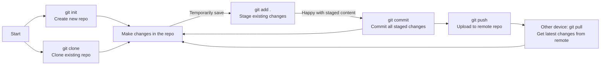

---
categories:
# - Mathematics
- Programming
# - Phase Field
# - Others
tags:
- Shell
- Tools
- Note
- VCS 
- Git
title: "(Maybe) a Git Tutorial? Part One"
description: "Introduction and daily usage"
date: 2025-07-28T22:49:16+08:00
image: /images/Tatara-Kogasa.jpg
math: true
license: 
hidden: false
comments: true
draft: false
mermaid: true
---

*Git is really great, but Git's commands are really complicated. Let me do a quick write-up -- might as well call it a tutorial~*

*The header image is by [Natsuzora](https://www.pixiv.net/en/users/75383094) -- it's [Tatara Kogasa](https://www.pixiv.net/en/artworks/116876998), so cute~ Let's go with Kogasa's character theme for the track.*



## Git, a Name Both Familiar and Strange...

Maybe it's just the environment I'm in, but a lot of people around me don't know what Git is. They've all heard of *GitHub*, but most only know that there are a ton of programs and programmers on it. That's not exactly wrong, but it's not quite accurate either; and when I say I use *Git*, some people conflate *Git* with *GitHub*; many think Git is very complicated, and by extension think GitHub is also very complicated... So, I'd like to share my understanding of Git and GitHub, and talk about what both Git and GitHub actually are.

So, if you don't know what Git is, I'm honored to briefly introduce it to you here.

### So What Even Is Git? Version Control? Huh?

What is Git? It is:

**
A save system designed for software development.
**

Yes, that's really what it is. Game saves. The kind of game saves that let you backtrack when you're stuck / when you're doing a side quest / when you regret something. If you're flipping through *ProGit* or some tutorial and can't quite grasp what a *version control system* is -- no worries, it's just a fancy name for game saves (for programs).

However, in order to serve programmers efficiently and well, Git naturally comes with a massive set of complex features, each sub-feature having tons of fine-grained subdivisions, and each save can have incredibly intricate ~~(troublesome)~~, meticulous ~~(verbose)~~ control. Still, none of this changes the fact that it is, at its core, a save system.

Once you accept that premise, Git doesn't really have many secrets left.

### OK, But From What You Say It Sounds Kind of Troublesome...

I have to admit, as mentioned above, Git's commands can indeed be extremely complex. If you're willing to flip through its man-page, you'll find it's shockingly long; and when you try using `git --help` to get some quick and useful info, sorry -- `git --help` only tells you what you *can* do, accompanied by somewhat incomprehensible usage lines, but it doesn't really tell you *how* to do it or what you can achieve.

But, here's the twist. First, if your environment limits you to the command line for Git, the four or five commands I'm about to introduce will cover nearly 80% of your usage scenarios. And if your environment supports graphical interfaces, then unless you're a die-hard command-line loyalist, you can totally just pick a GUI program -- like *GitHub Desktop*, which has high integration with GitHub, a sleek modern interface, and already plenty of features. No need to make things hard for yourself.

So, the conclusion is: Git is complex, but we can use it in a very simple way. It's powerful, it's great, but that doesn't stop me from only needing those few most basic functions. Most importantly, when you need more advanced features, the internet is always your best friend. You can totally search on the spot, and chances are someone from StackOverflow has already answered your question (pasted the answer) (from many years ago with tons of upvotes).

So, don't be afraid! Just try it!

### Fine, But What Exactly Is the Relationship Between Git and GitHub?

This is a really common question. The explanation is simple: GitHub provides cloud save functionality. Just like how Steam has cloud saves for games, Git can also have cloud saves. It's just that Steam has a dedicated server that automatically saves your game content for you, while Git lets you choose wherever you like to store your code saves.

And GitHub is exactly the place that most programmers prefer. Not only that, the saves uploaded to GitHub also work as a showcase -- everyone can upvote the code saves they like on GitHub, download other people's saves to their own computers, and even try teaming up with others. So, calling it a social network isn't entirely off the mark (maybe).

So can I choose somewhere else to store my saves? Of course! Besides GitHub, there are many, many other Git hosting providers. You can even *self-host a Git service*! In fact, GitHub is somewhat of a "*betrayal*" of Git's original intent: distributed save storage. What does that mean? Git's original idea was that every code developer (player) keeps a copy of the save, and then everyone can work together as a team. If everyone keeps a copy of the source code, doesn't that mean everyone is doing storage? It's just that as the demands of collaboration grew and the open-source community expanded, a place like GitHub -- a public place to share your code -- spontaneously emerged.

In short, Git is a save tool, and GitHub is a place where everyone uploads / shares / discusses / collaborates on cloud saves.

### Yay, I'm Gradually Understanding Everything!

That's right -- this is what Git does. You might see some introductions start by talking about how advanced the tech behind Git is, how efficient, how much it embodies the open-source spirit, and then you're left clueless. But Git is really just this thing for saving code, and if you're learning it in order to use it, this big-picture framing is what matters.

However, a word of caution: the above might indeed capture Git's core purpose, but it's still very rough and overly general. The text above can only help you *understand what Git is*, not tell you *how Git does it*. Also, while using Git's commands for the most basic tasks is simple, **please, before you truly understand what a command does, do not blindly run it**. In reality, to use Git well for managing your code/projects, you do need to know a bit about how Git works behind the scenes.

So, if you're still interested in Git, or want to actually start using it, let's dig into some technical details~

## How Do You Use Git to Save?

To answer this question, we inevitably have to touch on some not-so-exciting concepts. Rather than introducing them directly, let's first look at how one would use Git in day-to-day development.

### A Day in the Life of Tig

Tig is a devoted Minecraft player. He really enjoys the feeling of being a creator god -- after all, that's what drew him to the game's name. Today he's planning to start a new project: building a million-iron-per-hour iron farm!

Oh no! Something weird has happened to Tig's Minecraft! He's been told that Minecraft's graphical interface is broken, and in its place, he can use code to control his character and freely create any in-game items, and he can only use `git` for saving (whoever did this is terrible). Tig feels a mix of emotions: is this still Minecraft? But there's a conviction in his heart: I must finish this iron farm, even if I can just summon iron blocks out of thin air! When the game recovers, I can keep having fun building on top of this iron farm!

And so, Tig used `git init` to create a save for an empty world. Then he started writing code, line by line, for everything he wanted to do in this world...

After a while, Tig's mom called him for lunch. Unwilling as he was, Tig had to put down his work for now. He decided to do a temporary save first, so he used `git add .` to save all the code he'd written so far. After all, he wasn't sure if some parts had issues and would need tweaking later -- he was basically being dragged to eat right now.

After lunch and a nap, Tig came back and wrote some more. He was quite satisfied with his progress, because he'd managed to move the village's troublemakers up into the sky. This was not easy at all, and he didn't want to do something dumb later and lose those villagers. So he decided to make a save. First he used `git add .` to save all changes in every file, then used `git status` to check which files had been changed. Feeling like everything looked fine, he used `git commit` to formally save this checkpoint. The save system asked him to write a brief description of his changes, so he wrote: `Villagers moved into position, ready to build the frame`.

After an afternoon and an evening, Tig finally finished the iron farm right before bedtime! Truly a magnificent feat. Tig couldn't resist sharing it, and it would also be convenient to continue working on it from other computers. He created a GitHub account and a repository, and used `git push` to put this save in his repository. Still, before bed, he wanted to download the save onto another computer first, so he used `git clone <git-link>` to clone the repository locally.

Lying in bed that night, thinking about how in the future he could conveniently push his saves to GitHub with `git push`, and use `git pull` on another computer to get the latest changes, he couldn't help but grin to himself, already plotting how to make improvements the next day, like putting a nice shell around the iron farm...

Happy ending, happy ending!~

### So, What Did He Actually Do?

Tig's story might be a bit dull -- after all, forcing a story backdrop onto Git is kind of a stretch; and more importantly, who the heck plays Minecraft like this?! Still, the commands he used are pretty much all the commands I use on a daily basis. Let's summarize them. We'll stop talking about the game now, since it's basically been exposed as just writing code...

- `git init`

We can use `git init` to create/initialize a Git repository locally. This means you intend to manage this directory with Git. A very simple command, and actually quite low-frequency, because you rarely re-initialize a repository.

- `git add .`

A fairly high-frequency command. Git won't immediately record the changes you make within your repository. It's afraid that if it records them right away, you might instantly regret it. Plus, recording immediately would basically overlap with plain file-saving functionality.

So, when you feel your current progress is decent, you can use this command to *stage* all your current changes. The word "stage" here has two meanings: one, Git indeed saves your changes into the *staging area*; two, if you now realize a certain change isn't quite right, you can conveniently pull it back out of the staging area.

The `.` in `git add .` means the current directory -- i.e., "I want to stage all files in this directory." Git is smart enough to only save changes, which was decided right from the design stage. If you only want to save part of them, just write their names instead, or the corresponding directory -- as long as it can be located.

Anyway, this command is for staging all your current changes.

- `git status`

A command I really love to use. It reports to you the current state of the staging area and the working directory. Things like: which files have been modified, which files are new, what's been deleted, and among these changes, which ones have been staged and which ones you haven't staged.

If your Git is using default settings, it will also remind you how to undo certain changes. Just follow along.

- `git commit`

When you're satisfied with your progress, you can use `git commit` to commit the contents of your staging area. So-called "committing" is forming a save -- a save you can return to later. In this save, the state of your repository is frozen; when you return to this commit, everything will be restored to how it was at that moment. Very satisfying.

Two things to note: one, `git commit` only commits the contents of the **staging area**. Whatever hasn't been staged will stay put, waiting for you to first stage it with `git add`, or waiting for you to undo those changes. Two, `git commit` requires you to leave a message for this commit. Please don't just scribble something to save time, because future you might feel sad about the casually scribbled messages left by present you. By default, `git commit` opens your text editor for you to write; if you find that too bothersome, you can use `git commit -m "messages"` to use that line of `messages` as the commit message.

Two more points: if after committing you realize you forgot to stage some content or have small additional changes due to a minor oversight, you can add those changes to the staging area and then amend this commit using `git commit --amend`. Also, commit with care, because once something has been committed, it's not so easy to modify. You can certainly change it, but compared to stuff in the staging area through `git add`, it's significantly more trouble.

- `git push`

Push your current content to the remote repository. If your repository was obtained via `git clone` and you have permission to modify it, then `git push` can simply and directly push the changes on *this branch* to the remote.

We won't get into what a branch is yet, or things like remote collaboration. But as far as common commands go, `git push` is relatively frequently used and also quite simple.

- `git clone`

Download a Git repository from a remote to your local machine. Just follow it with the repository link. If you're cloning from GitHub, clicking the green Clone button will show you how to do it. You can directly copy the command listed there and run it.

- `git pull`

Pull the contents of a remote repository to your local machine. It's almost the opposite direction of `push`. If there's a change on the remote that you want to sync locally, just `git pull` it.

One thing to note with this command: don't run `git pull` when you have local changes that haven't been saved. If local and remote conflict, it gets really messy. The best way to avoid trouble is: `git pull` first, then make your own changes.

### Drawing a Flowchart

## Alright, That's Enough for Now

We've covered what Git is and the features you'd use day-to-day. I can say that aside from two or three more commands related to another very powerful Git feature -- branches -- and one or two commands I personally find handy, the remaining commands are all ones I very rarely use. The rest are commands I only look up online in an emergency when I've messed something up, and with good habits they're really very seldom needed -- those troublesome / complex / hard-to-grasp features.

So, if you've made it this far, congratulations -- you've already mastered the single-branch Git workflow. It's just: change files, stage, commit, push. And in the next chapter we'll take a look at what those hyped-up Git branches actually are, and explain some of the concepts in Git.

A special shout-out here: this article's analogies draw inspiration from [HDAlex_John](https://space.bilibili.com/337242418)'s Git tutorial series: [A Git Tutorial for Idiots](https://www.bilibili.com/video/BV1Hkr7YYEh8), which is really well done. Good thing I'm not an idiot, so I didn't find it tiring, hahaha. (Still, writing it yourself is more exhausting.)

And finally, thank you for reading this far. Wishing you a cheerful mood and a smooth life!~
