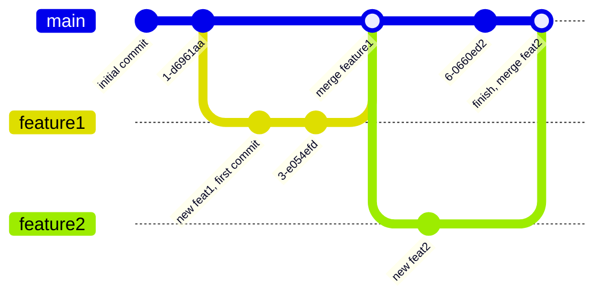

---
categories:
# - Mathematics
- Programming
# - Phase Field
# - Others
tags:
- Shell
- Tools
- Note
- VCS 
- Git
title: "(Maybe) a Git Tutorial? Part Two"
description: "Let's look at Git branches!"
date: 2025-08-14T16:49:16+08:00
image: /images/Tatara-Kogasa.jpg
math: true
license: 
hidden: false
comments: true
mermaid: true
---

*The previous section covered how you'd normally use Git for single-branch repository management. This section is all about how Git handles multi-branch collaboration!*

*For header image info, please refer to the previous section, thanks~ For the track pick, I went with a remix of Kogasa's character theme by the well-known circle [Foxtail-Grass-Studio](https://f-g-s.net/). Enjoy~*



## Branches -- Those Kind of Branches?

We already covered Git's daily workflow under a single branch in the last section. Notably, we said "single branch," which naturally implies that Git supports -- and encourages -- the use of multiple branches. So what is a branch, exactly?

If you've had experience with visual novels or played games with branching storylines, you've probably already guessed what a "branch" is. Yep, it's a lot like that, except with richer functionality, because you're not just experiencing several branching storylines -- Git even lets you merge two branches together, provided there are no conflicts! If there were a game that supported Git for managing branches, maybe you could manually achieve a harem ending...

Ahem, no more jokes. Let's take a look at what a branch actually looks like. First, a branch diagram:

### A (Hopefully) Simple Git Branch Diagram



(Damn, Mermaid actually has a built-in gitGraph feature. Awesome.)

So we can see there are three branches here: `main`, `feature1`, and `feature2`. Sometimes we start a branch, sometimes we merge two branches together. How was the diagram above generated (pun intended)? Here's the code used:
```
gitGraph
    commit id: "initial commit"
    commit
    branch feature1
    checkout feature1
    commit id: "new feat1, first commit"
    commit
    checkout main
    merge feature1 id: "merge feature1"
    branch feature2
    checkout feature2
    commit id: "new feat2"
    checkout main
    commit
    merge feature2 id: "finish, merge feat2"
```
The fun thing about Mermaid's gitGraph is that the code above is almost exactly the Git commands you'd need to produce that commit tree / branch shape. We can ignore the `id` parts, since in actual `commit` operations those should be specified with `-m` as the commit message.

So what do these commands do? How do you use commands to control branches?

## Branch-Related Commands

Let's go through the commands that appeared above (and a few that didn't)~

- `git checkout`

    Honestly, this command is a huge pitfall. `git checkout` has existed since Git's inception, and it's a command that combines the functions of creating, managing, and switching branches or commits, among other things. The main reason for this situation is that `git checkout` doesn't actually operate on our current mental model of Git's storage layer; it operates closer to Git's implementation layer, i.e., moving "pointers."

    However, we're not going into that much depth/detail here. Let's talk about this command from a practical perspective. Looking at the Mermaid diagram above, you'll notice that `git checkout`'s function doesn't seem to be directly reflected. But if you look carefully, you can guess: `git checkout`'s role here is switching branches. For instance, `git checkout main` tells Git "now I want to switch to the main branch." This is one of `git checkout`'s primary uses. Additionally, we can use `git checkout -` to switch to the previous branch, just like `cd -`.

    We can say a bit more about this command. Adding the `-b` flag lets you create a new branch. For example, `git checkout -b new-branch` creates a new branch named `new-branch` and immediately switches you to it. And if what you put after it is a filename or just `.`, you're telling Git to discard unstaged changes in that file / all files.

    The above are all relatively old-school approaches. I'm sure you've also guessed the newer way to create a branch from the Mermaid diagram above. That would be:

- `git branch`

    This command is for managing operations related to individual branches. Let's give a brief overview.
    
    With no arguments, it prints out the available branches. To create a new branch, use `git branch <another-branch>`, which tells Git to try to create a branch named `<another-branch>`. If this branch already exists, Git will error and tell you there's already a branch with that name.

    Note that `git branch <branch-name>` only creates the branch; it does not switch your current branch to the new one. To create and then switch, besides the traditional `git checkout`, you can also use the more "modern" (?) command: `git switch -c <branch-name>`. We'll cover that later.

    Beyond creating branches, we definitely also want to be able to view / delete / rename branches. Let's just list them all below. Feel free to skip this section.

    - To view branches, just `git branch`. To see all branches (including remote ones), use `git branch -a`. You can also use `-v` to show the last commit message.
    - To create a branch, as said above, append the branch name you want: `git branch <branch-name>`. If this branch already exists it'll error; also, this command only creates, it doesn't switch.
    - To create a branch from a specific commit, append `<commit-hash>` after `<branch-name>`. As for what `<commit-hash>` is, we'll cover that later when discussing some Git concepts.
    - To delete a branch, use `git branch -d <branch-name>`. If you want to delete the current branch, switch to a different one first.
    - To rename a branch, think of it like moving a file: `git branch -m <branch-name> <new-name>`. Again, this only changes other branches.

    So, that's it! Single-branch operations in Git can all be done with the `branch` subcommand. So, how do we switch branches? Besides `checkout`, the "more modern" (citation needed) method is to use:

- `git switch`

    This command is the relatively newer way to switch branches. Use `git switch <branch-name>` to simply switch. Interestingly, you can also use `git switch -c <branch-name>` to create a new branch and switch to it at the same time. In other words, `git switch -c` is nearly equivalent to `git checkout -b`. Also, we can use `git switch -` to jump directly back to the previous branch.

    You can also consider `git switch -m <branch-name>` to merge the current branch into the target branch while switching. This is pretty nice, since we often encounter this situation: after completing a feature on the `dev` branch and testing it, we want to merge it into `main`. Without this command, we'd need to `git checkout main` first then `git merge dev`, but with this command we can simply `git switch -m main`.

    Anyway, if you need to switch branches, use the `switch` command. Semantically clear, isn't it?

- `git merge`
    
    This command, as the name suggests, is for merging branches -- or, less obviously, *merging into the current branch*. Its usage is relatively straightforward: just `git merge <branch-name>`.

    The main issue with this command is that merging can produce the demonic *conflict*. Resolving conflicts is honestly a headache-inducing affair (in my opinion). To avoid (escape) the trouble after merge conflicts, you can use the `--abort` flag to tell Git "if the merge fails, don't touch anything." But if you actually want to merge, you'll have to resolve the conflicts eventually.

    Actually, resolving conflicts is just a process of "choosing whose code to apply." Git marks the conflicting sections with arrows showing the content from the current branch and the branch being merged. All you need to do is delete the part you don't want and save. Also, merging creates a new commit. If you don't like the default commit message, use the `-e` flag to tell Git you want to edit the merge commit's message yourself.

    Finally, Git has different merge strategies. We won't go into much detail here; most cases can use `ff` mode, i.e., *Fast Forward* mode. This mode makes your commit tree look like a straight line -- if the commit histories are the same, both branches end up sharing the same commits.

- `git log`

    This command, as the name says, outputs Git's branch history. With no arguments, it simply prints the commit history of the current branch, including each commit's SHA1 hash, author/email, commit date, and commit message. At this point, Git enters its own pager so you can scroll up and down, supporting Vim-style navigation like `jk` for scrolling and `/?` for searching. Naturally, press `q` to exit.

    This command is definitely not this boring. In fact, you can customize a ton. For example, use `--graph` to display a branch diagram at the far left of each commit (though it's not super easy to read), and `--all` to show the history of all branches. If you want the history to not take up loads of lines and just see a quick overview of each commit, use `--oneline` to make each commit a single short line. These three flags can be combined for a quick browse of what the commit history looks like. And if you want detailed info, like which files changed and how, use `--stat`, and Git will give you statistics on what changed in which files.

    You noticed the commit dates, right? `git log --before <date> --after <date>` also lets you filter to view only commits within a certain time range! The date format is `yyyy-mm-dd`. A really convenient feature.

    However, the most magical part of this command is that you can actually customize the output format. Using the `--pretty` format, you can control the output format of Git's log with certain fields. Here's a [reference table](https://devhints.io/git-log-format); check it out and try it if you're curious.

That's enough for the basic branch-related commands. With the above, I believe you can already make use of Git's branching features~

## Git Concepts

Still, stopping at just how to use Git always feels like it doesn't go deep enough. To know the how, you should also know the why. Since we're introducing Git, let's try to cover some of Git's deeper (actually not that deep) concepts.

### Repository

Almost all our Git projects begin with creating or cloning a Git repository. A repository is a fairly broad concept -- everything Git-related starts from the repository, and all information is stored within it.

So what is "all information"? This question can get quite deep. From a surface-level understanding, it definitely includes content closely related to our work, since that's what Git is meant to manage. Beyond that, there's content related to Git itself, most of which is stored in the `.git` directory, plus some scattered `.gitignore` files. Among these, `.git` stores everything directly related to Git for this repository -- things like file snapshots, commit records, different branch records, etc., all recorded in a special structure. This also means that if you delete the `.git` directory, the repository is gone, and all Git records vanish. Think carefully before deleting~

Then `.gitignore` is also a file that controls Git's behavior. It tells Git not to track certain files. For example, if you have some test files that really shouldn't be recorded in the repository and you only want them locally for testing, you can write their names or the directory they're in into `.gitignore`.

In short, a Git repository is this overarching thing. Sometimes we abbreviate "repository" as *repo* -- I actually quite like that name.

### Working Directory / Working Tree

This is essentially the project directory we're currently editing. For instance, after cloning a repository from online, we enter that repository's directory. The root directory of this repository is the so-called working directory. As for why it's called a "working tree," my personal take is that Git's branching makes the entire repository spread out like a tree, or perhaps the hierarchical structure of files in the directory resembles a tree. Though either way it feels a bit odd -- I mean, if it's about repository branches, shouldn't we be on the leaves rather than the tree itself...

Anyway, without overthinking it, the place where we do our work is the working directory. That's it.

### Staging Area

We've actually already covered the staging area. As the name suggests, the staging area is a place to temporarily store content that you feel is "good enough." We use `git add` to place modified content into the staging area to await committing. If something in the staging area doesn't feel right, we can pull it back out and revise it anytime. We can also unstage certain content. In short, the staging area gives us a chance to reconsider. And when we think "I'm satisfied with what's in the staging area, I can commit it," we use `git commit` to commit the contents of the *staging area* to the branch (or repository, depending on how you view the act).

In short, the staging area is a place between "saving a file" and "saving the entire working directory state." This also determines that Git's workflow is: `modify files -> save files -> stage them -> commit to branch/repository`.

### Branch

I'm sure you already have some understanding of branches by now. When we create a repository, a main branch is created along with it. The main branch used to be called `master`, but for various political reasons, it's now more commonly called `main`. Besides the main branch, we can have many other branches. These branches allow us to store different information in the repository; there's no interference between different branches, and when we want to, we can perform operations on branches like merging, deleting, etc.

Branches are like parallel worlds -- we can have two branches share the same past, diverge at some point, and evolve independently. And what makes branches superior to parallel worlds is that we can merge two branches together when there's no direct divergence, without running into "I'm the real Spider-Man" problems.

Branches can be called the soul and essence of Git. I highly recommend using branches for project management; they're incredibly useful. When in doubt, open a branch and test things out first -- that's never a bad idea.

### Commit

Once we have a branch, we need to keep making commits to it. Each commit extends the branch's record; the branch is, in effect, a record of each commit. In plain terms, commits are saves -- except these saves are attached to a particular timeline (branch).

You could say commits are the building blocks of branches. When we look at what specifically a branch contains, what we see is each commit record. So-called "merging branches" is really just comparing the commit situations of two branches; if there are no conflicting commits, they can merge smoothly.

One thing to note: in Git, we don't commit files themselves; we commit *changes* to files. It's precisely this key characteristic of **changes** that lets Git do version control so efficiently. The downside, though, is that it gets a bit clumsy with binary files: you could say binary files change all at once, unlike text files that can have clearly localized changes. This also suggests we should try to have Git track plain-text files rather than binary ones.

Also, another reminder: commits only commit what's in the staging area. If there are changes that haven't been placed in the staging area, the commit will ignore them. Please keep that in mind.

### Remote

Although we haven't talked much about remote repositories / hosting platforms yet, remote repositories were a key concept from the very beginning of Git's design.

As we've mentioned, Git's original design goal was a so-called *distributed* version control system. This *distributed* nature means that everyone can have a copy of the source code, and everyone can pass their changes to each other, freely choosing whether to merge other people's changes. Such a decentralized feature was a very forward-thinking design. And to make this vision a reality, Git had to have the ability to connect to other people's repositories. Remote is exactly that thing.

Git can use a repository on the network as its remote repository. We usually don't interact directly with files in the remote repository, but rather use commits as the basic unit for interacting with it. When we have new commits or new branches, we can *push* these local changes to the remote repository; when the remote repository has new changes, we can *pull* them down locally. We'll cover Git's remote functionality in more detail in the next section.

In short, Git's remote repositories allow a codebase to be stored in multiple locations and let us interact with those repositories, enabling collaboration with others. However, due to the numerous practical demands of collaboration, Git eventually gave rise to many code hosting platforms to make it convenient to store Git remotes and collaborate on them, avoiding the need to directly shove stuff onto others' computers.

## Afterword

I must immediately admit that this article couldn't have been written without `tldr` -- more precisely, `tealdeer`. It's hard to imagine how I'd introduce available commands without `tldr`. Sigh, I'm still not familiar enough with Git. If there are any mistakes or omissions, or if you have suggestions for this series, please tell me directly, thank you. I'll fix things promptly (please, tell me where I wrote poorly, wuwuwu).

I'd also like to recommend an excellent website: [Learn Git Branching](https://learngitbranching.js.org/), a web page that lets you practice Git branch management through hands-on exercises. It covers everything from making commits, creating branches, merging branches, to rebasing, remote repository collaboration, and other advanced operations. I spent an afternoon completing it and gained a ton, so I strongly recommend it.

The next section will be our final one. I plan to talk about Git's remote collaboration features and things to watch out for when collaborating. Also, having deeply felt the complexity of Git's commands, I have plans to make a small tool that gives suitable Git commands through a Q&A format. I'm tentatively naming this tool `Giao`. Hopefully it won't die in the cradle, haha. If you're interested, feel free to follow me / give me suggestions, thanks~
