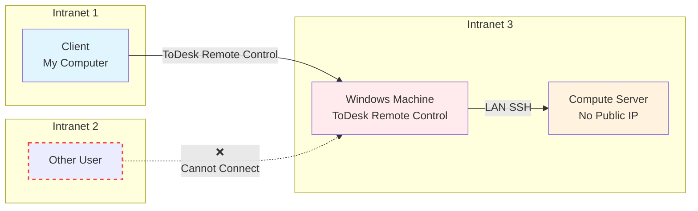
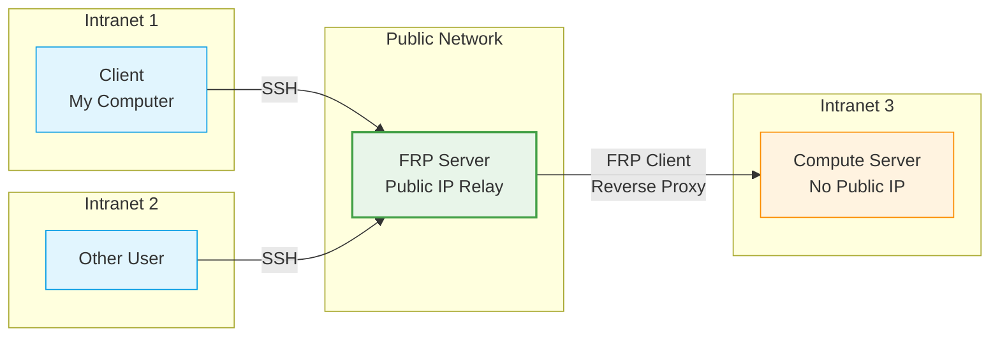
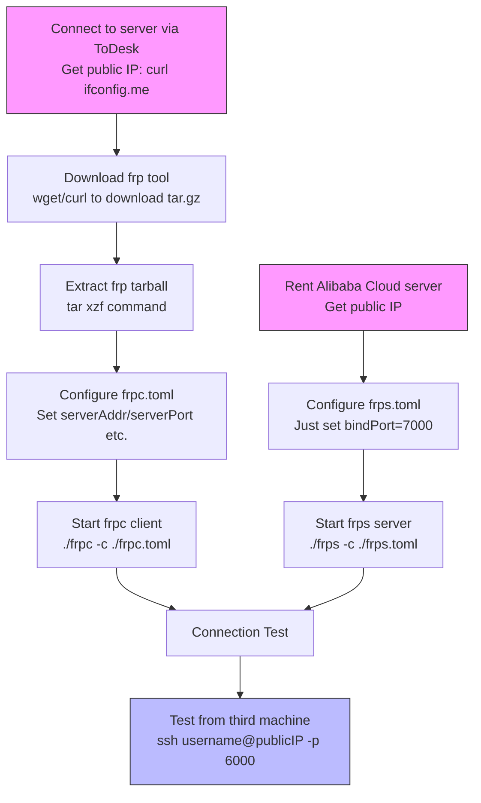
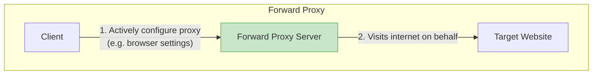
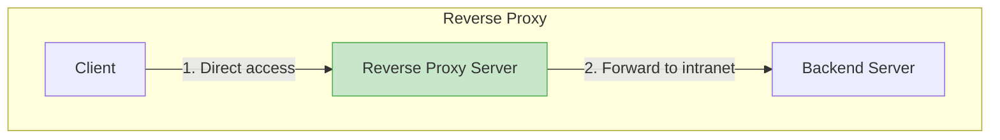

---
categories:
# - Mathematics
# - Programming
# - Phase Field
- Others
tags:
- Linux
- Software
- Server
title: "Setting Up an FRP Service"
description: A quick record of my FRP service setup process
date: 2025-07-23T13:26:16+08:00
image: /images/BagPipe.jpg
math: false
mermaid: true
license: 
hidden: false
comments: true
draft: false
---

*Why do I have to first ToDesk into a Windows machine, and then SSH from that machine into the server just to connect!? Unbearable. Let's just set up an FRP service myself.*

*The image features the lovely Ms. Bagpipe. According to unverified sources, it's likely drawn by artist [Liyu黎](https://weibo.com/u/5979033109) as a celebratory illustration for the 2022 Ambience Synesthesia concert. To match, let's play Ms. Bagpipe's personal EP: 《故乡的风》 (Wind of Home).*



## Prologue: Why a Jump Host

To make submitting jobs and doing Phase Field calculations easier, our group got a computing server — one management node + two compute nodes. Powerful! But the bad news: the group didn't have spare space to house the server, so it had to be hosted at another professor's place.

OK, no big deal — give the server a public IP and it'd be just like having it in our own group, right? But reality isn't that nice — public IPs aren't available on demand. The group seems neither familiar with nor interested in network configuration, so it was left to the guy who set up the server. After consulting with the hosting professor, the solution they settled on was: use ToDesk to connect to a Windows machine on the same local network as the server, then SSH from that Windows machine into the server. The overall flow goes something like this:



This solution, honestly, feels pretty dumb. A server running a multi-user operating system, and you have to use Windows as a jump host to get in!? Doesn't this mean if two people want to use the server at the same time, I'd have session conflicts with the other person? And if someone's watching that Windows machine's screen, my operations would be fully exposed!? No matter how you think about it, it's a stupid approach — though I can understand it: this is (probably) just a temporary solution. But who's going to fix it later?

It has to be me! We can set up an FRP (Fast Reverse Proxy) service, forwarding traffic through a jump server to the compute server, instead of stupidly bottlenecking through a single Windows machine. This way, everyone can freely connect to this server — just hand the traffic over to the reverse proxy server (jump server), let it handle port forwarding and such, and that's it. After setup, the diagram looks roughly like:



Alright, let's get started~

## Setup: Maybe We Need a TL;DR

I think maybe I should first explain what FRP technology is and introduce the network communication process involved. However, I believe most friends reading this blog post are looking for a practical, executable procedure. So the first step below is:

### TL;DR
*The following procedure heavily references the open-source tutorial: [Frp Intranet Penetration Setup Guide](https://github.com/CNFlyCat/UsefulTutorials/). The content is very detailed — if something here isn't clear, do check it out.*

Here's my solution process:

1. Rent a server: Use student verification on Alibaba Cloud to get a cheap server free for three months. Just need a public IP — we'll use this IP later.
2. First, use ToDesk to connect to the remote compute server, then use `curl ifconfig.me` to get the public IP of the network the server is on — we'll use this later.
3. Download frp on the compute server:

```sh
#  If you have wget:
wget https://github.com/fatedier/frp/releases/download/v0.61.1/frp_0.61.1_linux_amd64.tar.gz
#  If not, try curl:
curl -LO https://github.com/fatedier/frp/releases/download/v0.61.1/frp_0.61.1_linux_amd64.tar.gz
```

4. Extract with `tar`: `tar xzf frp_0.61.1_linux_amd64.tar.gz`
5. Enter the folder and configure `frpc.toml` with:

```toml
# Server address (fill in the IP or domain of your public-IP server)
serverAddr = "192.xxx.x.x"
# Server port (the port the FRP server listens on)
serverPort = 7000

# Connection protocol
transport.protocol = "tcp"

# Proxy configuration
[[proxies]]
# Proxy name (identifier for this proxy, name it however you like)
name = "comp_server"
type = "tcp"
localIP = "127.0.0.1" # This is it — represents the local machine IP
localPort = 22 # Default SSH port
remotePort = 6000 # Tells frps which port's traffic to forward here
```

6. Start frpc: `./frpc -c ./frpc.toml`
7. Perform similar steps on the public server. I didn't modify `frps.toml` here, which contains only one line:

```toml
bindPort = 7000
```

8. Start frps: `./frps -c ./frps.toml`

9. Test the connection from a third machine: `ssh username@192.xxx.x.x -p 6000`. This forwards access through port `6000` on the public server to the compute server.

That's pretty much the whole process. It looks long but actually only takes a few steps. Note that this server-side configuration is a bit bare-bones, but it's perfectly adequate for now. However, if you need more detailed or more robust configuration, refer to the open-source tutorial mentioned above. Also, that `7000` is purely a default value — you can choose your own. Generally, port numbers should lean toward higher numbers (high ports), mainly for security. If you used a different port for `serverPort` in the client config above, make sure `bindPort` below matches.

### Flowchart

~This person, having tried Mermaid once, now wants to draw diagrams for everything. Forgive him.~


~(Seems like the flow description above still isn't as clear as a diagram — diagrams are better)~

So, that's about it. If you've stumbled into this blog and happen to want to set up an FRP service, the content above should suffice. Hope it helps~

## The Explanation Section

With the TL;DR, you can probably see the outline of the entire setup process from those steps. But it might still not answer some questions: why do this, then that, then that, and it works? So here's a simple explanation of what each step does and what to watch out for. Although I'm calling this an explanation, it's really just piggybacking on others' wisdom and adding some simple supplements to the above. Please go easy on me, experts.

### So, What Is FRP?

When encountering a strange, English-acronym-laden concept, the best place to start is by unpacking what the acronym stands for. FRP stands for Fast Reverse Proxy. Some might ask: what's a proxy, what's a reverse proxy, and what's a "Fast Reverse Proxy"?

Unfortunately, I'm also a mega-noob and can only humbly share my own take. The word "proxy" — you can probably guess roughly what it does: handling some business on behalf of something else. In my understanding, that's basically it. But before talking about "reverse proxy," let's first discuss what might be more familiar — the *forward proxy*. It means handing traffic to a service, and having all service traffic go out through it. Roughly:



Here the forward proxy server acts as a middle layer — a disguise for the client — visiting on the client's behalf, then relaying the content back. This way, the target website has a harder time knowing who's behind the proxy server, providing a degree of anonymity.

So what about a reverse proxy? It's the exact opposite of a forward proxy. While a forward proxy lets the proxy server be the client's disguise, a reverse proxy lets the proxy server work on behalf of the target server. The reverse proxy server receives client requests and passes them to the backend server, handling content forwarding to the appropriate destination. When the backend server wants to communicate back with the client, it still has to go through the reverse proxy server. Visually:



In other words, with a forward proxy, the target website only knows some server is visiting it; with a reverse proxy, the client doesn't connect directly to the backend server but instead connects directly to the reverse proxy server. Our need is for our own computers to cross the compute server's intranet barrier and connect via SSH. So what we need to do is find a way for the server to relay my requests to the compute server — i.e., use a reverse proxy. Have the reverse proxy server receive my request traffic on one port, then forward it through another port to the port on the compute server responsible for listening to SSH requests. That's it.

So what's a "Fast Reverse Proxy"? From my shallow understanding, "reverse proxy" isn't anything particularly special — many people can implement it in their own ways. "FRP" just happens to be one very popular choice. As for "fast"... it's supposedly fast? Since I only know this one, let's not dig deeper.

After downloading the FRP package, you should see there aren't many files inside. Two executables: `frpc` as the client and `frps` as the server, along with their corresponding config files — almost just that, pretty simple. How it works: `frps` receives traffic and forwards it to the device running `frpc`. Note: although called the "client," it's actually the compute server, not your local machine. Your local machine's only job is basically ensuring it can `ssh` into another machine — that's enough.

### Get a Server

First, rent a server. Even the lowest-spec server can run the FRP service (I'm guessing — I find it hard to imagine this forwarding process needing much RAM or powerful computing). When renting, pay attention to what deals various cloud providers offer, especially student discounts. Generally, students get some decent discounts or free trial credits — worth trying out. Make sure to use a **strong password** for the server — don't use personal info. Since a public server is exposed to the dangerous internet, simple passwords are easily brute-forced. If your password contains personal info (birthday, phone number, QQ, etc.), it's game over. In short, be careful on the open internet: make passwords complex, and keep them on paper or in a password manager — whatever works.

After setting up the server, consider using SSH key-only login. Keys have two main benefits: passwordless login and security. SSH only allows verified machines to log in, checking whether the machine possesses a matching private key. I wanted to go on a tangent about "encryption, private keys, and SSH" here, but on second thought — there's barely any relation! Forget it. Being able to log in normally is a big success! The specific steps: first, log in however the server provider offers. Then open a file called `authorized_keys`, located at `~/.ssh/authorized_keys` (if it doesn't exist, that's normal — just create one). We'll write your public key into it shortly. Next, on your daily-use machine, open a terminal and use `ssh-keygen`, then just hit Enter all the way through to create your very own key pair. Accepting all defaults creates a passwordless key using the default encryption.

Next, open the **public key** content — e.g., with `cat ~/.ssh/id_ed25519.pub` — and copy its contents. Pay attention: you want to open the **public key**, i.e., the file with a `.pub` extension. Information sent over the network should be the public key — something that's fine even if everyone knows it — not your precious private key that one-directionally proves your identity. The file content should be one or even several long lines, structured roughly as `<type> <key> <user>@<machine>`. The first `<type>` indicates what encryption protocol; the middle part is the main body; the last part is a field to help you recognize "where this public key came from." If you find the last part insufficiently descriptive, feel free to modify it. But the urgent task is to copy this content and paste it into the server's `authorized_keys` file.

That should do it. Try `ssh`-ing from your computer to the server. If it doesn't ask for a password, everything's OK. Note: if this is your first login, your local `ssh` client will tell you it's never connected to this host before and ask whether you want to trust it — requiring you to type `yes` or `no`, or displaying a fingerprint. As a security check, carefully consider whether you're connecting to the right place. If everything looks fine, **type `yes`** to confirm. The default is `no` — if you're trigger-happy or assumed the default was `yes`, you'll just have to reconnect and remember to type `yes`.

Anyway, the main thing on the server side is just being able to get one. Logging in isn't too hard — `ssh` is a relatively easy-to-configure, user-friendly tool. The last thing to do on the server right now is to get the server's public IP. Usually, your admin panel will tell you what the external IP is. Remember it or note it down — you'll need it soon. If you like command-line operations, you can also try `curl ifconfig.me`. `ifconfig.me` provides a service that displays the visitor's public IP — you can use this script to grab the server's public IP. So, once you've ensured convenient and fast access to the jump server, let's move to the next step:

### Compute Server Configuration

Let's configure the compute server. I mentioned above that we can use remote control software to operate the remote server — that was actually our original working method. In theory, we don't need the compute server to *be* accessible from outside; instead, we set up the FRP service so it can *access the outside*, which then relays elsewhere, establishing the data path. So you just need to get the `frpc` client and its config file onto the compute server somewhere networked and to your liking.

Since our goal is to use FRP to access the compute server via the jump host, we naturally wouldn't consider `ssh`-ing directly in. The approach here is to first go the old way — using ToDesk to configure the remote server. I won't introduce this commercial software — just operate your way into the remote server.

After that, download FRP. I'd hesitate to call the download method straightforward, because I still haven't fully grasped what `curl` and `wget` actually do... But both commands work, as in:

```sh
#  If you have wget:
wget https://github.com/fatedier/frp/releases/download/v0.61.1/frp_0.61.1_linux_amd64.tar.gz
#  If not, try curl:
curl -LO https://github.com/fatedier/frp/releases/download/v0.61.1/frp_0.61.1_linux_amd64.tar.gz
```

According to `man wget`, `wget` is:

> Wget - The non-interactive network downloader

— a non-interactive network downloader. Its parameters are relatively simple — just append the URL of what you want to download. `curl` is more complex. According to `man curl`, it's:

> curl - transfer a URL

— it transfers URL content. By default, it outputs whatever it fetches directly to the screen. Since we want to download a file, we need the `-O` flag for *download content to a local file with the same name*. The `-L` flag tells `curl` to follow redirects, since the URL might not actually point to the resource directly but somewhere else. Incidentally, `-o` (lowercase o) means *download content into the following file* — so `-o` should be followed by a filename you specify.

Next, decompression. What we downloaded is a `tar`-packaged and `gzip`-compressed file. So we should first decompress it to a plain `.tar` file, then unpack it into the actual content. However, good news: the `tar` command has built-in support for calling compression/decompression tools including `gzip`. We just need `tar -xzf frp_0.61.1_linux_amd64.tar.gz`. The `-xzf` flags respectively stand for *extract*, *use* `gzip` *tool*, and *specify file path*.

Then we can enter the extracted folder. Inside, `frpc` is the software we need, and `frpc.toml` is its config file. The rest can be deleted, or you can extract and move it to the reverse proxy server later. On the compute server, we only need `frpc` and its config.

The config file above has some comments — it's actually written in decent detail. I also just provided the most basic info: telling `frpc` where the corresponding `frps` is and which port to communicate through; which port `frps` should receive traffic bound for here on, what type the traffic is, which port to forward it to, and giving this little config a name for easy identification. That's it.

At this point, the compute server side is basically configured. We can set it aside for now and move to configuring the reverse proxy server (public server).

### Reverse Proxy Server Configuration, and Trying the Connection

Same as before — download the `frp` package, extract it, and get ready to configure `frps.toml`. But for `frps`, the configuration is much simpler. There's only one line here: telling `frps` which port to listen on for communication with `frpc`. Simple, right?

After that, we can try starting both programs. Start `frps` on the reverse proxy server first with:

```sh
./frps -c ./frps.toml
```

You should see some output — ignore it for now. Then immediately start `frpc` on the compute server with:

```sh
./frpc -c ./frpc.toml
```

The `-c` in both specifies the config file path. If all goes well, you'll see a connection success message on the compute server side, and it won't exit. The reverse proxy server will likewise show a successful connection and won't exit either. If that happens, mission basically accomplished.

But expecting everything to go smoothly is asking too much. The most common problem is `frpc` telling you it can't connect. If that happens, first check the reverse proxy server's firewall settings. There's a high chance the firewall is blocking the FRP communication port or excluding your address. Relax the firewall rules a bit first.

If `frpc` and `frps` connect successfully, we can try accessing the reverse proxy server's corresponding port via `ssh` to attempt connecting to the compute server. Based on our config above, we asked the reverse proxy server to forward traffic received on port `6000` to the compute server. So we use:

```
ssh <username>@<frps_ip> -p 6000
```

to connect. The `-p` tells `ssh` which port to connect to — otherwise `ssh` defaults to port `22`. You might still be prompted for a password at this point; configure key-based login afterwards. At this stage, FRP is basically set up.

## Some Extra Work

### Registering FRP as a Service

However, there are still some issues. For instance, when `frpc` can't connect to `frps`, it just gives up — it doesn't even try to reconnect. Also, as a system-level application, we want it persistently running in the background. The above approach has `frpc` and `frps` occupying the current shell, blocking all other operations. After considering various options, I think the best approach is to register systemd services for both (assuming both machines support systemd). Here's the systemd service I wrote for `frpc`:

```
[Unit]
Description=Frp Client Service
After=network.target

[Service]
Type=simple
User=root
Restart=on-failure
RestartSec=5s
ExecStart = /root/frpc/frp_0.61.0_linux_amd64/frpc -c /root/frpc/frp_0.61.0_linux_amd64/frpc.toml
ExecReload = /root/frpc/frp_0.61.0_linux_amd64/frpc reload -c /root/frpc/frp_0.61.0_linux_amd64/frpc.toml
LimitNOFILE=65535


NoNewPrivileges=true
PrivateTmp=true

[Install]
WantedBy=multi-user.target
```

The content above basically says: what the service's display name is, what needs to be up before starting it, the service type, the user it runs as, the restart conditions and interval, the command to run on start; the command to run on reload, etc. This content is saved in `/etc/systemd/system/frpc.service`. For easier management, you can use `ln -s /etc/systemd/system/frpc.service <destination of link>` to symlink this service file into the folder where `frpc` resides. The `-s` here means create a symbolic (soft) link — otherwise `ln` defaults to hard links, which isn't really needed.

Once written, you can start the service with `systemctl enable --now <destination of link>`. `enable` means you're registering the service so it starts on system boot, and `--now` tells `systemd` to start the service immediately. For checking connection status, you can use `journalctl -u frpc.service -f` to view real-time logs (it also prints the most recent few lines), or use `-a` instead of `-f` to open all recorded logs.

On the reverse proxy server, similarly, you can write such a service and start it. Just make sure to replace the corresponding content, like the software paths. Then try logging in — there should be no obstacles.

### Setting Firewall Rules

The default configuration above will probably allow **all IPs** to access **all ports** on the public FRP server. If, like me, this service is only for personal use connecting to an intranet server, please configure the firewall reasonably to prevent brute-force port scanning and password cracking attempts. Refer to your cloud server provider for specific methods, but it's generally about selecting an IP to block or allow.

Modern firewalls almost all support whitelist mode. Like me, you can first deny all IP access to any port, then allow any IP to access the SSH communication port, then allow the compute server's IP to access the port it uses to exchange info with the reverse proxy server (using the example above, port `7000`), and allow the IP you normally use to connect to the compute server to access port `6000` — if you have `frps` forwarding traffic to `frpc` on `6000`.

Configuring it this way minimizes access control. While it brings some inconvenience (e.g., if your IP changes you'll need to log into the control panel to modify firewall rules), it's quite secure.

## Closing

I actually set up this FRP service during the May Day holiday. The plan was to build it while writing this blog post, but it ended up as: built it, then got lazy and didn't write until now (July 23rd, summer vacation) before remembering. Sigh, procrastination.

In reality, FRP's use cases go far beyond what I've written above. If you're willing to click into the tutorial link I posted earlier, you'll find his write-up is even more detailed, with more complex configuration options. However, since my needs were simple enough, my config is correspondingly simple.

One reminder: your firewall might not actually need to be as strict as I wrote here. But you absolutely must stay alert — there really are a lot of bad actors online. For example, the very evening I set up the FRP service, I received friendly scans from friends across the ocean. Once they found the open ports, they went to town trying account names like root, admin, user, along with an obvious slew of weak passwords to try to break into the server. The good news is they failed — I banned them with the firewall. But it still gave me a cold sweat. You need not have a mind to harm others, but you must guard against those who would harm you.

One more thing: there are scenarios where using FRP or similar remote access services is not allowed. Yes, this goes for TeamViewer, ToDesk, and the like as well. There are cases online where using such services led to catastrophic consequences. Before using these kinds of services, think twice.

Finally, as always, thank you for reading this far. Thank you for your support, and I wish you a pleasant life~
