---
categories:
- Programming
tags:
- Arch
- Linux
- Software
title: "从零开始的 Arch Linux 安装"
description: 记录一下自己学习安装 Arch Linux 的过程
date: 2024-11-10T22:34:55+08:00
image: imgs/Reimu_Water.jpg
math: 
links: 
  - title: Arch Linux+KDE安装流程和踩坑记录 By Azure Zeng
    # description:
    website: https://blog.azurezeng.com/installation-guide-for-archlinux-kde/
  - title: ArchLinux KDE Plasma安装及常见问题 By Skyone
    description: 
    website: https://www.skyone.host/2024/archlinux-plasma-faq#input-method
---
*久闻 Arch Linux 大名, 以前尝试过在自己的电脑上安装 Arch Linux, 但是无情地失败了. 最近又有了尝试安装的想法, 故顺带做此记录, 以便将来回头嘲讽自己的离谱操作.*
## 引子: 我与 Linux
我认识 Linux 是从疫情在家无所适从的时候, 在自己的戴尔笔记本上安装 Ubuntu 开始的. 在那之前, 我只知道在 Windows 的江山之外, 还有一片名为 Linux 的世外桃源 (是的, 当时还不知道有 Mac OS,笑死). 而随着对编程兴趣的逐渐浓厚, 我愈发好奇那个 "只有高手才能玩得转" 的操作系统究竟是长什么样子. 于是, 在父亲的帮助下, 我在我的戴尔笔记本上划出来一小块硬盘留给 Linux (是的, 那时想安装双系统), 并且安装了 Ubuntu. 这个过程花费了我整整一天, 中间甚至和父亲闹了点矛盾, 把为数不多的精力全都耗光了. 自然, 安装好之后除了打开看了一眼, 安装了个 QQ 然后给同学炫耀之后, 便没了下文, 在随后的哪次格式化硬盘的时候跟着不见了.

第二次尝试 Linux 是在英国百无聊赖的时候开始的. 那时又是对电脑感兴趣, 又是好奇 Linux 操作系统是什么样子, 于是便又一次自己尝试安装 Linux. 这次是跟着鸟叔开始的, 故而安装了他的教程里的 CentOS. emmm 这个系统好像是比较老旧了还是怎么样, 目前也不是很火的样子. 鸟叔的教程还是相当细心认真的, 我这种纯小白 (也许) 也懵懵懂懂地在虚拟机上安装好了, 尝试了几个命令, 也感受到了命令行的神奇之处. 然而, 可能是好奇心太旺盛, 抑或是其他的原因, 我的兴趣点很快跑掉了, 因此这次对 Linux 的探索之旅止步于学会用命令行关机 (当然, 现在也已经忘了hhh)

第三次便是进入研究生之后. 由于程序需要在 Linux 环境下运行, 编译和调试, 我再一次尝试起了 Linux. 不过这一次, 我使用了 WSL 来运行 Linux. 一开始也是安装的 Ubuntu, 后来总是在网上听到什么 "BTW, I use Arch" 这样的段子, 以及各路网友的推荐, 我便尝试了一下在虚拟机上安装 Arch Linux. 不过也许是心浮气躁, 没能搞成, 后来安装了网上大佬的 Arch WSL, 现在也随着老笔记本的退役而说再见了.

目前我使用 Linux 系统还是主要通过 WSL, 毕竟真的很方便. 但是, 心里总是痒痒的: 为什么我不能装个 Arch 呢? 所以这一次, 我一定要安装好 Arch Linux 口牙! 即便可能后面还是会沦为文件夹角落的落灰软件, 我也要骄傲地喊出: "BTW, I use Arch!" (下期可能是 Debian 也说不定, 哈哈哈) 

## 准备: VirtualBox 和 Arch 镜像站
环顾电脑一圈, 发现我以前用的 VMware Workspace 安装包没有导到这台新电脑上来, 而且即便现在安装 VMware Workspace 17 Pro 是免费的, 它竟然还要我注册…… 于是我还是选择了 Oracle 家开源的 VirtualBox. 再下来便是 Arch Linux 的源了, 我选择使用 ISO 镜像安装, 下载是通过淘宝的[阿里云镜像站](imgs/https://mirrors.aliyun.com/archlinux/iso/2024.11.01/)(其实就是第一个而已, 懒得往下翻了). 下载了大概40来分钟吧, 感觉速度还行, 1G 的大小来讲感觉还不错.

VirtualBox 里给 Arch 预留了 4096MB (4GB)内存和 8GB 的硬盘容量, 希望这么多够 Arch 用. 校验过 SHA256 之后, 因为之前设置虚拟机的时候没有指定 Arch 的镜像文件 (因为还没有下载好), 所以在启动虚拟机之后会显示 "failed to boot" 并且要求指定 DVD 的路径. 这里选好 Arch 的镜像之后直接 `mount and reboot`, 便会进入 Arch 的安装界面了. 从这里开始也算是正式进入 Arch Linux 的安装环节了.

## 开始 (准备) 安装
### 帅气的开屏, 然后进入 Shell
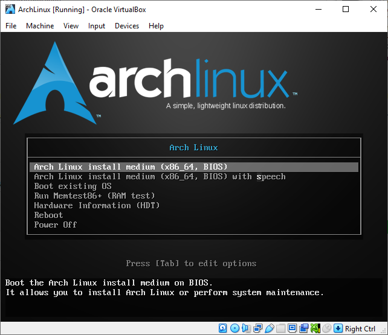
这里我们打开 [Arch Linux Installation Guide](imgs/https://wiki.archlinux.org/title/Installation_guide)以便根据官方教程进行安装. 我不打算用 Arch Install, 感觉那个没什么意思 (~~上次也是这么说的~~). 按照小节 1.4.2, 我们使用了光盘介质 (ISO也算是光盘镜像), 所以直接第一个选项就可以了.
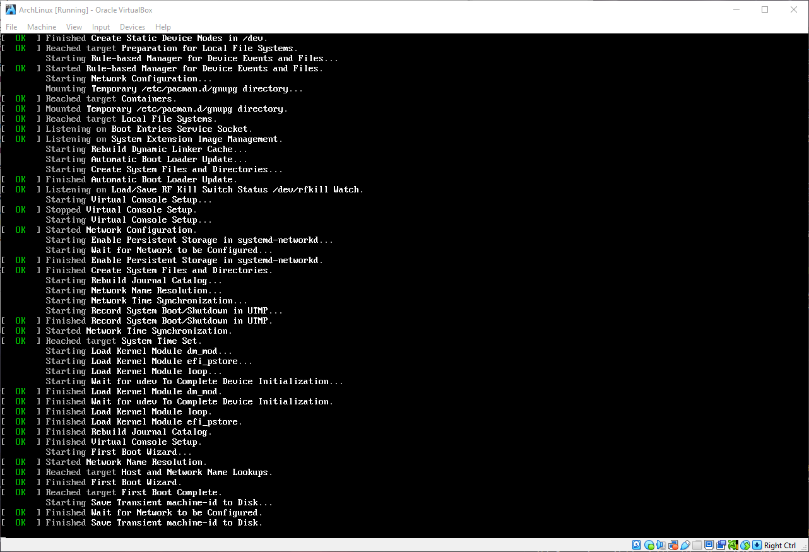
旋即屏幕闪过很有黑客感觉的画面 (个人猜测是系统自检, 感觉像是 systemd, 因为左边有很多绿色 OK 字样), 然后便进入了如下画面:

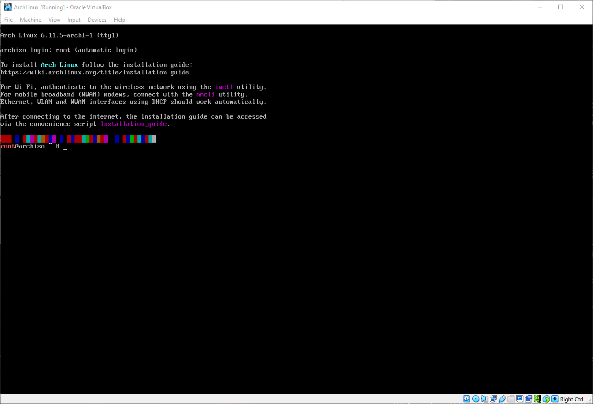

根据 1.4.3, 我们这是来到了第一个虚拟终端 (Virtual Console), 身份是管理员用户 root, 使用的 Shell 是 Zsh. 感谢虚拟机, 让我不用担心在 root 账户下做的愚蠢操作会害死我的电脑和我自己. 那么我们继续吧~

### 键盘映射和字体, 以及验证启动模式
接下来要设置键盘映射. 其实个人感觉美式键盘就不错, 不过还是看一下吧. 说不定以后会考虑搞点中文输入法, 之前看到的小狼毫还不错的样子 (现在也还再用).

扯远了, 查看键位映射的命令是: `localectl list-keymaps`. 这个命令感觉很容易拆分为 "locale ctl", 本地化控制的感觉. 很快阿, 输入命令之后直接跳出来一个长长的列表! 里面应该是所有 Arch Linux 支持的键盘映射选项. 这里好像就是使用了 Vim 输出到屏幕上的, 所以支持所有的 Vim 操作 (当然, 我就只会那几个, 以及退出). 坏消息是, 没有中文的选项, 不过这里应该是我犯蠢了, 键盘布局其实中文用的貌似就是美式布局…… Anyway, 我们就直接接受最基本的设置即可, 不考虑更改键盘布局了. 后面可能我会考虑把 CapsLock 键映射为 ESC/Ctrl, 不过就现在而言还是省了吧. 这里还可以设置键盘的字体, 但是也省了吧, 以后再说. 感觉这个地方设置的主要目的还是为了能顺利安装 Arch Linux, 个性化之类的内容按理应该是放在装完系统之后的.

接下来是验证启动模式. 使用命令如下: `cat /sys/firmware/efi/fw_platform_size`. WTF? 竟然显示没有这个文件. 按照说明, 这里系统应该是使用 BIOS 或者 CSM 方式启动了. 查看虚拟机设置里的母板(主板)部分, 可以看到 启用EFI 没有被勾选上. 好吧, 那就说明应该就是 BIOS 启动了.

### 验证网路环境, 然后更新系统时间
然后尝试联网. 作为网络小白, 我只能按照说明上的一步步来了. 首先检查网络接口 (network interface) 有没有打开, 使用命令 `ip link`, 得到了两行内容, 一行是 *lo*, 另一行是 *enp0s3*. 看不懂. 查看 Arch Wiki 上关于网络接口的部分, lo 是 *virtual loopback interface* 的意思, 且不会用在联网上. 而另一个 enp0s3 看起来像是正确的网络接口. 根据说明, *en* 代表的是以太网 (Ethernet), 而且只要显示了 *UP* 的字样, 便表明该接口是已启用了的. 很好, 说明我们的网络接口设置没遇到什么阻碍. 

我的虚拟机是使用的 NAT, 这个 NAT 根据 Google 得到的结果来看, 是 Network Address Translation 的缩写, 是一种把 IP 地址重映射的技术. 听起来很像是路由器在做的工作. 根据安装引导的说明, 我们需要做的是插好网线并且配置好动态IP, 而动态 IP 又好像是会自动配置好的. 所以实际上什么都不需要做就可以了其实. 那么网络这块儿的最后一步便是尝试 `ping archlinux.org`. 很不错, ping 出来结果了. 这个命令就我的认知而言, 是尝试向某个网址发送一些短数据包, 然后让对应网址的服务器返回一个数据包, 以此来检测网络延迟情况. 除了尝试 [archlinux.org](imgs/archlinux.org), 我还试了试 ping B站, Google, 百度. 结果除了谷歌以外都不错. 可能是因为代理没有代理虚拟机的端口吧 (瞎猜). 无论如何, 网络这块儿是搞定了. 接下来是更新系统时间. 这个简单, `timedatectl` 就可以. 轻轻松松. 看来这会儿是美国时间下午4点半.

### 磁盘分区咯, 还要格式化并挂载
现在要进行的就是磁盘分区了. 每次到了这里总会感觉紧张, 不知道是不是因为之前搞坏过磁盘的缘故 (虽然是物理损坏, 和操作系统没关系). 先来看看都有哪些设备可用: `fdisk -l`. 结果显示找到了两个设备: `/dev/sda` 和 `/dev/loop0`, 一个是我预留好的 8GB 固态虚拟文件系统, 另一个是什么我不是很懂. 教程上讲, 以 `loop` 结尾的可以不用管. 可是我这是以 `loop` 开头的呀…… 算了, 应该没问题. 这里提示如果没有显示硬盘, 需要确保硬盘控制器没有处于 RAID 模式. RAID 阿, 看来磁盘阵列这种好像还不太好直接搞 Arch? 因为我这里的硬盘是普通的 SATA, 所以就忽略NVMe 等的提示了.

接下来正式开始分区. 这里指出了两个要划出来的分区: **用于根目录 `/` 挂载的分区** 以及 **用以 UEFI 模式启动的 EFI 系统分区**. 这个 EFI 分区我有印象, 在 Windows 系统的磁盘管理中, 可以看到 `C` 盘里面就又一个 EFI 系统分区. 看来 EFI 现在是比较通用的系统启动方法. 这里我发现我好像设置的磁盘空间太小了, 教程里给的是至少 23-32GB 留给根目录挂载的, 唉. 郁闷阿. 看来要火速删机然后重新搞起.

Waiting...

还好之前基本都是检查性质的条目, 直接可以跳过. 重新分配硬盘空间到了 64G, 启动后就可以开始分区了. 这里教程里有提到几个点: 1. 想好怎么分配空间; 2. 如果要组存储池之类现在就要搞; 3. 如果这个盘上已经有 EFI 了就不要重新建立 EFI 了; 4. 可以在支持 Swap 的文件系统设置 Swap. 底下还有两个分区示例, 我们就尝试最简单的那个, 也就是 1.9.1 中的 第一个方案. 个人而言这个方案也挺合适的.

我们使用 `fdisk` 来创建硬盘分区: `fdisk /dev/sda` (我这里用来分区的磁盘是这个 `/dev/sda`, 所以命令后面跟着的是这个). 这个命令行工具我从来没用过 (上次安装好像用的不是这个, 有个 TUI. 也有可能 fdisk 也有 TUI, 这次没搞出来吧), 查阅 fdisk 的说明, 直接从第四节开始, 首先是说明创建分区会抹掉这个磁盘上的所有数据. 很吓人, 还好我们在虚拟机上. 应该不会影响到我可爱的C盘的吧. 

首先创建分区表. 这里使用 MBR 分区表, 因为默认如此. 根据网上的搜索结果, MBR 也适合我这种磁盘容量比较小的情况. 然后按 `n` 进入创建分区引导界面. 这里会询问你的分区类型 (是初始还是拓展), 分区的编号, 以及起始和结束扇区. 第一个分区分给 `/boot` 作为启动分区, 结束扇区前的部分一律默认 (初始分区, 1号, 从 2048 扇区开始), 然后通过命令 `+1G` 来给第一个分区 1G 的容量. 然后创建第二个分区, 也是前面全部默认, 最后用 `+4G` 指定容量为 4G. 这里我把这 4G 作为 Swap (好像就是虚拟内存)分区, 先使用命令 `l` 查看每种分区类型的代码 (Swap的代码是 82), 然后 `t` 开始改变分区类型, 选择 2 号, 类型写82. 最后把所有的空间分给第三个区, 然后给分区1打上 bootable 的标签 (用命令 `a` 然后选 1 号).

这个时候可以用 `p` 来查看分区结果, 会有一个表格写着所有的内容. 确认无误就可以 `w` 来写入分区结果了. 接下来要格式化文件系统, 不然操作系统不知道文件是怎么存放的. 首先用命令 `lsblk -f` 来查看现在的磁盘信息 (或者就是刚刚的分区情况). 这里我显示的结果如下:

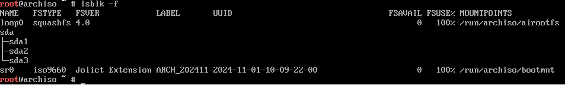

说明之前的 `sda` 磁盘已经被分成了三个区域, 且都没有挂载. 现在我发现了一个问题: 我用的是 MBR 分区表, 为什么使用了 GPT分区表推荐的 `/boot`呢? 而且之前还说没有开启 EFI, 现在又要搞 EFI 适用的 `/boot`, 离谱. 很好, 那就重新分区吧.

Waiting...

很好, 在熟练的操作下~~ (指现学)~~, 先用 `d` 删除所有分区, 然后创建 4G 的 Swap 分区, 以及 bootable 的主目录分区. 现在的分区结果是这样的:

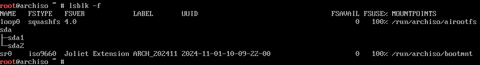

我们采用最经典的 `ext4` 文件格式 (其实就是教程里这么推荐的) 来格式化 `/dev/sda2`, 命令为: `mkfs.ext4 /dev/sda2`; 然后用命令 `mkswap /dev/sda1` 将 `/dev/sda1`格式化为 `swap`.  整体结果如下:

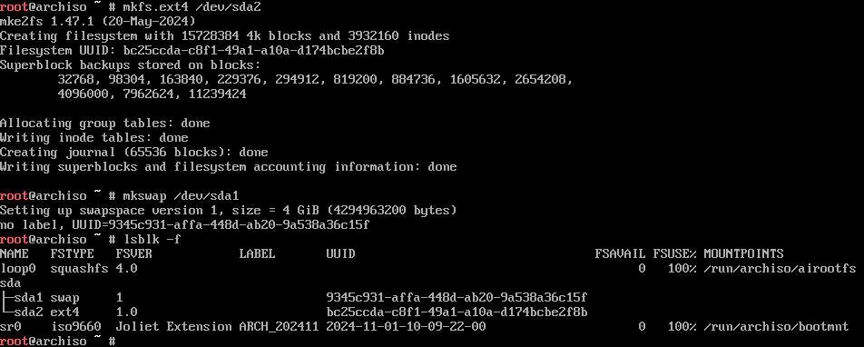

最后, 我们终于要挂载文件系统了. 这个我了解过, 使用 `mount` 命令即可挂载硬件到某个目录下. 首先我们挂载根目录, 把根目录挂载到 `/mnt` 下: `mount /dev/sda2 /mnt`. 因为我没有别的什么文件分区, 只剩下一个 Swap 分区, 所以我们直接使用命令: `swapon /dev/sda1` 来启动 Swap.

## 真的要安装了
刚刚才发现, 上一节内容是 "Pre-installation". 晕了, 原来刚才的真的全都是准备工作吗? 好像看起来确实如此, 因为没有涉及到什么具体的软件安装之类的, 更像是创造一个能让 Arch Linux 得以安装的环境. 但是看安装说明, 安装这一节只有两个小节, 看来也不是很复杂的样子.

首先是要选择镜像. 这次选择的镜像感觉上是给系统使用的 pacman 的镜像源. Arch 已经有一份使用 Reflector 生成 的镜像服务器列表: `/etc/pacman.d/mirrorlist`, 可以查看或编辑这个文件以使地理位置最靠近的服务器地址可以被优先使用. 这里我使用 `reflector --latest 10 --sort rate` 来按照响应速度排序最近更新的10个服务器. 结果好多都 timeout 了. 尝试命令 `refletor --country China --age 12 --sort rate`, 试了两次, 结果又是时好时坏. 不管了, 起码这个时好时坏也算是有源可用. 使用命令 `reflector --country China --age 12 --sort rate --save /etc/pacman.d/mirrorlist` 即可把输出的结果保存到 `/etc/pacman.d/mirrorlist` 里面.

接下来要安装必要的包. 根据教程, 这里安装的包有 `base` 包, Linux 内核以及一些常见的固件. 使用命令: `pacstrap -K /mnt base linux linux-firmware`. 之后便进入了安装界面.

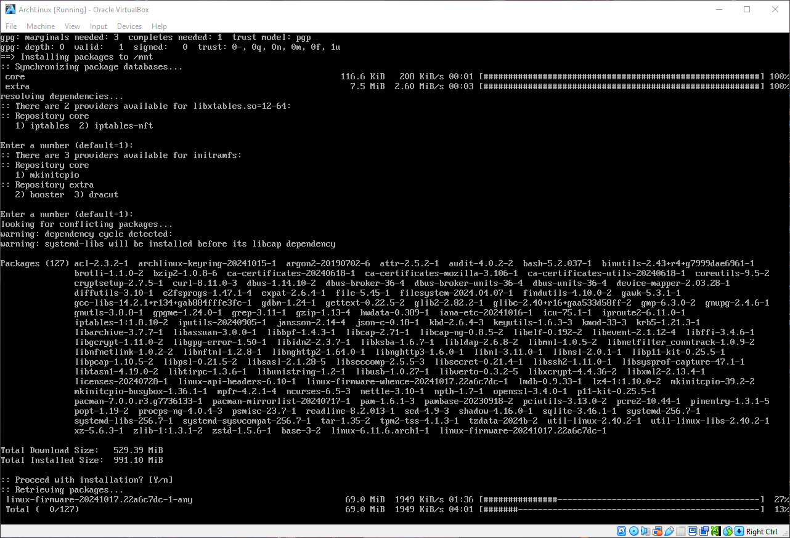

看来要安装 127 个包, 不是个小数目. 而且我这里的网速看起来也比较一般. 慢慢等吧. 这个安装进度让我莫名想起安装 $\LaTeX$ 时候的样子. 

Waiting...

? 后续过程这么快的吗? 127个包看来都不是很大的样子. 安装好之后的样子是这样的:

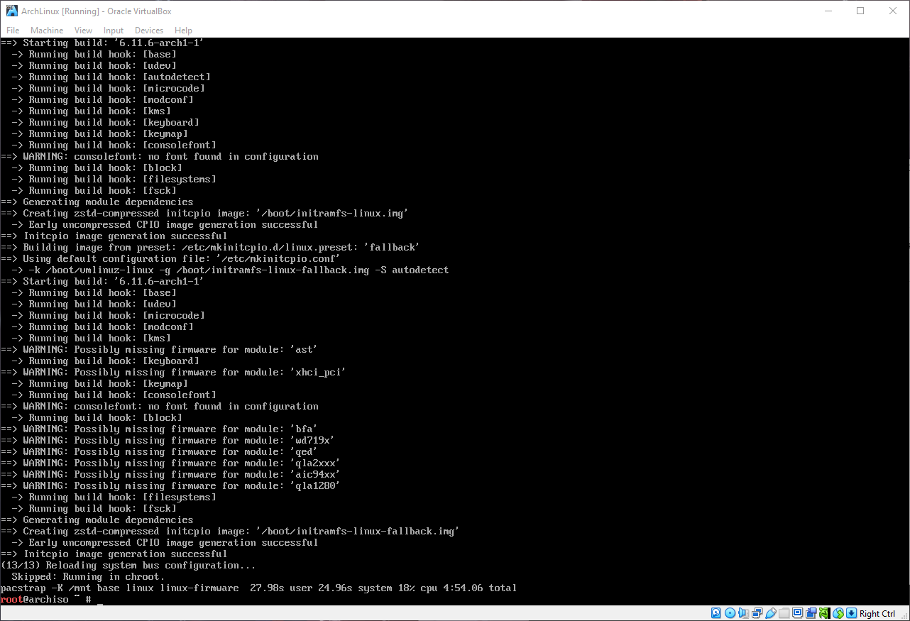

可以看到其实有一些部分是缺失的. 这个应该没什么关系, 毕竟虚拟机可能确实会缺一些不紧要的组件. 这里还可以安装一些别的组件, 比如 CPU 的指令集更新 (`microcode`), 使用 RAID 的工具之类. 这里就先跳过了, 之后使用 `pacman` 安装需要的内容. `microcode` 由于我使用的是虚拟机, 指令集补丁应该存在于主机 (这台Windows) 上,
所以不需要安装.

安装在虚拟机上的时候好像不需要安装 `linux-firmware`, 额…… 无所谓了. 现在才看到也是醉了. 那么就下一步吧.

## 设置系统吧!
### 分区文件, chroot, 以及本地化
首先先生成一份分区表文件, 使用命令: `genfstab -U /mnt >> /mnt/etc/fstab`. 之后用 `cat` 看看结果是否正确, 不对的话需要改一下. `fstab` 的 Arch Wiki 页面有一些例子, 这里就不再赘述 (因为我搞的好像没什么问题).

接下来 change root 到新系统下: `arch-chroot /mnt`. 根据中文 Arch Wiki 的解释, chroot 是 "修改当前进程及其子进程的可见根目录的操作". 似乎修改之后进程就会以 `/mnt` 为根目录 `/`:

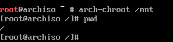

我大胆猜测, 现在就是把进程从 ISO 文件中的系统转移到了我虚拟机上的系统. 不过怎么验证这个想法我没什么主意. 下一步吧.

现在要设置时区. 国内应该是东8区. 根据教程, 可以使用 `timedatectl list-timezones` 来列出可用时区. 然而坏消息是, 列出来的时区因为太多了, 而不知道为什么, 这个终端我没法滚动 (鼠标或者键盘的 `Shift + PgUP` 好像都不可以). 经过一番查找, 向上翻页的功能应该是被从内核中砍掉了,  因为没多少人用了, 目前几乎都在用终端模拟器. 好吧, 只好把结果重定向到文件里, 然后再用 Vim 打开试试了. 不过竟然新系统是真的什么都没有, 包括 Vim 或者 Nano 都没有??? 只好退回到安装镜像里看看了. 国内时区使用的是 `Asia/Shanghai`, 所以重新 `arch-chroot /mnt` 回到根目录, 使用命令 `ln -sf /usr/share/zoneinfo/Asia/Shanghai /etc/localtime` 命令设置好时区, 然后使用命令 `hwclock --systohc` 生成 `/etc/adjtime`. 

再下来是设置本地化. 我个人倾向于不改中文使用, 而且因为没有安装编辑器, 现在要改变本地化设置也不行 (太蠢了, 为什么不安装编辑器!). 好吧, 再憋一下. 还是先设置主机名吧. 因为没有编辑器, 干脆直接使用 `echo` 重定向到 `/etc/hostname` 好了. 那么在不使用 LVM 或者 RAID 的情况下, 下一步便是设置密码. 设置密码的时候输入的字符是隐形的, 所以看不见是正常现象. 好像 Linux 下的大多数密码输入的时候都会隐形, 也算是保护隐私的一种惯例了.

## Boot loader, 然后决定命运的重启!
最后, 选择并安装 boot loader. 这一步很重要, 不然会导致无法启动 Arch Linux. 根据 boot loader 的特性表, 以及网上查找到的信息 (其实是我没找到怎么搞 EFI boot stub 的安装), 我选择使用 GRUB 作为 boot loader. 首先安装 GRUB (算了, 顺带这一步把vim也安装了吧, 憋不住了): `pacman -S grub vim`. 根据 GRUB 的 Arch Wiki 页面, 找到 BIOS System 的第二条 Master Boot Record (MBR) (我怎么在 UEFI 这里兜兜转转好久). 使用命令: `grub-install --target=i386-pc /dev/sda`. 这里 `--target=i386-pc` 是固定的, 而后面的 `/dev/sda` 是指的硬盘而非分区.

安装好这一步之后就需要对 GRUB 进行配置了. 使用命令: `grub-mkconfig -o /boot/grub/grub.cfg`. 貌似这样就已经配置好了. 感觉还是挺简单的. 怎么心里毛毛的. 好, 重启吧! 希望一切顺利.

成功辣! 好耶! 但是迎接我的并不是美丽的图形化界面, 而是简洁的 tty1, 甚至要我输入账户名来登录. 好吧, 看来起码安装是成功了, 现在要做的就是后处理了.

## 安装后的配置

其实要是较真地讲, 现在已经把 Arch Linux 安装好了. 但是我决定送佛送到西, 配置一个能日常使用 (~~玩耍~~) 的系统出来. 按照安装教程的说明, 现在跳转到了 general recommendations 的页面. 这也算是教程吧, 就按着这个来吧.

### 系统管理: 添加用户和其他

首先是要学习两个概念, 系统管理 (system administration) 和包管理 (package management). 这两个里第一个对任何的 Linux 系统而言都应该是重要的, 而第二个应该是出于 Arch Linux 独特的滚动更新模式, 所以要特别强调.

第一点就是讲明 root 账户应该只应用于系统管理的情况, 平时应该使用未经提权 (提高权限) 的普通用户. 使用命令: `useradd -m amoment` 便可创建一个名为 `amoment` 的用户, 并初始化这个账户对应的 `/home/amoment` 文件夹. 随后使用 `passwd amoment` 来给这个账户一个密码. 具体操作中, 因为要先登入 `root` 账户进行操作, 所以可以在执行完之后 `logout` 然后重新以新创建的 `amoment` 账户登录.

接下来是安全问题. 看不了一点儿, 越看越觉得自己在互联网上裸奔 (其实应该已经是了). 感觉自己的网络安全意识还有待提高. 这一部分的文档很长, 以后再细看吧. 随后是服务管理, 主要是说 `systemd` 的使用. 也许以后会有需要用 `systemd` 来搞一些自动化的服务. 最后是 Arch 滚动版本带来的系统维护的需要. 由于是~~玩具~~系统, 这步也暂时免了吧.

### 包管理: pacman, 但是……

Arch Linux 默认使用 `pacman` 作为包管理器. 用包管理器可以安装东西, 前提是有网络. 然而…… 好消息是, 我新安装的 Arch Linux 莫名其妙没有网了. 所以, 包管理章节先暂停一下, 先跳转至 **网络设置** 部分. 

### 有网络再说安装吧!

问题的症状很奇怪, 使用命令 `ip link` 之后显示的网络适配器都是未启动的状态, 而使用 `ip a` 之后显示的内容都是没有 ipv4 地址的. 
- 猜测1: 虚拟机设置有问题
  - 捣鼓了半天的 NAT 网络设置, 但是感觉问题应该不是出现在了这里, 因为之前就是使用的 NAT, 不然我的 `vim` 都安装不上去的
- 猜测2: ip 设置有问题
  - 可是 ip 我也不懂啊, 互联网 (物理) 小白是真的搞不懂这些网络协议之类的. 回去翻看安装说明, 也没有讲到这里呀.
- 回忆: 安装的时候是有网络的, 安装完好像没碰过网络环境.
- 猜测3: 该不会是我自己系统上没有装驱动吧
  - 坏了, 网上一通搜, 真的是没有装网络服务 `dhcpcd` 和 `networkmanager`. 乖乖回去用安装镜像进入, `mount` 根分区 `/dev/sda2` 到安装镜像的 `/mnt` 然后 `arch-chroot /mnt`, 开始老实安装 `dhcpcd` 和 `networkmanager`. 这里要感谢[讨论串](imgs/https://bbs.archlinuxcn.org/viewtopic.php?id=12603)和[一篇博文](imgs/https://www.cnblogs.com/yuxiayizhengwan/p/16576946.html). 
回看安装指引, 这时才明白, 条目 1.7 最底下的 Note 是什么意思了: 网络服务在新装的系统上面是通通没有滴! Okay, 安装完毕, 继续回到 `pacman` 上.

### pacman: 没错, 孩子, 又是我

首先, 为了能让我以普通用户身份提权然后使用 `pacman`, 先在 `root` 账户下安装好 `sudo` 吧: `pacman -S sudo`. 然后安装结束后会发现一个很尴尬的事情: 我的普通账户不在 sudoers 文件中. 查看指南, 指出需要使用 `visudo` 来修改 `/etc/sudoers` 文件, 但是 `visudo` 需要 `vi`. 我安装了 `vim`, 但是这个不默认安装 `vi`. 网上的解决方法看起来有点麻烦, 所以干脆直接 `pacman -S vi` 安装. 之后 `visudo /etc/sudoers`, 在某处 (我在 root 开头那行的底下) 插入 `amoment ALL=(ALL:ALL) ALL` , 即可在需要时提权我的个人账户.

太棒了, 但是这是否已经解释了如何使用 `pacman`? 好像还不够. 查阅指南, 指南中指出在安装软件包时, 不要使用 `pacman -Sy`, 这样会造成部分更新, 容易搞崩系统 (俗称 "滚挂"). 安装软件包使用 `pacman -S <pack name>`; 升级系统使用 `pacman -Syu`. 这里再解释一下 `pacman` 的命令行的意思吧, `-S` 代表的是 *Sync*, 是同步的意思, 意即使用该命令是从 Arch Linux 的软件源服务器上把对应的软件包同步到本地. 实在是很新颖的做法, 起码概念已经甩开传统的安装了. `-Syu` 中的 `y` 是指 *refresh*, 从服务器上下载最新的包数据库, 而 `u` 则代表 *sysupgrade*, 更新系统上的所有软件包. 所以 `-Syu` 的意义就很明显了, 不希望拉到了最新的软件包数据, 却又没有实际更新软件. 所以这两者放在一起最合适是有道理的.

看一下删除包吧. 我发现 `networkmanager` 好像是不必要的, Arch Linux 使用的 `systemd` 自带一个 `systemd-networkd`. 删除软件包使用命令 `pacman -R` 即可删除包, 但是这种情况下会留下这个跟着这个包一起下载到本地的依赖们. 要顺带删掉*空闲*的依赖 (可能有些依赖别的软件包也在用), 使用 `pacman -Rs` 即可. 其中 `s` 代表的是 "recursive". `R` 的意义就很明显了, 就是删除 (Remove). 所以为了删掉 `networkmanager` 且不影响到别的软件包依赖, 使用命令 `sudo pacman -Rs networkmanager` 即可.

最后了解一下如何列出安装好的软件包吧. 使用命令 `pacman -Q` 即可列出所有已经安装好了的软件包 (非常多, 因为在安装系统的时候就已经在使用 `pacman` 了). 其他的设置可以通过 `pacman -h -Q` 来查看 (`-h` 即为帮助的意思咯).

### 桌面环境: KDE

很好, 先在这个系统距离可以让我谜之自信地喊出 "By the way, I use Arch" 感觉只剩下最后的一步: 安装桌面环境. 经过不细致的选择, 我决定使用 KDE Plasma 作为桌面环境 (Gnome 的拟物图标感觉不是很喜欢呀, 虽然左侧栏的设计很喜欢, 不过好像 Plasma 也可以搞?). 

通过 `pacman -S plasma-meta` 安装 plasma. 中间有几处需要选择一些诸如字体, 解码器之类的供应源, 网上没有多少讨论这个的, 所以就基本全部默认了. 然后顺手安装上 `zsh`, `noto-fonts-cjk/emoji/extra`, `bluez-utils` `kitty`, `konsole` 和 `alacritty`. 这里 `kitty`, `konsole`, `alacritty` 三个重复了, 因为我想都试试. 

首先打开蓝牙: `sudo systemctl enable --now bluetooth`, 然后通过 `sudo systemctl enable --now sddm` 即可进入 KDE Plasma 桌面. 剩下的就是点点点了, 点点点, 爽! 我必须立刻把任务栏 (这里叫 panel) 移至左边!

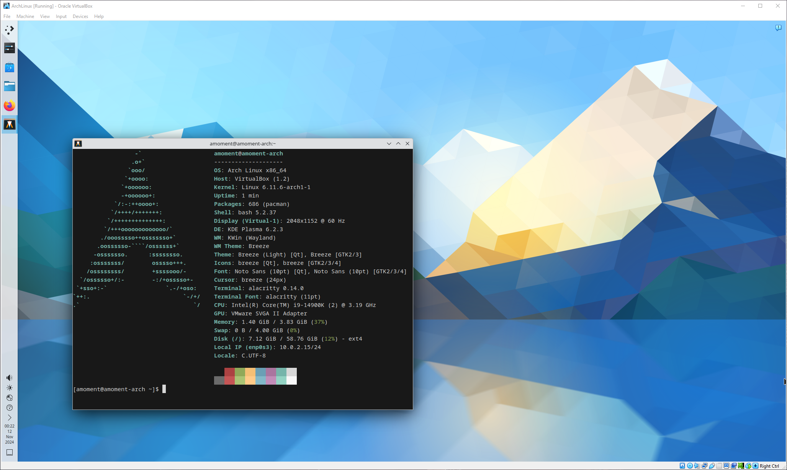

### 安装别的工具……

#### 我中文输入法呢!

为了实现中文输入法, 我安装了 `fcitx` 大礼包: `fcitx5`, `fcitx5-configtool`, `fcitx5-chinese-addons`, `fcitx-gtk`. 然而莫名其妙地遇到了几个奇怪的坑:
1. 教程讲要把一些内容加入到文件 `/etc/environment/` 里面, 然而我用 `vim` 打开之后发现是只读的. 虽然可以覆盖, 但是总是感觉不对. 经过网上的搜索才得知: 没错, 这就是权限控制. 使用 `ls -l /etc/environment` 命令可以看到最左边的权限控制符, 指明了这个文件是只有拥有者才可以读写, 同组或其他人只能读, 而这个文件的创建者正是 `root`. 所以乖乖使用 `sudo vim /etc/envirnment` 就可以了, 其实很简单.
2. 为了配置中文输入法, 我找到 KDE Plasma 的设置里面的 `Input Method` 部分, 并且在右下角的 `Add Input Method...` 中选择了 `Keyboard - Chinese`. 然而什么都没有发生. 即便左下角的输入法显示的是 zh, 可依旧不是中文输出. 很怪! 然而解决方法出乎意料的简单: 在仔细观察各路大佬博客之后, 我发现中文输入法不叫这个名字, 而是应该直接搜索 `pinyin`. 无语了, 心态有点小爆炸.
根据 `fcitx` 的官网教程, 为了使 `fcitx5`生效, 应该在路径 `~/.config/environment.d/` 下创建文件 `im.conf`, 并在其中输入：
```bash
XMODIFIERS=@im=fcitx
SDL_IM_MODULE=fcitx
```
这样一来, 重启之后就可以使用中文输入了

#### 还是想要用 `fcitx5-rime`

安装 `fcitx5-rime` 我是直接按照说明来的. 直接用 `pacman` 就好: `sudo pacman -S fcitx5-rime` 即可. 然后在输入法中直接搜索 `rime` 选中应用就好. 但是这个时候的词库啊配置啊什么的都不太合意. 然而我 Windows 端也用 的是 Rime 家族的输入法 (具体来讲是小狼毫 `weasel`) 而且有一套调教过的配置 (使用 `oh-my-rime`, 也叫薄荷输入方案). 所以, 干脆把配置从 Windows 上导入到虚拟机里好了.

为了能把我在 Windows 上的配置文件直接导入到 Arch 里, 需要在 Arch Linux 里面下载: `virtualbox-guest-utils` (不支持 X 的话要安装带个 `-nox` 后缀的版本), 然后把它加入到 `systemd` 的服务中去: `sudo systemctl enable --now vboxservice.service`. 然后再在虚拟机上打开 Drag and Drop 以及 Shared Folders. 我将我用的 Rime 配置文件打包成 tar 之后放在了 Shared Folder里, 然后就可以从虚拟机上的指定位置取出来然后解压缩到需要的路径了. 其实期间有考虑过使用 `ssh` 或者是其他的方式来传输这个压缩包, 后面还是放弃了. 反正能完成目标就好, `ssh`? 不用也罢! ()


#### 不能科学上网吗？

虽然是虚拟机, 还是想试试安装一些科学上网的工具. 目前 Windows 上有在用的工具, 但是貌似在 Linux 上并不是很好用呀 ... 经过一通搜索之后锁定到了 V2rayA, 使用 `yay` 就能很简单的安装 (? 代理? Github?). 

实际尝试过后, 发现这个工具好像和我目前在用的有点八字不合? 在 Windows 上也尝试同款工具之后, 发现确实是不太好用, 唉. 那就算了吧. 不科学上网, 那又能怎么样呢?

#### 终端字体怎么怪怪的? Alacritty?

听闻 Alacritty 使用 Rust, 性能十分优异, 然而在我满心欢喜地调整系统字体为中文之后, Alacritty 的字体变得惨不忍睹了 ...

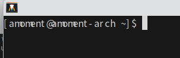

这究竟是怎么回事? 在热心群友的帮助下, 我查阅了 Alacritty 的 Arch Wiki, 得到了令人震惊的事实: 我竟然没有配置字体文件. 直接下载安装 `ttf-cascadia-mono-nerd` (其实不下载也可以), 然后在家文件夹下创建新文件夹和文件: `.config/alacritty/alacritty.toml` 并使用 `vim` 修改内容. 格式如下: 

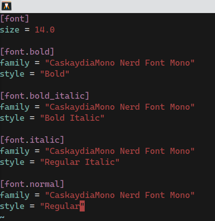

保存的时候便会直接应用. 其中 `family` 是可以从设置的字体管理部分看到字体族的名字, 输入即可. 这里字体族主要是需要等宽字体族才能正常显示, 选择这款字体是因为我 Windows 上的终端字体也是用的这套 `Cascadia`, 很喜欢所以就干脆保持一致了.

#### 试试 Zsh!


