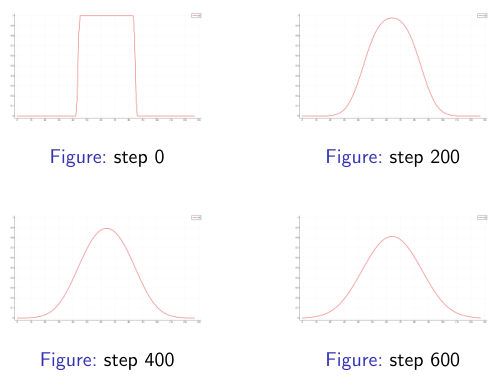

---
categories:
- Phase Field
- Mathematics
- Programming
tags:
- Tutorial
- Phase Field
- Numerical Analysis
- C++
title: "Phase Field: 相场模拟学习笔记 III"
description: 记录相场方法的学习内容
image: Skadi.png
date: 2024-12-23
math: true
links:
  - title: PF_Tutorial_3 C++语言及计算实例
    description: 放在B站的讲课录播
    website: https://www.bilibili.com/video/BV15aSuY2EpY
  - title: Github 上的讲义仓库
    description: 放在 Github 上的讲义, 包含课件和用到的资料
    website: https://github.com/A-moment096/Phase-Field-Tutorial/tree/main/PF_T2-Numerical_Method_and_Python
---

*接上一节内容, 这节会简单介绍 C++ 的一些语法知识, 然后用 C++ 实现一维传热方程的模拟。*

## C++：一门高效的，适宜科学计算的程序语言

C++ 是一门经典的编程语言，于 1979 年由 Bjarne Stroustrup 设计，最初目的是为了成为更好的 C 语言，而后随着自身发展，成为了一门和 C 语言有许多相似之处，而又截然不同的一门语言。 C++ 支持多种编程范式，包括但不限于面向过程，面向对象，函数式，模板元编程等等。 其丰富的生态，高效的算法库以及*零成本抽象*的理念让 C++ 极为适合进行各类科学运算。此外，C++ 的语法较为亲民，其多种编程范式也便于不同背景的开发者上手，故我们在这里引入 C++ 作为后续计算使用的程序语言。

### C++ 简介

首先，我们对 C++ 的一些基础概念做出简单的介绍。这些概念你也许在上节中已经遇到过来，这里再做出进一步的解释。

### C++ 编译器

C++ 作为一门语言，当谈起 C++ 编程时，实际上我们只是书写了以 C++ 的格式书写的代码，而将这些代码翻译为机器能够阅读并执行的程序，需要许多道不同的工序。幸运的是，**编译器**（compiler）可以近乎一步到位地帮助我们完成这个过程。C++ 历史悠久，自然发展有多种编译器来编译源代码。这里列举其中三个较为知名的编译器（工具链）：
- GNU Compiler Collection (GCC) 以及 G++：来自 GNU 基金会的开源老牌编译器工具集合，其中用以编译 C++ 的编译器为 G++。G++ 编译器几乎是 Linux 平台的标准编译器，而 Windows 平台可以考虑使用一些迁移工程，如 Cygwin， MSYS2 或  MinGW（Minimalist GNU for Windows）。其链接器为 `ld`，调试器为 `gdb`。
- Microsoft Visual C++ (MSVC)：微软开发的 C++ 编译器工具，除了编译 C++ 外还兼职编译其他的一些代码，如 C 等。其命令行工具名为 `cl.exe`，但只能通过微软的开发者命令行调用。使用 MSVC 的一般方式为使用微软开发的 IDE。其链接器为 `LINK.exe`，调试器为 `vsdbg.exe`。
- Clang++ / LLVM：LLVM 组织开发的一款模块化的现代编译器工具集合，其中用以编译 C++ 的编译器前端为 Clang++。 Clang++ 为 MacOS 系统默认的编译器。当然也可以安装在 Windows 平台或 Linux 平台上。其链接器为 `lld`， 调试器为 `lldb`。
以上三款编译器近乎最受欢迎的 C++ 编译器，当然也有一些其他的 C++ 编译器，但由于不同编译器对语言的实现可能有所不同，依旧是建议没有特殊需求的开发者采用三大主流编译器编译 C++ 代码。

编译器负责将源码编译为二进制文件，而**链接器**（linker）则负责将不同的二进制文件按照要求链接起来，形成一个单独的二进制文件。**调试器**（debugger）则负责读取符号表后对二进制文件进行逐行运行与调试。至于编译器的*前端*，*后端*以及其具体运行超出了单纯运用的范围，这里不深入介绍（其实笔者也不太懂）。

这里同时也稍微提一下 *编译器*，*编辑器*，*解释器* 和 *IDE* 的区别。其中，解释器我们已经在 Python 中遇到过，它负责将 Python 代码逐行解释给机器并令机器执行。其属于广义上的编译器，即将源代码（文本）转化为机器能识别的指令等的程序。而狭义的编译器则指将文件整体处理并编译为二进制文件的程序。由于 C++ 的执行必须先编译为二进制文件，故其编译器是必不可少的。编译器则与前两者完全区分开，是编辑文字的工具。常见的编辑器如 Windows 上的记事本，Linux 上常用的 Eamcs，Vim，较为现代的 VSCode 等。 经常与编辑器搞混的概念则为IDE。IDE是指集成开发环境（Integrated Developing Enviroment），其兼具编辑器与编译器的功能，可以在其中编辑代码并编译为二进制文件后运行，且通常具有别的功能，如断点调试等等。 这些概念是有一定区分的必要的，否则容易造成误解。

### C++ 编译链接

理解 C++ 的编译过程与链接过程对正确运用编译器编译 C++ 代码是必要的。这里不会过分深入，旨在介绍大致过程，以免出现一些常见问题（如找不到符号定义等）。

在编译过程中，编译器会首先将所有的源文件（通常后缀为 `.cpp`, `.cxx` 等）按照要求编译为相对应的对象文件（Linux 上为 `.o` 文件，Windows上为 `.obj` 文件），并留下没有实现但是已经声明过的函数、类等，等待链接器链接至对应位置的静态或动态库。随后链接器将执行链接，即将对象文件，外部静态库（ Static Library, Linux上的 `.o` 或 Windows 上的 `.lib` 文件）和外部的动态库（Shared Object 或 Dynamic Library，Linux上的 `.so` 或 Windows 上的 `.dll` 文件）链接至一起形成一个二进制文件。其中，静态库将和程序生成的对象文件合并到一起形成一个文件，动态链接库则不被合并到文件中。因此，使用动态链接库可以减少重复代码，降低程序的大小。随后在运行该程序时，当程序需要外部链接库中定义的内容时，操作系统将按照一定的顺序寻找动态链接库，并找到其中的定义然后执行。当没能找到动态链接库时，程序便会报出“未定义的符号 XXX”的错误。一般程序会到环境变量中的位置寻找动态链接库，随后在程序所在文件夹下寻找动态库。如果用到了动态链接库，请注意让程序能找到动态库，否则无法成功运行。

上面仅为简单的介绍，其中编译过程还可以细分为若干步，链接过程也可以分为若干步骤。这里不再介绍。但是需要指出的是：编译过程中，根据编译的类型，会对代码进行不同程度的优化。常见的所谓 *Release* 版本即为打开所有优化选项，且不生成/加载符号表的程序版本，其程序体积小，运行速度快，但通常无法调试（因为缺少符号表）。与之对应的 *Debug* 版的优化则较少，但其含有的符号表可以在调试过程中逐步运行代码并查看变量值。编译程序时请注意这些区别。

### 调试器与调试

调试器通常是一类独立的程序，其可以运行编译链接完成的可执行程序，并且加载程序对应的符号表后可以逐行运行程序。调试器还支持断点，在特定位置暂停程序的运行，并且显示当前位置程序中加载的变量和函数调用栈等。调试器的出现极大地方便了程序的调试，可以方便定位程序中存在的问题并做出修改，以编写出更加符合要求的代码。

调试器常常拥有自己的界面，可以独立运行，然而目前常见的使用方式是使用一些外部程序调用调试器，捕获其输出并传递输入的参量，以便与源代码进行对照。常见的 IDE 均有此功能，而一些编译器经过合理的配置之后，也可以调用调试器进行使用。通常的调试过程为：添加断点，逐步运行，查看变量/修改变量值，步入函数/步出函数等。调试过程中可以多加探索。

### C++ 环境搭建

如果您使用 Windows 平台，最简单的方法即为考虑微软旗下的 Visual Studio。作为一款成熟的 IDE，Visual Studio 可以在简单的了解其操作之后便将注意力集中在编程解决问题本身而非工具的使用。只需要在官网下载 Visual Studio 的下载器，在下载器界面内选择 C++ 桌面开发的组件，便可以在安装后创建一个解决方案+一个项目，并在左边资源管理器中新建一个 C++ 源文件后开始编写程序了。所有的编译器选项等等都可以通过项目属性来管理配置。如果需要在 Windows 平台上编写大型程序的话，Visual Studio 近乎是 Windows 平台的不二之选。

不过如果只需要编译运行单个 C++ 文件，又或者 Visual Studio 太过笨重，不适合您的电脑环境的话，可以考虑使用 MinGW-w64 或者 MSYS2 中的编译器与 C++ 运行时。在写好 C++ 源文件之后， 像在 Linux 环境下一样调用 `g++` 命令编译源文件，即可得到可执行的程序。除了在 Windows 上模拟 Linux 环境外，还可以考虑使用 WSL 来创建本地的轻量化 Linux 子系统，登录到子系统后就相当于打开了 Linux 虚拟机，此时便可在 Linux 环境下安装编译所需要的工具链并进行编译了。

由于所谓源代码仅为有一定格式的文本文件，故而您可以使用任何喜欢的文本编辑工具来编写源代码。然而好的编辑器可以辅助编写，特别是代码高亮，自动补全，调用编译器等功能可以极大地方便代码编写。这里推荐使用 VSCode，其丰富的插件生态可以在安装好编译器与对应插件的情况下提供良好的代码高亮，定义跳转，自动补全的功能，且可以编译 C++ 源文件并调试/执行。具体内容由于 VSCode 提供了详尽的文档，这里不再赘述。

### C++ 标准

作为一门发展良久的语言，C++ 经历了数次版本迭代，也因此拥有多个语言版本。根据 ISO 的标准，C++ 委员会将对语言特性，语法规则等进行调整，对语言库做出提案，并由各大编译器厂商进行实现。不同的编译器厂商可能会采用不同的实现方式，且不同的编译器可能会添加不同的扩展，故而非标准的 C++ 代码可能需要根据平台和编译器进行编译。而当源码采用的标准与编译器标准不同时，也常常会出现编译错误。所以在编写/编译源文件时应明确采用的 C++ 标准。目前业界常用的且拥有广泛编译器支持的 C++ 标准为 C++14，但该标准较为老旧，缺少很多便利的库函数等。可以考虑使用 C++17 或者 C++20 标准以方便使用。本教程使用 C++17 标准。请注意 Visual Studio 默认的 C++ 标准为 C++14，如有必要请在项目属性中修改 C++ 标准。

## C++ 语法基础

经过上面的介绍，相信您已经对 C++ 所配套的工具和其必要的信息已经有所了解，而到目前为止，我们还没有介绍 C++ 具体的语法。那么我们接下来便开始 C++ 语法的介绍。

### 注释，头文件和 `#include`

程序通常都有注释。C++ 中的单行注释以 `//` 开始，让编译器忽略一行中 `//` 后的所有内容。 而多行注释（或者更准确地说，范围注释）则是以 `/*` 开始，以 `*/` 结束。简单更改程序时，单行注释很常用，而多行注释常用来书写大段说明性的文字，特别是版权信息等。

打开一个 C++ 文件，首先看到的常常是各种 `#include` 开头的若干行。在 C++ 中，当需要使用外部的内容时（如，函数，类等），通常使用 `#include` 预处理命令来将对应库的头文件引入该文件。比如需要使用标准库的输入输出流时，则需要在源文件中使用 `#include <iostream>`。而在使用自建库时，通常使用冒号 `""` 而非尖括号 `<>` 来引入头文件。

所谓头文件，通常指以 `.h` 结尾的 C++ 代码，其中声明了一些函数或者类等，也可以在头文件中实现这些函数/类。在引入头文件后，便可以使用头文件中定义的名称，作用类似于 Python 中的 `import`，但更为原始一些，因为 `#include` 会令编译器直接将对应文件复制粘贴到对应位置。

标准库的头文件常常与标准库相关联，所谓标准库，是指 C++ 标准所提供的一系列函数，类，函数模板以及类模板等内容。上面的 `iostream` 便是一个例子。 标准库非常地多，当有需要时请自行搜索是否存在已有的库可以满足需求。

### `main` 函数和小例子

对 C++ 程序而言，一个可执行文件必须要包含一个 `main` 函数作为程序的主入口。当程序执行时，会从 `main` 函数开始执行，并且逐行向下。一个 C++ 程序只能拥有一个程序入口，意即 `main` 函数。下面是一个简单的例子：*hello_world.cpp*
```cpp
#include <iostream>

int main(){
    std::cout<<"Hello C++ world!"<<std::endl;
    return 0;
}
```
`main` 函数拥有以下几个特点：
- `main` 函数必须拥有 `int` 返回值类型
- `main` 函数的参数列表可以为空，也可以有两个参数：一个整值类型用以表示接受参数的个数，一个字符串数组/指针/容器用以存储接受的参数。
- `main` 函数成功执行时应返回 `0`。标准允许不写返回值，默认返回 `0`。

`main` 函数除了作为程序入口以外，本身也是一个满足 C++ 语法的函数。我们后面会看到 `main` 函数作为函数的几个要素。

### 变量类型

C++ 和 Python 最大的区别中，其中一个便是所有的变量具有静态类型（别的区别还有不需要代码缩进表示代码块等等）。在 C++ 中，声明变量需要首先声明变量的类型，然后是变量名。可以（也推荐）在声明变量时给变量初始化，通常只需在变量名后用等号 `=` 接上需要赋予的值即可。也可以通过初始化列表进行变量初始化，且对于类而言还可以使用合适的类构造函数进行变量初始化。下面是一个例子：

```cpp
#include <vector>
#include <string>
int main(){
    int i = 0;
    double j;
    int k {1};
    bool yes = false;

    std::vector<double> vd {0.1,0.2,0.4};
    std::string str = "I'm a string!";
}
```

为了简化内容，我们只介绍 `int`，`double`，`bool`，`string` 和 `vector` 五种类型，他们分别代表有符号整数，双精度浮点数，布尔值，字符串和向量。其中前三种是 C++ 的内置变量类型，在计算过程中常用到；后两者需要引入对应的头文件才能使用。这里有以下几点需要注意：

- 变量不进行初始化时请不要使用。可能会带有垃圾数据。如上面示例中的 `double j` 并没有对变量 `j` 进行初始化，里面可能存有任何错误的数据，需要在初始化之后使用。
- 变量可以使用大括号 `{}` 进行初始化，称为初始化列表。该方式对多个数据的组合变量较为常用。
- 使用标准库内的变量/类/函数时，如果没有使用 `using namespace std;` 进行全局获取名称，请使用 `std::` 来告诉编译器该名称的位置。 这里不介绍命名空间的内容。
- 对于 `vector` 这种类模板，请在后面的尖括号中指明容器中数据的类型。如上的 `std::vector<double>` 意即声明一个内部变量类型为 `double` 的容器类 `vector`。
- 字符串以双引号`"`开头，以双引号`"`结尾。
- 请勿使用全角字符，C++ 文本使用半角字符作为其符号。
- 变量命名不能以数字开头，可以包含数字，下划线和英文字母。

请注意，C++ 是严格类型语言。 当类型不匹配（且自动类型转换失败）时编译器会报错，在存在自动类型转换的情况下编译器可能会警告。请尽量不要让类型做自动转换，如使用 `double` 将整数变量强行转化为小数等。

### 作用域

和 Python 相似，C++ 也有变量作用域的概念。在 C++ 中，代码块使用花括号（大括号）来区分，代码块可以嵌套于代码块内。代码块内的变量可以获取代码块外变量的信息，但代码块外的变量无法获取代码块内的信息。变量在离开自己定义位置所在代码块时，如果没有特殊情况，将会自动销毁。使用循环，判断语句以及声明函数时使用的花括号也是一个作用域。下面是一个小例子：

```cpp
int main(){
    int i = 0;
    {
        int j = 1;
        i = 888; // success
    }
    // i will be 888 here

    // Below is an error:
    // j = 666; 
}
```

### 控制流，循环和判断语句

首先介绍循环语句。这里仅介绍 `for` 循环与 `while` 循环。下面是使用 `for` 和 `while` 循环的例子。

```cpp
for (int i = 0; i < 10; i ++){
    std::cout<< i << std::endl;
}

{
    int j = 0;
    while (j < 10){
        std::cout<< j << std::endl;
        j += 1;
    }
}
```

这两个循环都会将数字从 `0` 打印至 `9`，且其语法特征是完全相同的。其中 `for` 循环圆括号内第一项为循环前语句，会在循环开始前执行，常用来声明并初始化循环变量；第二项为循环条件，满足条件则继续循环；第三项为循环末尾语句，在执行完循环体内语句后将执行第三项中的语句。而 `while` 循环则显得简单很多：只要满足括号内的语句条件便可以一直进行下去。 请注意下面的循环在套上一层代码块后才能与上方等同。换句话说，在 `for` 循环括号中定义的变量时临时变量，在离开循环后将会自动销毁。另外值得注意的是，`for` 循环的括号内是三个语句，使用分号 `;` 分割，而非逗号 `,`。另外，判断条件实际上是一个表达式，当表达式值为 `true` 时则继续循环，为 `false` 则停止。

这里再介绍一下所谓的 range `for` 循环。当存在一个不变长的容器式的变量时，可以通过：
```cpp
for (auto rep_elem in container){
    /* xxx */
}
```
这样的语法来用 `rep_elem` 依次从前向后地取用所有的元素，以此完成循环。

判断语句这里仅介绍 `if-else` 语句。下面是一个例子：
```cpp
if (3 > 4){
    std::cout<< "false" << std::endl;
} else if (3 < 4) {
    std::cout<< "yes" << std::endl;
} else {
    std::cout<< "?" << std::endl;
}

```
其语法特性一目了然，这里不再赘述。


另外要介绍的是 `break` 和 `continue` 控制命令。当循环遇到 `break` 命令时将会立刻停止循环，而当执行到 `continue` 时则会结束本次循环，进入到下一次循环。对于嵌套循环，`break` 和 `continue` 只负责当前循环的控制，不会控制父循环。

### 函数

C++ 中的函数包含五个要素：返回值类型，函数名，参数列表，函数体，返回值。下面是一个例子：
```cpp
double my_add(double a, double b){
    return a+b;
}
```
这里我们声明了一个函数：返回值类型为 `double`，函数名为 my_add，参数列表中接受两个 `double` 类型的参数。这三个要素即可声明一个函数的存在。后面的函数体和返回值则是对该函数的实现方法，这里只做了一件事，即返回了参数列表中两个值的和。

这里要提出的是，C++ 中的函数允许不返回值，此时返回值类型为 `void`；函数也可以不接受任何参数，这时只需空置参数列表即可，但是圆括号是必须的。我个人建议声明函数时即将函数做出定义，但是在有必要时，可以列出声明后在另外的地方做出函数定义，例如将声明放在头文件中，函数定义则放在一个源文件中。

另外，在这里我尝试提出另一种理解函数的方式：提供了对外通道的独立代码块。这个代码块可以把外部的数值通过参数列表交换给代码块内部，而后从代码块内部返回一个结果交给代码块外部。在需要使用该代码块时，只需使用代码块的名称即可。此外需要注意的时，在使用函数时，像上面例子所定义的函数是无法改变外部数据值的。可以理解为代码块内部的所有内容都独立于其他部分，不会对接外部的上下文，只会根据传入的数据进行处理。如果需要改变外部数据，则需要在参数列表中传入**指针**或者**引用**，这两个概念会在下一个部分介绍。

最后要提出的是，函数允许递归调用，即函数调用自己。通过递归调用，可以将复杂的逻辑用较为简单的代码实现。C++ 函数还允许*重载*，即同一个函数名通过参数列表的不同来让编译器自动区分调用的是什么函数。请注意，仅返回值不同是无法区分的，只有参数列表才能让编译器对同名函数做出区分。也许可以考虑将参数列表纳入“函数名”的一部分，这可以为所谓的*函数指针*带来一定的解释，但可能有一些问题？所以仅供参考。

### 指针

我们这里不会介绍指针太复杂的内容，仅对指针最基本的用法以及其背后（可能）的思想做出大致介绍。在介绍指针之前，有必要先简单介绍 C++ 语言下的内存逻辑。

在程序运行过程中，由操作系统所管理的程序内存可以根据代码中的内容而区分为两个部分：堆和栈。其中的栈实际上是一种数据结构，指先入后出的队列，但这里我们只把它理解为一个由程序直接管理的内存。这些内存（比如某些变量）会由代码创建后存在栈上，当该程序的变量脱离某个部分时，由于变量的生存周期便会从栈上弹出销毁。这带来了一些好处，让程序的所有内存都得到恰当的管理，但是操作系统能分配给程序的栈空间大小是有限的，当栈空间不足以储存所有变量时，程序便会报出*栈溢出*的错误。

为了解决这样的痛点，程序允许和操作系统沟通，拿到不直接属于程序栈空间内的内存。拿到的这些内存就保存在*堆*上，而声明或使用这些内存则可以使用*指针*来取得。需要注意的是，虽然堆空间很大，但是堆空间由于数据散乱，其速率可能不如栈上的内存；另外，即便空间很大，不加限制的创建内存且不加销毁，特别是运行时间较久的时候，程序可能会用光所有的内存，此时便会造成所谓的*内存泄漏*。由于使用堆上数据近乎只能依靠指针，所以使用指针时需要格外注意，特别是内存的释放。

那么指针到底是什么？我们提取上面所给出的一些信息：指针需要能够获得堆上的内存，C++ 是强类型语言，需要使用指针获取并管理堆上内存。如果考虑 C++ 可以通过内存的地址管理内存，那么答案就呼之欲出了：指针，实际上是一种特别的变量。它会记录一个地址，并记录上这个地址下的数据的类型（同一数据，在不同类型解释下会给出不同的值，比如 `0` 在 `int` 下就是数字0，而在 `bool` 下则会解释为 `false`，所以指针的类型（大部分情况下）是必须的），随后在使用该地址内所存储的数据时，只需要对指针*解引用*便可以获得该值。下面是一个例子来说明如何声明指针，以及如何获取变量的地址：
```cpp
int i = 0;
int *p = &i;

// Output i's address
std::cout<<p<<std::endl;

// Modify i's value
*p = 1234;
std::cout<<i<<std::endl; //1234

```
上面的例子中，我们先声明了（栈上）的一个变量 `i`，随后用 `int *` 作为数据类型名声明了一个指针 `p`，并用 `&i` 取得 `i` 的地址，然后给这个变量 `p` 赋予了 `i` 的地址的值（称为*指针p指向i*）。此时输出 `p` 的值时会打印出一些十六进制数字。之后，通过 `*` 运算符，取出了保存在 `p` 中的地址下存储的值，并直接对该内存地址覆写数据 `1234`。由于 `p` 保存的地址正是 `i` 的地址，所以对 `i` 的地址写入新数据即为给 `i` 重新赋值。这样一来，输出 `i` 的值时，得到的结果即为 `1234`。

希望这个例子以及这里的简单介绍能帮助你理解指针是什么以及有什么作用。值得注意的是，这里指针指向的变量依旧是一个栈上的变量，而在很多需要使用指针的情况下，需要的常常是堆上的数据。为了在堆上创建变量，需要使用 `new` 关键字。而当在堆上创建变量后，如果不再使用变量时，必须使用 `delete` 关键字删除该变量。其主要原因是，当我们声明指针时，通常都是在栈上创建的数据；作为一个栈上的变量而言，当指针变量离开其作用域时便会被销毁。如果只有一个指针指向某个内存空间时，销毁该指针之后，内存中的数据便没有别的办法取到；而此时由于通过 `new` 创建了这个内存，操作系统会一直保留这个内存直到 `delete` 删除该内存，或者程序退出由操作系统销毁所有内存。这样一来，只 `new` 不 `delete`，当数据量较大时便会造成严重的内存泄漏；此外只 `new` 不 `delete` 还会把数据暴露在外，造成安全风险。然而要是使用了两个指针指向同一个内存时，如果在一个指针上销毁了内存，而另一个指针仍然认为内存没有销毁，那么该指针便会称为*野指针*，或者*悬空指针*。这时，当尝试使用该指针时，程序便会出错，轻则报错退出，重则产生难以排查的奇怪问题。

上面这么一大段，其最终目的只为了说明一件事：请不要轻易使用指针。指针很好用，但是 C++ 中也提供了别的很多更友好的方式来管理并使用内存。一旦使用裸指针又不小心忘记删除或者出现空指针，程序便会出现很多奇怪的问题。所以，对自己技术没有绝对自信时，请不要轻易使用指针。

最后我们提出如何使用指针来帮助函数改变外部变量的值：通过指针传入参数时，虽然函数无法改变参数的值，但是由于参数传入的指针指向的内存空间不会受到影响，所以可以在函数内部给传入的指针内保存的地址下的变量赋值，从而绕开函数的限制。然而，为了达成这一目的，有一种更加安全，且更加便于理解的方式：*引用*。

### 引用

与指针相比较而言，引用就显得更加和蔼一些了，简单来讲，声明一个引用也就是声明了一个变量的别名。我们先看一个例子：
```cpp
int i = 0;
int &ri = i;

std::cout<<ri<<std::endl;

ri = 5678;
std::cout<<i<<std::endl; //5678
```
这里我们首先声明了一个变量 `i`，然后创建了一个引用 `ri` 作为 `i` 的别名。这样一来，我们对 `ri` 所做出的*任何操作*（应该）都是相当于对 `i` 本身所做出的。当 `i` 被销毁时，变量 `i` 和它的引用 `ri` 会一起消失。和指针相比，引用显然要安全的多。但是与此同时，引用也有一些限制：引用不能改变它引用谁。一旦引用被创建，引用本身和引用所指向的内容就绑定死了。此外，由于引用*别名*的特性，引用不可能存在空引用，这也就要求了引用的“声明”必须立刻对其初始化，且一经初始化就不可改变。所以这里不应该使用“声明”，“赋值”等描述这一过程，最恰当的描述即为“初始化”。

值得注意的时，引用，和指针类似，也可以作为函数参数传入函数内部。当作为函数参数把引用传入函数内部时，引用的“别名”特点依旧保持，函数内对参数的改变依旧会反映在函数外部。一种理解方式是，函数参数列表的默认传参方式是把参数的值复制一份，生成一个临时变量，然后使用该变量；指针传参时把指针的地址复制了一份，然后使用该临时地址可以在不改变地址的情况下改变地址内部的数据；引用传参时，创建了一个临时的引用，由于引用的特性，函数对引用的影响就相当于对变量本身的影响。

总之，引用在 C++ 中是更加推荐的使用方式。当然，引用也有别的限制。引用由于终究是变量的“别名”，不会改变变量的内存布局，所以不存在“引用数组”这一数据结构。同时，也不会出现引用的引用，也不会有指针的引用。这主要是因为，引用并不是实际的对象，不会占据内存，因此也没有对应的地址（参考 [Stack Overflow 上的回答](https://stackoverflow.com/questions/1164266/why-are-arrays-of-references-illegal)）。

最后，有人声称引用是必须初始化的常量指针。这一点见仁见智，个人认为可以这么去理解行为，但二者不能划等号，具体实现需要根据不同的编译器去考虑。

### 类，模板，STL

前面的部分几乎涵盖了所有 C++ 的基础语法。这里再做出一些补充，比如 C++ 的面向对象（类），模板和标准模板库。

#### 类，面向对象

面向对象在 Python 已经做出了简单的介绍。这里在其基础上介绍 C++ 的面向对象的语法。

首先需要注意的是，C++ 中存在结构体 `struct` 和 类 `class` 两种类似的数据结构。一般认为，`struct` 和 `class` 的区别仅在于默认的访问控制。 `struct` 的默认访问是 `public` 的，而 `class` 则是默认 `private` 的。然而，也许二者也有一些微妙的区别，这里不加区分。（我也不知道）

下面是一个简单的类声明的例子：
```cpp
class my_class{
    private:
        int value{0};
        bool is_true{false};
    public:
        my_class(int v, bool is){
            this->value = v;
            s_value = is;
        }
        void print_info(){
            std::cout<< "Data is obtained?  "<< is_true<<std::endl;
            std::cout<< "Value is  "<< value<<std::endl;
        }
} simple_class_sample ;
```

这里我们声明了一个类，名为 `my_class`，其中包含有两个数据，这些数据由 `private` 保护起来所以外界无法直接取得这两个数据；在公开的部分（`public`）中有两个函数，一个 `my_class` 和一个 `print_info`。由于是 `public` 的，可以在类外调用这两个函数。其中可以看到，`my_class` 的函数名和类名相同。这是一类特殊的函数，名为类的*构造函数*。在使用该类声明一个新的变量时，可以使用该函数来初始化变量。由于函数重载的特性，一个类可以拥有多个不同的构造函数以满足不同的构造条件。这里隐藏了一些函数，这些函数会自动定义好，包括*析构函数*（变量退出作用域时会调用析构函数销毁变量），*拷贝赋值函数*（将变量复制从而创建一个新变量），以及*默认构造函数*（什么都不做，采用默认值初始化类内的变量），等等。

这里再次提醒，创建一个类实际上就是创建了一个新的复合数据类型，通过该复合数据类型以及其内部定义的函数（方法），可以实现通过方法来操控用该类型创建的变量（对象）。

最后，类的定义必须在大括号后添加一个分号，否则编译器会报错；定义好一个类后可以立刻创建一个变量，这里创建了一个变量名为 `simple_class_sample`，使用了默认构造函数。

C++ 的面向对象的特性十分丰富且比较完备，这里不再做出介绍。

#### 模板

模板是一类更加复杂的，更加高阶的编程方式。模板会在编译器即进行运算，因此模板从某种角度而言，可以说是用来生成代码的代码。这里提到模板，主要是引入后面的标准模板库，因此这里仅做出最简单的介绍。

下面是一个类模板创建和函数模板创建的例子：
```cpp
template<typename T>
T my_add_t(T a, T b){
    return a+b;
}

template<typename T>
class class_T{
    private:
        T value{};
        int index{0};
    public:
        void print_T_value(){
            std::cout<< T.text <<std::endl;
        }
};
```

这里创建了一个函数模板 `my_add_t` 和一个类模板 `class_T`。在使用它们时，只需要在其模板名后面跟上一个尖括号，然后在尖括号内写上需要的类型名即可。这里需要注意的是，在使用这里定义的类模板时，要保证 `T` 类型中拥有 `text` 这个属性，否则会报错。

#### STL: 标准模板库

STL 是 Standard Template Library的缩写，即标准模板库，是一系列的函数和类库，允许使用库中的类模板和函数模板。科学计算中，最常见的类模板便是 `std::vector` 了。作为类模板，需要在使用它的时候用尖括号来放入变量的类型。这个类型没有太大的限制，除了因为历史遗留问题而不推荐 `bool` 作为函数模板外，几乎可以使用任何变量类型来实例化该类模板。像这样的容器模板类还有 `std::deque`，`std::array` 等，它们都有各自的特性，感兴趣请自行搜索。这里介绍这些容器类共有的一些常用方法。

作为容器，一定存在一个方法来告知其内部元素的数量，这个方法为 `size()`。调用 `size()` 方法后会返回一个 `size_t` 类型的数字来表示容器内元素数量。其次，我们需要存取容器中的元素。取用元素时，STL 提供了 `at()` 方法来从容器的某个位置下取出元素，这个方法接受一个整型数据来取出容器中的元素，当这个数字超出了容器范围时将会报错。当然 STL 也提供了传统的下标方法 `[]` 取用，但是这个方法不安全，不会进行边界检查。对 `std::vector` 而言，可以通过 `push_back()` 方法来将参数列表中的元素添加入容器的最后。当需要删除最后一个元素时，可以使用 `pop_back()`。最后我们介绍这些 STL 容器都有的 `iterator`，即迭代器。通过使用 `begin()` 方法即可返回一个迭代器，这个迭代器的作用类似于指针，允许与整数做加减法，允许比较大小（第一个元素最小，最后一个最大）以及是否相等，而最后一个元素**再向后一个位置**的迭代器为 `end()`。因此，使用迭代器取用容器中的元素也是允许的。另外，使用迭代器比较时，建议尽量使用判断相等/不等，而非比较大小。因为有部分迭代器可能没有实现迭代器的大小比较。

## C++ 简单计算案例：传热方程

终于，经过漫长且枯燥的语法学习，我们终于可以看一些实际的问题，并尝试使用 C++ 来解决它们了。我们遇到的第一个案例，即为所谓的 Fourier 传热问题。 

### 问题描述
问题描述如下：

> 问题：设现在有一个热源，其中心处在 x = 64 的位置，宽度为40，温度为1，再设整个模拟域的宽度为 128，且边界上采用固定边界条件，除了热源外的位置温度为 1。先在已知传热方程如下：
> $$ \dfrac{\partial T}{\partial t} = \mu \dfrac{\partial^2 T}{\partial x ^2},$$
> 且在该问题中取 $\mu = 1$，求算该体系在上述方程下的演化过程。

其中的偏微分方程即为所谓的 Fourier 传热方程的简化版，将每一点的热导率看作一个定值并将所有其他参数合并后称为 $\mu$。

### 问题拆解
分析该问题，我们拥有的信息十分完全，再根据已知的 Laplacian 算符和向前欧拉法，我们很快就能构建出该问题对应的 C++ 代码。我们采用 $\Delta x = 1$，$\Delta t = 0.2$ 的空间和时间步长以计算时空间导数，并使用向前欧拉法迭代演化出该体系的演化过程。代码层面，我们考虑使用最基础的面向过程方法，并且注意到边界判断时固定边界上的温度值为 0.0。

### 代码实现
下面是我编写的一个例子：

```cpp
#include <chrono>
#include <filesystem>
#include <fstream>
#include <iostream>
#include <string>
#include <vector>

const int Nx = 128; 
const double dx = 1.0;
const double dt = 0.2;
const double mu = 1.0; 
const int nstep = 20000; // total iterate time
const int pstep = 200; // print result every 200 step

int main() {
    auto begin_time{std::chrono::high_resolution_clock::now()};
    std::string result_dir{"./results/"};
    std::filesystem::create_directories(result_dir);

    std::vector<double> mesh(Nx, 0.0);
    for (int i = 0; i < Nx; i++) {
        if (i >= 44 && i <= 84) {
            mesh.at(i) = 1.0;
        }
    }

    // tempory mesh for value storage
    std::vector<double> temp_mesh(mesh);

    // ----- Begin Simulation ----- //
    for (int istep = 0; istep < nstep + 1; istep++) {

        for (int i = 0; i < Nx; i++) {
            int im = i - 1;
            int ip = i + 1;
            double val_m{0.0}, val_p{0.0};

            // Fixed boundary condition (to 0)
            if (-1 == im) {
                val_m = 0.0;
            } else {
                val_m = mesh.at(im);
            }
            if (Nx == ip) {
                val_p = 0.0;
            } else {
                val_p = mesh.at(ip);
            }

            temp_mesh.at(i) = mesh.at(i) + mu * dt * ((val_m + val_p - 2.0 * mesh.at(i)) / (dx * dx));
        }
        // update the origin mesh
        mesh = temp_mesh;

        if (istep % pstep == 0) {
            std::string of_name{result_dir + "fixed_step_" + std::to_string(istep) + ".csv"};
            std::ofstream ofs(of_name);
            // if the file is indeed opened
            if (ofs) {
                ofs << "\"pos\"" << "," << "\"val\"" << std::endl;
                for (int i = 0.0; i < Nx; i += 1) {
                    ofs << i << "," << mesh.at(i) << std::endl;
                }
            }
            // close the file after write
            ofs.close();
        }
    }
    // ----- End Simulation ----- //

    auto end_time{std::chrono::high_resolution_clock::now()};
    std::cout << "The time cost in this simulation is " << std::chrono::duration<double>(end_time - begin_time).count() << "s\n";
    return 0;
}
```

这里用到了一些技巧，在边界判断处使用下标运算是否越界来判断是否处于边界处，以及使用了 `<chrono>` 库来监测程序运行时间。在成功运行并且用输出的 `csv` 文件绘制曲线图后结果大致如下：



可以看到这个结果还是比较符合预期的。

## 结语

太久不更新，写起来有些不是很得心应手。写完这些回头一看，我竟然写了这么多东西？C++ 的基础知识点比我想象的要多很多呀。如果您看到了这里，感谢您的支持。C++ 平心而论，好上手是真的，在了解一定的编程相关知识后很快就能写出一份能跑的代码。但是，C++ 的语法特性繁杂，内容过于丰富导致的则是 C++ 极高的进阶难度。几乎没有人敢说自己精通 C++，因为总有一些奇怪的点会出现在这门历史丰富且悠久的语言上，而恰好提问者知道但回答者不知道。不过好在，如果仅仅是为了使用 C++ 进行简单的高效计算，那么它的入门内容应该只需要上面这些又臭又长的介绍就差不多够了。在实际编程过程中，大多数的函数和类的 API 都是需要现查的，甚至有时候确实还需要面对 CV 编程（复制粘贴）。此外，不论任何编程语言，语言本身只能提供一些好用的特性，或者一些包装好了的算法轮子。实际在编程时最重要的问题是怎么分析问题，并且就这个问题设计出一套算法来解决问题。希望语言不会称为您的绊脚石。

下一节我会正式采用 C++ 来实现在 Cahn-Hilliard 方程引导下调幅分解的相场（其实是浓度场）模拟。再下一节则会进行 Allen-Cahn 方程下的晶粒长大模拟，并作为这个入门系列的最后一部分。敬请期待。