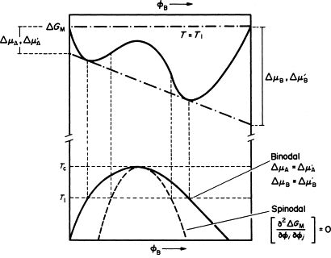
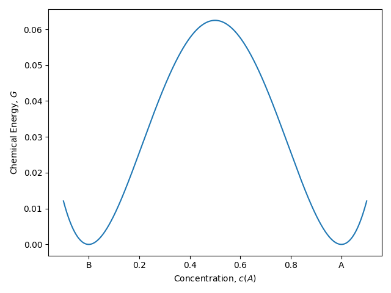
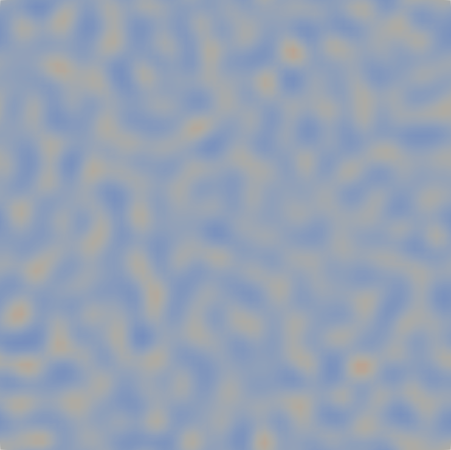
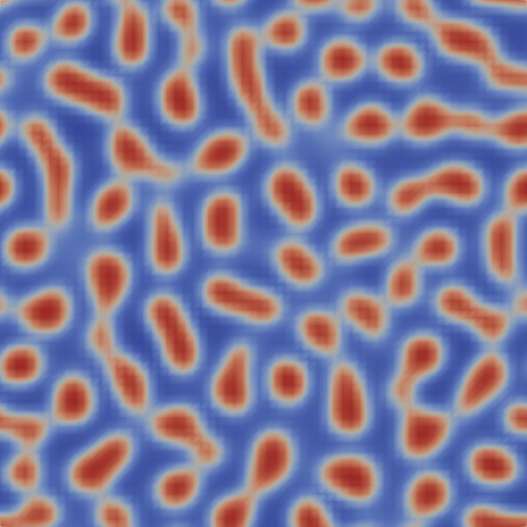
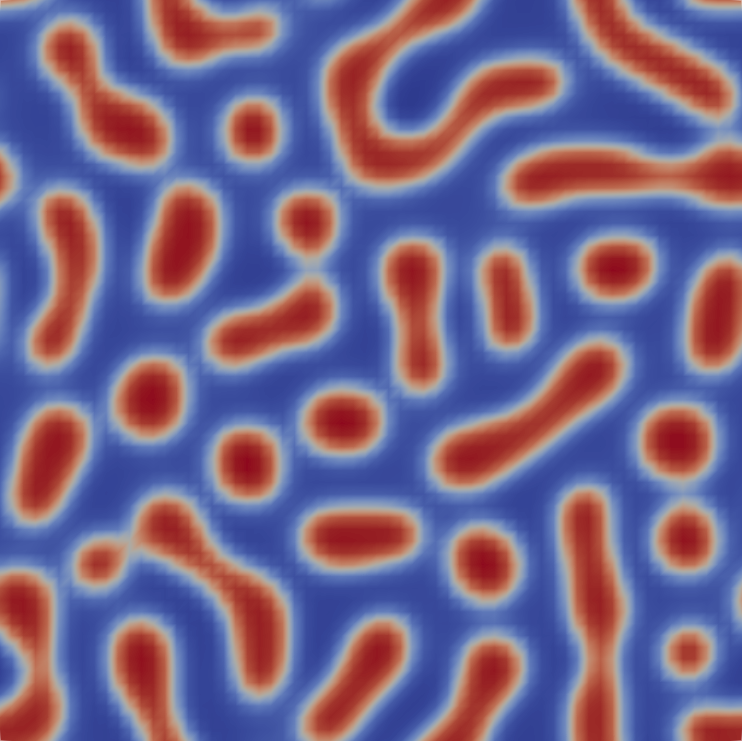
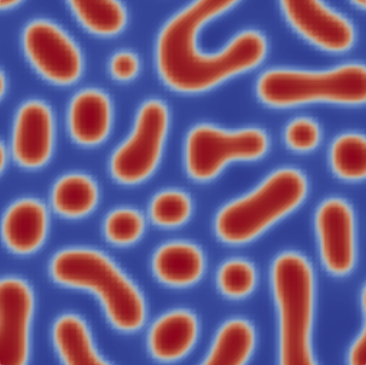

---
categories:
- Phase Field
- Programming
tags:
- Tutorial
- Phase Field
- C++
title: "Phase Field: 相场模拟学习笔记 IV"
description: 记录相场方法的学习内容
image: Skadi.png
date: 2024-12-24
math: true
links:
  - title: PF_Tutorial_4 调幅分解的相场模拟
    description: 放在B站的讲课录播
    website: https://www.bilibili.com/video/BV13niUYnEMu
  - title: Github 上的讲义仓库
    description: 放在 Github 上的讲义, 包含课件和用到的资料
    website: https://github.com/A-moment096/Phase-Field-Tutorial/tree/main/PF_T2-Numerical_Method_and_Python
---

*终于，真的要做相场模拟了。先从最软的柿子，调幅分解开始吧*

## 简介

所以，经过前面三个部分的学习，利用 C++ 进行相场模拟的所有前置几乎全部获得了：公式推导，编程基础，基础算法等，几乎全都拿到手了。这部分开始，我们就正式开始用 C++ 实现相场模拟。我们先从一个很经典且简单的例子开始：A-B 合金的调幅分解。

## 调幅分解

所以什么是调幅分解？它有什么特殊的地方？为什么相场法的第一个例子是算这么个有点陌生的东西？我们一个一个来解答这些问题。

首先值得明确的是，调幅分解是一类相变过程，且这类过程非常适合使用相场法来计算其演化过程。作为相变，我们自然关心其相图和自由能曲线的情况。下面是一副调幅分解的示意图：



从图上可以看到，调幅分解下的自由能曲线十分特殊，呈现一种*双势阱*的形貌。再观察这里的相图和自由能曲线，可以看到虚线部分对应于自由能曲线中比较平坦的区域。没错，这个点即为所谓的拐点（Spinodal Point），这也是调幅分解的英文 Spinodal Decomposition 中 “Spinodal” 的来由。由于调幅分解自由能曲线的特殊性，当自由能对成分的二阶偏导小于 0 时，如果成分正好出于混溶间隙里调幅线内，那么任何一点微小的成分扰动都会导致整个体系的稳定性被破坏，产生的自由能差（即所谓的相变驱动力）将增大并将体系演化至自由能曲线中“谷底”的位置，并形成所谓调幅分解的形貌。

调幅分解最特殊的地方在于，相场法这个方法几乎可以说是起源于调幅分解过程的。观察调幅分解的自由能曲线，它描述了一个中间态物质由于自身能量最小化的要求从而分散为两个不同组分的物质的过程。这个能量曲线将会是相场法这一计算方法的核心之一，意义在于在给出体系的体自由能描述的情况下，体自由能的最小化将会推动整个体系发生演化。Cahn 和 Hilliard 两人在 Ginzburg-Landau 自由能模型的基础上建立了用来描述调幅分解过程的自由能泛函，并推导出了对这个泛函的演化方程，这个演化方程即为所谓的 Cahn-Hilliard 方程。因此，从调幅分解入手开始了解相场法也许是最理想的选择了。

## 模型分析

本次我们使用的自由能构造如下：

$$
\begin{align*}
F &= \int_\Omega f_{bulk} + f_{int}\, \mathrm{d}\omega;\\
f_{bulk} &= Ac^2(1-c)^2; \\
f_{int} &= \kappa |\nabla c | ^2. \\
\end{align*}
$$
其中，$F$ 即为体系的总能量，由两部分的能量密度积分构成，第一部分为体自由能 $f_{bulk}$，其图像为一个双势阱：



而第二部分则为界面能密度部分，这里采用界面能梯度内积的值。这个能量构造保证了体系有演化的趋势（由体自由能密度驱动），又保证了体系中存在稳定的相界面（由界面能提供，在存在界面区域（梯度不为 0 ）时提高能量从而迫使物质不倾向于汇集在界面处）。这样的总能 $F$ 构造是一类非常经典的构造方法，而能量密度的具体表达式则需要根据体系做更改。

接下来我们分析 Cahn-Hilliard 方程。我们之前有提到这个方程，但是没有仔细分析它。其形式如下：

$$
\frac{\partial c_i}{\partial t} = \nabla\cdot\left(M_{ij}\nabla\frac{\delta F}{\delta c_j}\right)
$$

值得注意的是，这里括号内的乘积实际上是使用了 Einstein 求和约定 （对，就是那个 Albert Einstein）。这里不做过多解释，大概就是讲要把所有浓度的驱动力都算在一起作为总驱动力然后进行计算。

那么如何理解这个公式呢？首先我们先搞清楚这个公式里的所有的变量的物理含义。括号内的梯度项应该是各个组分的化学势，而与化学势梯度相乘然后求和的张量 $M_{ij}$ 则是所谓的迁移率矩阵，它是用来平衡各个化学势梯度对体系的贡献的，这时，等式右侧变成了化学势的 Laplacian，从数学上看是一个对空间所有方向求二阶偏导后加在一起的量，可以用来表示空间平直程度或者起伏程度的量。如果 Laplacian 在某点极大，则代表这个点附近的值有极大的变化。考虑到这里计算的是化学势的 Laplacian，如果化学势变化激烈，则它在这一点的 Laplacian 的数值自然会很大。

经过上面的分析，可以得到一个很初步但很重要的结论：当化学势变化越大时，变量的变化速率越大。这很合理，因为作为相变驱动力而言，浓度或物质的重新分配主要是由于化学势的变化而产生的，物质应该从化学势高的地方流向化学势更低的位置。那么，为什么必须是这样的散度套梯度的形式呢？这主要是因为浓度的*守恒性*，因为浓度是保守变量，不能随意产生和消失。根据物质守恒定律，有
$$
\frac{\partial c_i}{\partial t} + \nabla \cdot J = 0,
$$
其中 $J$ 是浓度流。考察物质流，由于我们一直处于热力学语境下，物质流必须符合热力学定律，即只能从化学势高的区域流向化学势低的区域。这时我们尝试构造出一个形式最简单的，把化学势和物质流相关联的表达式，由于从浓度高的区域流向浓度低的区域这一现象凝聚在某一点时表现为反浓度梯度，再考虑到要求形式最简，我们能想到的最简单的形式即为：
$$
J = - \nabla \frac{\delta F}{\delta c}.
$$
但是考虑到体系内可能存在多种物质，这些物质对化学势均有贡献，反过来所有的化学势都会对某一单一成分组元的演化情况产生影响，因此应该考虑所有的化学势的影响。然后由于不同物质的化学势贡献存在不同，我们使用 $M_{ij}$ 来对这些贡献进行配平。由此，我们便拼凑出了上面的 Cahn-Hilliard 方程。上面的分析和推导过程参考了 [这篇 Review](http://dx.doi.org/10.3934/era.2022143) 和 [这篇博文](https://mogadalai.wordpress.com/2008/09/13/spinodal-decomposition-and-its-modelling-using-cahn-hilliard-equation/)。

那么，顺着这个思路，要是不要求物质守恒，那么最简形式是什么样的呢？答案已经呼之欲出了，那就是下一节会提到的 Allen-Cahn 方程。也许有人发现，可以把这两个方程与扩散方程做比较。这些内容放在下一个部分吧，要不然没字数水了（）

## 问题分析

我们希望能模拟出调幅分解的过程，在二维条件下可以创建一个模拟域，规定其长宽后在其上每一个点赋予一个浓度 $c$，然后在每个点随机添加噪音来让初始浓度出现一个微小波动。随后我们便可以根据前面所列出的能量以及演化方程来演化该模拟域。考虑到该模拟需要保持物质守恒，我们采用周期性边界条件，即让最右端的点在取其右侧的点的时候反取到最左端的点，而最底端的点取其下方点时取到最上端的点，等。我们先从浓度 $c = 0.4$ 开始，考虑噪音大小为 $0.001$，处理边界条件时使用下标运算来保证获取的是在周期边界条件下的点。

这里我们再推导一下前面用到的公式，将能量带入演化方程直接获得迭代浓度场所需要的表达式。
$$
\frac{\partial c}{\partial t} =  M \nabla^2\left( 2Ac(1-c)(1-2c)-\kappa\nabla^2c\right)
$$

根据这个公式，我们需要先计算浓度的 Laplacian，然后计算出化学势后，计算括号内整体的 Laplacian，最后使用向前欧拉法迭代到浓度上。这里我们取用一些简单的值来进行计算，取 $A = 1.0$，$M = 1.0$，$\kappa = 0.5$。然后考虑离散步长，取 $\Delta t= 0.01$，$\Delta x= 1.0$。

## 代码实现

下面直接一口气给出所有的代码：

```cpp
#include <filesystem>
#include <fstream>
#include <iostream>
#include <string>
#include <vector>

void write_vtk(std::vector<std::vector<double>> mesh, std::string file_path, int time_step, double dx) {
    std::filesystem::create_directory(file_path);
    std::filesystem::path f_name{"step_" + std::to_string(time_step) + ".vtk"};
    f_name = file_path / f_name;

    std::ofstream ofs{f_name};
    size_t Nx{mesh.size()}, Ny{mesh.at(0).size()};

    ofs << "# vtk DataFile Version 3.0\n";
    ofs << f_name.string() << std::endl;
    ofs << "ASCII\n";
    ofs << "DATASET STRUCTURED_GRID\n";

    ofs << "DIMENSIONS " << Nx << " " << Ny << " " << 1 << "\n";
    ofs << "POINTS " << Nx * Ny * 1 << " float\n";

    for (size_t i = 0; i < Nx; i++) {
        for (size_t j = 0; j < Ny; j++) {
            ofs << (double)i * dx << " " << (double)j * dx << " " << 1 << std::endl;
        }
    }
    ofs << "POINT_DATA " << Nx * Ny * 1 << std::endl;

    ofs << "SCALARS " << "CON " << "float 1\n";
    ofs << "LOOKUP_TABLE default\n";
    for (size_t i = 0; i < Nx; i++) {
        for (size_t j = 0; j < Ny; j++) {
            ofs << mesh.at(i).at(j) << std::endl;
        }
    }

    ofs.close();
}

void energy_curve(std::vector<double> f_list, double kappa, std::string file_path, int pstep) {
    std::filesystem::create_directory(file_path);
    std::filesystem::path f_name{"energy_time.csv"};
    f_name = file_path / f_name;

    std::ofstream ofs;
    ofs.open(f_name);
    ofs << "time" << "," << "value\n";
    for (size_t i = 0; i < f_list.size(); i++) {
        ofs << i * pstep << "," << f_list.at(i) << std::endl;
    }
    ofs.close();
}

double laplacian(double cl, double cr, double cd, double cu, double cc, double dx) {
    return (cl + cr + cd + cu - 4.0 * cc) / (dx * dx);
}

double df_dc(double mu, double kappa, double lap_c) {
    return mu - kappa * lap_c;
}

double chem_potential(double A, double c) {
    return 2.0 * A * (c * (1 - c) * (1 - c) - c * c * (1 - c));
}

double chem_energy(double A, double c) {
    return A * c * c * (1 - c) * (1 - c);
}

double F_total(std::vector<std::vector<double>> mesh, double kappa, double A) {
    double energy{0};

    for (size_t i = 0; i < mesh.size() - 1; i++) {
        for (size_t j = 0; j < mesh.at(0).size() - 1; j++) {
            double cc = mesh.at(i).at(j);
            double cr = mesh.at(i + 1).at(j);
            double cu = mesh.at(i).at(j + 1);

            energy += (cr - cc) * (cr - cc) * kappa / 2.0;
            energy += (cu - cc) * (cu - cc) * kappa / 2.0;
            energy += chem_energy(A, cc);
        }
    }
    return energy;
}

const int Nx = 64;
const double dx = 1.0;
const double dt = 0.01;
const int nstep = 10000;
const int pstep = 50;
const double c0 = 0.4;
const double mobility = 1.0;
const double kappa = 0.5;
const double A = 1.0;

int main() {

    std::vector<std::vector<double>> mesh(Nx, std::vector<double>(Nx, 0));
    for (int i = 0; i < Nx; i++) {
        for (int j = 0; j < Nx; j++) {
            mesh.at(i).at(j) = c0 + (double)(100 - rand() % 200) / 1000.0;
        }
    }
    std::vector<double> F_time_curve{};

    auto df_dc_mesh{mesh};

    for (int istep = 0; istep < nstep + 1; istep++) {
        for (int i = 0; i < Nx; i++) {
            for (int j = 0; j < Nx; j++) {
                int im = i - 1;
                if (im == -1)
                    im = Nx - 1;
                int ip = i + 1;
                if (ip == Nx)
                    ip = 0;
                int jm = j - 1;
                if (jm == -1)
                    jm = Nx - 1;
                int jp = j + 1;
                if (jp == Nx)
                    jp = 0;
                double cl{mesh.at(im).at(j)};
                double cr{mesh.at(ip).at(j)};
                double cd{mesh.at(i).at(jm)};
                double cu{mesh.at(i).at(jp)};
                double cc{mesh.at(i).at(j)};

                df_dc_mesh.at(i).at(j) = df_dc(chem_potential(A, cc), kappa, laplacian(cl, cr, cd, cu, cc, dx));
            }
        }
        for (int i = 0; i < Nx; i++) {
            for (int j = 0; j < Nx; j++) {
                int im = i - 1;
                int ip = i + 1;
                int jm = j - 1;
                int jp = j + 1;
                if (im == -1)
                    im = Nx - 1;
                if (ip == Nx)
                    ip = 0;
                if (jm == -1)
                    jm = Nx - 1;
                if (jp == Nx)
                    jp = 0;
                double df_dc_l{df_dc_mesh.at(im).at(j)};
                double df_dc_r{df_dc_mesh.at(ip).at(j)};
                double df_dc_d{df_dc_mesh.at(i).at(jm)};
                double df_dc_u{df_dc_mesh.at(i).at(jp)};
                double df_dc_c{df_dc_mesh.at(i).at(j)};

                mesh.at(i).at(j) += dt * mobility * laplacian(df_dc_l, df_dc_r, df_dc_d, df_dc_u, df_dc_c, dx);
            }
        }
        if (istep % pstep == 0) {
            write_vtk(mesh, "./result", istep, dx);
            F_time_curve.push_back(F_total(mesh, kappa, A));
        }
    }
    energy_curve(F_time_curve, kappa, "./result", pstep);
}

```

这里再简单介绍一下 `write_vtk` 函数，这个函数参考 *VTK* 文件的标准，每个 `pstep` 步之后便输出一次 `vtk` 文件。其中的文件格式使用 `std::fstream` 来控制输入。

## 结果

输出的 `vtk` 文件需要使用 *Paraview* 进行可视化。如果程序无误，那么执行程序后输出的结果将会保存在程序所在文件夹下新创建的子文件夹 `result` 中，里面应该是若干个 `vtk` 文件。使用 Paraview 打开这些文件之后，则能看到整个体系的演化。这里贴出一些截图。
| | |
|:-:|:-:|
| | 
|第5步|第25步|
|| 
|第75步|第150步|

## 总结

这部分内容相对而言应该是比较少的，因为只要分析好了所使用的能量模型，理解使用的演化方程之后，剩下的工作几乎全都是不断调试，根据调试的结果来观察不同的参数会对模拟结果造成什么样的影响。这里提供几个调参思路吧：

- 调整时空间步长。求解结果应该会随着两者的变大而变大
- 调整扩散速率（迁移率），更高的扩散速率会让相聚集会变得更迅速
- 调整自由能函数的参数，越强的势阱会让相分散更加迅速且边界更分明
- 调整初始浓度
- 调整界面能参数。越大的界面能参数会导致越宽的相界面。而该参数太小时可能会发生数值不稳定的现象

可以参考这些描述调参，观察参数的影响。调参几乎是相场模拟中必不可少的一环。

那么，我们就下一节见吧。