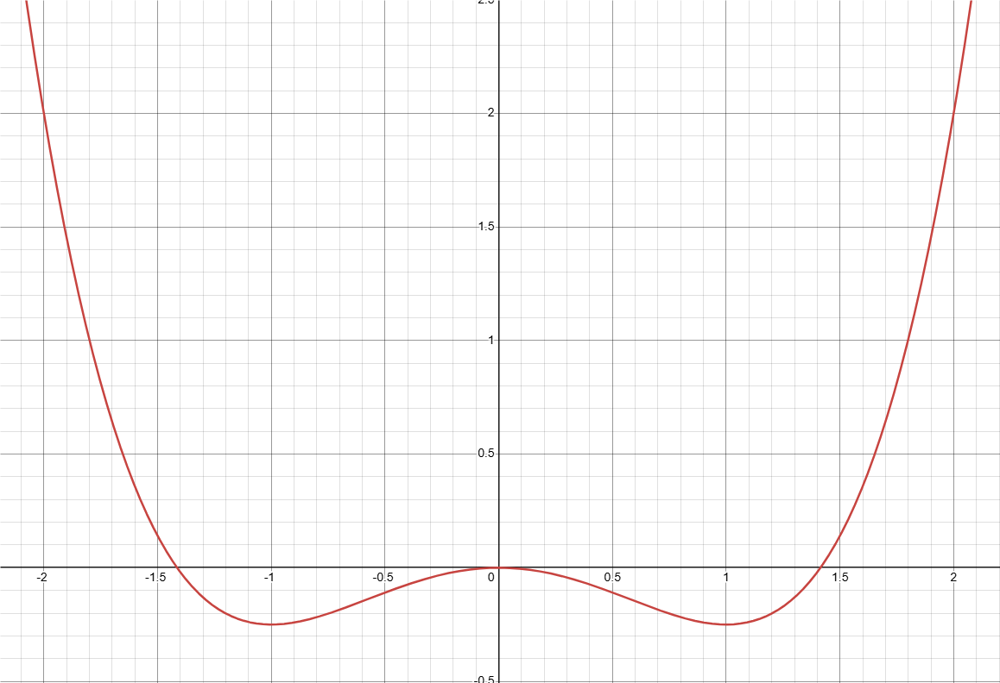
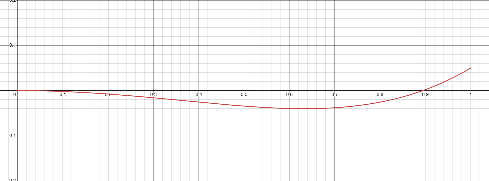

---
categories:
- Phase Field
- Programming
tags:
- Tutorial
- Phase Field
- C++
title: "Phase Field: 相场模拟学习笔记 V"
description: 记录相场方法的学习内容
image: Skadi.png
date: 2024-12-25
math: true
links:
  - title: PF_Tutorial_5 晶粒长大的相场模拟
    description: 放在B站的讲课录播
    website: https://www.bilibili.com/video/BV15QkMYbE6W
  - title: Github 上的讲义仓库
    description: 放在 Github 上的讲义, 包含课件和用到的资料
    website: https://github.com/A-moment096/Phase-Field-Tutorial/tree/main/PF_T2-Numerical_Method_and_Python

draft: true
---

*其实这节就是换成 Allen-Cahn 方程，然后多个变量而已，主要是俺不想实现 Voronoi 结构（逃*

## 简介

上一部分我们以调幅分解为基础讨论了浓度场在 Cahn-Hilliard 方程下的演化过程。对相场方法而言，另一个无法绕开的演化方程则是针对非保守场变量的 Allen-Cahn 方程。这一部分我们将对晶粒长大过程进行分析，了解 Allen-Cahn 方程并使用它进行晶粒长大过程的模拟。

## 晶粒长大

晶粒长大的过程各位材料学子应该已经很熟悉了，在这个过程中，由于晶界能量较高而体自由能相较之下较低，体系能量希望能够达到全局最低的情况下，需要尽可能地降低晶界能在总能中的占比，提高体自由能的占比。但是，晶界能的能量密度应该是某个变化不大的数值，几乎可以看作定值，因此为了降低晶界能，体系会倾向于降低晶界的体积，提高晶体的体积。这样一来，从宏观上的表现来看就是晶粒长大的过程。

这样来看，晶粒长大过程对能量的需求是：晶粒内的能量较低，晶界处的能量较高。那么，之前的 Cahn-Hilliard 方程 + 浓度的组合是否可行呢？我们需要考察晶粒长大过程中涉及什么量。由于同一种相的不同的晶粒都具有相同的成分，故无法用浓度来表示某一个特定的晶粒；不考虑取向的话，晶粒与晶粒之间只存在位置，大小之间的差异，也就是单纯的几何差异。而在界面上，一个晶粒与另一个晶粒相接，还需要某种方法来表示某些晶粒之间的界面。而且在晶粒生长的过程中，小晶粒可能会变得更小最后消失。

综合上面来看，Cahn-Hilliard 方程和浓度并不适合这个问题，那么应该如何处理呢？相场方法中我们经常使用场变量来表示某个区域存在某种性质，那么可以考虑为每个不同的晶粒赋予一个不同的变量，比如假设有 10 个小晶粒，那么就使用 10 个变量来分别代表这些晶粒区域。其次，考虑到这些晶粒仅存在位置上的差异，我们需要在他们参与热力学讨论时没有数值上的差异。我们可以让这些变量类比于浓度：存在于某区域时变量为 1，不存在则变量为 0。这样，界面部分也可以简单地表示出来：所有序参量都不为 0 的部分即为界面部分，这样也摆脱了追踪界面的麻烦。

那么，我们需要使用什么样的方程来演化这样的场呢？这个场，根据上面的分析，是不满足守恒条件的。我们这里就不卖关子了（因为上个部分已经剧透了），答案就是使用 Allen-Cahn 方程。那么这个体系的能量呢？这个方程要怎么理解呢？

## 模型分析

### 演化方程
我们先看看 Allen-Cahn 方程吧：
$$
\frac{\partial \eta_i}{\partial t} = -L_{ij}\frac{\delta F}{\delta \eta_j}
$$
简单地令人发指（也许）。简单来说，就是某个变量的变化速率受到所有的势的加权求和影响。但是要如何理解这个公式呢？它是怎么来的呢？其实如果有看过[上一篇]()内容的话，应该已经猜到了。如果物质不守恒，那么物质流的散度项就可以替换成某种别的形式。这个所谓“别的形式”需要满足这些条件：

- 需要和能量/势相关以满足热力学要求
- 最终是令体系演化达到平衡的

那么干脆就让演化速率和势成正比好了，然后用符号调整演化方向最终是朝着体系稳定的方向发展的。这样就得到了上面的 Allen-Cahn 方程。

除了这样解释之外，我们还可以采用更加数学一些的方式。当我们需要体系朝着稳定方向发展时，实际上也就是说我们希望体系自由能向着最小的方向发展。而当体系稳定时，我们有如下关系：

$$
\frac{\delta F}{\delta \eta_i} = 0
$$

这里需要运用我们已经了解到的泛函导数的相关内容，当泛函导数为 0 时，说明这个构型的 $\eta_i$ 是令泛函 $F$ 取得极值的点。考虑到 $F$ 具有能量的物理意义，这里的极值自然是极小值。在热力学中，极小值表示体系至少出于亚稳态。当该构型下恰好能量是最低的时，则体系出于热力学稳定状态。

这样一来，体系的稳态表示就没有任何问题，但是我们需要的是向着稳态演化，而不是直接求得稳态的状态。这时就需要使用经典的数值方法：弛豫法。我们给方程右边的 0 改变为某个微小变量。这个变量的意义是令体系向着平衡态发展，所以这个变量应该越来越小。通过不断迭代，最终这个微小变量将趋近于 0，此时我们便得到了平衡稳态的结果。那么这个微小变量，按照我们的预想，应该和场变量本身是相关的；不断迭代的过程又说明和时间相关。要让这个微小变量不断减小，根据能量函数（泛函）的特性，干脆就让弛豫变量设置为场变量的演化速率，再乘上一个弛豫常数。由于演化方向，弛豫常数应该是一个小于 0 的值，最后考虑所有项的影响，就得到了这个方程。

最后要指出，上面这些都是从一些不够物理的，十分唯象的角度来提出的。实际上，Allen-Cahn 方程是建立晶界迁移速率与驱动力成正比这一结论得出的，而这一结论更是从晶体排列构型的基态得到的。

关于 A-C 方程的一些碎碎念
另外，这个形式的方程非常常见，或者说，水非常深。几乎可以在物理学的许多领域见到这个方程，而对这个方程的描述都各有千秋。有人称其为 Landau–Khalatnikov 方程（描述磁性），有人称之为 Model A（界面动力学，[Theory of dynamic critical phenomena](https://doi.org/10.1103/RevModPhys.49.435)），还有一些奇奇怪怪的名称，但是这些文章几乎都没有对这个方程做出详细的解释。也许这些方程是从某些物理直觉中得到的？又或者这些这些方程有其更深刻的数学/物理背景，但是这些我也无从得知。

### 能量构造

本模拟使用的能量模型来自[D. Fan 与 LQ. Chen 的文章](https://doi.org/10.1016/S1359-6454%2896%2900200-5)，其构造如下：
$$
  \begin{align*}
  F &= \int_\omega f_{bulk} + f_{int} \,\mathrm{d}\Omega;\\
  f_{bulk}\left(\eta_0,\eta_1,\cdots,\eta_N\right) &= \sum_{i}^{N}\left( -\frac{A}{2}\eta_i^2 + \frac{B}{4}\eta_i^4 \right) + \sum_{i}^{N}\sum_{j\neq{}i}^{N}\eta_i^2\eta_j^2;\\
  f_{int}\left(\nabla\eta_0,\nabla\eta_1,\cdots,\nabla\eta_N\right) &=  \sum_{i}^{N}\frac{\kappa_i}{2} \left| \nabla \eta_i \right|^2.
  \end{align*}
$$

其中的界面能项我们不再赘述，因为它就是上一部分介绍过的能量而已，只不过这里要加上所有序参量的贡献而已。我们重点放在体能上。和上次相比，体能的部分变化很大，但是也有一些熟悉的部分。我们把这个体能重新整理一下：
$$
  \begin{align}
  f_{bulk}&= \sum_{i}^{N}\left( -\frac{A}{2}\eta_i^2 + \frac{B}{4}\eta_i^4 \right) + \sum_{i}^{N}\sum_{j\neq{}i}^{N}\eta_i^2\eta_j^2\\
  &=\sum_{i}^{N}\left( -\frac{A}{2}\eta_i^2 + \frac{B}{4}\eta_i^4 \right) + \sum_{i}^{N}\eta_i^2 \sum_{j\neq{}i}^{N} \eta_j^2\\
  &=\sum_{i}^{N}\left(\left( -\frac{A}{2}\eta_i^2 + \frac{B}{4}\eta_i^4 \right) + \eta_i^2 \sum_{j\neq{}i}^{N} \eta_j^2\right)\\
  &=\sum_{i}^{N}\left( \left(-\frac{A}{2} + \sum_{j\neq{}i}^{N} \eta_j^2\right) \eta_i^2 + \frac{B}{4}\eta_i^4 \right)\\
  \end{align}
$$
上面第二个等号是由于对 $j (j\neq i)$ 的求和的部分与 $i$ 无关，我们可以把 $\eta_i^2$ 从二重求和中提出来， 然后第三个等号中把对 $i$ 的求和的部分提取合并，最后第四个等号里提出 $\eta_i^2$，把 $\sum_{j\neq{}i}^{N} \eta_j^2$ 作为系数和 $-\dfrac{A}{2}$ 合并。现在我们把目光放在求和里面的这个，关于 $\eta_i$ 的多项式。为简单起见，我们设 $A = B = 1$。下面是这个函数在 $\sum_{j\neq{}i}^{N} \eta_j^2 = 0$ 时候， 即 方程(1) 的第一项的图像（当然，这个假设不够合理，但是我们可以先看看）。

是我们很熟系的双势阱，但是这里有一些问题：序参量实际上不能小于0，也不应该大于1。如果我们只关注 0 到 1 之间的值，不难发现现在这个能量的最低点处在 $\eta = 1$ 的地方。这很合理：在其余的所有序参量（我们简称所有的 j ，对应的本个序参量则为 i）都为 0 的情况下，或者说在没有任何 j 的点，i 占据该点是理所应当的。考虑到每个序参量都是平权的，这说明了这个方程是符合体相内部的热力学要求的。接下来我们考察当这个求和项不为 0 的情况。j 求和的值的变化范围我们先设为 0 到 2。

可以看到，当 j 不为 0 时，结果也是合理的，这里 i 的值也不在 1 处取到最小值，而是在 0 到 1 之间的区域取到最小值了。感兴趣的话您可以自行尝试绘制这里的图像，然后调整这些值，观察序参量-能量曲线的最低点位置。当然，我们也可以使用更数学一些的方式来研究这里的最低点取值情况，不过图像方法更加直观一些就是了。最后来简单描述一下表达式 (1) 的物理意义：将每个参量都赋予一个类势阱的能量，然后通过第二项的交叉作用将这些能量结合在一起。第二项的二重和即是其他参量对本参量的影响。

### 相场演化方程与扩散方程之间的关系

## 问题分析

## 代码实现

## 结果

## 结语