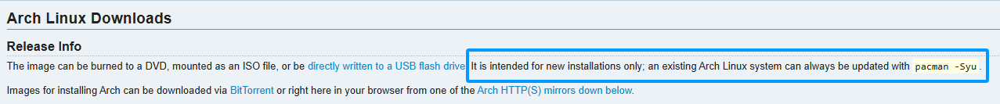

---
categories:
# - Mathematics
# - Programming
# - Phase Field
- Others
tags:
- Arch
- Linux
- Software
title: "安装 Arch Linux，但是笔记本物理机"
description: "放假了，折腾下自己的笔记本咯~"
date: 2025-05-02T16:12:04+08:00
image: 
math: true
license: 
hidden: false
comments: true
draft: true
---
*之前在虚拟机上面装的 Arch Linux 根本不过瘾（搞笑，你根本就没更完(❌)），这次就把自己的小轻薄改成 Arch 好了。顺带，也记录一下实体机上安装可能会遇到的坑？*
## 引子：我好急，怎么耗电这么大

## 准备：资料备份以及准备启动盘

首先肯定是先把电脑上已有的资料都备份好。其实说实话没太多文件，主要是两个没打完的 Gal 吧（心虚），因为大部分的文件都其实已经搞到台式机上面了。一开始是想着把这些文件放在一块精心规划的小硬盘上，安装的时候不格式化就行了，但是感觉还是有点点点点危险，所以干脆还是挪到另一台机器上，把这台小本的硬盘全部格式化了得了。不过也许我应该考虑更加智能的备份方案？算了，以后再考虑（挖坑）。

其次就是准备启动盘。本来这次想要换一种安装媒介来着，比如光盘？（没错我有光盘刻录机，为了听 CD 买的 ()），结果还是嫌麻烦，放弃了。给虚拟机安装的时候不是已经有了镜像了吗？为什么不直接用呢？至于为什么没有下载最新的（最新的就是昨天刚出的，5月1日版本），是因为我刚准备下载的时候看到最上面一行小字：

So, why not?

镜像依旧是用 `rufus` 烧录到陪伴了我6+年的小U盘上，什么格式化之类的 `rufus` 会自动帮我搞好的。中间有个小插曲好像是 `rufus` 不太支持最新的 syslinux 版本，需要额外下载两个小库。无所谓（）我选择相信。

到这里，基本上就已经准备好安装工作了。相信根据这些东西，来个老手估计三下五除二就安装好整个系统了。当然，我是新手，还是一步步来吧。这大概也是这篇（以及上一篇）文章的目的：记录自己安装系统时蠢蠢的样子。

## 开始：启动安装引导咯~

### 先进安装引导再说吧
激动的心，颤抖的手，插入U盘后从U盘启动会不会有？

太坏了，secure boot 没关，没有。上网搜索我的笔记本的 BIOS 设置方法，Redmi Book 14 需要开机后按下 F2 进入 BIOS，然后在启动设置里 **先设置管理员密码** 之后才能设置是否关闭安全启动。有一点点脱裤子放屁的感觉……算了。总之就是进来了，进到安装引导了。这下真是激动的心，颤抖的手了。

（由于屏幕反光，就不拍屏了，其实和上次的屏幕一模一样咯）

这次就得格外小心了：这可不是虚拟机。虽然说搞砸了也能重来（电脑上没什么别的重要文件了，打算全部格式化），但是一想到是实体机，还是有一些些的紧张。

~~其实这篇文章是在我进来安装引导之后才开始动笔写的。一开始没打算写来着，不过鉴于好久没有更新博客了，还是水一篇吧（）~~

### 还是先进行前期验证和网络配置

这次由于有上次安装的记录，所以其实可以直接参考以前写的那个东西。感谢代码高亮，我立马就敲下了 `localectl list-keymaps`。然而：没什么卵用。Bro，你就用的是美式键盘呀！？还列出来看个der呀……算了，不管了。不过验证启动模式也许还是有必要的？依旧，`cat /sys/firmware/efi/fw_platform_size`，结果是`64`。这个应该是说我的启动模式的系统是64位的吧？

随后是验证网络。这步我其实是有点心虚来着，会不会这个安装引导不支持我的电脑网卡？害怕。但还是先试一试吧。

从结果来看，我有一个 `lo`，*virtual loopback interface*，不管；一个 `wlan0`，看来是认出我的无线网卡了，好耶。然而它的 `state` 是 **DOWN**，emmm……

（找找办法……）

太愚蠢了，**DOWN**不就是说我没连上网嘛…… 不过根据 ArchWiki，还是先用 `rfkill` 命令检查我的无线网卡是不是被 *block* 了（屏蔽？也许？），好消息是没有；接着就使用 `iwctl` 工具进行联网。这个步骤我感觉有一点点繁琐，先要在交互界面使用  `device list` 列出设备，很幸运我这里是直接 `wlan0 powered on` 状态，这里的 `wlan0` 就是我的设备名了；接着就用 `station wlan0 scan` 扫描可用网络，然后用 `station wlan0 get-networks` 列出可用网络。这里有个很神奇的点：能连上我的校园网吗？用 `station wlan0 connect CSU-WIFI` 试试。这里 `CSU-WIFI` 就是我们的校园网了。好消息是成功了，不知道怎么做到的。本身链接我们学校校园网是需要使用一个网页进行验证的，不过也许是因为我在 Windows 系统上刚刚连过一次网络，所以成功重连上了？不清楚，不过也算可喜可贺。最后在用 `exit` 退出 `iwctl` 的交互界面后再 `ip link` 一下检查是否连上：没问题。绿色的 `UP` 真好看，诶嘿。

动态IP应该是自动配置的（ArchWiki讲是 *out of box*），所以不管。也许后面我会想搞个静态的？唉，不懂网络真头痛呀。不管不管。直接 `ping archlinux.org` 试试。

烂了，没有数据返回。烂完了。

（找找办法x2……）

顺从。又不是没有别的 WIFI 能用。直接连上办公室 WIFI好了。当然，这里也贴一下我参考了的连接校园网的方法的博文：[链接1](https://www.cnblogs.com/holaworld/p/17839616.html) 以及 [链接2](https://www.bilibili.com/opus/852262124483772422)。

最后网络这里还有要设置一下系统时间。用 `timedatectl` 就可以。 感谢 `zsh` 和这些工具带上的自动补全，`timedatectl --help` 一下，跟着感觉走，最后就得到了 `timedatectl set-timezone Asia/Shanghai` 了。相当简单。

### 再见，我的（旧）文件们

又到了每次装系统最喜欢也最提心吊胆的磁盘分区了。总有一种破后而立的感觉，感觉在磁盘格式化之后，这台电脑就变成全新的了诶。还是一样，`fdisk -l` 列一下可用分区。一下出来了一堆呀，删了删了，全部删了。

又看到一次我的硬盘大小，只有 476.94 GiB，Sad。不过，轻薄本，出差顺带干活用的，无所谓了吧？后面再考虑加容量之类的吧，也许还可以考虑直接换台新本（好奢侈（））。

开始分区吧，直接 `fdisk /dev/nvme0n1` 进入交互模式 （这里我的硬盘只有一个，就是在 `fdisk -l` 里列出的 `/dev/nvme0n1`，所以就把它传入参数就好）。由于硬盘太小，我也对文件管理没有什么特别多的想法，干脆就是一个 `SWAP` 一个 `/` 好了。至于分区表，依旧选用 GPT 分区表。貌似 GPT 的功能更加强大？已经完全超越了老旧的 MBR？其实按理来说我应该先多了解一下这些东西再下判断来着，不过这里就还是先相信互联网吧（）

这里搞了个大乌龙：我不小心把启动盘 `/dev/sda` 给分区了。有一说一，挺愚蠢的……目前先这么搞吧，安装引导也没断，后面不碰它应该就没问题，吧？下次还是要注意：根据 ArchWiki 上的指导，实际上应该先将分区表进行备份才对，命令是 `sfdisk -d /dev/sda > sda.dump`（这里 `/dev/sda` 是要备份分区表的硬盘）。下次一定注意，唉。

接下来就是使用 `mkfs` 等进行文件系统格式化了。这里很多人推荐 `Btrfs`，所谓的 *B Tree File System*（我一开始以为是 *Better File System* 来着），因为它貌似是支持自动压缩和别的一些高级功能，还有快照之类，很方便个人用户使用。这次就不用传统的 `ext4` 了，尝尝鲜。使用命令 `mkfs.btrfs /dev/nvme0n1p1` 就可以把第一个分区格式化为 Btrfs 格式了。我还留了一个分区作为 Swap 使用，大小设置为了8G。要创建 Swap 分区只需要 `mkswap /dev/nvme0n1p2` 即可。

分好了区，就需要挂载文件系统了。用 `mount /dev/nvme0n1p1 /mnt` 就可以。Swap 则使用 `swapon /dev/nvme0n1p2` 就行了。这样一来，我们就在硬盘上做好了准备，马上就要把 Arch Linux 安装在这个临时挂载于 `/mnt` 的主硬盘了。

## 安装：冲刺！冲刺！冲刺！

Arch Linux 的灵魂之一也许就是 `pacman` 包管理器了。安装 Arch Linux 实际上也是使用 Pacman 进行的。因此首先就是对 Pacman 进行必要的配置。

首先还是要选择镜像，可选的镜像站放在了 `/etc/pacman.d/mirrorlist` 里。这里直接借鉴上次安装的经验好了，使用 `reflector --latest 10 --sort rate` 来排出最快的10个服务器。结果出来之后可以考虑在这条命令的后面加上 `--save /etc/pacman.d/mirrorlist` 来保存下来。当然，在这之前（吸取刚刚的教训）我把原文件复制了一份作为备份。

下来就是安装必要的包，命令为 `pacstrap -K /mnt base linux linux-firmware`。这里的 `-K` 是指在目标处生成一空的 密钥环。（至于密钥环是什么，对不起，我不知道。后面会学的（））

经过漫长的等待，我的安装它：报错了。先是安装的特别慢，可能是因为源的问题吧，我还是尝试了 `reflector --country China --age 12 --sort rate` 这个命令获取了国内的镜像源；后面是变快了，但是突然又报 *error: GPGME error: No data*，不管我怎么操作 `pacman`，都没有用。我估计是密钥环之类的东西坏掉了吧，看来是前面对U盘瞎JB分区导致的。这下只能关机拔掉U盘，重新烧录，格式化电脑硬盘然后重新安装。好在这次安装地很快，这个插曲也算是过去了吧。

现在安装的应该是一些最最基础的软件包。为了安装好后有一些别的功能能用（比如联网），还是需要再安装一些别的软件包。这里我安装了 `vim` ，`dhcpcd` 以及 `networkmanager`。