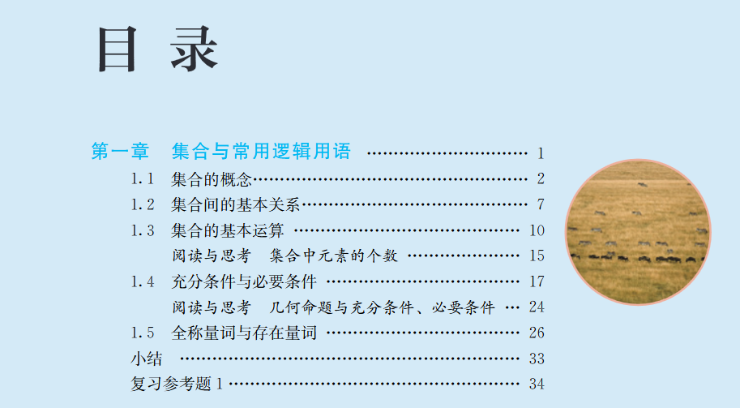
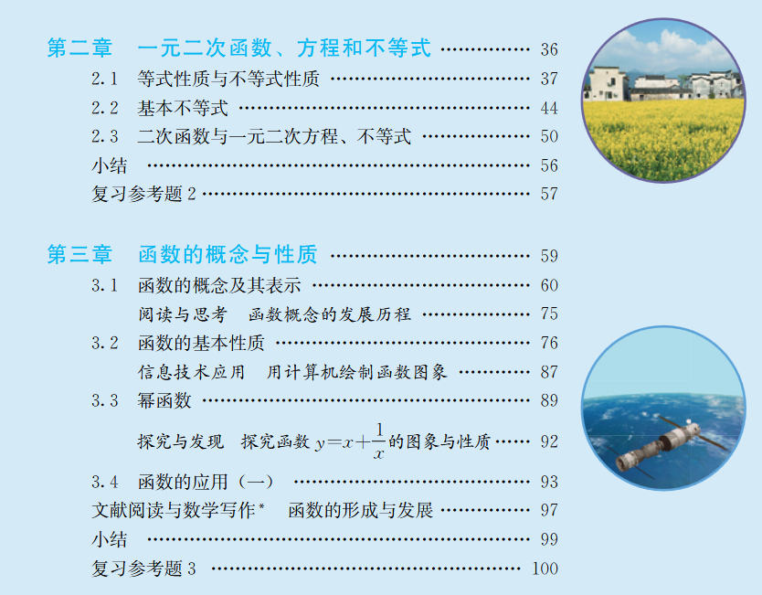

---
categories:
- Mathematics
# - Programming
# - Phase Field
# - Others
tags:
- Calculus
- Algebra
- Category Theory
- Notations
- Talk
title: "到底啥是函数！？"
description: "一个大家常用的概念，而各个教材则……"
date: 2025-09-01T18:41:51+08:00
image: 笔中的呓喃之境.jpg
math: true
license: 
hidden: false
comments: true
draft: true
weight: 2
---

*我们平时经常会遇到所谓的 **函数**，不管是数学、物理，甚至是程序里，都能看到它的身影。然而，它到底是啥呢？你也许自己心里有一个答案。这里我也斗胆对比一下各个教材中对函数的定义，聊一聊这个我们或许很熟悉的概念。*

*头图依旧选自  [fasnakegod](https://www.pixiv.net/en/users/8605991) 大大的 [笔中的呓喃之境](https://www.pixiv.net/en/artworks/115191853)，实在是非常好看，Aya 太可爱了。曲选自一首经典的吉他指弹曲：岸部眞明的 《Time Travel》，轻松愉快的一首，我很喜欢（甚至学过）（没学会）。*



## 印象中的函数

印象之中，函数其实应该是相当常见的。初中的时候就有这么个东西了。

### 初中：一些奇怪的公式以及图像

没记错的话初中的时候，教科书上就会讲述所谓的一元函数了：长成 $y = kx+b$ 这样儿的东西，就是一次函数；而压轴题里的，长成 $y = a x^2 + b x + c$ 样子的东西就是二次函数。哦对了，第二个式子里的 $a$ 还不能是 $0$，不然会退化成一次函数。这还是个考点。那是的我天真地认为，函数就是这些东西，哦，还有一个三角函数，不过太高深了，我听不懂。总之，初中时的函数非常地简单：就是一条或者直或者弯的线条嘛，然后有个公式可以算来算去，还和方程有那么一点关系，考试就是算个交点，仅此而已了。

### 高中：集合上的对应法则

进入高中之后，根据我手上这本 *数学 必修1 人民教育出版社 B版 2007年4月第3版* 的内容来看，我们在第一本书中几乎只学习什么是函数。在以非常具体的例子介绍完集合，集合的表示方法以及集合之间的关系与运算之后，我们在第二章就遇到了 **函数** 了。书上是这么开始介绍函数的，说在初中，同学们就已经学习了变量与函数的概念：

> [!DEF]{函数与变量（初中）}
> 
> 在一个变化过程中，有两个变量 $x$ 和 $y$，如果给定了一个 $x$ 值，相应地就确定唯一的一个 $y$ 值，那么我们称 $y$ 是 $x$ 的 *函数*，其中 $x$ 是 *自变量*，$y$ 是 *因变量*.

随即表示，在数学发展中，函数的定义也随之发展，然后用第一章中的集合[^1]：

> [!DEF]{函数、定义域与值域（高中）}
>
> 设集合 $A$ 是一个非空的数集，对 $A$ 中的任意数 $x$，按照确定的法则 $f$，都有唯一确定的数 $y$ 与它对应，则这种对应关系叫做集合 $A$ 上的一个函数，记作
>
> $$y=f(x),x\in A,$$
> 
> 其中 $x$ 叫做自变量，自变量取值的范围（数集 $A$）叫做这个函数的 **定义域**。
>
> 如果自变量取值 $a$，则由法则 $f$ 确定的值 $y$ 称为函数在 $a$ 处的函数值，记作
>
> $$y = f(a)\;\;\; \text{或}\;\;\; y\vert_{x = a},$$
>
> 所有函数值构成的集合
>
> $$\left\{y\,\vert\,y = f(x),x\in A\right\}$$
>
> 叫做这个 **函数的值域**。
>
> 函数 $y = f(x)$ 也经常写作函数 $f$ 或函数 $f(x)$。

于是，教材做出这样的表述：

> [!REM]
> 
> 因为函数的值域被函数的定义域和对应法则完全确定，所以确定一个函数就只需要两个要素：**定义域和对应法则**。

其实这个定义几乎就是我们平时谈论问题时会采用的定义。讨论一般问题的时候完全是够用的。不过，它足够精确吗？映射和函数是同一个东西吗？泛函是什么？不过无论如何，高中时的函数的定义绝对不是这个问题的终极答案。而要找这个答案，我们应该从初等数学迈向高等数学[^2]。

我很难不吐槽新版高中数雪教材

我们来看一看，新的人教版高中数学教材是怎么介绍函数的吧。要看一本书，肯定是首先看它的目录：

不错，装帧精美，配图有趣，内容也相当详实，是进入新数学语境的好开端。

我们来看第二章……等一下？啊？

什么叫先介绍一元二次函数，再介绍函数的概念与性质？

什么倒反天罡？

WTF is that?

我明白初中已经介绍了什么一次函数和二次函数，毕竟考题就考它们。但，是，这也不是能这样倒过来介绍函数这个概念的理由吧！唉，晕了。它上面关于函数的定义我们先不谈了。

不是我喜欢的教材，直接不参考。

## 高等数学中的函数

绝大多数国内高校理工科的同学们应该都是会学 *高等数学* 的。而这其中，又有许许多多的同学的学校（或者自己）选择的数学教材，是大名鼎鼎的 *同济高数*，即 *高等数学 同济大学数学科学学院编 高等教育出版社* （我以为一直是同济大学出版社来着，好像新版换了）。我们取第八版的上册，来看看它是怎么介绍函数的。

### 同济高数的函数定义

非常有趣的是，同济高数一上来先确立了“初等数学”与“高等数学”的区别：

> [!REM]
> 
> 初等数学的研究对象基本上是不变的量，而高等数学的研究对象则是变动的量。

以及单刀直入地引入函数，哦不，映射？在其 *第一节 映射与函数* 中，它首先介绍了二者：

> [!REM]
> 
> 映射是现代数学中的一个基本概念，而函数是微积分的研究对象，也是映射的一种。

哦天哪，我们不是在聊函数吗？怎么跳到映射了？那既然我们讲函数是映射的一种，我们就来看看映射的定义：

> [!DEF]{映射（同济高数）}
>
> 设 $X,Y$ 是两个非空集合，如果存在一个法则 $f$，使得对 $X$ 中每个元素 $x$，按法则 $f$，在 $Y$ 中有唯一确定的元素 $y$ 与之对应，那么称 $f$ 为 $X$ 到 $Y$ 的映射，记作
>
> $$ f\colon X\to Y,$$
>
> 其中 $y$ 称为元素 $x$（在映射 $f$ 下）的像，并记作 $f(x)$，即
>
> $$y=f(x),$$
>
> 而元素 $x$ 称为元素 $y$（在映射 $f$ 下）的一个原像；集合 $X$ 称为映射 $f$ 的定义域，记作 $D_f$，即 $D_f = X$；$X$ 中的所有元素的像所组成的集合称为映射 $f$ 的值域，记作 $R_f$ 或 $f(X)$，即
>
> $$R_f = f(X) = \left\{f(x)\,\vert\, x\in X\right\}.$$

这个定义怎么感觉和函数很像？那函数，是什么呢？紧接着的定义就定义了函数：

> [!DEF]{函数（同济高数）}
>
> 设数集 $D\subset \mathbb{R}$，则称映射 $f\colon D\to \mathbb{R}$ 为定义在 $D$ 上的函数，通常简记为
>
> $$ y=f(x),\, x\in D,$$
>
> 其中 $x$ 称为自变量，$y$ 称为因变量，$D$ 称为定义域，记作 $D_f$，即 $D_f = D$。

从这里看，确实函数是一种特殊的映射：它把定义域和，emmm？映射定义中的 $Y$ 是什么？好像不是值域吧？无所谓了，里面的集合全都换成了 $\mathbb{R}$ 上的东西了。定义域是 $\mathbb{R}$ 的子集，而箭头另一端就是 $\mathbb{R}$ 了。而映射呢？映射没管这俩是什么，只要是个集合就没问题。

这个定义与高中的定义相比，它主要区别在于，这个定义是建立在*映射*之上的，而不是像高中那样直接给我们一个定义。另外，它 *貌似* 不再混淆 $y=f(x)$，$f(x)$ 和 $f$ 三者，而是表明 $f$ 是函数，$y = f(x)$ 和 $f(x)$ 是元素 $x$ 的像。为什么说是貌似呢？因为如果我们看映射，它是分清了像以及映射的，如果这套能直接套在函数上的话，那就是分清楚了的；然而，在函数的定义中，我们发现它又一次讲 “简记为”。

最后，同济高数对函数的定义（以及最根本的，映射的定义）中，没有说明一个很重要的问题：映射定义中的 $Y$ 跑哪里了，它是什么？

然而，不只有同济高数上记载了函数的定义。高数教材那么多，我们再看看别的嘛。

### 其他高数教材的函数定义

我从朋友那里拿到了湖南大学用的高等数学教材，即便这本书的名字叫 *大学数学*，全称为 *大学数学系列教材（第四版）大学数学 湖南大学数学学院组编 高等教育出版社*，也不妨碍它是用来给一般理工科同学上课。

#### 大学数学-湖南大学

这本书没有一上来默认一些集合的内容，而是在第一节介绍了什么是集合以及集合的表示法，随后立即介绍了 *映射*，在第二节才正式引入函数。我们来看看它上面的定义吧：

> [!DEF]{映射（湖大高数）}
> 
> 设 $A,B$ 是两个非空集合，若每一个元素 $x\in A$，按照某种确定的法则 $f$，有唯一确定的 $y\in B$ 与它相对应，则称 $f$ 为 从$A$ 到 $B$ 的一个映射（如图所示），记作
>
> $$ f\colon X\to Y\;\;\;\text{或}\;\;\;f\colon x\mapsto y = f(x), x\in A.$$
>
> 其中，$y$ 称为 $x$ 在映射 $f$ 下的 **像**，$x$ 称为 $y$ 在映射 $f$ 下的一个 **原像**（或逆像），$A$ 称为映射 $f$ 的 **定义域**，记作 $D(f) = A$。$A$ 中所有元素 $x$ 的像 $y$ 的全体所构成的集合称为 $f$ 的 **值域**，记作 $R(f)$ 或者 $f(A)$，即
>
> $$ R(f) = f(A) = \left\{y\,\vert\,y=f(x),\, x\in A\right\}$$
>
> 称集合 $D(f)\times R(f) = \left\{ (x,f(x))\vert x\in A \right\}$ 为映射 $f$ 的 **图形**。 

特别有趣的地方在于，湖大这本教材在这些定义结束后立刻提到：

> [!REM]
>
> 根据集合 $A$、$B$ 的不同情况，在不同的数学分支中，“映射” 有着不同的术语，如 “函数”，“泛函”，“算子” 等。

所以？原来映射有这么多的身份？在不同的分支下，映射的含义是不一样的？我们再来看这本教材对函数的定义：

> [!DEF]{函数（湖大高数）}
>
> 若 $f$ 是数集 $A\subset \mathbb{R}$ 到 $\mathbb{R}$ 的映射，则称 $f$ 为数集 $A$ 上的 **一元（实）函数**（简称函数），通常把这个函数简记为
>
> $$ y=f(x),\,x\in A.$$
>
> $x$ 称为函数的 **自变量**，$y$ 称为函数的 **因变量**， $A$ 称为函数的 **定义域**，通常记为 $D(f)$，而 $f(A) = \left\{y\,\vert\,y=f(x),\, x\in A\right\}$ 称为 $f$ 的 **值域**，记为 $R(f)$。点集 $C = \left\{(x,y)\,\vert y = f(x),\, x\in D(f) \right\}$ 称为 $y = f(x)$ 的图形（或图像）。

这个定义和前面人教版数学必修一 A 的定义如出一辙…… What can I say?

对比湖大教材的定义以及同济教材的定义，我们发现其实大同小异。湖大教材的特点在于，它积极地运用了一些集合的符号，这也许是由于它第一章先提过了集合的内容的缘故；另外它提到了所谓的图形和图像，它们是 *括号包起来的 $x$ 和 $y$，用逗号分隔*。

什么？你说这是图像点？不敢苟同。因为我不知道这个括号的含义具体是什么。虽然确实钻了牛角尖，但是说明湖大的这本教材依旧不够严谨。最重要的是，两本教材都同时有意地忽略了那个在箭头右边的可怜孩子。它到底是什么？

#### 高等数学-中南大学

令人悲哀的是，我本科时使用的这本书已经找不到了（因为我卖掉了）；更令人悲伤的是，二手书店已经不卖这本书了！我找遍了整个学校的书摊，都没找到，难受…… 我甚至在校园集市上找过这本书，结果得到的答案却是我早就已经否决的一本：它不是中南大学出版社出版的高等数学，而是高教社出版的高等数学。真是令人心灰意冷，太令人悲哀了。

然而，得到这本并非我目标的书的同时，我得到了消息：其实这本高教社出版的高等数学，主编就是数统院的副院长，郑洲顺老师。此刻，死去的记忆疯狂攻击我，没错，我的高数教材好像就是他主编的！

总之，绕了一大弯子，还是搞到了换皮版的 *高等数学（上册） 郑洲顺主编 任叶庆副主编 高等教育出版社*。我们就当它是中南大学出版社出版的吧。废话太多了，我们直接看定义：

> [!DEF]{函数（中南高数）}
> 
> 设 $D$ 为非空实数集，若存在对应法则 $f$，使得对于任意的 $x\in D$，按照对应法则 $f$，总有唯一确定的 $y\in\mathbb{R}$ 与之对应，则称 $f$ 为定义在 $D$ 上的一个 **函数**。通常简记为
> 
> $$ y = f(x), x\in D,\ \text{或}\ f\colon x\mapsto y = f(x), x\in D, $$
>
> 其中 $x$ 称为 **自变量**， $y$ 称为 **因变量**， $D$ 称为 **定义域**，记作 $D(f)$，即 $D(f) = D$。
>
> 在函数定义中，对每个 $x\in D$， 按对应法则 $f$，总有唯一确定的值 $y$ 与之对应，这个称为函数 $f$ 在 $x$ 处的 **函数值**，记作 $f(x)$，即 $y = f(x)$。因变量 $y$ 与自变量 $x$ 之间的这种依赖关系通常称为函数关系。函数值 $f(x)$ 的全体所构成的集合称为函数 $f$ 的值域，记作 $R(f)$ 或 $f(D)$，即
>
> $$R(f) = f(D) = \left\{y\,\vert\,y=f(x),\, x\in D\right\}.$$

其实记号有点凌乱……特别是简记的部分。同时，它没有先引入映射，而是直接将函数定义为实数集子集内的元素到实数集内的元素二者的对应关系。另外的部分也是大同小异，不过好处在于，没有用什么幽灵一般的箭头右边的东西，直接就说是非空实数集内的元素到实数集内的元素，绕过了这个问题，也算简洁明快吧。

对了，除了国内教材，国外也应该学高数吧？没错，国外也学这些内容，不过一般叫它 *Calculus*，即 *微积分*。我们看看它们的情况：

### 国外教材的函数定义

首先我们来看看广受赞誉的  *普林斯顿微积分读本*。它的英文其实是 *The Calclus Lifesaver: All the Tools You Need to Excel at Calculus*，并没有 “普林斯顿” 这个地名。

Anyway, 我们来看看它怎么处理这些定义。鉴于这本书原版就是英文的，且我相信大家应该能看懂英文吧（也许吧），我就直接贴上英文原文内容了。

#### The Calculus Lifesaver

它开门见山，在几句介绍性的文字后，立刻给出了函数的……定义？

> [!DEF]{Function (The Calculus Lifesaver)}
>
> A *function* is a rule for transforming an object into another object. The object you start ith is called the *input*, and comes from some set called the *domain*. What you get back is called the *output*; it comes from some set called the *codomain*.

Emmm，怎么说呢？非常的口语化。我很难说这个是 “定义”，也许这是因为这本书本就是为了这样慢慢地读下去，用平易近人的方式来理解这些概念。不过我们依旧可以从中提取出一些不一样的东西：什么是 *codomain*？从它的说法中，好像 *codomain* 就是我们说的值域，因为给一个 $x$ 就会得到来自它的 $y$；然而，事情不是这样的，因为旋即它给出 *range* 的定义：

> [!DEF]{Range (The Calculus Lifesaver)}
>
> The *range* is the set of all outputs that could possibly occur.

紧接着有这样的描述：

> [!REM]{Codomain and Range}
>
> So why isn't the range the same thing as the codomain? Well, the range is actually a subset of the codomain. The codomain is a set of **possible** outputs, while the range is the set of actual outputs.

That explains all. *Codomain* 不是值域。值域是 *range* 才对，而 *codomain* 是元素对应函数值可能出现的一个大的集合，也就是说，值域是 *codomain* 的子集。我们这里正式揭晓所谓的 *codomain* 的中文翻译：*陪域*。

虽然很口语化，但是它解决了我们之前没有解决的问题！而且，它这样口语化的内容，貌似隐藏了一些细节……先不管了。那么，其他教材呢？我们来看看群友在加拿大使用的一本微积分教材：由 Hughes-Hallett 主编的 *Calculus: Single and Multivariable*。

#### Calculus: Single and Multivariable

这本书更是直接，第一句话就讲了函数是什么:

> [!REM]
>
> In mathematics, a *function* is used to represent the dependence of one quantity upon another.

且立刻就有了一个看起来很顺眼的定义：

> [!DEF]{Function (Calculus: Single and Multivariable)}
>
> A **function** is a rule that takes certain numbers as inputs and assigns to each a definite output number. The set of all input numbers is called the **domain** of the function and the set of resulting output numbers is called the **range** of the function. 
> 
> The input is called the *independent variable* and the output is called the *dependent variable*.

令人失望的是，这个定义没有提到陪域，而是像国内教材一样使用了定义域以及值域的方式。不过嘛，反倒是显得简洁。另外，在这部教材中，没有找到 *codomain* 的字眼，这一点是有点令人失望的。然而值得一提的是，上面介绍了陪域的普林斯顿微积分读本，依旧没有过多使用 *codomain* 一词，全文中只出现了约 5 次而已。然而我们还可以看看另一本鼎鼎大名的 *Thomas' Calculus*，由 George B. Thomas, Jr 所著，算是美式教材中的顶流之一了。

#### Thomas' Calculus

依旧是熟悉的函数开场，熟悉的先介绍一下函数的地位：

> [!REM]
>
> Functions are fundamental to the study of calculus. ...
>
> Functions are a tool for describing the real world in mathematical terms. ...

逼格拉满了（复数 + are + a tool 这样的单数真的没问题吗（）），那么定义是什么呢？

> [!DEF]{Function (Thomas' Calculus, full version)}
>
> ... the value of one variable quantity, say $y$, depends on the value of another variable quantity, which we often call $x$. We say that "$y$ is a function of $x$" and write this symbolically as
>
> $$ y = f(x) \ \ \ \text{("$y$ equals f of $x$")} $$
>
> The symbol $f$ represents the function, the letter $x$ is the **independent variable** representing the input value to $f$, and $y$ is the **dependent variable** or output value of $f$ at $x$.
>
> （下一行是正式的定义 —— AMoment 留）
> 
> A **function** $f$ from a set $D$ to a set $Y$ is a rule that assigns a *unique* value $f(x)$ in $Y$ to each $x$ in $D$.
> 
> The set $D$ of all possible input values is called the **domain** of the function. The set of all output values of $f(x)$ as $x$ varies throughout $D$ is called the **range** of the function.

紧接前面的关于值域的内容（就在同一段）是关于值域与 $Y$ 以及函数这一概念的说明：

> [!REM]
>
> The range might not include every element in the set Y. The domain and range of a function can be any sets of objects, but often in calculus they are sets of real numbers interpreted as points of a coordinate line.

它依旧没有提多少陪域的事情，只是让幽灵一般的 $Y$ 出现了一下，并说明值域并不总是有所有 $Y$ 里面的元素。然而，有趣的地方来了：它的函数的定义没有把定义域和幽灵 $Y$ 限定在数域上，而是后面补充了说在微积分中函数一般是坐标轴上的实数。所以，它的函数是我们在国内高数教材中的 *映射*！我们再回看那本 *The Calculus Lifesaver*，它没有说 *the object* 是什么！只说了 *input* 和 *output* 是来自于两个 *集合*：domain 与 codomain，所以，*The Calculus Lifesaver* 的函数定义也是 *偏向* 映射的。

看了这么多美国教材，我们再看看英国的教材吧

#### 英国的教材，吗？

……哦不，我只有一篇朋友给的讲义可以参考。而且，这位授课的 Theodore Voronov. 还是一位莫斯科国立毕业的俄国人…… Anyway，我们可以看看，他在讲义中怎么定义函数：

> [!DEF]{Functional dependence (From Prof. Theodore Voronov.)}
>
> In many cases application of mathematics to natural science and engineering deals with analyzing **functional dependence**. What is a functional dependence? We have one varying quantity described by a variable, say, $x$, and another quantity described by a variable, say, $y$, so that to each value of the first quantity, $x$, by a certain given law there corresponds a particular value (which should be uniquely defined) of the second quantity, $y$. We write this as
> 
>  $$ x\mapsto y \ \ \text{or} \ \ y = f(x) \ \ or \ \ y = y(x) $$
> 
> (here the letter $f$ is used to express a *functional law* by which y depends on $x$; but very often we simply write $y = y(x)$). The variable $x$ is called *independent variable* or the *argument* of the function. Respectively, $y$ is called *dependent variable* and $y = y(x)$ is called the value of the function (corresponding to a given value $x$ of the argument).

与其说是给出了函数的定义，不如说这里描述了什么是 *函数关系*。鉴于此，我们得以看到也许更高的视角：这也许是一种普遍存在的关系，而非某个特定的事物（函数、映射）才能携带有的。另外我们可以看到，这里的记号相对比较随意：$y$ 既可以等于 $f(x)$，又可以等于 $y(x)$，都表达一种函数关系。我不评价这种记号的好坏，但是我不喜欢就是了。

#### 竟然还有日本的高中教材

没错，我莫名收藏了几本翻译的日本高中数学教材，原作者是著名日本数学家小平邦彦，采用的版本是 *数学I 小平邦彦编 吉林人民出版社*。我们也来看看是怎么写的吧：

> [!DEF]{函数（日本高中教材）}
>
> 设 $X$ 与 $Y$ 是数的集合，使 $X$ 的各个元素分别对应 $Y$ 的唯一的一个元素 $y$，这个对应叫做由 $X$ 到 $Y$ 的 **函数**。函数可用字母 $f$，$g$ 等表示。
>
> 当 $f$ 是由 $X$ 到 $Y$ 的函数时，按 $f$ 使 $X$ 的元素 $x$ 所对应的 $Y$ 的元素 $y$，叫做 $f$ 在 $x$ 的值，写作
>
> $$ y = f(x)$$
>
> 并且，$X$ 叫做函数 $f$ 的定义域。$f$ 的所有值 $f(x)$ 的集合 
> 
> $$\left\{f(x)\ \vert\ x \in X\right\} $$
>
> 叫做 $f$ 的值域。
>
> 一般地，$y = f(x)$ 则说 $y$ 是 $x$ 的函数。 $x$ 叫 **自变数**，$y$ 叫做 **因变数**。

也许是由于年代的原因，一些翻译，比如因变量，自变量，采用了不怎么寻常的翻译方式。另外这本书是直接跳过了映射，指明了函数是从数集到数集的一种对应，也不失为一种好的处理方法。最后，日本原来在高中第一本书就会学函数吗（）

相信看了这么多的高等数学教材中的函数定义，你一定累坏了：这些定义没有一个非常好地说明我们提出的所有问题，必须把它们组合起来，才能回答：

- 函数是什么，记号怎么写；
- 映射是什么，映射和函数是什么关系；
- 那个神秘的，箭头右边的集合/数集，到底是什么东西。

这个问题的根源，也许是这些教材都是 *高等数学* 教材。它们不关心别的用处，只关心在本教材中使用的情况。我们可以看到，上面第三个问题鲜少有教材提及，这一点其实相当诡异：大家都知道那里有个东西，大家都当作没看见。然而这一点也是无可厚非的：我们在学习这些教材的过程中，几乎不需要用到这个房间中的大象。

那么，既然普通理工科大学生学习的 *高等数学* 里的定义并不能让我们满意，也许我们应该将目光投向数学系的教材，看看数学系是怎么处理函数这个数学研究中近乎最最基础的概念的。我们首先从距离高等数学并不遥远的 *数学分析* 开始。

## 数学分析中的函数

我知道的数学分析的教材相比高等数学而言真是多太多了。这里我们挑选这么几本来聊：

- *数学分析讲义 - 陈天权* 
- *数学分析 - 梅加强*
- *数学分析教程 - 常庚哲 史济怀*
- *数学分析 - 陈纪修*
- *数学分析之课程讲义 - 于品*
- *Mathematical Analysis I - Vladimir A. Zorich*
- *Principles of Mathematical Analysis - Walter Rudin*
- *Analysis - Terence Tao*
- *Roger Godement - Analysis I Convergence, Elementary functions*

其中，前四本书是国内广泛使用的教材；第五本其实算是讲义，但写的很全，我们也来参考；后几本则是国外的数学分析教材：大名鼎鼎的卓里奇，鲁丁，陶哲轩，戈德门特，分别代表俄、美、奥、法四个国家的数学教材。由于这些书名都太像了，全都是什么什么分析，且其作者都十分有名（几乎就是书的代名词），所以我们在书没有别名的情况下采用老师的姓名；有别名的情况下则使用更轻松幽默的别名。最后要提到的是，由于函数和映射的关联性，我们把映射也一并加入考察的对象。

### 国内教材中的定义

我们首先指出，绝大多数的数学分析教材，都是要谈一个基本的问题的：实数如何构造。有一些书会选择放在第一章，而有的书会放在第二章，目的是在第一章先介绍一些更基础的概念，方便后续使用。比如我们下面的这本由北京大学陈天权老师编著的数学分析讲义，就采用了后聊实数的方式。我们得以直接先来看看我们最关心的函数的定义。

#### 陈天权

在简单介绍集合的基本情况之后，我们首先看到的即为映射的定义：

> [!DEF]{映射（陈天权）}
>
> 从集合 $A$ 到集合 $B$ 的 **映射** $\varphi$ 是指一个规则，根据它，每一个元素 $x \in A$ 有一个元素 $y \in B$ 与之对应。常用以下两个记法中的任一个表示这样一个映射（对应关系）：
>
> $$ y = f(x) $$
>
> 或
>
> $$ \varphi\ \colon A\to B,\ \varphi\ \colon x\mapsto y.$$
>
> $A$ 称为映射 $\varphi$ 的 **定义域**。$B$ 称为 $\varphi$ 的 **目标域**。 $A$ 中的元 $x$ 称为映射的 **自变量**，$y$ 称为 **因变量**。当映射的目标域是 $\mathbb{C}$ 时，映射也常称为 **函数**。有时（如在代数或几何中），映射也称为 **变换**。映射或函数或变换常记作 $\varphi$，有时也记作 $\varphi(x)$。

幻视数学原神了（）我们不写像、值域、原像之类的定义了。可以看到，这里直面那个我们在高等数学中感到躲躲闪闪的那个概念：那个奇怪的幽灵名字叫做 *目标域*。可惜这里没有使用 *陪域* 这个名称，不过目标域也是非常贴切了。而且，这里采用了 *目标域是复数域时我们称映射为函数* 的说法。这和我们以前看过的每一个都不一样：它只限定了映射的目标域，不考虑定义域；它还直接把目标域限制到了复数域，这从某种角度确实是没问题的，但是也是相当大胆的（）只可惜我没有仔细看过这本书，相信这本书一定也是非常精彩。

让我们继续吧，看看另一本著名的分析学教材，由南京大学梅加强老师编著的数学分析，在2020年它出了第二版。

#### 梅加强

咚咚咚：

> [!REM]{第一章 引言 的引言}
>
> 本章我们简要介绍分析学中的常用方法和常用概念。一些基本概念，比如集合与映射，大家已经在中学课程中学过，在此我们就不再详细介绍。……

什……竟然，这样吗？然而好消息是，我们有梅老师的另一本书，或者说讲义：*数学分析讲义*。这本 2006 到 2010 年间编成的书中一板一眼地给出了映射的定义:

> [!DEF]{映射（梅加强）}
>
> 设 $X$, $Y$ 为集合. 如果对于每一个元素 $x \in X$, 都有 $Y$ 中 惟一元素 $y$ 与之对应, 则称这种对应关系为从 $X$ 到 $Y$ 的一个映射, 记为
>
> $$f\ \colon X\to Y,\ \ y = f(x),$$
>
> 或 
>
> $$f\ \colon X\to Y,\ \ x\mapsto f(x),$$
> 
> 我们将 $y = f(x)$ 称为 $x$ 在 $f$ 下的象, 而将 $x$ 称为 $y$ 的一个原象或逆象. 集合 $X$ 称为映射 $f$ 的定义域, $f$ 的象的全体组成的集合 $f(X)$ 是 $Y$ 的子集, 称为 $f$ 的值域, 即
>
> $$f(X) = \left\{ f(x)\ \vert\ x\in X \right\}. $$
> 
 
以及一个注解：

> [!REM]{映射定义后的注解}
>
> 映射有时也称为 **函数**, 特别是当 $Y \subset \mathbb{R}$ 是数集时更是如此. 通常也把映射写为 $y = f(x)$ 或 $f(x)$, 这时 $x$ 也称为变量或自变量, $y$ 也称为因变量. 如果 $X, Y \subset \mathbb{R}$ 均为数集, 映射 $f \colon\ X \to Y$ 也称为一元函数或一元实值函数或一元实变函数.

我们首先注意到一个有趣的地方：梅老师采用 *象* 而非我们前面看到的更多的 *像*。我承认这个写法是确实存在的，但我也不知道这样写的原因是什么。不过，我们也算是有现代通假字了吧，哈哈哈。回归正题，这里映射的定义中规中矩，不过记号上写的有点瘸腿（$Y$ 中的唯一元素 $y$，没有用逻辑记号），且很可惜没有提到 $Y$ 的名称。然而这里在注解中提到的函数的说法又不一样了：映射就是函数，在 $Y$（我们知道是陪域/目标域）是实数集的子集时则 *更是如此*，而如果 $X$ 和 $Y$ 都是实数的子集是就直接称为 *一元函数* 或 *一元实值函数* 或 *一元实变函数*。感觉像是误入 BOSS 房，怎么实变函数突然出现了？不过也能理解，这是从三个方面聊这个函数：只描述变元数量、强调陪域、强调定义域。

那么，由中科大常庚哲和史济怀老师编著的数学分析教程，是怎么介绍这些概念的呢？

#### 史济怀

我必须首先提到，这本书即便有两个老师参与编著，然而大家都还是很喜欢叫这本书为史济怀。因此我们这里还是用大家更常用的叫法了。另外这本书是比较流行的一本教材，但这本书的风评又比较一般：据说有一些错漏，一些定义不够严谨。又但是，这本书的优点是习题质量很高，且史济怀老师在讲课时会提到哪些地方有错漏不严格（B站有网课）。鉴于这本书真的好多人用，我们很难不参考它对函数的定义。

> [!DEF]{映射（史济怀）}
>
> 设 $A$，$B$ 是两个集合，如果 $f$ 是一种规律，使得对 $A$ 中的每一个元素 $x$，$B$ 中有唯一确定的元素——记为 $f(x)$——与 $x$ 对应，则称 $f$ 是一个从 $A$ 到 $B$ 的 **映射**，用
>
> $$ f\colon\ A\to B$$
> 
> 来表示。集合 $A$ 叫做映射 $f$ 的 **定义域**；$f(x)\in B$ 叫做 $x$ 在映射 $f$ 之下的 **像** 或 $f$ 在 $x$ 上的 **值**。

很可惜，它的定义显得有点苍白了。我也查看了后面的内容，依旧没有谈到陪域的事。而函数的部分呢？

> [!REM]{函数}
>
> 函数是一类特殊的映射。如果对映射 $f\colon\ X\to Y$，$X$ 与 $Y$ 都由实数组成，则称 $f$ 为一个函数。简而言之，函数是从实数到实数的映射。说得更精确一点，$f$ 是单变量函数。

我个人不是很喜欢 *$X$ 与 $Y$ 都由实数组成* 这样的说法。既然已经介绍了基本的集合论记号，为什么不用子集明确地表示出来呢？这样口语化的表述给我一种印象：$X$ 和 $Y$ 都是实数集。希望视频教程能弥补这些问题吧。

下一本我们来看看复旦大学陈纪修老师编著的数学分析教材：

#### 陈纪修

介绍一些集合的内容之后，立刻我们就拿到了映射与函数的定义：

> [!DEF]{映射（陈纪修）}
>
> 设 $X$，$Y$ 是两个给定的集合，若按照某种规则 $f$，使得对集合 $X$ 中的每一个元素 $x$，都可以找到集合 $Y$ 中惟一确定的元素 $y$ 与之对应，则称这个对应规则 $f$ 是集合 $X$ 到 集合 $Y$ 的一个 **映射**，记为
>
> $$\begin{align*}f\colon\ &X\to Y \\ &x\mapsto y = f(x)\end{align*}.$$
>
> 其中 $y$ 称为在映射 $f$ 之下 $x$ 的 **像**，$x$ 称为在映射 $f$ 之下 $y$ 的一个 **逆像**（也称为 **原像**）。集合 $X$ 称为映射 $f$ 的 **定义域**，记为 $D_f$。而在映射 $f$ 之下，$X$ 中元素 $x$ 的像 $y$ 的全体称为映射 $f$ 的 **值域**，记为 $R_f$，即
>
> $$R_f = \left\{ y\ \vert\ y\in Y\ \ \text{并且}\ \ y = f(x),\ x\in X \right\}.$$

依旧没有提到陪域，令人失望。然而我很喜欢这里映射的记法：确定好映射的定义域与陪域之后，再确定好如何把变元 $x$ 映射到其像上。对了，其函数的定义为：

> [!DEF]{一元实函数（陈纪修}
>
> 若在定义 1.2.1 （映射定义）中特殊地取集合 $X\subset\mathbb{R}$，集合 $Y = \mathbb{R}$，则映射
> 
> $$\begin{align*}f\colon\ &X\to Y \\ &x\mapsto y = f(x)\end{align*}.$$
>
> 称为 **一元实函数**，简称 **函数**。由于函数表示的必是实数集合与实数集合之间的对应关系，所以在其映射表示中，第一行是不需要的，只要写成
>
> $$ y = f(x), x\in X(=D_f)$$
> 就可以了，读作 “函数 y= f(x)” 或 “函数 f”。这里 $f$ 表示一种对应规则，对于每一个 $x\in D_f$，它确定了惟一的 $y=f(x)\in \mathbb{R}$ 与 $x$ 相对应。

我们可以看到这里是直接将函数限定到一元的实函数上了。这样也许也无可厚非，毕竟根据使用需要来选择合适的定义也没什么问题。有趣的是，陈老师特别介绍了记号的读法，且这里出现了这样的记号：$y = f(x) \in \mathbb{R}$，这个记号表示右侧的 $f(x)$ 是实数集的元素。这个记号初读可能感觉一头雾水，然而只需要把 $f(x)\in\mathbb{R}$ 看作一个整体即可。

最后我们撇一眼清华大学于品老师的数学分析讲义中怎么处理这些定义的。

#### 于品

坏消息，于品老师的这本讲义，不聊映射和函数这种太基础的东西。她从实数公理体系开讲，从代数的方法定义什么是域，这个过程中就非常自然地用上了函数和映射这两个概念了。应该说不愧是清华的讲义吗？然而我们依旧可以从里面观察一下，于品老师的讲义中是怎么处理映射和函数两个概念的。

通过一些搜索，我们可以看到这本讲义中对“函数”一词的使用主要集中在幂函数、距离函数、指数函数、三角函数等词汇上，而映射则是什么集合都会用到。因此，映射的定义应该还是和我们早已熟悉的定义是相同的，而函数还是让它有特殊的陪域（或许也限定了定义域）。我们就不再多聊这本书中的内容了，非常现代化的表述，挺吓人的。

品鉴完了国内的材料，我们来试试国外的这几本书，看看它们又是怎么处理这个问题的。

### 国外教材中的定义

我们先来看看“俄罗斯最好的数学分析教材”，Zorich：

#### Zorich

Zorich 在介绍完集合后，函数部分直接给出的是 *The concpet of a Function (Mapping)*，即“函数和映射的概念”。似乎，它直接把函数和映射直接联系起来了：

> [!DEF]{Function (Zorich)}
>
> Let $X$ and $Y$ be certain sets. We say that there is a *function* defined on $X$ with values in $Y$ if, by virtue of some rule $f$ , to each element $x \in X$ there corresponds an element $y \in Y$.
> 
> In this case the set $X$ is called the *domain of definition* of the function. The symbol $x$ used to denote a general element of the domain is called the *argument* of the function, or the *independent variable*. The element $y_0 \in Y$ corresponding to a particular value $x_0 \in X$ of the argument $x$ is called the value of the function at $x_0$, or the value of the function at the value $x = x_0$ of its argument, and is denoted $f (x_0)$. As the argument $x \in X$ varies, the value $y = f (x) \in Y$, in general, varies depending on the values of $x$. For that reason, the quantity $y = f (x)$ is often called the *dependent variable*.
>
> The set
>
> $$ f(X)\ \coloneqq \left\{ y\in Y \ \vert\  \exist x \ \left( (x\in X) \land (y = f(x)) \right) \right\} $$
>
> of values assumed by a function on elements of the set $X$ will be called the *set of values* or the *range* of the function.

它给出的是函数的定义诶！并没有给映射的定义，但是真的如此吗？仔细观察这个定义，我们能发现，这里定义的 *函数* 貌似应该是我们前面经常谈的那个 *映射* 才对。另外，我们可以看到这里采用了逻辑谓词：那个倒过来的 E 其实是存在的意思，而那个小帽子则是所谓的 *且*。这个集合的元素筛选条件就是：存在一个 $x$，它是 $X$ 中的元素的同时，把 $f(x)$ 的结果记为 $y$。这一点实在是非常新颖。不过，坏消息是这里的定义依旧没有提到 *codomain*，它依然没有明说这里的 $Y$ 是什么。

有趣的是，它后面的内容像是剧透一样，给了我们很多新颖的东西，并指出它们都是这里定义的函数，只是领域与关心的具体集合不一样：

> [!REM]
>
> The term “function” has a variety of useful synonyms in different areas of mathematics, depending on the nature of the sets $X$ and $Y$: *mapping*, *transformation*, *morphism*, *operator*, *functional*. The commonest is *mapping*, and we shall also use it frequently.
> 
> For a function (mapping) the following notations are standard:
>
> $$ f\ \colon\ X\to Y,\ \ \ X \xrightarrow[]{f} Y.$$
>
> When it is clear from the context what the domain and range of a function are, one also uses the notation $x \mapsto f (x)$ or $y = f (x)$, but more frequently a function in general is simply denoted by the single symbol $f$.

天哪，这么多奇怪的名词。我们干脆就在这里把它们的翻译给出来吧，它们分别是：mapping - 映射；transformation - 变换；morphism - 态射；operator - 算子/算符；functional：泛函。这里有点剧透了：它已经告诉了我们，许多概念背后的思想是一致的。它也提到了我们通常会用很多不同的记号来表达一个函数。

总的来说，Zorich 对函数的定义给我们最大的启发来自于两点：使用逻辑谓词的集合，以及剧透般地阐述了诸多概念背后的关联。那么，同样大名鼎鼎的 Baby Rudin 又是怎么定义函数的呢？

#### Baby Rudin

为什么这本 *Principles of Mathemattical Analysis* 会被称为 Baby Rudin 呢？其实是因为 Rudin 老爷子写了三本分析学的教材，一本就是这本我们要参考的书，另一本是 *Real and Complex Analysis*，最后一本则是 *Functional Analysis*。而又因为这三本书逐级递进的难度，它们便被冠以 Baby, Papa 和 Grandpa Rudin 的名号。

虽说难度中 Baby Rudin 是最简单的，然而看完这本我的评价是并非简单。作为我第一本读完的数学教材，Rudin 的内容引入很有趣：他先介绍序结构，紧接着介绍代数域的概念，最后通过介绍的这两个东西引入了实数域（以及实数扩域）和复数域到欧氏空间。这个顺序我在初读时是没有想到的，然而更神奇的是，上面的这一切都没有依赖某种函数/映射关系。也正因如此，直到第二章它才引入了函数的概念，而这一章的内容，叫做拓扑。（更神奇的是，通篇在谈拓扑，一整本书只有目录有 Topology）

那么它上面怎么定义的函数呢？

> [!DEF]{Function (Baby Rudin)}
>
> Consider two sets $A$ and $B$, whose elements may be any objects whatsoever, and suppose that with each elen1ent $x$ of $A$ there is associated, in some manner, an element of $B$, which we denote by $f(x)$. Then $f$ is said to be a *function* from $A$ to $B$ (or a *mapping* of $A$ into $B$). The set $A$ is called the *domain* of $f$ (we also say $f$ is defined on $A$), and the elements $f(x)$ are called the values of $f$. The set of all values off is called the *range* of $f$.

它貌似和 Zorich 一样，采用了 *function = mapping* 的说法，且这本书并没有用形式化的语言来叙述这个定义，也许这就是美式教材的魅力吧。同样令人失望的是，它没有说明 $B$ 是什么。怎么说呢，多少还是有点点失望的。不过没有关系，我们继续前进，看看另一本著名分析教材：Terence Tao（陶哲轩）的教材怎么定义的函数。

#### Terence Tao

虽然没有看过这本书，但是它的目录很吸引人：第一章首先介绍的不是什么“集合”，“数系”等内容，而是一个 "Introduction"，两个小节，"What is analysis?" 与 "Why do analysis"。我感觉我有必要抽时间看这个部分，一定会很有趣。而它在第二章也没有直接开始我们观念上很分析的内容，而是先介绍了所谓的 Peano axioms（皮亚诺公理），以及加法和乘法，明摆着是打算从自然数一步步走到实数系。终于，它在第三章谈集合论，在里面谈到了函数。首先，它先从观念上谈了函数是什么东西：

> [!REM]{Function}
>
> In order to do analysis, it is not particularly useful to just have the notion of a set; we also need the notion of a *function* from one set to another. Informally, a function $f \colon X \to Y$ from one set $X$ to another set $Y$ is an operation which assigns to each element (or “input”) $x$ in $X$, a single element (or “output”) $f(x)$ in $Y$; we have already used this informal concept in the previous chapter when we discussed the natural numbers. 

哈，看来已经在自然数那里使用过这样不正式的定义了。不过从这儿也能看到，这本书也是走的 *function = mapping* 的路数，因为你可以看到，函数是从集合到集合的。不过下面就是正式定义了，我们来看一下：

> [!DEF]{Function (Terence Tao)}
>
> Let $X$, $Y$ be sets, and let $P(x, y)$ be a property pertaining to an object $x \in X$ and an object $y \in Y$ , such that for every $x \in X$, there is exactly one $y \in Y$ for which $P(x, y)$ is true (this is sometimes known as the *vertical line test*). Then we define the *function* $f \colon X \to Y$ defined by $P$ on the *domain $X$ and range* $Y$ to be the object which, given any input $x \in X$, assigns an output $f(x) \in Y$, defined to be the unique object $f(x)$ for which $P(x, f(x))$ is true. Thus, for any $x \in X$ and $y \in Y$,
> 
> $$y = f(x) \iff P(x, y)\text{ is true.}$$

它的定义很有趣，使用了一个我们此前没有用到的概念："property"。它依旧从两个集合中取元素，随后要求 $P$ 是这样一个性质：每一个 $x\in X$ 都得有一个唯一的 $y\in Y$ 使得 $P(x,y)$ 这样的性质为真，且叫它 “垂线测试”。最后，它让函数成为一个数学对象，它可以接收一个 $x \in X$，结果在 $Y$ 中，然后让这个对象与 $x$ 和 $f(x)$ 能令 $P(x,f(x))$ 为真。这个定义还用一个表达式表达出来了。莫名有种脱裤子放屁的感觉，不过也是很好地体现了函数作为 *数学对象* 的特点：它不止是一种关系，更是一个可操作的数学对象。

另外令人欣喜的是，它把那个 $Y$ 也给出来了。在这里它叫…… *range*？啊？为什么是 “值域” 的单词？那这样的话，值域怎么办？貌似它放弃了值域这个概念，转而直接使用了 *image*（像）。从后续 *Onto functions* 的定义也能看出，似乎它确实是选择了使用 *range* 作为那个神秘集合的名字。虽然说可能和我们预期的不一样，且貌似大多数数学家没有把 *range* 用在这个概念上，但是这本书里的内容是自洽的，这也就够了。另外，它最后也同样有一个注解：

> [!REM]
>
> Functions are also referred to as *maps* or *transformations*, depending on the context. They are also sometimes called *morphisms*, although to be more precise, a morphism refers to a more general class of object, which may or may not correspond to actual functions, depending on the context.

很明确，它也是持 *function = mapping* 的观点的，只不过这里没有使用 *mapping* 而是使用了 *map*。可能澳洲是喜欢这么讲吧，但 *map* 一般用作动词表示映到，而 *mapping* 则是动名词形式，意为映射。嘛，没什么大问题。那就让我们最后来看一下法国数学家戈德门特的这本教材吧。

#### Godement

我在我自己的书库里找这个人名时，只找到了一本 *代数学教程*，且是由国内老师翻译的；而我是怎么知道他写的分析教材呢？我是从清华大学刘思齐老师（他有自己的B站主页：[我真的不懂分析](https://space.bilibili.com/85657899)）的视频 [如何选择一本适合你的《数学分析》教科书？北京某高校数学老师为你揭示选书的秘密](https://www.bilibili.com/video/BV1xp4y1e7Nh/) 中得知的。其实，前面选的一些教材，是从这个视频里了解到的，就包括这次选择的 Godement。考虑到我找到的是英译本，且我不会法语，我就还是以这本英译本为参考吧。

从目录上看，这本书首先介绍的是集合论，紧接着就是函数了。然而它的语言，说实话比较长：它不只是定义了函数，它甚至给了一些函数这个定义发展的历史脉络。我们把它的描述放在下面，为了方便阅读我做了折叠，然后在下面进行了一些总结。不想看可以跳过这些文字，说实在的，确实挺长的。

函数的定义：Godement

The concept of the cartesian product allows one to introduce the general
concept of a *function* or *map*, which is as fundamental as that of a set and
which, as we shall see, reduces to it as do all others. In elementary education
and in the whole history of mathematics up to the beginning of the XIXth
century, a function was given by a "formula" such as $f (x ) = x^2 - 3$, $f (x) =
\sin x$, etc., but starting with Descartes one often also defined a function from a
curve whose "equation" one sought. For experimental scientists and engineers
a function is very often also given by its *graph*, the geometrical locus of those
points $(x , y)$ in the plane such that $y = f( x)$ for a function $f$ which, quite
often, one does not really know.

Starting with the XIXth century the concept of a function ceased to be
associated with a simple or complicated "formula"; the German Dirichlet for
example speaks of the function equal to 0 if $x$ is a rational number and to 1
if $x$ is irrational, and one later envisaged much stranger functions, until the
general and abstract concept emerged of a *function defined on a set $X$ and
having values in a set $Y$*; such a function $f$ associates to every $x \in X$ a well
determined $y = f (x) \in Y$ depending on $x$ according to a precise rule. The
graph of $f$ is then the set of ordered pairs $(x , y) \in X \times Y$ such that $y = f (x)$
for every $x \in X$. One encounters this in everyday life: if, in a monogamous
society, one denotes by $H$ the set of married men and by $F$ the set of women,
the relation "$y$ is the wife of $x$" is a function with values in $F$ defined on $H$.
Its graph is clearly a set of ... couples.

Conversely, a subset $G$ of $X \times Y$ is the graph of a function $f$ provided that
$G$ has the following property: for every $x \in X$ there exists one, and only one,
$y \in Y$ such that $(x , y) \in G$; and then one writes $y = f( x)$ . This convention
allows one to reduce the concept of a function to that of a set: *by definition*
a function defined on X with values in $Y$ *is* a subset of $X \times Y$ subject to the
preceding condition; no longer is there a "formula".

它从笛卡尔积出发构建的函数的概念，先是介绍了十九世纪时人们对函数的定义停留在要有一个表达式，或者工程师们需要一个图像；随后德国数学家狄利克雷所定义的奇怪函数：在有理点取 0 而在无理点取 1 的函数（所谓狄利克雷函数）让人们重新思考函数的概念，确定为了要让一个集合中的 $x$ 有另一个集合的唯一对应。而利用笛卡尔积，我们则能构建出函数的图像：笛卡尔积 $X \times Y$ 的一个子集，其元素（有序对）的第一个分量 $x\in X$ 有唯一确定的一个 $Y$ 中的 $y$ 与之对应。实在是非常巧妙的做法：通过对函数图像的刻画同时反向地描述了函数应该怎么样定义。

即便此前从未看过这本书，这段文字依旧非常吸引我。而我也大概看了看后续的内容，非常地细致入微，介绍了很多符号以及概念上的细节，包括 “如果这个对应关系不唯一，那会怎么样” 这样的问题。另外它也是声称 *function = map* 的，这从后面表述函数的记法与叫法能看出。可惜的是，它并没有指出 $X$ 或 $Y$ 有什么特殊的名称：函数就是单纯地 *定义在* $X$ 上，且 *其值在 $Y$ 里*。 

鉴于 Godement 也有一本 *代数学教程*，我们可以在稍后的代数学部分也看看，他是怎样在代数学中定义函数的。

#### 小结

看完这里这些微积分、数学分析中对函数的定义，我们可以看到，它们主要持两种态度。第一种是国内教材所普遍使用的，比较精细的划分：映射是从集合到集合上的一种对应关系，而函数则是要把映射的或陪域，或定义域与陪域一起限定在某个数域上（实数或者复数）。可惜的是，国内教材大多都没有提及 “陪域” 这个词，反倒是国外的一些教材有提及这个在箭头右侧的集合的名称。而第二种态度，恰恰是国外教材普遍采用的，不那么精细的说法：函数就是映射，映射也就是函数。函数甚至可以是别的很多（更多）的东西：态射、变换、算符、泛函等等。不过在定义的细节上，几本教材似乎有所分歧：有的就和国内教材的差不多，比如 Zorich 和 Baby Rudin；Terence Tao 使用了关系-函数，而 Godement 最独特，使用了图像-函数的定义方法。

然而不可否认的是，这两种定义都首先表示：函数一定是从集合到集合的一种对应关系。而如果您了解过代数学，特别是抽象代数，就一定明白，代数学一大特点就在于研究数学对象之间的关系。而函数，或者说，这种集合到集合之间的关系，也不可避免地成为代数学的基础研究对象之一。接下来，我们就看看代数学中都是怎么介绍函数的吧。

## 代数学中的函数

由于代数学一般都从抽象代数/近世代数这些数学专业修习的专业课开始，我们就不需要再看普通理工科学生需要学习的内容了。这里我们选择的教材依旧从国内选择几本，再从国外选择若干本，尽可能涵盖较多的国家，领略一下各个国家的风格。这里我们选择这些书：

- 丘维声 - 高等代数
- 姚慕生，吴泉水，谢启鸿 - 高等代数学
- Serge Lang - Undergraduate Algebra
- Paolo Aluffi - Algebra: Chapter 0
- Michael Artin - Algebra

## 后记

（你其实是想写解析哦，不是写教材定义比较哦）

（你删了菲砖哦）

[^1]: 这也是一个很大的坑，学习数理逻辑一定绕不过公理化集合论。我们在这里首先采用传统的朴素集合论，随后在需要的时候不加提示地直接转变为 ZFC 公理化的集合论。这一点请注意。（总之就是我们不深入研究集合，它很好很对就OK）

[^2]: 其实，私心地讲，我不喜欢“高等数学”这样的说法。这样的说法总给我一种“高等数学比初等数学更高级”的印象，而在我看来，高等数学（大学后的数学）和初等数学（大学前，有时可以放宽到高中前）的主要区别在于，前者更加严格，从某些公理开始得到定理、引理、推论等结论，用定义简化描述；后者则多为介绍性的讲述，以及怎么在有限的知识框架下解决简单问题。不过，我也想不到更好的词汇来表述这两者了……