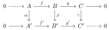
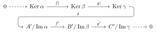
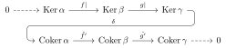

---
categories:
- Mathematics
tags:
- Algebra
- Category Theory
title: "蛇年，Snake Lemma！"
description: 蛇年我也试证一下蛇引理
image: Post Shelter-Inaba Kumori.png
date: 2025-02-27
math: true
draft: false
---

*看了好多证明蛇引理的视频，我也来试试~ 蛇年到了，重在参与嘛*

*头图出自 [ぬくぬくにぎりめし](https://twitter.com/NKNK_NGRMS) 太太， 为 [稲葉曇](https://space.bilibili.com/26040194) 所作的 [ポストシェルター](https://www.bilibili.com/video/BV1jS4y1y7Yf/) (Post Shelter)的曲绘。支持正版，就只有30秒试听了（）*



## 写在最前

本命年到啦~！作为一个代数爱好者（自称，其实是名词党），最近在B站看到了很多的关于怎么证明蛇引理（Snake Lemma）的视频，比如[这个视频](https://www.bilibili.com/video/BV1FZFNezE6D)。以前在自学代数的时候也遇到过这么个引理，但是看到这个部分的时候已经人快晕了（大概就是看完这个之后就抛弃了那本书吧，*Algebra: Chapter 0*），所以几乎等于没学过。这次看到这么多关于蛇引理的视频，自然是学习一下，这里也做一个记录吧。在本文中你将看到：

- 你在说些什么？
- 这么简单的前置竟然也要？
- 你这里跳步了吧？
- 就算我证的不好，我证的很搞笑也不行吗？

之类的高血压时刻。为了您的身心健康，如果你打算认真了解蛇引理的话，我还是不建议你深究这篇文章。当然，如果你是找乐子的话，我希望这篇文章能带给大家笑容。这篇文章的面向读者应该对最基础的代数有了解，比如集合啊，函数啊之类的，如果会线性代数就更好了，别的东西会中途提到，毕竟是名词党写的文章，当然起点会很低的吧（笑）。话不多说，开始吧。

## 简单（？）介绍

蛇引理究竟是什么呢？这是一个代数学定理，简单来讲，它做的事情和很多代数学定理一样：从已有的两个东西来创造出新的东西。比如，如果我们有一个集合以及集合上的等价类/等价关系，我们就可以构建出来一个商集；给定一个群以及它的正规子群，我们就可以构建出商群；把两个空间 $\mathbb{R}$ 叉乘起来（笛卡尔积），我们就得到了 $\mathbb{R}^2$。

那么蛇引理是针对什么样的代数对象呢？这里就要尝试引入我们的第一个概念：正合列 (Exact Sequence)

### 正合列，但是先别急

正合列，同调代数中的重要对象，是由链复型添以特殊的条件而产生的。链复型又是什么？链复型是一系列的交换群或者模通过同态连接起来，且相邻两个同态的复合为0。

也许你要说：天哪你在说什么鬼东西，这都是啥啥啥呀。既然我们假定读者只拥有最基础的代数知识，我们就从最基础的开始介绍吧。名词党最喜欢的名词介绍环节，启动！

#### 群，交换群

上面说链复型是由交换群或者模带上同态构成的，为了简单，我们就不介绍模 (Module) 了，专注于交换群。

但是模是什么？我要看口牙！
如果有人讲模之类的话，可以认为就是一个差一点的线性空间，它就差在标量不再是数域中的元素了，而是环 (Ring) ，一种乘法可能没有逆元的神奇代数结构，里面的元素。这里指出，环想要变成域（有的地方管域叫体，英文都是 Field）的话只需要让环满足交换律，并且它的每个非 0 元素都有乘法逆元就好了。

那么交换群，或者从头来讲，群，又是什么呢？有人会讲：群就是对称！有对称，就有群！挺好的，但是对称这种几何元素偏偏要符号化成群元素，这一步我倒是走了蛮久的。我们速通嘛，就说简单一点，尽可能地不丧失严谨性吧。群 (Group)，最为代数学中几乎是最基础的代数结构，和其余的许许多多数不清的代数结构类似，遵循这样的特点：

1.  从集合而来。它的 “底下” 一定是一个集合。这样我们就可以讨论这个代数对象中的元素了。
2.  它的内部有一个或者多个 “运算”。我们可以想象我们早已熟悉的乘法。既然是运算，我们对这么个东西有这样的要求：
    1.  首先运算是两个元素同时参与的。相乘的总是（起码）两个数。注意不一定非得是不一样的数哦。
    2.  两个元素经过运算之后应该得到一个元素。两个数相乘之后给出的也是一个数字。
    3.  这点不太明显，但是我们的运算总是应该从这个集合来，到这个集合里去。比如 $1\times 1\neq\mathrm{苹果}$。

这样就可以有一个（很基础的一些）代数结构啦。而我们的群，也正是这样的一个代数结构。不过它还有这样的特点：

1. 群的运算必须要是可以结合的。这意味着如果 $abc \neq (ab)c \neq a(bc)$，那它就不是群。（天啊真的有这样的神经结构吗）
2. 群的运算**不需要**是交换的。其实不交换的东西很常见，例如我们要先穿袜子再穿鞋，这肯定和光脚穿鞋后再套个袜子是不一样的啦。学过线性代数的朋友应该更有体会：矩阵乘法是不交换的。
3. 群得有单位元。何谓单位元？这不是元素吗？这里的单位元是和运算强相关的，说的就是群里的任何元素和这个单位元做运算之后一定得到的是它们自己。
4. 群中元素都得有逆元。没错，这里逆元的概念也是和运算相关的。所谓 “逆”，就是要把一个元素 “逆转” 回单位元。可以想象单位元就是某个出发的位置，每个元素都代表着某个让你移动的方式。而某个元素对应的逆元，就像你移动之后让你移动回原点的移动方式。能走出去，也得能走回来。就是这样。

其实上面的这些内容，经过一些整理的话就可以变成比较严格的群的定义了。然而严格定义谁都能查，这里也就偷个懒啦~ 这里指的指出的是，群上的运算我们一般就叫它乘法。而且在代数的语境下，很多运算我们都叫它乘法！所以在讨论代数结构中的乘法时要注意上下文哦~

所以群的对称意义究竟在哪？
 
我们讲，集合中的元素位置其实是无所谓的，比如集合 $\{1,2\}$ 和集合 $\{2,1\}$ 是一模一样的。那么，群的对称的意义，就在于群中的元素有两重含义：集合内的一个小不点，以及代表了如何操作这个集合的一个符号。

我们提到过，群的运算是需要满足上面一大堆条件的。这些条件指向了这样的一个神奇的结果：两个群中的元素相乘，我们可以有意识地将其中一个元素作为操作方式，将另一个元素看作群中茫茫多（或者很少，也许）元素中的某个元素。而这样的运算结果又是群中的某一个元素。

然后我们再想象这样一副图景：桌子上有一副扑克牌，每一张都分开放，放的很整齐。现在你尝试把这些扑克牌重新排列，这个排列方式取决于你开始重排前看到的第一张牌。在重新排列时，你肯定需要一张一张地取，取到之后会根据你看到的第一张牌来思考应该把它放在哪里，最后你就把它放在了对应的位置。在重复54遍 “取-看-放” 的过程之后，你会惊奇地发现：天哪，竟然又得到了一副扑克牌（？）

你可能觉得这个发现很无聊，但是这就是对称：在某种操作下又回到自身了。你也许会说：不！位置变了！但是还记得吗？集合中元素位置是无关紧要的。我们这里其实就是在讲群对自身的作用。那么群可以对别的集合进行作用吗？当然！只要某个作用方式满足群的条件，也就是说如果你先做了一个操作，又做了另一个操作（这样就操作两次了，对应群中的两个元素相乘）这俩操作实际上也是你可取操作的一种（群中元素运算后依旧在群里），以及别的条条框框，那么实际上你就是在对这个集合进行着群作用。

群中蕴含的对称，不在于群自己，而在于它能操作的对象。笨笨的我花了好久才明白这个道理 QAQ。

---

太棒了！群是什么，已经狠狠地理解了！那么交换群？诶！交换群一定是运算能满足交换律了吧！

是的，答案就是这么简单，且无聊。交换群 (Commutative Group，又称阿贝尔群 Abelian group，为了纪念伟大的挪威代数学家阿贝尔)，就是能交换 (Commutativity) 的群 (Group)。你也许会对交换群感到失望，但是代数岂是如此无聊之物！？这一切的原因，其实是：我们还没有引入同态 (Homomorphism)。

交换群和普通群还是有区别的吧？

Under Construction~

#### 同态，同构，等价关系

首先，代数中［Homo-］的词头其实很常见（？）。这是代表着两个东西之间一定有什么相同的地方。而同态，正是指出了两个代数结构之间相同之处的东西。请注意这里用到的是 *代数结构* 而非 *群* 或者 *交换群*。同态广泛地存在于代数学中，到处都是同态。那么同态是什么呢？其实你早就见过了。对于 *集合* 这个最基础的代数结构而言，同态就是 *函数*，或者说 *映射*[^1]。既然函数是对于集合而言特殊的同态，那么对于群而言，特殊的同态是什么呢？很可惜，没有一个特别的名字，或者大家就直接叫群同态了。然而群同态确实是有其特殊之处的。我们稍后再细讲这种特殊点在哪，以及何来的“同”一字。

回忆我们很熟悉的集合上的函数，它有这样的特点：

1.  函数必须要有定义域，它是一个 *集合*，且这个集合里的每个元素都能被函数处理（作用）。不能说有个定义域的元素不能被函数吃掉，那就礼崩乐坏了。函数是不会剩饭的。
2.  函数必须要有陪域。他也是一个 *集合*。请注意这里不是说不是值域，而是陪域。值域是函数能吐出来的东西组成的集合，而陪域则是函数吐出来的东西一定会存在的集合。所以，很自然的，会有一些陪域上的元素不会有任何定义域上的元素去对应。
3.  定义域中的每个元素 *能且只能* 对应陪域上的一个元素，而陪域上的元素可以有0个，1个或者很多个定义域上的元素对应。这就像投篮，球可以投不中，可以一个球一个框，也可以很多球进一个大框里，但是不能一个球同时进两个框。
4.  判断两个函数是否相等（没错，函数作为数学对象是可以判断是否与另一个相等的）的铁则是：定义域相同，陪域相同，定义域上的每个元素通过两个函数作用后得到的结果总是一样的。也就是说，要检测函数的三个要素都是一样的。表达式也许会骗人，但 *函数的定义* 永远是诚实的。

天啊我怎么又讲了一遍函数是什么？原因是：函数，作为同态的一个例子，自然就包括了同态的许多特点。然而同态还有一个重要的特性，也是被冠以 “同” 字的原因：同态必须保持结构！我们没有在集合中看到这样的特点，是因为集合里什么结构都没有。也许有人说：集合里的元素都是有名字的呀？什么 1 啊 2 啊的，这不就有结构那样的东西了嘛。这里要明确的是：集合里这些看似特殊的元素，它们的特殊性全都源自于我们为了能区分它们所给的，甚至就是为了能数清楚这些元素，不至于把它们搞混。So，集合真的很单纯，它上面的结构都是后面赋予的。当然，你也可以说 “没有结构” 也是一种结构，因为 *函数不会把集合变成别的什么不是集合的东西*，保持了 “没有结构” 的特点（结构）。

哦，好，但是说了一圈，到底怎么保持结构？群同态到底是什么样的？观察上面函数的特点，我们提炼一下：

> 同态要有来有去，且来去都是同一类东西，不能来去之后东西不一样了。这说明 *同态不会给对象添加或删去任何结构*。

就是说，群同态只能连接两个群。或者，*一个群上如果作用了一个群同态，那么它就必须给出一个群*。这点对于其他所有的代数结构都是一样的。

还是一头雾水？是不是觉得随便哪个集合上的函数都能在集合变身成函数后也跟着变成同态？没关系，就群同态而言，我们其实可以写出群同态需要满足的特点（多亏了运算的存在）。

> 设有两个群 $G$ 和 $H$，它们之间有个从 $G$ 到 $H$ 的群同态 $\varphi$。我们记群 $G$ 的运算为 $\times_G$，记群 $H$ 的运算为 $\times_H$，群 $G$ 中有俩元素 $g_1$ 和 $g_2$。这样一来，由于 $\varphi$ 是群同态，有：
>
> $$\varphi(g_1 \times_G g_2) = \varphi(g_1) \times_H \varphi(g_2)$$

而且它有一个很神奇且重要的特点：群同态只能把一个群的单位元映射到另一个群的单位元。这点乍看很神奇甚至不可思议，但是经过简单的证明就可以得到这样的结论了。这也是为了保持群的结构而对群同态做出的一个很强的限制。这也说明了，代数结构越是复杂，同态的限制就会越大。

最后我们讲一种特殊的同态或者态射，它需要有一个态射作为基础。我们设有这样的一个态射 $f:\\,A\to B$，且在 $A$ 中有一个保持原有 $A$ 结构的子结构 $A^\prime$，在集合层次上则为包含关系。此时我们就可以定义所谓的 *限制* （Restrict），就是把定义域从 $A$ 换到了其子结构 $A^\prime$ 上而已。它的记号为：$f|:\\, A^\prime\to B$。

---

我们接下来介绍同构 (Isomorphism)。它在集合函数中的对应就是所谓的一一对应函数了。回忆所谓的单射和满射，单射说一个萝卜一个坑，满射说值域就是陪域。而同时满足这两个条件的话，这个函数就是一一对应的函数啦。我们立刻使用一些新词来讲这些事情，因为函数（映射）是集合间的同态嘛。

同态中有单态 (Monomorphism)，也有满态 (Epimorphism)。而同时满足这两点的，即为所谓的同构了。它们的要求和集合函数是一模一样的。然而还有别的定义方法，使用态射的逆（啊没错它们都是态射但是这就留到范畴论再说吧）即可定义同态的单或满。回忆之前学过的逆函数这一存在，一个函数的逆函数再作用到函数的话就会变成恒同映射（把一个元素映射到它自己）。这是一种双边逆，更常见的情况则是一个态射只有左逆或者只有右逆。*我们称有左逆的态射为单态，有右逆的态射为满态，有双边逆的则为同构*。这个我们不证，有兴趣可以挑一些例子看看。请把重点放在 “能不能找到原来的元素” 以及 “如果能找到原来的元素，那么一定会如何”，并注意函数的复合是从右到左的。

同构从字面意思来理解，是 “保持结构” 的映射。可是之前还说同态是保持结构的映射，这两个区别在哪里？事实上，同构比同态要求高多了。同构要求的是 “构造完全相同”，而同态则只要求 “是同一类东西，不会多结构，也不会丢结构”，却可以修改这个结构。比如，同态可以让一个大群变成一个小群，搞得里面的每个元素以前有更丰富的运算结果，结果到了小群里好多元素被捏在一起了，这些丰富的结果也就没了。而同构会很严格地将一个群变成另一个大小一模一样的群，它们结构的丰富程度或者精细程度是一模一样的。在只关心群这个整体以及它怎么与其他群发生转变，完全不关心群内部元素有什么特别之处时，我们可以说，*同构的两个群，它们在同构意义下可以被视作是相同的*。顺带一提，集合的同构就是映射到元素个数相同（集合的势相等）的另一个集合。这也是个大坑，感兴趣可以搜 Schröder–Bernstein 定理或者伯恩斯坦定理。

对于群而言，群的同态会把群的一个或几个元素捏在一起形成新群的一个元素。同态是创造新群的一个重要方式。但是假如我们考虑 *把几个元素捏在一起形成一个新的元素* 实际上意味着 *对原来的群中的元素进行分类*，那我们就会形成很有趣的结构，商群 (Quotient Group)。我们不会深入这部分，但是这个思想是极其重要的，因此我们需要介绍另一个概念：等价关系与等价类。

---

小学数学，甚至幼儿园数学，经常会遇到这样的题目：把一堆苹果分成若干份，每份有几个苹果；把苹果平均分成若干份，最后剩下几个苹果。这样的题目是为了让孩子熟悉除法，而我们这里则要指出，这就是除法，或者所谓的 “商” 所代表的含义。而我们在分苹果时所做的事情，就是在对苹果分类。

我们要如何进行分类呢？特别是对一堆苹果而言，分成堆时我们做了什么？也许我们有某个标准，也许就是简单的 “我乐意”，但分成堆的过程中每个苹果最终都有属于自己的一堆。假如我们要分成三堆，那么我们完全有理由将三堆起不同的名字，比如：科比，牢大，曼巴。这样一来，每个苹果就都有了一个属性，一个标签。而苹果之间有什么关系吗？有的。我们观察同一堆的苹果，如牢大这堆，会发现这样的（显而易见）的特点：

1.  一个属于牢大的苹果，那么他就属于牢大（？）
2.  如果一个苹果在牢大里，另一个苹果也在牢大里，那么它们俩就都在牢大里，不论进入牢大这堆的顺序
3.  如果苹果A和苹果B都在牢大里，苹果B和苹果C也在牢大里，那么苹果A和苹果C就一定在牢大这里。

不论分类手法如何，不管分类标准怎么样，上面这三条总是成立的。而在分好之后，对任何人都可以只宣称这堆苹果属于哪一堆，不用管它具体怎么样了。有人问这个苹果是哪个，都可以回答这个苹果是从科比或者牢大或者曼巴这堆里取出来的。

还是一头雾水？上面的例子是想说明这样的一件事：只要你选了，那就会形成一个标准，这个标准内的每个成员都会接受这样的束缚，而这个约束是有 *自反性*，*反身性* 和 *传递性*的。这些性质就刻画了一个 “关系”，称为 *等价关系*。我们刚刚用分好的类来说明这类关系一定存在，而反过来讲，根据这样的关系，也一定能进行这样的分类。最后分出来的 “每一堆”，我们就称为等价类。

分类是代数学中另一个极为重要的话题。有一些出色，重要且惊艳的研究正是建立在这样的分类问题上的，比如传说中的 *有限单群分类*，洋洋洒洒几千字的论文将整个单群分类问题整的明明白白。分类如此重要的原因还在于帮助我们创造新的代数结构，也就是所谓的 *商*。比如使用同态对群进行划分则会涉及著名的 *群同构基本定理*，描述了用同态下的等价关系创造出的商群有什么样的信息。

我们这里先不深入介绍商群，因为它将涉及到子群 (Subgroup)，陪集 (Coset)，正规子群 (Normal subgroup) 等概念，太啰唆了。这里只指出商群的记号为 $G/H$，其中 $G$ 和 $H$ 都是群，且 $H$ 是 $G$ 的正规子群。这个商群的元素是这样的：每个元素都是一个集合，这个集合内是群 $G$ 中的元素，并且这些群 $G$ 中的元素都相互等价，而这个等价关系则由群 $H$ 这样确定：元素 $a$ 和 $b$ 等价由 $a^{-1}b \in H$ 决定。换句话说，我们根据群 $H$ 制定了元素的分类标准，把分好类后的每个 “元素堆” 作为商群中的每个元素。能分多少堆，商群就有多少个元素。

要注意的是由于等价关系，商群中每个元素（也就是 $G$ 中元素的集合）里都可以选出唯一的一个 $G$ 中元素来代表。那么既然如此，我们就使用在代表元的头顶加个尖尖的东西来代表这个集合了。比如有一个等价类 $A$ 中有一个元素 $a$，此时我们就可以用这个元素 $a$ 来代表这个等价类 $A$：$\hat{a} = A$。这个记号还是比较重要的，所以这里提前介绍一下。

太棒啦！感觉智慧满大脑了~但是这么多前置了，和蛇引理有关系吗？还有多少前置需要呢？答案令人振奋呀：还有一节就好了！我们已经明白了同态是什么样的，交换群又是啥，商群里的元素怎么确定，有什么样的特点。我们只需要再看一看最后两个和同态有千丝万缕联系，作为 “群同构基本定理” 中的 C 位的两个特殊的代数对象，核 (Kernel) 与像 (Image)，就可以开始一窥蛇引理的神秘了~。

#### 核与像

核的概念其实很简单，它高度依赖于同态，本身是一个特殊的集合（我们先看它单纯的集合结构）。它是同态的定义域上所有能被对应到陪域的 *零元素* 的元素，记号为 $\operatorname{Ker}$。假设有某个同态 $\phi$，那么在这个同态下的核就记为 $\operatorname{Ker}\phi$。这里的零元素应该是代数结构中普遍存在的单位元，而称为零元素的主要原因是因为对我们即将研究的许多代数结构而言，它们上面的结构实际上是交换的。交换的运算我们会叫它们 *加法*。而我们熟悉的加法的单位元就是 $0$。

我们上面只说了核底下依赖的集合是怎样选取的，然而由于同态的性质，核上经常都会有额外的代数结构。这一点很容易确定：对群而言，单位元自己本身就是一个平凡群，其上的唯一运算就是单位元和单位元进行运算之后得到单位元自己。那么既然单位元是一个群，由同态的要求，我们马上就可以得知，群同态的核很自然地就拥有群结构。不但如此，我们在此不加说明地断言：群同态的核总是群的定义域的一个正规子群！而有了正规子群，我们马上就可以讨论定义域的群商去这个同态的核所得到的商群了。事实上，群同构基本定理中就和同态的核关系非常密切，且经常使用核来构造商群。

对于核而言，我们还想提到这三点：首先核一定是依赖于某个同态的，没有同态是没有办法讨论核的。从它的记号就可以看出，我们选择使用 $\operatorname{Ker}$ 记录同态的符号而非其定义域，然而也请切记核作为集合而言一定是定义域的子集。

其次想要提到的是核在 *同调代数* （也许也不是？）中的意义：核衡量了同态的性质，告诉了我们一个同态距离单态究竟有多远。这是由于这样的定理：*核中的元素只有一个（也就是单位元）当且仅当同态是单态*。那么如果核越大，同态距离单态就越远了；核越小，同态就越像单态。

最后一点也许会复杂一些，我们想提到的是：群同态的核由于一定是正规子群，而正规子群又一定能够被商掉。考虑我们上面提过的构造商结构的过程：被商的集合/结构是作为一个选择方式出现，而这个选择方式就是这个结构中的所有元素都被视为同一个元素。我们进行这样的猜测：这样用核来构造的商群中的元素，每个元素都是一个集合，而这些集合与核是相似的：它们都有同样的大小。幸运的是这样的猜测是成立的。最后也不卖关子了：商群中的元素就是正规子群的陪集，而每个陪集的大小都是相等的。所谓的陪集就是把群里面的子群用某个元素乘一下（移动一下）。这里说 “集” 有两个层面，一是我们不计划赋予它别的结构，他们就作为集合存在于商群；二是我们没法赋予群结构，除了最平凡的那个正规子群。更一般的陪集是没有办法满足单位元要求以及逆元要求的。

核真的很重要，所以我们聊了许多。不过这主要是由于核与商群之间重要的联系。有了这样的铺垫，我们理解像将会更迅速：像也是一个子群，但不是更特殊的正规子群。

---

像我们早就熟悉了，就集合层面而言，就是值域 “更代数”的一个名字。而同样由于同态的存在，像也一定是一个群。但是不同于核，像并不总是正规子群。这真是一个悲伤的故事，我们不能再愉快地构造商群了。也许你之前幻想着，既然核可以衡量同态与单态的距离，是不是像也可以衡量同态与满态的距离呢？因为很显然可以看到，像越大越可能是满态，像与陪域相同那就是满态了。然而很可惜，我们不用这种方式。

但是我们有三个好消息：第一条是，虽然像不是个正规子群，但是我们依旧可以用像构造商结构！第二条则是，虽然像不能衡量同态的信息，但是它构造的商结构可以！我们还给它一个特别的名字：余核 (Cokernel)。第三条则是，我们其实要研究的是交换群，而对交换群而言，所有的子群都是正规子群的！这样一来，前面讲的商结构也就可以是商群啦。

子群，商群，陪集，商结构，到底是怎么回事？
 
在讲商群时，终究还是无法避免陪集的概念。陪集和商群之间到底是什么样的关系？陪集之间又有什么样的联系？陪集到底是什么样子的东西？*商* 究竟是什么？我们讲了这么久的子群，正规子群，它们到底都是啥？这里我们斗胆写一写吧。

先看看子群吧，其实子群的概念很简单：一个群的子群，实际上就是子集加上原群的运算。这样一来，子群的单位元一定就是原群的单位元，而子群的运算就是原群的运算了。这个还是相对比较简单的一个概念，麻烦的是所谓的正规子群。而为了讨论正规子群，必须要讨论所谓的陪集。我们把陪集往后放一放，先讲商群中的元素们：陪集。

我们已经提到，商群就是对群按照其正规子群的需求进行分类从而得到的一个更小的群。这个更小的群里面是一个个的陪集，我们讲陪集中的元素都是相互等价的，因此，这个更小的群里的元素虽然都是集合，但是完全可以从每个集合中取一个元素来代表这个集合（由于等价关系），这个元素就被称为代表元。所以你可能会见到商群中的元素是用一个个原群中的元素带上标记构成的。但是还请记住，商群中的元素始终都是集合，也就是陪集。

我们再谈谈陪集。陪集是这样一个集合：它必须依赖一个群里的元素，以及这个群的一个子群。我们记较大的群为 $G$，它的子群为 $H$。那么我们取 $G$ 中的一个元素 $g$ 之后，再和子群 $H$结合一下，就得到了所谓的陪集了。具体是这样的：

1.  还是先提醒：$H$ 是住在 $G$ 里面的，它们拥有一模一样的运算，所以 $G$ 中的元素是完全可以与 $H$ 中的元素运算的。
2.  我们从群 $G$ 中取出一个元素 $g$。这个元素是任意的，只要在 $G$ 里就好。然后还要把 $H$ 中的元素一个一个地取出来，准备进行运算。我们要取出所有 $H$ 中的元素，不遗漏不重复。
3. 用 $g$ 和 $H$ 中的元素依次进行运算。在做运算时，我们先把 $g$ 放在 $H$ 中元素的左边。最后得到的结果放在一个篮子里（或者框里，也可以）。
4. 最后检查这个框子，我们给它贴上标签：$gH$。这个框就是我们想要的陪集，准确地说是 $H$ 在 $G$ 中元素 $g$ 作用下的 *左* 陪集。

自此，我们便成功得到了一个左陪集。如果在进行运算时将 $g$ 放在 $H$ 的右边，则称之为右陪集，记号也变为 $Hg$。注意到陪集中的元素一定是在 $G$ 中的元素，我们自然好奇：陪集内元素有什么样的特点呢？我们回顾上面的内容：陪集内元素相互等价，等价关系为 $a^{-1}b \in H$。我们来看看是怎么回事。我们更多地关注左陪集，右陪集是类似的思路。

> 证明：$a^{-1}b \in H$ 当且仅当 a 与 b 等价，亦即 $aH = bH$。
> 
> 首先，$a$ 与 $b$ 都一定属于各自的陪集，因为 $H$ 是一个群，群里有单位元，则陪集 $aH$ 中肯定有 $a$，$bH$ 中也肯定有 $b$。
>
> 既然 $a^{-1}b \in H$，那肯定就有一个元素 $h$ 就是 $a^{-1}b$。由于乘法逆元的性质，我们给两边左乘 $a$，就有了 $b = ah$。回忆 $H$ 在 $a$ 的左陪集的定义，这就说明了：$b$ 也是 $aH$ 中的元素。
>
> 此时我们想到，既然 $H$ 是一个群，$h$ 在 $H$ 里了，那 $h^{-1}$ 也肯定在里面。我们就给 $b=ah$ 的右边同时乘以 $h^{-1}$，就有得到了：$a=bh^{-1}$。这同时也说明了 $a$ 也是 $bH$ 中的元素。这样一来，我们就证明了 $aH = bH$，因为我们的 $a$, $b$ 是任意选择的 $G$ 中元素，这样的任意性保证了不会选取特殊的点。
>
> 其次，当 $aH = bH$ 时，有这样的情况：$a$ 与 $b$ 相等，则结论自然；若是 $a$ 与 $b$ 不相等，这时由于群乘法的封闭性，一定要有一个 $h$ 满足这样的关系：$ah = b$。现在我们视线移向群 $G$ 后，便可以同时左乘 $a^{-1}$，这时就得到了我们想要的结论。至此，我们证明了这样的选择方式确实是构成了一个等价关系。

最后我们关注陪集间的关系：左陪集是不一定等于右陪集的。这点如果能恒成立的话，那么这个群 $H$ 就一定是一个正规子群。另外，群 $H$ 的所有左陪集都有同样的大小。这一点的理由是：左乘群 $g$ 中的元素这个动作总是可逆的，再左乘回 $g^{-1}$ 就可以了。这样一来，左乘 $g$ 就实际形成了一个集合间的双射，也就是所谓的同构。它保证了元素个数相同。也正因如此，用左乘 $a$ 定义的 $H \to aH$ 就保证了 $H$ 与 $aH$ 的元素个数相同了。由于 $g$ 是任意选取的，所以任意的左陪集都有相同个数的元素了。这个结论对右陪集而言也是显而易见的。

另外我们提一下记号的问题。对于使用乘法记号的群而言，由于我们的子群本身就是一个群，所以一定有一个单位元。而根据左陪集的形态，我们就知道了：每个左陪集中一定有一个元素，这个元素就是子群 $H$ 的单位元乘上我们左陪集所左乘的元素。简单来说，如果有一个左陪集 $gH$，那么这个左陪集里面就一定有一个元素 $g 1_H$。而既然左陪集中每个元素之间都是等价的，我们很自然地就可以使用这个元素来代表这个左陪集。至于记号，我们上面已经介绍了：$\hat{g}$ 就可以代表 $gH$。诶？那假如我用单位元去左乘以这个子群，得到的就是？没错，就是子群本身形成的陪集。而这个特殊的陪集在我们下面定义的商群乘法下自然就是我们需要的单位元了。

我们定义正规子群为左陪集等于右陪集的子群。在这个定义下，很明显就可以看出，满足交换律的交换群里没有不正规的子群了，因为很轻易地就得到了左陪集等于右陪集，只需要把交换律下放到陪集内元素的计算过程中即可得到。那么对于交换群/阿贝尔群而言，陪集的记号是什么样的呢？我们很轻易就可以类比出来：既然乘法记号的群是用一个元素左乘子群得到左陪集，那么加法记号的群就用一个元素加上一个子群得到这个子群的陪集即可。同样，我们可以使用这个加上去的元素来代表这个陪集，方法也是在上面戴个小帽子。

有了正规子群，我们就可以愉快地进行商群的构造了。然而，为什么必须是正规子群呢？不能商去一般的子群吗？答案藏在商群运算的合理性中[^2]。

为了尝试从普通的子群构造商群，我们取子群的左陪集们然后就可以形成一个集合了。这个集合内的每个元素都是子群的左陪集。现在我们希望给这个集合上面添加运算。由于左陪集的元素是形如 $gH$ 这样的，所以我们自然希望 $g_1H \cdot g_2H = (g_1g_2)H$，也就是可以直接借用我们在群 $G$ 或 $H$ 中已经有的乘法了。这样定义的乘法满足了群运算的所有性质。然而，定义这个乘法不能靠我们一厢情愿，我们得检查定义的是否合理，即设 $a, a^{^\prime},b$ 是满足了 $aH = a^{^\prime}H$ 的任意的 $G$ 中的元素，我们要有 $(aH)(bH) = (ab)H = (a^{^\prime}b)H = (a^{^\prime}H)(bH)$。

根据陪集定义，我们取任意的 $h_1$, $h_2$ 以及由它们决定的某个 $h_3$，则有 $ah_1bh_2 = a^{^\prime}bh_3$。由于 $aH=a^{^\prime}H$，根据之前的论述，我们指导一定有某个 $h_4$ 满足 $a = a^{^\prime}h_4$。我们带入前面式子，有 $a^{^\prime}h_4h_1bh_2 = a^{^\prime}bh_3$。根据群乘法可逆的条件，有 $h_4h_1bh_2 = bh_3$，我们再把 $h_2$ 的逆乘到等式右边，根据 $H$ 中乘法封闭性，就有：$h_5b=bh_6$。由于我们的 $h_1$，$h_2$ 是任意的，$a$，$b$ 也是任意的，所以 $h_3$ 和 $h_4$ 也不受额外条件的束缚，进而 $h_5$ 与 $h_6$。再回忆我们的左陪集和右陪集的定义，因此我们可以认为：为了满足我们的乘法条件，则必须要有 $Hb = bH$，这正说明了 $H$ 必须是正规的。至此，你应该已经发现：为满足运算的合理性，子群 $H$ 必须是正规子群。

我们也可以这样理解。取 $G$ 中的任意两个元素 $g_1$与 $g_2$，再取 $H$ 中任意的两个元素 $h_1$ 与 $h_2$，我们要保证 $g_1h_1g_2h_2 = g_1g_2h_3$，其中 $h_3$ 可以是某个由计算过程得到的一个 $H$ 中的元素。要想把 $g_2$ 往左挪过去和 $g_1$ 凑成一对儿的形式，我们必须要让 $g_2$ 和 $h_1$ 存在某种形式的 “交换律”，这样的交换律必须保证 $g_2$ 还是 $g_2$，$h_1$ 则必须还是 $H$ 中的元素。但是，很可惜，这样的 “交换律” 只能存在于真的交换群，或者最低限度的办法：让左陪集等于右陪集，也就是正规子群中。否则这两点无法保证。

上面这个说明，也是为了指出证明定义合理的重要性。这一点在代数中是十分重要的。而在讨论完陪集和正规子群的重要性后，我们最后要讨论的是：*商* 到底是什么。

我们其实已经指出过，商就是所谓的分类。小学学到的 “分堆问题” 就已经是对 *商* 这个字非常好的诠释了。至于为什么用了 “商” 这个字…… 首先，我不知道；其次，也许可以问商鞅？（什么地狱笑话）

商结构远不止存在于群或者集合中。商结构几乎存在于任何代数对象里。我们可以对拓扑空间做商结构，就像是把纸/空间缝起来/黏起来一样，这样我们就可以得到各种有趣的拓扑空间，比如甜甜圈（环面）、克莱因瓶、莫比乌斯环带等；我们可以把整数轴折叠起来，这样可以得到一个有限群（还很有可能是循环群）；我们还可以把 $\mathbb{R}$ 上多项式空间（就是所有以实数作系数的多项式组成的线性空间）商去多项式 $x^2+1$，这样得到的就是我们熟悉的复空间（复述域）。这里我们提出一种理解商空间的方法：把空间的某些点/线/面或者什么东西黏起来。这个 “黏起来” 的动作，实际上就是把某些点看作同一个点，而这样就等于定义了一个等价关系：黏起来后到同一个点的原空间内的点就在同一个等价类里面。

此时你可以看到，如果你有一种分类方法，并且你可以用什么办法把代数对象里的元素放到不同的几堆儿里，那你就已经可以生成一个商结构了。它最最最最最起码也是一个商集，而要是你分类方法足够好，你得到的商结构就会更好。我们最后提一下商结构的记号，一般有两类表示方法：一是商去一个等价关系，二是商去用这个等价关系生成的等价类。这两种记号一般都是代表着同一个含义的。利用这个等价关系对原代数结构进行划分会得到若干等价类，其中的一个就是商去等价类记号中的那个等价类。

So，这就是对这么几个代数学结构的解释了。希望你不要因为这些文字而感到眩晕的同时，得到一些对这些代数结构直观的解释。我们回到主线吧。

### 正合列，以及一点点点点范畴论

现在我们已经清楚了什么是交换群，什么是同态，什么是核，像，商群以及余核。是时候看看我们想要研究的结构了：正合列，以及对应的图。下面就是我们要研究的对象，也是一个图的例子：两个整合列所组成的图。
<figure>

<figcaption>两个整合列，通过整合列间的同态链接</figcaption>
</figure>
你可以在图中看到两个虚箭头，这两个虚箭头我们先把它们看成实线的，也就是实际存在的。后面证明蛇引理的时候这两个箭头是可以不存在的（当然也就没有连接着的0了）。

#### 链复型

我们先来说说正合列（Exact Sequence）。上图中的正合列有两个，分别是 $0\to A \to B\to C\to 0$ 以及 $0\to A^{^\prime} \to B^{^\prime}\to C^{^\prime}\to 0$。它们中的 $0$, $A$ 等我们称之为 *点*，实际上是一个个交换群（一般是模，我们这里取交换群即可），而每个箭头都代表着一个同态。这些同态有着特殊的要求，如果这些同态只是一般的同态，那它们就什么都不是。为了使之成为整个列，我们需要先得到所谓的链复型（Chain Complex，上下文明确时可能直接叫复型 Complex）。

链复型要求使用同态将一系列的数学对象连接起来，通常这些数学对象以及对应同态还会有一定的顺序，且同态之间的复合还要满足特殊的要求。具体而言，链复型要求这样的序列：

$$\cdots\xrightarrow{d_{i+2}} M_{i+1}\xrightarrow{d_{i+1}} M_i \xrightarrow{d_i} M_{i-1} \xrightarrow{d_{i-1}} \cdots$$

满足条件：$d_{i+1}\circ d_{i} = 0$ 对于所有的 $i$ 都成立。这样的链复型可以被记作 $(M_\bullet,d_\bullet)$。这样的定义蕴含了下面的信息：

1.  交换群的序号从高到低，同态序号也从高到低
2.  对于所有的同态而言，左侧的同态复合上右侧同态得到的是零同态，也就是把所有的元素映射到单位元上（对于交换群，单位元就是0）
3.  由上面一条，如果左侧同态复合右侧同态得到了恒通映射，就说明左侧的同态必须把元素映射到右侧同态的核里面。若不然，则无法达成两次复合后为零同态。

链复型的结构要求每个点都是同一种结构（交换群），且某个点里的任何一个元素沿着链复型移动两次后一定会映射到单位元（后面称零元）上。这样的代数结构是为了方便我们讨论所谓的 *同调*，也正因如此，链复型是同调代数中最基础也最重要的代数结构之一。

#### 同调群，正合，正合列

上面提到，正合列是在链复型商加条件得到的，而这个所谓的条件就是 *正合* 条件。而为了讨论正合，我们还要引入同调群的概念。有了同调群，正合就非常好判断了。

我们还是用上面的链复型来举例，所谓的同调群是指这样的商结构：

$$H_n(M_\bullet) \vcentcolon= \operatorname{Ker}d_n/\operatorname{Im}d_{n+1},$$

即一个同态的核与上一个同态的像之间的商群。当链复型的某个点处（即某一个 $n$）的同调群是平凡群（即只有一个元素的群，记作 $0$）时，我们称这个点上是 *正合的*。而如果每个点都是正合的，我们就叫这个链复型为正合列。表达正合关系也可以不借助同调群，因为同调群等于平凡群就相当于说 

$$\operatorname{Ker} d_n = \operatorname{Im}{d_{n+1}},$$

从这个角度来看也许更好理解正合是什么样的关系。仅从集合的角度来讲，链复型的要求就是在说 $\operatorname{Im} d_{n+1}$ 必须在 $\operatorname{Ker} d_n$ 的里面，它们之间可能有缝隙：$\operatorname{Im}d_{n+1} \subseteq \operatorname{Ker} d_n $；而正合则表示，这两个集合之间是没有缝隙的。这也许也是**正**合这个字的来源吧。

最后我们指出，我们上面的那个图片里所给出的两个正合列更为特殊，因为很短，所以叫它 *短正合列*。不难看到，由 $0$ 出发的态射是单态，到 $0$ 结束的态射则是满的。而又根据正合的条件，可以得到 $f$ 必须是单态（不然 $\operatorname{Ker} f \neq 0$），$g$ 则必须是满态（否则 $\operatorname{Im} g \neq 0$。

#### 图与交换图

学代数的时候会遇到许许多多用箭头代表的态射，而我们也常常需要将态射复合起来形成新的态射。有时我们又会发现，一个态射可以通过两种甚至多种不同的态射复合方式得到。单靠语言经常会感到乏力，自然而然地，我们想到用图（Diagram）来绘制出这样的想法，把一些态射按照对应的数学对象连接起来。上面链复型或者正合列的表示实际上已经是一副图了，但是这个图还是比较简单的。而当我们发现一个态射可以通过不同的态射复合方式得到时，我们就可以把它们画出来，这样的图我们称是交换的，这种图我们叫做交换图（Commutative Diagram）。

以上面的用两个短正合列组成的那个图举例，如果有 $\beta\circ f = f^{^\prime}\circ\alpha $ 以及 $ \gamma\circ g = g^{^\prime}\circ\beta $，那么它就是一个交换图。我们后面把态射复合时中间的圆圈 $\circ$ 省略掉。

#### 一点点的范畴论

我们最后简单地提一嘴范畴论吧。范畴论是从拓扑那里来的，是根据不同的几何结构间精巧的关系而诞生的描述这种关系的语言，但是后来逐渐被大家发现，好像很多数学结构之间也是可以构建出类似关系的。自此，便有数学家开始建立范畴论，用以正式地，形式化地描述不同数学结构它们内部的或之间的关系。

我们举一些简单的例子，来看看什么是一个 *范畴*（Category）。一个很简单的例子就是 *所有* 的集合以及集合之间的 *所有* 函数们所构成的范畴 $\mathsf{Set}$ 了（具体某个范畴的记号一般使用无衬线体，根据情况省略部分字母），另一个例子则是所有群以及所有的群之间的同态所构成的范畴 $\mathsf{Grp}$。可以看到很多都是 “所有的数学对象以及它们之间所有的同态构成的范畴” 这样的形式。这样的范畴还是比较基础且常见的，且根据这样的形式，我们可以很自然地总结出别的一些范畴，比如 $\mathbb{R}$ 上的所有线性空间以及所有的线性映射构成的范畴 $\mathsf{Vect_\mathbb{R}}$，所有的环以及其同态构成的映射构成的范畴 $\mathsf{Rng}$[^3]，等等等等。

范畴之间是可以相互联系起来的，这种联系我们也可以像箭头一样写出来，称为函子（Functor）。而函子之间也可以做出联系，称为所谓自然变换（Nature Transformation）。不过好消息是，我们不需要关注这些内容，而只需要关注某一个具体范畴（具体来讲，就是阿贝尔群范畴 $\mathsf{Ab}$）的内部即可。

范畴的作用除了给出不同类型的数学对象之间有什么样的联系之外，也给我们提供了一个讨论问题的舞台。我们可以直接讲我们在某个范畴中研究什么样的问题，此时范畴本身就给出了我们要研究内容的重要信息。另外，范畴论给了我们一些用以描述数学对象关系的语言，它们通常可以一针见血地指出数学对象间是什么样的关系，当然也因为过于抽象且过于具有总结性而被戏称为 “抽象废话”。

最后，借助范畴论中的一些内容，比如交换图，我们可以方便地描述数学对象之间的关系。

所以什么是范畴呢？

Under Construction~

### 所以，蛇引理到底讲了什么

终于，我们把为了描述蛇引理讲了什么而需要的一些基础内容介绍完了。可以看到，蛇引理还是需要比较多的前置的。下面就是这个所谓的蛇引理了。我们介绍的是建立在两个短正合列所构成的交换图上的简单版本的蛇引理。具体内容如下：

> 蛇引理：
>
> 设有如下图所给出的交换图：
> <figure>
> 
> </figure>
> 其中第一行和第二行均为正合列，每个点均为阿贝尔群（交换群）。由这样的两个正合列，我们可以构造出下面的正合列：
> <figure>
> 
> </figure>
> 且当交换图中的虚线箭头成立时，对应的虚线箭头也成立。

这条引理由于构造出的正合列需要像蛇一样从交换图的左上角开始出发一路拐到右下角而得名。真是恰当的名字。由于我们已经知道所谓的余核，所以上面的正合列实际上还可以写成这样更加对称的形式： 

<figure>

</figure>
<!-- $$
0\dashrightarrow \operatorname{Ker} \alpha \xrightarrow{f|} \operatorname{Ker} \beta \xrightarrow{g|} \operatorname{Ker} \gamma \xrightarrow{\delta}\operatorname{Coker} \alpha \xrightarrow{\hat{f^\prime}}\operatorname{Coker} \beta\xrightarrow{\hat{g^\prime}} \operatorname{Coker} \gamma \dashrightarrow 0
$$ -->

对称？对称在哪？

Under Construction~

## 准备证明吧

我们的手牌已经集齐了，现在等待着我们的就是要证明这个引理。这个引理涉及到的阿贝尔群很多，同态也很多。我们需要一步一步地朝着目标前进，否则这个大个家伙是没办法一次搞定的。

### 证明思路

从最后的结果来看，我们有这样的几个问题是需要验证的：

1.  $f|$ 的定义是否合理
2.  $g|$ 的定义是否合理
3.  $\hat{f^\prime}$ 如何定义，是否良定
4.  $\hat{g^\prime}$ 如何定义，是否良定
5.  $\delta$ 如何定义，是否良定
6.  每个点处是否正合
7.  若原交换图虚线箭头成立，得到的正合列是否对应虚线箭头也成立

我们不计划纠结于为什么核与余核在这里出现的如此频繁，只将之作为待证明的结论；也就是说，我们不考虑为什么选择了这样的构造，只考虑证明这个构造为什么是正确的。另外，我们可以发现第1点与第2点是很相似的，同样第3点与第4点也是很相似的。

好了，我们开始正式的证明过程吧。

### 验证 $f|$ 的定义，然后 $g|$

我们第一个要验证的是 $f|$ 的定义，或者说仔细考虑怎么样去定义它。从图上可以看到，这个同态是 $f$ 在 $\operatorname{Ker} \alpha$ 上的限制，对它的定义的验证则是要验证 $f|$ 是否真的能把 $\operatorname{Ker} \alpha$ 映射入 $\operatorname{Ker} \beta$ 中，即验证 $\operatorname{Im} f| \subseteq \operatorname{Ker} \beta$。

为了验证这件事，我们只需要任意取 $\operatorname{Ker} \alpha$ 中的点，如果这些点在 $f|$ 的映射下都属于 $\operatorname{Ker} \beta$，就可以验证这样的包含关系了（这也是子集的定义）。既然如此，我们取 $\operatorname{Ker} \alpha$ 中的一个点 $a$，根据核的性质，既然 $a$ 在 $\alpha$ 的核内，我们知道 $\alpha (a) = 0 \in A^\prime$，再根据同态的性质，群同态只能将单位元/零元映射到单位元/零元上，我们知道 $f^\prime \alpha (a) = 0 \in B^\prime$。由于交换图的性质，我们有：$\beta f (a) = f^\prime \alpha (a) = 0$。请注意 $\beta (f(a)) = 0$ 就意味着 $f(a)$ 这一点位于 $\operatorname{Ker} \beta$，即 $f(a) \in \operatorname{Ker} \beta$，而这恰恰就是我们要证明的：任意一个 $\operatorname{Ker} \alpha$ 中的元素 $a$ 在经过 $f|$ 映射之后，都位于 $\operatorname{Ker} \beta$ 中。

这里有一个点需要指出：为什么我们明明要验证的同态是 $f|$，最后却直接使用了 $f$ 的性质？这是因为：$f|$ 除了更改了定义域的范围之外，所有的信息都得以保留。由于我们任取的 $a$ 满足 $a\in\operatorname{Ker} \alpha \subseteq A$，所以 $f|$ 对在 $\operatorname{Ker}\alpha$ 中语境下的 $a$ 所产生的影响，和 $f$ 对 $A$ 中语境下的 $a$ 产生的影响是一模一样的。这保证了我们可以放心大胆地使用 $f$ 的性质。

最后我们指出，这里的验证过程没有借助图表交换以及核的性质以外的任何要素，因此这套证明也可以直接照搬到下一个交换块，也就是关于 $g|$ 的定义的验证问题上。这里就不啰嗦了。

### 验证 $\hat{f^\prime}$ 的定义，顺带 $\hat{g^\prime}$

接下来要验证的就是 $\hat{f^\prime}$ 的定义了。我们要验证的东西其实和上面类似，也是 $\operatorname{Im} \hat{f^\prime} \subseteq \operatorname{Coker} \beta$。然而我们现在还不知道 $\hat{f^\prime}$ 具体是怎样的，只知道它的定义域是 $\operatorname{Coker} \alpha$。所以我们先来看看 $\operatorname{Coker} \alpha$ 里都有什么，再看看 $\hat{f^\prime}$ 是一个什么样的同态，再来考虑验证上面所要求的定义。

#### $\operatorname{Coker} \alpha$ 里是什么样的

由于 $\operatorname{Coker} \alpha = A^\prime / \operatorname{Im} \alpha$，其中的每个元素都应该是 $\operatorname{Im} \alpha$ 这种形式的陪集。对于阿贝尔群（交换群）而言，这里的等价关系是这样定义的：若 $a,b\in A$ 且 $a - b \in \operatorname{Im} \alpha$，则认为 $a \sim b$，即 $a$ 与 $b$ 等价。这里的减号 $-$ 应该与 $b$ 一起理解为 $b$ 的逆元。这就形同 $a^{-1}b$ 在一般的乘法群中判定元素是否等价时一样。与此同时，其他的等价类（陪集），按照加法记号，也应该可以写作这样的形式：$a+\operatorname{Im} \alpha$。（假如你没有点开哪些小箭头的话）我们使用代表元的记号来记录这个陪集，即 $\hat{a} = a+\operatorname{Im} \alpha$。我们在余核中定义的运算，则是借助余核所在的群的运算所定义的：直接将代表元按照原群中的运算进行，最后给它带上帽子（找到对应的等价类）。写成符号形式则是：假设有同态 $f: A\to B$，则这个同态的余核为 $\operatorname{Coker} f = A/\operatorname{Im} f \subseteq A$，再设余核这个群中有两个元素 $\hat{a}$ 与 $\hat{b}$，则余核中的运算为：$\hat{a}+_\mathrm{Coker}\hat{b} = \widehat{a+_A b}$。

现在一切都明了了。 $\operatorname{Coker} \alpha$ 中的元素，就是一个个等价类，如 $\hat{0}$, $\hat{a}$ 这样，其运算直接继承自群 $A^\prime$。

#### $\hat{f^\prime}$ 是什么样的

从交换图上可以看到，$\hat{f^\prime}$ 是从 $\operatorname{Coker} \alpha$ 到 $\operatorname{Coker} \beta$ 上的。而在 $\operatorname{Coker} \alpha$ 中的元素则是众多的以代表元所代表的等价类。那么，在使用 $\hat{f^\prime}$ 作用到 $\operatorname{Coker} \alpha$ 中的一个元素 $\hat{a}$ 后，得到的则应该是位于 $\operatorname{Coker} \beta$ 中的一个元素，这个元素应该是形如 $b+\operatorname{Im} \beta$ 这样的等价类，自然也可以被表示为 $\hat{b}$。这就是我们需要验证的同态，$\hat{f^\prime}$，具体在做的事。

那么就有值得注意的一些问题。两个元素等价时，它们自然属于同一个等价类，但这两个元素本身是可以不同的。假如两个不同但等价的元素在进入等价类后再被商群间的同态所映射，应该会得到一个目标群上的等价类。另外，自然，我们也要验证这个同态的像确实在陪域内。我们开始验证吧。

#### 开始验证

我们取 $\operatorname{Coker} \alpha$ 中的一个元素 $\hat{a}$，这个元素是一个等价类，等价关系由 $a - a^\prime \in \operatorname{Im} \alpha \hArr a \sim a^\prime$ 给出。此时我们就取这个等价类中的这两个元素 $a,\\,a^\prime \in A^\prime$。那么，此时这两个元素在经过 $f^\prime$ 作用后得到的就是 $f^\prime (a)$ 以及 $f^\prime(a^\prime)$。这两个 $B^\prime$ 中的元素应该依旧会被映射到同一个等价类中，也就是两个元素等价。判断两元素等价的条件则类似于前面的判断条件：$f^\prime (a) - f^\prime(a^\prime) \in \operatorname{Im} \beta$。我们可以看到：由于 $f^\prime$ 是一个同态，同态是保运算的，则 $f^\prime (a) - f^\prime(a^\prime) = f^\prime(a-a^\prime)$。注意到 $a-a^\prime \in \operatorname{Im} \alpha$，由像的性质，我们就一定可以找到一个存在于 $A$ 中的一个元素 $a^*$，使得 $\alpha(a^*) = a-a^\prime$。

我们理一下思路：我们先选取了两个在 $A^\prime$ 中等价的元素；这两个元素的差，根据等价类划分的规则，必须是属于 $\alpha$ 的像的，那么就一定有一个对应的 $A$ 中的元素 $a^*$ 在 $\alpha$ 的作用下等于这两个 $A^\prime$ 中元素的差。那么这时，我们就可以使用图表交换的性质了：$f^\prime(\alpha(a^*)) = \beta(f(a^*))$。请注意这个地方：右侧显示 $\beta(f(a^*))$ 是属于 $\beta$ 的像的：$\beta(f(a^*)) \in \operatorname{Im} \beta$。这就说明了 $f^\prime(\alpha(a^*)) = f^\prime(a-a^\prime) \in \operatorname{Im} \beta$。这样，我们就得到了我们所需要的：任取两个 $A^\prime$ 中的等价元素，它们最终被映入了 $B^\prime$ 的等价类，因为 $f^\prime (a) - f^\prime(a^\prime) \in \operatorname{Im} \beta$。

[^1]:我其实挺纠结应该说 *函数* 还是 *映射* 的。函数我认为用以指代给集合上每个点指派一个数字的东西更合适，更符合我心目中对函**数**的想象。而映射又太广泛了，因为很多地方代数结构之间不会一板一眼地讲 “同态”，而是直接就说映射了。思来想去，还是函数更合适，毕竟接触最多，接受程度也最广泛。

[^2]:这里所谓的合理性，在一般数学教材中称为良定义，而一个定义是合理的也被称为良定的。很奇怪的说法……良定……

[^3]:有数学家表示应区别含幺环范畴 $\mathsf{Ring}$ 与不含幺环范畴 $\mathsf{Rng}$，我觉得环应该含有乘法幺元，且应该省略元音字母 $\mathsf{i}$，所以写成这样。请根据上下文确定环范畴具体是什么样的含义。