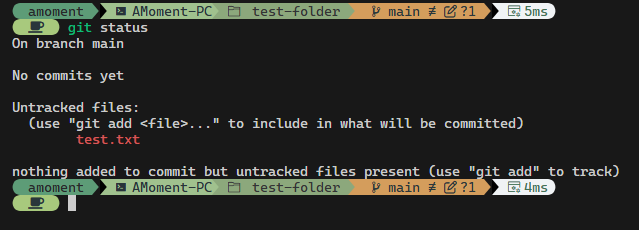
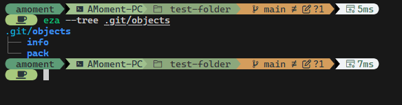
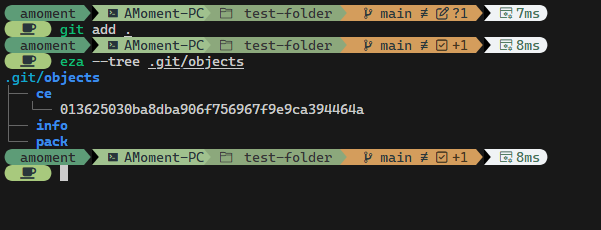
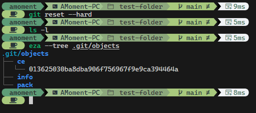

---
categories:
# - Mathematics
- Programming
# - Phase Field
- Others
tags:
- Git
- Shell
- Experience
title: 记拯救用 git-reset 误删的某代码仓库
description: 不要用不了解的命令行，and RTFM
date: 2025-12-28T00:13:03+08:00
image: 迷迭香.png
imageObjectPosition: "center 10%"
math: true
hidden: false
comments: true
draft: false
---

*某个笨蛋错误地使用了 `git reset --hard` 命令，这是他发生的变化。*

*头图是可爱的迷迭香！是由 Pixiv 的 [赌上厨师生涯的拼好饭](https://www.pixiv.net/users/38336697) 创作的，这里有[原图链接](https://www.pixiv.net/artworks/138994056)。选曲为最近听的很多的一首东方同人曲：来自 [凋叶棕](http://www.rd-sounds.com/) 的专辑 **望** 的第一首歌，**encourager**，曲调积极向上，阳光活泼，我说专辑封面金发的孩子真可爱，你能反驳吗！？*



## 引子

美妙而快乐的周五，应师兄的提议，我决定将自己用 AI 写出来的深度学习代码放在 Github 上的仓库里。Everything works great! 我的代码跑出来的结果看着海星，放在 Github 上和师兄们分享一下也挺好（就是不太能入米娜桑的法眼了，嘿嘿）。二话不说，先创建个 Git 仓库先，一会儿 Push 到远程就好了，Easy ~ 

首先，自然是让 Git 接手这个仓库咯：

```bash
git init .
```

在我条件反射地写下：

```bash
git add .; git commit -m "
```

的时候，我突然意识到，这个项目之前是瞎搞的，搞成了就行，工作目录里乱七八糟的，还没有 README，这不得整理一下？于是我就把后面的 commit 部分删掉：

```bash
git add .
```

先把文件放进暂存区吧。但是好像加进去了很多没用且特别大的数据文件！？一看 VS Code 侧边栏的 Git 小蓝点，哇，200 多个文件，肯定不对。写个 `.gitignore` 文件，把 `data` 文件夹的内容忽略掉好了。接下来应该写个 README.md 来介绍一下这个项目在干嘛，怎么准备项目依赖，顺带抽空了解了一下 `conda` 怎么像 `pip` 那样 `freeze`：

```bash
conda list --export > requirements.txt
```

就行了。

写好这些东西之后，再看一眼 Git 的小蓝点：怎么没啥大变化…… 对了！我记得要让 `git` 停止追踪某些文件，可以用 `git reset --hard` 来着？那么：

```bash
git reset --hard
```

……

噩梦开始了。

## woc，救一下呀，Git！

看向我的目录，里面只剩下了几个在我 `git init .` 之后创建的文件，而在初始化 `git` 仓库之前的内容全都不见了。我突然意识到，`git reset --hard` 貌似不是撤回，而是将仓库状态重置到上一个提交，而我这个仓库从来没有提交过，结果就是我的仓库之前的内容都不见了。此时我也没有什么心思去搞清楚 `git reset` 究竟会干嘛了，我的目标此时只有一个：把我亲爱的文件找回来。那可是我让 AI 给我写了两周的心血呀！

我的第一反应是用我曾经了解过的极为强大的 `git reflog`，印象中它会记录我在 Git 中做的所有操作。而使用 `git reflog` 之后我得到的结果是：

```bash
fatal: your current branch 'main' does not have any commits yet
```

太坏了。必须得有提交记录才行，天哪…… 

此时我又想到，这是在 WSL 里，也许我可以在回收站找到…… 想了一下，结果我都把自己逗笑了，这是 WSL，是 Linux 呀，有自己的独立虚拟磁盘 `ext4.vhdx`，而在这个环境下，Git 删除文件就是像自己用 `rm` 删除文件那样，没有回收站可以回收的。

这下烂完了…… 我好像和 Git 一起干了波大的……

## 怎么办，要恢复整块硬盘吗……

2025 年了，遇到问题应该学会问 AI 了。我直接提问 AI，遇到这么个情况要怎么搞，他也是没含糊，好在我用的是 WSL，vhdx 硬盘文件可以直接备份一份，他让我找到硬盘文件并复制一份出来到别的位置。然而接下来的操作我傻眼了，需要用磁盘恢复程序什么的，而且我需要用别的环境挂载这个磁盘文件，然后安装一些软件包并尝试从磁盘里找出来还没被覆盖掉的那些数据。

为什么能用磁盘恢复工具尝试找回这些文件呢？不是说 Linux 里删除就等于彻底删掉文件吗？其实 “彻底删掉” 的说法是不准确的，实际上的删除行为一般并不会抹掉数据，而是把数据从文件系统中断开连接。或者说，当我们在文件系统中删除某个文件的时候，文件系统不会抹掉这些文件存储区域的数据，而是单纯地不再保护这块存储区域，以后谁需要这块存储空间的时候会直接分配给别人。莫名想到 *死亡不是人生的结束，遗忘才是*，在文件系统里就是 *删除不是文件的结束，覆盖才是*。

因此，只要我还没犯蠢再向文件系统中写入数据，这块位置就应该还没被覆盖掉，而我就还有机会把这些数据救回来：让文件系统重新链接并保护这块位置。然而这操作谈何容易，我对文件系统的了解也仅限于此（说不定理解还有问题，大佬轻喷呜呜呜），一想到美妙的周五下午就要被恢复数据占满毁掉，而恢复的东西里最重要的其实只有不到一成（毕竟丢失的大部分都是计算数据，是复制来 WSL 里的，重要的是代码），而且还都是 AI 写的……

一想到这里，我就放弃了直接恢复整块硬盘的想法。和 AI 又聊了一下，说是让我从编辑器下手看看能恢复出来些什么东西不，我试了下也没啥用…… 难到就这样摆烂，想办法再让 AI 写一份代码吗？

此时我想到，为什么不 Google 一下呢？（好吧其实是 DuckDuckGo，对不起 DuckDuckGo 真的很好用，再见 Google）我就搜 `git reset --recover recover`，结果就遇到了一篇伟大的 Stack Overflow 帖子：

## 还得是 Stack Overflow

搜索结果第一个，[这篇 Stack Overflow 帖子](https://stackoverflow.com/questions/5788037/recover-from-losing-uncommitted-changes-by-git-reset-hard) 的提问很直接，高赞回答和我想得一样，有提交历史的情况下可以 `git reflog show` 来救一下自己，有趣的是这个回答没有被选为题主认可的回答，反倒是第二个回答，赞数稍低一些些，却被题主选为了最佳回答。这个最初在 2011 年发布的回答讲到：

> Previously staged changes (`git add`) should be recoverable from index objects, so if you did, use `git fsck --lost-found` to locate the objects related to it. (This writes the objects to the `.git/lost-found/` directory; from there you can use `git show <filename>` to see the contents of each file.)

诶！我好像确实 `git add .` 过！想到这里，我立刻采用了这个方法，结果的确如我想的那样，在 `.git/lost-found/others` 这个文件夹里我找到了我丢掉的所有文件。只不过所有的文件名都是乱码，而且绝大部分都是 XML 格式的数据文件，想找到最关键的文件得话好长时间，而 `git show <filename>` 结果也没有效果。不过不管怎么说，我都成功找回来这些内容了，着实是让我松了一口气，大不了把这些文件一个个地全都打开嘛。

不过，有了如此进展，为何不再向 AI 问问怎么解决这个问题？

## AI 还是挺有用的，其实

AI 闻言，先是狠狠地恭喜一波，然后就给我指了条明路：`file` 命令可以检查文件类型，告诉我这些文件内容是什么。甚好！就地让 AI 写个 Bash 脚本， ，很快就把文件分类放在了不同的文件夹里。有趣的是，我顺带还发现，其实 Jupyter Notebook 用的 `ipynb` 文件是伪装的 Json 文件，而亲爱的 VS Code 在发现文件是 Json 文件，后缀是 `ipynb` 之后就会直接帮你渲染出来（甚至在 VS Code 里创建一个 `ipynb` 文件之后就会自动写上一些文件头并渲染好）。谢谢你，VS Code！

找到最重要的 `ipynb` 文件和 Python 脚本之后，剩下的文件其实就可以删除掉了。我也算是成功地渡过了这次危机。感谢 Stack Overflow，感谢 AI，感谢 VS Code，感谢所有，我活过来了。

## 所以，`git-reset` 究竟会干嘛？

要想回答这个问题，最好的办法就是 **RTFM**，即 *Read The Friendly Manual*。如果是没有内置 `man` 这样的文档阅读器的情况，或者在 Windows 下输入 `git reset --help`，我们就会打开 `git-reset` 的帮助文档 （没错 `man` 其实是轻量的 HTML 阅读器）。

通过阅读（~~不那么友好，有点晦涩的~~ 其实挺友好的 ）文档，可以了解到 `git reset` 就是设计好的，通过 *重置* 来实现 *撤销* 一些操作的一个命令。前面 `SYNOPSIS` 和 `DESCRIPTION` 部分说实在的有一点难懂，但是我们可以直接看 `EXAMPLES` 部分，详细地写了一些情况下使用 `git reset` 的实际案例。说实话，每个案例里的命令最后会有一些说明文字，像是读个小故事或者看主角内心历程，还挺有意思的。具体有些什么这里就不啰嗦了，内容其实相当多，感兴趣可以自己找来慢慢看。

那么，`git reset --hard` 会做什么呢？答案是会彻底撤销到某个提交。当我们在后面填上提交的位置（用 `HEAD` 相对位置或者用 `commit-hash` 均可）时，我们会直接跳回这个提交并且 **彻底删除** 这个提交之后的修改。而如果我们不填提交位置，那就是默认 `HEAD`，会重置 Git 的头指针。被 Git 跟踪索引的文件的 *变更* 会被抛弃，而未被索引的文件则会直接被删掉。

这样就能解释我的仓库里发生了什么。由于我在 `git init .` 之后 *创建* 了一些文件，它们会被直接索引，但又由于它们是新建的文件，不属于 *变更*，所以不会被删除而是原样留下；而在 `git init .` 之前的文件，由于还没来得及被 Git 跟踪索引，于是就被 `git reset --hard` 无情地删除了。原话是：

> Any untracked files or directories in the way of writing any tracked files are simply deleted.

谢谢你，Git。以后再也不瞎用 `git reset` 了。

## `git-add` 又做了什么？`git-fsck` 是什么？

那么我为什么又能救回来我的文件们呢？原因在于 `git add` 的工作方式。在我们 `git add` 之后，被添加到暂存区的文件会被放在 `.git/objects` 文件夹里。我们来做个小实验，使用下面的代码：

```bash
mkdir test-folder
cd test-folder
echo hello > test.txt
git init .
```

这样我们就创建了一个新文件夹，写了一个新文件，并且在有文件的情况下执行了 `git init .` 初始化了这个仓库。我们用 `git status` 看看：



我们再看看 `.git/object` 文件夹：



里面空空如也。我们执行下面的 Git 命令：

```bash
git add .
eza --tree .git/objects
# if you don't have eza:
# tree .git/objects
```



怎么确定他就是我们要的文件呢？Git 提供了它用来哈希的命令，我们执行 `git hash-object ./test.txt`，得到的结果是：

```bash
ce013625030ba8dba906f756967f9e9ca394464a
```

结果很有趣：Git 把哈希值的前两位取出来作为文件夹的名字，后面则作为文件的名称。

此时我们复刻我干过的好事，然后再看看 `.git/objects` 这个文件夹：

```bash
git reset --hard
ls -l
eza --tree .git/objects
```



结果很神奇！工作目录里的文件确实被删除掉了，而 `.git/objects` 里的内容并没有被删掉。多亏了 `git add .` 这个命令，把结果暂存了下来。此时我们尝试 `git fsck --lost-found`：

```bash
git fsck --lost-found
eza --tree .git/lost-found
cat .git/lost-found/other/ce013625030ba8dba906f756967f9e9ca394464a
```


所以其实 `git fsck --lost-found` 大概就是把 `git add` 过的文件从 `.git/objects` 里找回来。那么 `git fsck` 是什么呢？查阅手册，我们看到：

>  git-fsck - Verifies the connectivity and validity of the objects in the database
>
> `--lost-found`
> 
>  <p style="text-indent: 50px"> Write dangling objects into `.git/lost-found/commit/` or `.git/lost-found/other/`, depending on type. If the object is a blob, the contents are written into the file, rather than its object name.

That's it! *fsck* 应该是 *filesystem check* 的缩写，而 `--lost-found` 也如预料的一样，将 *悬垂* 的对象恢复到这两个文件夹里。

## 总结

这次真的出了一身冷汗，还好习惯性地 `git add .` 了一次，不然真的是神仙难救呀。我可不想把美妙的周五时光全都放在文件系统恢复上。当然，最大的教训还是：不要随意用自己了解不充分的命令，特别是这种会对自己文件系统形成半不可逆更改的操作。我自认为对 Git 有点熟悉了，现在看来，根本就是太过自大，属于是半瓶子水晃荡，最后搬石头砸自己的脚了。还得好好学一下呀！

不过，毫不谦虚地讲，这次经历我还是有做的好的地方的。起码没有彻底慌乱掉然后干出更加迷惑的操作，比如关机重启彻底删除这样失了智的行为。之前有一次好像也是东西丢了找不到，一时慌乱结果彻底找不回来了。还好那次的文件不算重要，丢了也就丢了。看来这次也算吸取了上次的一点教训，不要手忙脚乱，左右脑互搏。

另外就是，DuckDuckGo 真的很好，Stack Overflow 真的很好，没有搜索引擎和这个伟大的论坛，我半个月的心血说不定真的就泡汤了（即便是让 AI 给我干苦力（））

希望这次经历能帮到遇到了类似问题的你，或者给你也敲响一次警钟。那么，感谢你读到这里，祝你身心愉快，工作顺利，不出乌龙~