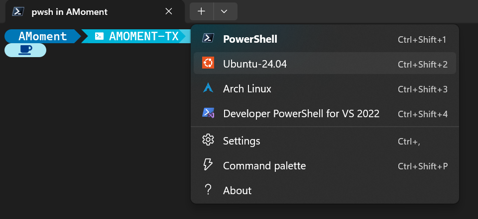
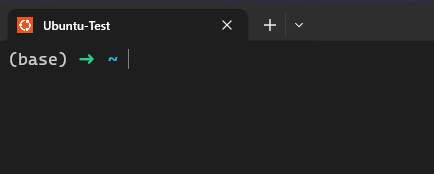

---
categories:
# - Mathematics
- Programming
# - Phase Field
# - Others
tags:
- CUDA
- WSL
- Linux
- Shell
- Python
title: 工作用 Ubuntu WSL 配置记录
description: 怎么快速配置一个能用的 WSL Ubuntu（以及几个包）
date: 2025-11-29T14:28:17+08:00
image: 
math: true
hidden: false
comments: true
draft: true
---

## 前情提要

参加完刚刚在西安举办的材料基因工程大会之后，某人深受触动：

> 机器学习真是好东西！我必须立刻启动！

于是他决定在自己的电脑上配置一些做机器学习要用的环境。然而他有一些洁癖…… 不希望因为工作用的环境影响自己的日常使用，于是他决定不在心爱的 Arch Linux 中安装这些环境，而是自己新安装一个 Ubuntu 的 WSL，后续的内容都在 WSL 里完成。

刚刚他算是配好了，我整理了一下他安装的过程以及中间踩的坑，记录在这里，希望能帮到需要的人~

（为了方便起见，后面还是用第一人称吧）

## 环境状态 & 目标

下面的表格汇总了我目前的环境状态：

|   项目   |         状态         |
| :------: | :------------------: |
|    OS    |    Windows 11 Pro    |
|   GPU    |   RTX 5060 Laptop    |
| Terminal |   Windows Terminal   |
|  Shell   |     Powershell 7     |
|   WSL    | Arch Linux（不使用） |
|   硬盘   |       只有C盘        |

即便微软罪大恶极，经过一些调教之后，Win11 还是变得能用了起来；Windows Terminal 真的很好用，推荐每个人玩了命地用（）；很难想象不用美丽优雅 **兼容部分 GNU/Linux 命令** 的 Powershell 7（`pwsh`）的样子；我们默认打开科学上网且开启虚拟网卡模式，免得 Shell 笨笨地不走代理。

我们的目标？自然是搞一个 Ubuntu 的 WSL，再在里面装上 Anaconda 以及 CUDA ，最后创建一个 conda 虚拟环境，在虚拟环境里装上测试用的 PyTorch。

那我们开始吧~

## 安装/配置 Ubuntu WSL

Ubuntu 在某种角度，已经成为了 Linux（GNU/Linux）的代名词了：市占率广，知名度高，还算简单易用，基于 Debian 的特性让它也许也还算稳定。最重要的是，Windows 的 WSL2 使用的默认发行版就是 Ubuntu，而也许也正因如此，CUDA 关于 WSL 的支持是默认用户用的是 Ubuntu。

说实在的，我不是很想在我已经有了一个配置地很不错的 Arch WSL 的前提下再大费周章地搞一个 Ubuntu WSL 来专门跑机器学习，而且 Arch Linux 实际上是有打包好的 CUDA 包的，可以用 `pacman` 方便地下载下来。然而考虑到我不希望复杂（冗杂）的 Anaconda 污染我的电脑，也不希望后面在跑程序的过程中因为 Arch 和 CUDA 之间的问题而反复调试，所以干脆就再开一个 Ubuntu 好了。

### 安装 Ubuntu WSL

安装的过程还算简单，因为之前我的电脑已经有了 Arch WSL 了，安装 Ubuntu WSL 也不用等太久的 WSL 初始化过程。使用的命令也算简单：

```pwsh
wsl --install
```

没错，一行就可以了，而且甚至不用指明是哪个发行版（没错，因为默认）。当然，想要查询有哪些 WSL 上可用的 Linux 发行版，可以

```pwsh
wsl -l -o
# 其实就是 wsl --list --online
```

然而我这里没有默认安装，本着能装新的就装新的原则，我选择安装了 Ubuntu 24.04 版本：

```pwsh
wsl --install Ubuntu-24.04
```

中间需要设置用户名和管理员密码，用户名**只能是小写**，而且 **输入密码时你看不见输入的内容**，最重要的是 **请保管好你的管理员密码**，不然就只能卸掉重装咯，那样就很亏了。不过行文至此，怎么卸载安装好的 WSL 发行版呢？很简单：

```pwsh
wsl --unregister Ubuntu-24.04
```

这行命令就会删掉你的 Ubuntu-24.04 发行版了。顺带，查询电脑上装了什么 WSL 的方式也很简单：

```pwsh
wsl --list --verbose
# wsl -l -v
```

这个命令不止会列出已经安装的 WSL，还会显示它们的状态。想要彻底关闭运行中的 WSL（而不是简单地关掉 Shell），可以 

```pwsh
wsl --shutdown
```

（这个会关掉 WSL，也就是所有运行中的发行版都会被关掉）

有点啰嗦了，不过这么几个简单的命令就能操作 WSL 的安装、卸载、查询之类的了。

### 配置新到手的 Ubuntu WSL

刚到手的新系统，怎么能不先设置一下呢？工欲善其事，必先利其器嘛。我装了这些东西：

- `zsh`: 替代 `bash`
- `fd`: 替代 `find`
- `rg`: 替代 `grep`
- `eza`: 替代 `ls`
- `bat`: 替代 `cat`
- `nvim`
- `cmake`
- `build-essential`
- `git`
- `gdb`
- `tldr`: 方便快速了解命令用法

然后给 ZSH 装一些插件，插件管理选择了经典的 `oh-my-zsh`，一款基于 `git clone` 仓库到对应文件夹下的插件管理器（）安装的插件有：

- `zsh-autosuggestions`: 让你的 ZSH 拥有 FISH 那样的补全（既然如此，为什么不直接用 FISH 呢？别问……）；
- `zsh-syntax-highlighting`: 给正确/错误/特殊命令以多样的颜色，很方便，就像 FISH 那样（既然如此……）；
- `zsh-completions`: 让你的 ZSH 补全更聪明；
- `conda-zsh-completion`: 给你的 ZSH 加上 conda 命令的补全
- `zsh-vi-mode`: 按下 ESC，使用 vi mode 来编辑你的命令行！偶尔会用到，但是要注意光标形状……

我们给出用到的命令：

```bash
# Upgrade the source first
sudo apt update && sudo apt upgrade
# fd has package name fd-find; rg has package name ripgrep; nvim has package name neovim;
# tealdeer for tldr
sudo apt install zsh fd-find ripgrep eza bat neovim cmake build-essential git gdb tealdeer
# download oh-my-zsh, install and use it
sh -c "$(curl -fsSL https://raw.githubusercontent.com/ohmyzsh/ohmyzsh/master/tools/install.sh)" 
# several zsh plugins
git clone https://github.com/zsh-users/zsh-autosuggestions ${ZSH_CUSTOM:-~/.oh-my-zsh/custom}/plugins/zsh-autosuggestions
git clone https://github.com/zsh-users/zsh-syntax-highlighting.git ${ZSH_CUSTOM:-~/.oh-my-zsh/custom}/plugins/zsh-syntax-highlighting
git clone https://github.com/zsh-users/zsh-completions.git ${ZSH_CUSTOM:-${ZSH:-~/.oh-my-zsh}/custom}/plugins/zsh-completions
git clone https://github.com/conda-incubator/conda-zsh-completion ${ZSH_CUSTOM:=~/.oh-my-zsh/custom}/plugins/conda-zsh-completion
git clone https://github.com/jeffreytse/zsh-vi-mode $ZSH_CUSTOM/plugins/zsh-vi-mode
# Config for tldr, update the cache
tldr --update
```

上面的命令可以复制下来贴在 Shell 里，过程中需要输入几次刚刚设置的密码或者回车确认一些东西，安装好 `oh-my-zsh` 之后会让你的 Shell 变成 `zsh`，请输入 `exit` 命令来退出当前的 `zsh` 以便继续安装下面的插件）。

接着把之前我一直在用的 `.zshrc` 配置也同步到 Ubuntu WSL 里：

```zsh
# $HOME/.zshrc
export ZSH="$HOME/.oh-my-zsh"

ZSH_THEME="robbyrussell"

# Use zsh-completions plugin
fpath+=${ZSH_CUSTOM:-${ZSH:-~/.oh-my-zsh}/custom}/plugins/zsh-completions/src
autoload -U compinit && compinit

# Update when available
zstyle ':omz:update' mode reminder 

plugins=(
	git
	colored-man-pages
	zsh-vi-mode
	zsh-autosuggestions
	zsh-syntax-highlighting
	conda-zsh-completion
)

source "$ZSH/oh-my-zsh.sh"

# Source everything in the custom env folder
if [ -d $ZSH_CUSTOM/env ]; then
    for f in $ZSH_CUSTOM/env/*; do
        source $f
    done
fi

# Set ~win as the windows user home folder
hash -d win=/mnt/c/Users/AMoment
# Disable pipe override (>)
set -o noclobber

```

这里的 `.zshrc` 文件是删掉了很多没用到的注释的。这些注释实际上是 `oh-my-zsh` 自动提供的，为的是方便用户自己调整，如果你有需要的话请只修改和添加上面的内容到特定的行就可以了。注意要保持顺序，特别是 `zsh-completion` 是特别要求要保持顺序的。

最底下的两个小段是我自己常用的一些配置。第一段是我把所有和环境相关的内容都会以 `程序名.zsh` 脚本的形式放在 `$ZSH_CUSTOM/env` 这个文件夹里，这里就依次 `source` 应用一遍。第二段里第一行是方便去 Windows 宿主机下的家目录（没错我的家目录在这里），这样 `~win` 就会被解析为这个路径，还是有点方便的；第二行是关掉了向有内容的文件里使用 `>` 重定向的操作，避免犯傻。

最后就是添加几个好用的别名，我们可以直接写在 `$ZSH_CUSTOM/aliases.zsh` 这个文件里，我用到的是这些：

```zsh
alias ls="eza --icons=auto"
alias ll="eza -lh --icons=auto"
alias la="eza -A --icons=auto"
alias la="eza -lAh --icons=auto"
alias vim="nvim"
alias fd="fdfind"
alias bat="batcat"
```

修改好之后使用 `exec zsh` 来应用这些改动，就完成啦。不过 Windows 宿主机上还可以做一点简单改动。

### Windows 宿主机的简单配置

由于我使用的是 Windows Terminal，在安装好 Ubuntu WSL 之后关掉 Windows Terminal 再打开，Profiles 里面就出现刚刚设置好的 Ubuntu WSL 了：



可能你的 Windows Terminal 里有很多别的选项，或者默认的 Shell 等不是 PowerShell，没关系，我们可以进入设置修改。比如让 PowerShell 成为默认 profile[^1]，把常用的 profile 顺序提前等等。

这里主要想聊一下下面这些设置，请注意要记得保存，用的 GUI 的话右下角有保存按钮，使用 JSON 文件的话要保存文件：
- 调整 profile 顺序: 实际上 Windows Terminal 会把所有的 Profile 信息都存在一个 JSON 文件里，可以从设置页面的左下角打开，我们手动改一下需要的 Profile 顺序就可以了；
- 隐藏 profile: 可以直接在 GUI 中修改，有个 Hide profile from dropdown，或者在 JSON 文件中找到对应的 profile，添加 `"hidden": true` 即可；
- 如果你不希望在运行程序时 Shell 的标签页变成在执行程序的名字，请在底下的 Terminal Emulation 中选择 Suppress title changes。这样就可以一直显示 profile 的名称。在安装了若干个同类 profile（比如两个 Ubuntu）的时候会很好用。

大概就是这么些内容，实际上 Windows Terminal 的默认配置已经很不错了，上手只需要简单设置一点点东西就很好用了。这也是我喜欢它的原因。微软，你做得好口牙（赞赏）。

--- 

那么到此，就配好了一个（我个人觉得）很好用的一个操作环境。接下来要做的自然就是进行安装了。虽然 CUDA 和 Anaconda 安装顺序也没那么严格，我们这里还是先装 Anaconda。

## Anaconda

在正式安装之前，我觉得还是可以：

### Anaconda 的简单介绍

所以，Anaconda 是什么？它是 Python 吗？Python 是什么？我已经有 Python 之后还需要装 Anaconda 吗？如果你了解这些概念，请直接跳过吧（）

我们先来说说 Python 和包管理。Python 作为一门比较现代的语言，它使用解释器实现逐行的代码运行，且通过包管理器来管理代码中使用到的模块、库之类的东西。然而 Python 其本身只是一个语言，我们常说的 “下载 Python” 实际上是下载了包含 Python 的解释器、包管理器以及运行环境的一个发行版。我们从 [官网](https://www.python.org) 下载到的 Python 安装包实际上包括了使用 C 语言实现的 CPython 解释器，从 PyPI，即 Python Package Index 来下载安装对应的包的包管理器 `pip`，以及它们的运行所需的环境（如果你勾选了 IDLE 的选项，你还会安装一个小小的 Python IDE）。我们称这样下载到的是 Python 官方发行版。

除了 Python 官方的发行版外，由于 CPython 采用的开源协议，它允许任何人自由地打包并发行自己基于 CPython 的 Python 发行版，实际上也确实有很多不同的基于 CPython 的发行版。其中一个非常出名的发行版即为本次的主角，Anaconda。Anaconda 的 Python 发行版包含了由自己打包的 CPython 解释器，不同于 `pip` 的另一款包管理器 `conda`，以及由 Anaconda 提供的，预包含了许多科学计算、数据统计库的运行环境。

Anaconda 的特点在于 `conda` 这款包管理器，它可以选择对应的频道（channel）来安装不同来源的库，且更重要的是，它的库不局限于 Python 使用：它不仅管理 Python 使用的库，还会管理这些库所需要的可能的其他语言的库，进行必要的依赖求解。另外它还集成了虚拟环境管理，不似 Python 官方提供的 venv 这个环境管理工具，这让 `conda` 成为了一个 All In One 的管理工具。当然，它还直接地提供了一些做科学计算时常需要的库，如 Numpy, Matplotlib，Pandas 等。如果你只是想享受最纯粹的 `conda`，可以考虑安装 Miniconda，不过因为我们就是要做机器学习，所以干脆安装 Anaconda 就挺好的。

所以，为什么我们需要 Anaconda？做机器学习没有说必须要用 Anaconda 呀？而且大部分 Python 包都会优先考虑使用 PyPI 分发，而不会先考虑 Anaconda 的包源。使用 Anaconda 的主要原因，除了我看的教程是用的 Anaconda 管理环境之外，还有很重要的一点就是 `conda` 管理的不只是包，还有包自身的依赖，以及能直接管理环境。这解决了一个很棘手的问题：依赖地狱。假如你要的包 A 和包 B 都依赖同一个库 C，而 A 要求用老版本的 C 库，B 要求用更新版本的 C 库，而你的电脑已经安装了老 C 库，这时候要怎么办？把这个老 C 库卸载，重装一个新的吗？`conda` 提供了一个优雅的方法：虚拟出一个环境，在这个环境中重新安装相容的 A, B 和 C。更重要的是，这个环境不会影响到其他的环境，不用担心装上什么软件之后会毁掉整个电脑上的库。事实上，在机器学习这个较新的，正在发展的领域，机器学习用到的库很有可能发生奇怪的依赖问题。而使用 `conda` 就能更方便地解决这类问题。

听我啰嗦了这么多，是时候开始安装了。

### 安装 Anaconda

其实安装它还是比较简单的。只需要获取到安装脚本，然后运行就好了。我们使用命令：

```zsh
wget https://repo.anaconda.com/archive/Anaconda3-2025.06-1-Linux-x86_64.sh
```

就可以把它的安装脚本下载下来。说实在的这个脚本挺大的：它有 1G 的大小，因为脚本之外应该还集成了一些压缩包。下载好之后我们可以使用 `sha256sum` 来检查下载到的文件是否完整：

```zsh
echo 82976426a2c91fe1453281def386f9ebebd8fdb45dc6c970b54cfef4e9120857 ./Anaconda3-2025.06-1-Linux-x86_64.sh | sha256sum --check
```

一般来讲都没什么问题，会显示 `./Anaconda3-2025.06-1-Linux-x86_64.sh: OK`，此时我们就可以执行安装，即运行这个脚本了。但是此时这个脚本还不能直接执行，因为这个文件的所有执行权限都默认关闭了。我们使用 `chmod +x` 来给这个命令以执行权限并执行：

```zsh
chmod +x ./Anaconda3-2025.06-1-Linux-x86_64.sh
./Anaconda3-2025.06-1-Linux-x86_64.sh
```

这样就进入安装流程了，首先要先同意它们的协议，我们回车，它会讲我们得同意协议条款，此时我们得明确打出 `yes` 并回车，否则：


接下来就是安装位置，默认是安装在家目录的 `anaconda3` 这个位置，我们可以选择接受这个位置，或者手打换一个位置安装，这里就直接默认了。然后就是一阵强力的安装，就进入了最后的环节，是否要将 `conda` 添加进 Shell 的配置中，每次进入 Shell 就自动启动 `conda`。默认是 `no`，我们接受默认，待会儿我们手动添加相关内容。

这样就完成安装了。不过因为没有在 Shell 中初始化 `conda`，我们需要先执行初始化。我们安装好的 `conda` 位于 `~/anaconda3/bin/conda`，因此我们可以使用命令：

```zsh
$HOME/anaconda3/bin/conda init zsh
```
它会更改 `.zshrc` 的内容，在最后添上一段：

```zsh
# >>> conda initialize >>>
# !! Contents within this block are managed by 'conda init' !!
__conda_setup="$('/home/amoment/anaconda3/bin/conda' 'shell.zsh' 'hook' 2> /dev/null)"
if [ $? -eq 0 ]; then
    eval "$__conda_setup"
else
    if [ -f "/home/amoment/anaconda3/etc/profile.d/conda.sh" ]; then
        . "/home/amoment/anaconda3/etc/profile.d/conda.sh"
    else
        export PATH="/home/amoment/anaconda3/bin:$PATH"
    fi
fi
unset __conda_setup
# <<< conda initialize <<<
```

其实就是将 `conda` 加入环境变量 `$PATH` 中。我们可选地将这部分挪到我们留出来的 `$ZSH_CUSTOM/env` 中：

```zsh
mkdir $ZSH_CUSTOM/env
vim $ZSH_CUSTOM/env/conda_env.zsh
```

然后把刚刚的内容贴进去，然后重启 Shell，就好啦。你应该能看到 Shell 的显示中，左侧有一个 `(base)` 的字样，这样就说明我们已经成功启动 `conda` 的 `base` 环境了。



--- 

我们先不介绍 Anaconda 的具体操作，因为对我们而言，我们还没有完全完成环境配置。接下来要配置的则是所谓的 CUDA。

## CUDA

CUDA 是 Nvidia 推出的 GPU 计算框架，是 Compute Unified Device Architecture 的缩写，即 *计算统一设备架构* （神秘机翻）。这里的 Device 主要指的就是 Nvidia 家的各系显卡了。由于进行机器学习需要对大量（存疑）的数据进行计算，而计算需求也没有特别复杂（相较于 CPU 更适合执行复杂计算任务），使用显卡这样处理图像的设备进行加速计算几乎成了刚需。

虽然说 Nvidia 家的显卡对 Linux 的支持也许没有 Windows 端那么好（F**k you Nvidia！），但是毕竟做计算这行 Linux 还是主力，微软与 Nvidia 也很识相的给普通开发者一个很不错的选项：使用 WSL 来借助 Windows 的显卡驱动进行 CUDA 开发，且有专门适配 WSL 的包与文档供下载使用，所以我们干脆就这么做，使用支持情况最好的 Ubuntu 来进行相应的开发。

### 安装 CUDA

在开始之前，我们最好先确认我们的设备可以使用 CUDA。

[^1]: 实在是不知道怎么翻译这个词比较好…… 