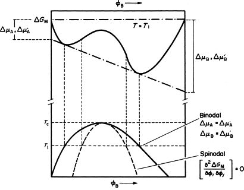

---
categories:
- Phase Field
- Programming
tags:
- C++
- Python
- C
- Rust
title: "相场模拟，但是用很多语言 I"
description: 除了 C++ 和 Python，还有什么能跑相场？
# image: star river.png
date: 2026-03-21
math: true
draft: true
---

*目前做相场的大家似乎都在用 C++ 后者 Python 来跑相场，可是程序语言这么多……对吧？Why not？本文（系列）就来整个小活儿，用各种各样的语言来实现某个相场模拟~*

## 缘起：模拟与程序语言

某个阳光明媚的下午，一切都是那么的惬意，亲爱的群友 [開源 lib（](https://ex-tasty.com/) 分享了他的最新选题：在浏览器中做个示波器！而且他也建议我可以把一些东西交互式地搬上浏览器，搬进博客里。

我必须说：非常好提议，但是 HOW？要搬进浏览器，那怕不是要用 Javascript，但是 JS 又要怎么跑相场呢？跑出来的结果又要怎么办呢？一般来讲，相场跑出来的结果都会用 VTS 格式存储为一系列的文件，然后再用 Paraview 来可视化这些结果。那如果在浏览器里的话……想不到什么好办法。

不过，这个点子狠狠地启发了我！虽然浏览器上做这些确实可能有点难，再加上我不太懂 JS/TS（本博客的程序部分 vibe 成分极高），用浏览器跑相场这事儿目前确实是有点难度了；但是，为什么我们总是选择用 C++ 和 Python 来做模拟呢？诚然，对 *性能* 的追求是很现实的需要，但是我们也可以试试用别的程序语言来实现模拟呀？说到底，相场模拟也不过是做一些数值计算嘛。

所以，我们就从笔者最熟悉的 C++ 和 Python 开始，试试用更多的程序语言实现相场模拟吧！

### 相场模拟简介

所以，在实现相场模拟之前，你也许会问：什么是相场？

简单来说，材料中有很多的相，做实验之后能看到材料的相结构，但是如果不用非常非常贵的原位实验手段的话，是很难看到相变进行的过程的。而相场法就是一个通过数值计算来模拟相变过程的计算方法。在模拟中，我们会划定一个小区域，在里面使用 $1$ 代表某个区域完全被某个相占据，$0$ 代表某个区域里完全没有这个相，而 $0$ 到 $1$ 之间的值就说明是在相边界的位置。驱动相场演化的主要因素是这个系统的能量，绝大部分情况都是由两个大块儿组成：体能和界面能。体能负责让相与相从混乱的状态不断分离，让体系完全变成热力学所描述的样子；界面能则起到相反的作用，它会帮助界面的生成，让相与相之间有一个 *扩散* 的界面，或者说让取值在 $0$ 到 $1$ 之间的区域变多一些。合理调配这两种对抗的能量贡献，就能让相场不断演化下去。

而实际的演化过程则是由偏微分方程控制。根据变量的特点，我们会用两大类方程来推进相场演化：当变量是保守的，即这个变量在模拟区域的总量应该是固定不变的的时候，我们就用 Cahn-Hilliard 系列的方程来演化，最经典的就如浓度场；而当变量没有保守条件，我们则会用 Allen-Cahn 系列方程来演化这个场。两个方程都有个最基础的形式，其中 Cahn-Hilliard (CH) 方程为： 
$$
    \frac{\partial c_i}{\partial t} = \nabla \cdot M_{ij} \nabla \frac{\delta F}{\delta c_j \left( r,t \right)};
$$
而 Allen-Cahn (AC) 方程则为：
$$
    \frac{\partial \eta_p}{\partial t} = -L_{pq}\frac{\delta F}{\delta\eta_q\left( r,t \right)}.
$$
两个方程里的 $F$ 是能量泛函，$M$ 和 $L$ 是两个方程的动力系数。

在做相场模拟的时候，在构建好相场理论（能量描述，演化方程）之后，就需要设置求解相关的内容。首先需要对初始结构建模，换句话说也就是初值；然后需要有合适的边界条件来让场正常演化。一切准备就绪之后，就是写程序，模拟并输出结果了。

那么，在这个系列中，我们要模拟什么好呢？要说起相场模拟，最早应该追溯到 Cahn 用它来模拟二元合金的调幅分解了，而这么经典的模拟，模型却意外地简单。在 S. Bulent Biner 所著的 *Programming Phase-Field Modeling* 中，它用到的第一个案例就是二元合金的调幅分解了。这本书中用的程序语言是 Matlab，一个我不太喜欢的语言（因为我不会），不过作为计算参考已经足够了。

### 系列介绍和本文计划

这个系列计划是会把主流编程语言都试一遍，再试试有些非主流的语言和方法，不管笔者到底会不会这门语言。如果会，那就写；如果不会，那就学了再写。本文打算用笔者最熟悉的 C++ 和 Python 开始，再用程序老资历之一 C 和新生代最火的 “编程原神” Rust 来实现一下这两个模拟。代码会贴在每一段的后面，在实现的前面会简单介绍一下这门语言，然后在实现之后给出结果和可能有的评论。后续的文章可能会考虑换一个模拟案例，大概就是仿照 *Programming Phase-Field Modeling* 这本书的案例了。

另外，在实现这些计算的过程中，我们尽可能尝试突出这门语言的特点。这意味着某种语言的实现可能有若干个版本。

## 调幅分解的相场理论

其实在 [相场模拟学习笔记 IV](/posts/PF_Tutorial_4) 里就已经对调幅分解做了些介绍，但是为了内容的完整性，我们还是贴在这里。

### 调幅分解简介

调幅分解是在自由能-成分曲线呈现双势阱状态时会体系可能会发生的一种相变，其主要特点为没有相变的型核过程，且体系具有双势阱型的自由能。它的自由能-成分曲线图和相图如图所示：



根据热力学理论，若一个过程能让体系自由能下降，那么这个过程就很可能会自发进行。当成分位于势阱中间的位置（比较高且在两个曲线拐点以内）时，由于成分小幅度波动会让整个体系自发地发生自由能下降，进而影响周围的区域带动相分离。

### 相场模型

我们自然是采用 CH 方程来演化这个体系，重要的是自由能的构成。为了模仿这样的双势阱，我们用一个很简单的函数来表示这样的自由能曲线：

$$f_{\mathrm{bulk}} = Ac^2(1-c)^2,$$

其中 $A$ 是用来控制曲线高度的参数。而有了体能之后，我们需要有界面能来让体系形成扩散界面。我们使用最经典的梯度能模型：

$$f_{\mathrm{bound}} = \frac{1}{2} \kappa |\nabla c|^2,$$

这样的梯度能只会在某个点处上下左右成分不同的情况下才会有值，且差别越大这个值就越大，从而能成功避免界面太尖锐（左边是 0 右边是 1 这样）。

经过一些（也许）不难的数学推导，我们很快得到我们要解的方程：

$$\frac{\partial c}{\partial t} =  M \nabla^2\left( 2Ac(1-c)(1-2c)-\kappa\nabla^2c\right)$$

### 参数设置

为了计算简单不出错，我们直接用书中的参数。模型参数中，$A = 1.0$，$M = 1.0$，$\kappa = 0.5$。建模方面，取初始浓度为 $c_0 = 0.4$, 并在每个点生成随机的浓度噪声，噪声最大值为 $\delta c = 0.005$。然后考虑离散步长，取 $\Delta t= 0.01$，$\Delta x= 1.0$。模拟域设为 $64\times 64$ 的正方形区域。边界条件设为周期性条件，即左边的点再向左走就取到最右边的值，上下同理。


## C++ 的实现：

C++ 算是笔者做相场时第一个接触的语言了。用 C++ 做相场某种角度上是平衡了使用难度和运行效率的选择，吧？我们就从这个开始吧。

### C++ 的简单介绍

C++ 是斯特劳普 (Bjarne Stroustrup) 教授于 1979 年在贝尔实验室设计开发的高级编程语言。它某种角度上是对 C 语言的扩充和发展，但是也不是完全兼容 C 语言的（漫长的发展历程中二者逐渐分道扬镳了）。C++ 的特点在于引入了 *类* 用来组织和管理数据，且在发展过程中人们发现 C++ 能够支持 *模板元编程* 来让某种处理逻辑能够处理不同的数据类型。相比起 C 语言十分接近硬件的特点，C++ 的工具库更多，也更适合构建复杂的应用程序，如今广泛应用在游戏，高性能计算等领域。不过，经过长时间的发展，C++ 的功能越来越丰富，但是语法也越来越复杂，入门门槛也变得很高。从 C++17 标准开始的所谓 *现代 C++* 与这之前的 C++ 写法风格上有很大的区别，甚至有人会认为这已经是另一门语言了。

这里的实现会用一些现代 C++ 的特性以及很好用的新加入的标准库，比如一些用来生成随机数的，用来管理文件系统的标准库，不过这些代码应该也不会太难懂。笔者的环境是 Windows 10，最合理的选择自然是 MSVC，但是也会尝试保证代码能够正常运行在各个平台。

我们开始吧。

### C++ 实现

首先我们先得有一个网格。我们用 `vector` 来承载我们的整个网格，然后就可以用 `vector.at()` 方法来安全地从容器中取出元素了:

```cpp
vector<vector<float>> con_mesh(64, vector<float>(64, 0.4));
```

通过这行简单的代码我们就能生成一个 $64\times 64$ 的网格了。但是我们的初始浓度需要有一定的噪声，我们使用 `<random>` 库中的 `uniform_real_distribution<>` 模板类来生成从 $-0.005$ 到 $0.005$ 的随机浓度波动：

```cpp
for (auto &row : mesh) {
    for (auto &point : row) {
        point += dist(rd);
    }
}
```

下来自然是考虑实现计算核心的部分了。不涉及网格的这块儿相当简单，而一旦涉及到网格，就稍微麻烦点。我们观察上面的总求解式，总共需要计算两次 Laplacian，而对 Laplacian 的计算则需要在每个点周围的 $3\times 3$ 的网格里计算出中心点的 Laplacian 值。为了能放心大胆地做计算，我们先处理边界数值，然后对中心点做计算即可。由于要有两次 Laplacian 计算，而且边界条件都是周期性的，因此我们干脆直接把带有边界条件的网格遍历过程打包成一个函数：

```cpp
vector<vector<float>> mesh_periodic(
    vector<vector<float>> mesh, int Nx, int Ny, float dx,
    std::function<float(float, float, float, float, float, float)> kernel_func) {

    float v_l, v_r, v_u, v_d, v_c;
    vector<vector<float>> next_mesh(Nx, vector<float>(Ny));
    for (int i = 0; i < Nx; i++) {
        for (int j = 0; j < Nx; j++) {

            v_c = mesh.at(j).at(i);
            // x-minus
            if (i == 0) {
                v_l = mesh.at(j).at(Nx - 1);
            } else {
                v_l = mesh.at(j).at(i - 1);
            }
            // x-plus
            if (i == Nx - 1) {
                v_r = mesh.at(j).at(0);
            } else {
                v_l = mesh.at(j).at(i + 1);
            }
            // y-minus
            if (j == 0) {
                v_d = mesh.at(Ny - 1).at(i);
            } else {
                v_l = mesh.at(j - 1).at(i);
            }
            // y-plus
            if (j == 0) {
                v_u = mesh.at(0).at(i);
            } else {
                v_l = mesh.at(j + 1).at(i);
            }

            next_mesh.at(i).at(j) = kernel_func(v_l, v_r, v_u, v_d, v_c, dx);
        }
    }
    return next_mesh;
}
```

而我们要具体计算的内容，也就是上面 `kernel_func` 的内容，进一步地有两个部分。第一部分自然是体自由能泛函对浓度的变分（也就是体自由能密度对浓度的偏微分）：

```cpp
float df_bulk_dc(float con){
    return 2*con*(1-con)*(1-2*con);
}
```

而另一部分自然就是 $\kappa \nabla^2 c$，我们把其中的求拉普拉斯的部分提取出来:

```cpp
float laplacian(float c_l, float c_r, float c_u, float c_d, float c_c, float dx){
    return (c_l + c_r + c_u + c_d - 4 * c_c) / (dx * dx)
}
```

最后我们做一下组合，在稍后使用函数的时候通过吧 `laplacian` 和 `df_bulk_dc` 等通过合适的组合后放入上面 `mesh_periodic` 函数中的 `kernel_func` 里，就可以自动进行计算了。这里我们用一下 Lambda 表达式来组成匿名的临时函数：

```cpp
vector<vector<float>> df_dc = mesh_periodic(
    con_mesh, Nx, Ny, dx,
    [&](v_1, v_2, v_3, v_4, v_5, v_6) {
        df_bulk_dc(v_1) - kappa *laplacian(v_1, v_2, v_3, v_4, v_5, v_6)
    });
vector<vector<float>> dc = mesh_periodic(
    df_dc, Nx, Ny, dx,
    laplacian);
```

这样我们就得到了浓度对时间的导数了。最后一步就是更新浓度场：

```cpp
for (int i = 0; i < Nx; i++) {
    for (int j = 0; j < Ny; j++) {
        con_mesh.at(j).at(i) += dt * dc.at(j).at(i);
    }
}
```

这样，我们就实现了一个时间步内的演化。而为了不断向后演化，我们把整个过程用一个时间循环包起来就可以了。随后我们需要设计函数来将结果输出出来。这里我们借助 Paraview 的 `VTK` 文件格式来保存我们的数据点。这里我们不再赘述，直接把代码给出来。

```cpp
#include <filesystem>
#include <string>

using std::string;
namespace fd = std::filesystem;

void write_vtk(vector<vector<float>> mesh, string file_path, int time_step, float dx) {
    fs::create_directory(file_path);
    fs::path f_name{"step_" + std::to_string(time_step) + ".vtk"};
    f_name = file_path / f_name;

    std::ofstream ofs{f_name};
    int Nx{mesh.size()}, Ny{mesh.at(0).size()};

    ofs << "# vtk DataFile Version 3.0\n";
    ofs << f_name.string() << std::endl;
    ofs << "ASCII\n";
    ofs << "DATASET STRUCTURED_GRID\n";

    ofs << "DIMENSIONS " << Nx << " " << Ny << " " << 1 << "\n";
    ofs << "POINTS " << Nx * Ny * 1 << " float\n";

    for (int i = 0; i < Nx; i++) {
        for (int j = 0; j < Ny; j++) {
            ofs << (float)i * dx << " " << (float)j * dx << " " << 1 << std::endl;
        }
    }
    ofs << "POINT_DATA " << Nx * Ny * 1 << std::endl;

    ofs << "SCALARS " << "CON " << "float 1\n";
    ofs << "LOOKUP_TABLE default\n";
    for (int i = 0; i < Nx; i++) {
        for (int j = 0; j < Ny; j++) {
            ofs << mesh.at(i).at(j) << std::endl;
        }
    }

    ofs.close();
}

```