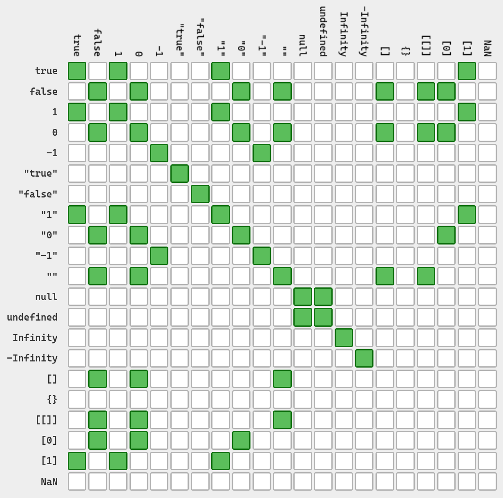

---
categories:
- Phase Field
- Programming
tags:
- JavaScript
- TypeScript
- Numerical Analysis
title: "相场模拟，但是用很多语言 III"
description: 让浏览器跑相场！
image: /posts/PF_Note/Impl_Spinodal/Alice-2.png
imageObjectPosition: center 20%
date: 2026-04-09
math: true
---

*我们已经用了 C++ 和 Python 来进行相场模拟，除了这种典型的 “后端” 语言之外，前端能不能跑相场模拟呢？答案是肯定的！我们这次就试试 鼎鼎大名的 JavaScript 和 TypeScript 吧~*

*为保持系列的统一，头图我们依旧选择了上期出现的，由 [Neve_AI](https://x.com/Neve_AI) 绘制的 AI 爱丽丝。选曲则是最近（怎么这么多最近）很喜欢的 **ラプラスショコラ(Laplace Chocolate)**，由 [Kai](https://space.bilibili.com/3706933947140196) 作词曲，初音未来献唱。活泼可爱，甚至某种程度有点切题（Laplace <-> Laplacian）？希望您也喜欢~*



## 从浏览器讲起

这次我们把目光放在 JavaScript 和 TypeScript 这两门语言上，因为基础的调幅分解的模拟相信在前两期中已经聊得很多了。而要讲 JavaScript 和 TypeScript，就不得不提我们早已熟悉的互联网入口：浏览器。

### 非常好浏览器技术

我们的生活已经充满了各种各样的浏览器了。从大家了解的知名浏览器如 Google Chrome，Microsoft Edge，Mozilla Firefox，Apple Safari 和一些大家也许尝试过的 UC/QQ/360 浏览器，到藏在软件背后的浏览器，如众多的安卓软件，许多的看起来拥有现代 UI 风格的桌面端应用等等，甚至是平时吃饭点单用的小程序，它们都是各式各样的浏览器。笔者写这篇博客使用的 VS Code 就是用 *Electron* 这个桌面应用框架写成的。如果您的电脑上正好有 VS Code，您可以从 `Help->Toggle Developer Tools` 来打开一个和 Google Chrome 的开发者工具别无二致的页面。

> 唉，怎么现在什么服务都在千方百计让用户下载手机应用或者从微信小程序打开呢？真麻烦呀！如果有一个东西能够把这些东西全都统一起来，那该多好呀！（恭喜你重新发明了浏览器）

为什么浏览器如此流行呢？我想这主要得益于浏览器的技术具有众多的优势：

- 技术结构清晰。人们常说 *前端三剑客*（我们稍后会谈到什么是前端，以及对应的后端）：HTML，CSS 和 JavaScript，这三者分别提供了内容描述，界面样式以及交互逻辑，再加上网络与后端服务器的通信，这些让浏览器生态变得 *近乎万能*，让许多想法都得以在它上面实现。这样优秀的结构设计也方便了人们做网络开发，而这带来的第一个大优点便是：
- 好看。这几乎毋庸置疑，当前的浏览器页面近乎百花齐放，许多伟大的平面设计都在浏览器上得到了空前的发挥，而为了支持这些设计的发挥，浏览器前端技术也在持续不断地发展，以支持越来越多的效果。CSS 的神奇效果与 JavaScript 对页面元素近乎绝对的掌控能力让前端三剑客几乎可以实现任何能想到的效果，区别大概只在于难度与延迟。
- 移植性强。几乎没有某个桌面操作系统没法安装浏览器，而只要能安装浏览器，浏览器相关的那些技术就都可以借助诸如 **Node.js** 这样的本地 JavaScript 运行时和诸多 WebApp 框架来在桌面环境运行 JavaScript 代码，成为一个好看好用的应用程序。
- 生态丰富。这点就比较顺理成章了，当一个东西好用的时候，大家自然就都会涌向这个技术，为它添砖加瓦。这意味着，很多功能我们不需要自己去实现，可以用现有的工具去做，尤其是当我们设计 UI 的时候，同时也意味着前端开发的门槛正在逐步降低。再加上 AI 技术的加持，像我这样的小白也敢对着我的博客用 AI 进行魔改了。

太伟大了，浏览器！然而说的是天花乱坠，前端/后端究竟是什么呢？

### 让我前后端旋转

因为笔者对网络开发并不算了解，这里只能浅谈自己的一点愚见，如有疏漏还望不吝赐教。在笔者看来，前端和后端是相对的，它们相互配合来向用户提供完整的服务。其中的前端代表的是 *和用户交互的部分*，一切用户能看到的，摸到的，直接交互的东西，都应该被划分到前端里。而在用户期望获取服务时，比如点击一个按钮之后，负责 *处理按钮背后代表的业务逻辑* 的则成为后端。

在这样的理解下，实际上前端和后端应该是某种逻辑处理的职责模型，且这样的区分可以不局限于网络开发。比如 Python 桌面应用编程，我们可以用 PyQt 来描述应用有哪些组件而不关心它们要具体干什么，只留下一些接口，随后在别处实现点击按钮之后要执行的业务处理，不用关心这个功能要怎么出现在用户面前。我们也不必拘泥于桌面程序，比如设计一个用在命令行中的 TUI （文本用户界面）程序，那么命令行界面就是对应的前端；设计一个像 `gcc` 这样的 CLI（命令行界面）程序，那么如何合理地传入参数并解析就成为对应的前端问题。

但是这很显然不符合我们对平时 *前端开发* 的印象。当我们说前端开发时，我们在谈什么呢？也许我们提到的主要是如何在浏览器上和用户进行交互。这包括如何设计页面的元素（出现什么文字，放入什么图片，有什么按钮文本框），元素应该出现在页面什么位置，以及按下按钮时应该做什么。

这里你也许会问：前两点能理解，第三点是为什么？按下按钮的情况为什么还需要前端去考虑？那不是后端的问题吗？这就要引出在网络开发中后端是什么了。一般在按下某个按钮的时候，大概率有两种情况，一种是在页面中的操作，比如切换一下页面风格，跳转到某个位置之类，第二种则是要 *与服务器进行通信* 的操作。最常见的如用户注册，当一个用户要注册时，填写表单时前端负责将元素漂亮地展示出来，让用户理解应该做什么，并提供最基础的表单检查；而当用户按下 `注册` 的按钮时，前端要负责的事情则是：让用户知道它按下了 `注册` 的按钮（也许可以变灰或者什么样），以及 *通知后端服务器登记这个条目*。在这个情境下，后端则是一个数据库服务。

一般来讲，前端就是 HTML，CSS 和 JavaScript 这三位了，

那么，前端怎么执行诸如 “按钮按下后该做什么” 的逻辑呢？前端如何与后端通信呢？这就要请出今天的主角：**JavaScript** 与 **TypeScript** 了。

## JavaScript 与 TypeScript

不论是从历史角度还是从逻辑关系，我们都应该先来讲讲这个名字奇怪的 JavaScript。

### 神秘的命名与成功的营销

相信许多不了解 JavaScript 的人都或多或少地因为在某些地方听说过 *Java* 而尝试将它和 Java 联系起来或者简称 JavaScript 为 Java。然而这实在是一个非常幽默且有趣的误会。

在 1993 年，网景（Netscape）公司的创立人们开发了图形用户界面的浏览器 Mosaic，这款浏览器和其后继者 Navigator 大获成功，但很快人们对浏览器的需求就不仅限于 “浏览” 了。为了能够让浏览器页面在加载完成后有一些动态相应效果，1995 年网景雇佣了 Brendan Eich，要求他在浏览器中实现 Scheme，一门脚本语言 Lisp 的方言。然而与此同时，网景又计划着与开发了 Java 的太阳微系统（Sun Microsystems，后来被甲骨文 Oracle Corporation 收购）合作，将它们的 Java 嵌入到 Navigator 中，以此来实现网页的动态功能。两方对比竞争下，网景高层最终决定还是选择使用脚本语言来实现，让这门语言扮演 “胶水” 的功能，但需要有与 Java 相似的语法，且轻量，易用。Eich 在 1995 年 5 月花了 *十天* 时间完成了原型设计，并给了它 Mocha 这个名字。随后，网景的市场部门将名字改成了 LiveScript，在当年的十一月正式随 Navigator 推出，但在十二月时又改名为了 JavaScript，蹭上了当时如日中天的 Java 的名头[^1]，从此就用着这个名字直到今天。

所以，很难说 JavaScript 和 Java 一点关系都没有，但是这层关系大概也只到了 JavaScript 曾经参考过 Java，而且为了能够更好地实现商业化，JavaScript 有意地选择了这个名字吧。但是，目前为止似乎 JavaScript 是专供 Navigator 浏览器使用的脚本语言，但现在什么浏览器都在用这个语言，这中间又发生了什么？其实，有关 JavaScript 名字的故事依旧没有结束。

也许你在某些地方看到过 ECMAScript 的名字，或者在 Windows 系统里看到过一个丑丑的图标。实际上，在 JavaScript 随着 Navigator 浏览器迅速风靡全球之后，在 1996 年 11 月网景公司便与欧洲计算机制造联合会（European Computer Manufactures Association, ECMA）举行了会议，着手对这个语言进行标准化，且被定义在标准文件 [ECMA-262](https://www.ecma-international.org/publications-and-standards/standards/ecma-262/) 中。随后该标准也通过 ISO 标准，成为 ISO-16262 [^2]。

作为一份标准，ECMAScript 标准只要求了如何实现这类脚本，因此应该说，如果要实现自己的符合 ECMAScript 标准的脚本引擎（比如 Firefox 的 SpiderMonkey 或者 Chrome 的 V8 引擎）时，我们才需要参考这份标准，而我们常用的 JavaScript 是 ECMAScript 的原型也是一种实现。而其他的实现中，微软实现的那一份叫做 JScript，就是那个丑丑的图标的文件；也有一些别的，比如 Adobe 手上的 ActionScript 等。不过总的来说，应用最广泛的还是 JavaScript，当大家提到 JS 的时候大概率也是提的那位老资历，JavaScript 了。

### TypeScript: JavaScript，但是静态类型

事实上，在人们发现什么地方都能塞个浏览器的时候，JavaScript 就已经自然地流行起来了。谁不想要美丽的 GUI 界面和炫酷的交互逻辑呢？这实在是太酷了！符合我对 21 世纪美丽互联网的想象。但是这带来了一个问题：想要写出一个灵活，好用，功能强大的基于 JavaScript 桌面程序，其代码量是可想而知的庞大的。但是我们亲爱的 JavaScript 是一门动态，弱类型的语言。我们看看这个著名的地狱绘图：

很可怕吗？是的很可怕…… JavaScript 会贴心地帮你做很多的类型转换，同时贴心地告诉你某两个写法完全一样的东西其实是不一样的。非常地伟大。

But, Y？JavaScript 为何？因为 JavaScript 本身就是一个轻量的快捷语言。这样等于或不等于的背后，其实是类型转换系统在发力。但是即便 JavaScript 背后真的有一套类型系统，在这样的神秘转换下，人们也很容易认为这门语言根本没有什么类型可言。这样的小缺点在处理简单逻辑和小型应用时还算 Okay，但要是考虑使用 JavaScript 去写什么特别复杂的应用逻辑，那我相信没有类型提示的结果就是 Bug 四面开花，神秘报错以及崩溃的秃头程序……

但是我们可以想办法让它有类型呀！没错，微软就是这么想的。2012 年的 10 月 1 日，TypeScript 横空出世。它的目标很简单：让 JavaScript 拥有类型标注。它的做法很简单：写的 TypeScript 脚本将会被静态类型检查器会保证代码没有类型问题，随后就会被 *编译* 为对应的 JavaScript 代码，通过把所有的类型标注删掉。但是它的结果很强大：它解放了 JavaScript 缺乏静态检查的桎梏，让前端技术能够进一步应用在更大体量的程序中。

### Node.js，`pnpm` 与 React

太棒了。那么我怎么才能够运行 JavaScript 和 TypeScript 代码呢？既然它和浏览器有千丝万缕的联系，是不是我可以在浏览器里直接运行 JavaScript？没错，是这样的，但也不完全是。在浏览器中运行 JavaScript 代码的方式是在网页中插入 `` 这样的标签，然后在里面运行。但这样的方式多少是有点别扭了。也可以通过开发者工具的 Debug Console 来写两句，但这应该更别扭了……有没有什么可以像 Python 解释器那样的工具来在电脑上不依赖浏览器地运行 JavaScript 代码呢？

有的，兄弟！有的！向您介绍 **Node.js**，一款免费开源跨平台的 JavaScript 运行时环境。Node.js 让 JavaScript 得以独立于浏览器运行，赋予了 JavaScript 作为后端开发语言的能力。要用 Node.js 运行 JavaScript 代码，只需要 `node hello_world.js` 即可！就像 `python hello_world.py` 那样，甚至少写两个字母！

此外，Node.js 还拥有现代包管理系统，`npm`，来为 Node.js 或者任何 JavaScript 项目提供包管理支持。`npm` 提供了现代的 file locking 机制，用以确定项目的依赖版本并允许通过 `npm install` 来自动识别并安装项目依赖。更重要的是，`npm` 是默认将依赖安装在项目文件夹而非全局的。这自动地提供了环境分隔，避免了依赖冲突，与必须手动创建虚拟环境的 Python 相比 Node.js 的做法更显优雅。

不过，我们并不打算使用最传统的 `npm`，而是使用更先进的包管理器 `pnpm`，它提供了更优秀的包管理和依赖解析，让依赖的安装速度更快且支持通过符号链接节省包占据的空间。另外就是我因为某些我也忘了的原因安装了 `pnpm`，而 `npm` 则只装了一个 `pnpm`，那我们干脆就让他依旧单纯下去吧~

而要运行 TypeScript 代码，我们采用 `pnpm` 来安装 `typescript` 包并安装 `tsx` 这个工具。`tsx` 可以直接运行 TypeScript 代码，不需要先 “编译” 为对应的 JavaScript 代码。最后，为了在本地能够打开临时端口观察渲染情况，我们再安装 `vite` 这个工具。

我们前面聊了这么多前端与 JavaScript，那么用 JavaScript 跑出来的模拟结果肯定应该用漂亮的前端漂亮地展现出来漂亮的结果吧！就这么干！我们介绍 **React**，一款 JavaScript 前端组件库，用来搭建美丽的用户界面。React 允许用户使用可复用的组件来设计用户界面，并提供了多种钩子（Hook）来管理控件状态与副作用等。虽然笔者不会 React，但是笔者会让 AI 写 React 呀！再加上美丽群友 [開源 lib](https://ex-tasty.com/) 已有的 React 实例代码，我的评价是：

> 前端，易如反掌口牙！！！

行了，别废话了，赶快进入今天的正题吧！

## JavaScript 的实现

[^1]: 来源自 [Speaking JavaScript, Chapter 4. How JavaScript Was Created](https://exploringjs.com/es5/ch04.html)
[^2]: 来源自 [JavaScript and the ECMAScript specification](https://developer.mozilla.org/en-US/docs/Web/JavaScript/Guide/Introduction#javascript_and_the_ecmascript_specification)