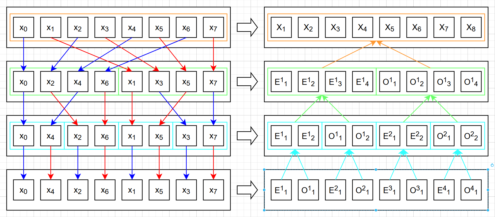
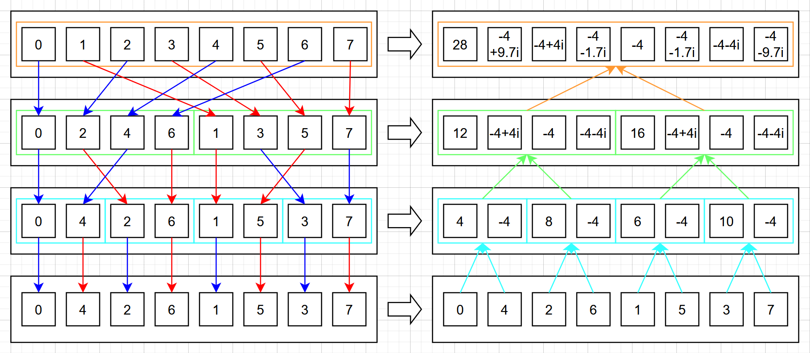
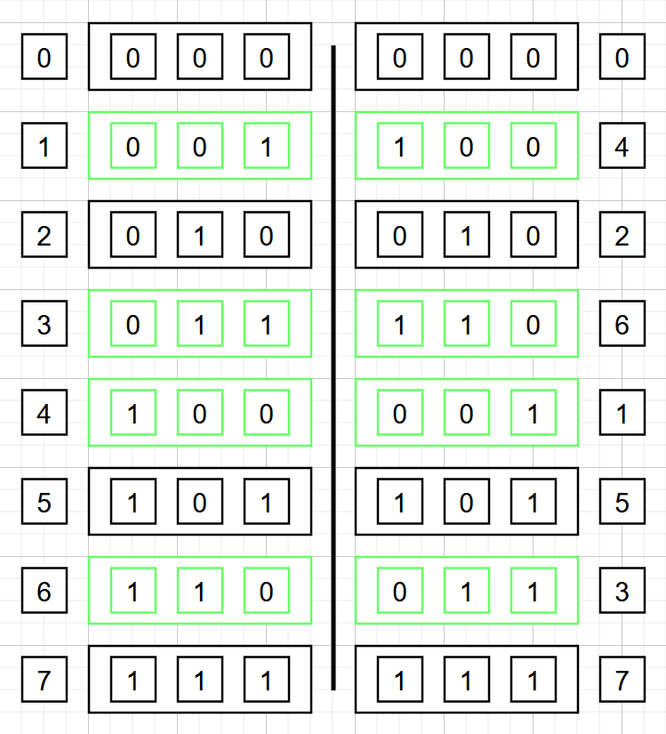

---
categories:
- Phase Field
- Programming
- Mathematics
tags:
- C
- Fourier Spectrum
- Fourier Transformation
- FFT
- Numerical Analysis
title: "相场模拟，但是用很多语言——番外"
description: 傅里叶全家桶！！
image: /posts/PF_Note/Impl_Spinodal/Alice-2.png
imageObjectPosition: center 20%
date: 2026-05-01
math: true
mermaid: true
draft: true
---

*前几篇博文中，我们都使用了有限差分法来离散网格并计算 Cahn-Hilliard 方程的结果。这样的写法确实简单有效，但是问题是就没有别的更好的方法了吗？有的，兄弟！有的！那就是今天要向各位介绍的 **傅里叶谱法**。在这个方法下，我们不需要再可怜兮兮地做网格差分了，而是从另一个神秘空间：**谱空间** 去求解。本篇就以番外的形式，聊聊这个神奇的方法，关于它的数学原理，使用事项，以及实现时需要注意的若干细节。*

*为保持系列的统一，头图我们依旧选择了上期出现的，由 [Neve_AI](https://x.com/Neve_AI) 绘制的 AI 爱丽丝。选曲则是上季度知名动画 **Fate Strange Fake** 的片尾曲 **潜在的なアイ**，由 **13.3g** 献唱，节奏明快，非常欢乐的一首歌！希望你也喜欢~*



## 傅里叶全家桶！

相信当您看到 **傅里叶** 三个字（**Joseph Fourier**，也译作 **傅立叶**，旧译 **福里叶**）的时候，也许就已经秒变战斗脸了吧……作为通常高等数学教学的最后一部分，也是古典分析学最引以为傲的成果之一，这位伟大的法国数学家、物理学家的名字出现在了许多地方，傅里叶级数、傅里叶变换等一系列概念与技术都深刻地影响了现如今的各个科学技术领域，也是众多科普文章或视频绝佳的素材，而它的传热方程模型也在工程上解决了许多热传导相关问题。即便已有了许多对傅里叶级数等概念的非常好的介绍，我们这里也还是简单介绍一下 “傅里叶全家桶” 的基本概况。如果您对这方面的内容感兴趣，我搜集到了一些不错的文章和视频，对这些概念有一些不同层次与程度的介绍[^1][^2][^3]。

要了解傅里叶全家桶的情况，我们得从另一个您也许熟悉的名字开始讲起：**泰勒**（**Brook Taylor**，英国数学家）。

### 从函数项级数开始：泰勒展开与泰勒级数

给定任意一个函数，我们有什么好的办法把它拆成乘积的和的形式吗？如果说一个复杂函数能够被分成许多份简单函数的组合，那会极大地方便我们研究该复杂函数，因为它的性质将会完全由这些小的简单函数的性质决定。我们能做到吗？当然可以！事实上，各位最早接触到的函数项级数应该就是大名鼎鼎的 *泰勒级数* 了。通过将函数在某一点处进行 *泰勒展开*，我们可以获得在这一点处附近函数的各阶导数，同时还能得到非常好的近似结果，用来在该点处做近似的函数还是被得到了相当透彻的研究的多项式。也许您曾经听说过，泰勒展开是古典微积分学的终极杀手锏，这一点几乎是毋庸置疑的，因为当我们需要研究函数在某一点附近的性态时，泰勒展开能够让我们解剖开这个复杂函数，并在需要的时候做对应的简化，省略掉高阶项从而低成本地表示该函数。

然而上面的一切都有一个前提，那就是仅限在函数的 *某一点* 处。这个限制其实相当大，当把目光从古典微积分学研究某一点的问题转移到研究函数在某个较大区间内的性态时，泰勒级数就没那么好用了。每次展开我们都必须且只能选择某一个点进行展开，这让我们没法同时在区间上的每个点展开并研究。从下面的例子你也许能更清晰地感受到泰勒级数展开的局限性：



可以看到，$\sin(x)$ 的泰勒展开在展开阶数不断上升时，有不错逼近结果的区间在快速拓宽；$\mathrm{e}^{x}$ 在正半轴的逼近效果很不错，但在负半轴的逼近情况就比较困难了；$\ln(1+x)$ 的逼近效果简直是灾难级别的，即便在零点处展开到 10 阶，效果依然不太好；另外当我们从另一个位置对函数展开时（这里以 $\ln(3+x)$ 来模拟在 $x=2$ 处展开 $\ln(1+x)$ 的情景），可以看到它的收敛区间比在 $0$ 处展开的效果稍微好一些，但很快就会受到自然定义域的限制（左侧 $x\leq 3$ 处无定义）。总体上来说，泰勒展开的效果在确定范围内的函数逼近时很不如人意。那么要怎么解决这个问题呢？

### 选择正确的函数：三角函数

问题其实在于多项式。当我们选定某个点时，我们可以快速地得到一组经过该点的多项式，而无需关心其他的点，而多项式的连续性能保证经过的那个点的附近性质是不会发生剧烈变化的。而要想将函数展开出来的级数每一项都对函数整个区间上的结果做出贡献，我们得找一组在整个区间上都分布均匀，但又各不相同的函数，来代替多项式。其中最简单的一组函数自然就是 *三角函数* 了。比如下面的这一组：



可以看到，$\omega$ 为整数倍的不同频率的三角函数都近乎完美地均匀分布在 $-\pi$ 到 $\pi$ 的区间中，而且不同频率的函数也都相互之间有所区别，方便我们用它们自由组合出需要的函数。但是问题是，我们要怎么求出某个给定函数的组合系数呢？在泰勒级数中，我们只需要求导就可以了，因为求导可以 *让多项式降阶*，从而得到多项式中各个项的系数。但这在三角函数里行不通呀……

### 函数内积与傅里叶级数

好消息是，三角函数有着很特殊的性质，如果两个正弦或者两个余弦函数的频率 $\omega$ 不同，那么它们相乘后再在一个周期上积分之后会得到 $0$，而当它们的频率相同的时候，积分得到的结果才不为 $0$！具体的原因我们就不证明了，这样的特点让我们自然想到可以用不同频率的三角函数和这个函数求积分，得到的结果就能够来反求出这个频率下对应的系数了。在数学上，我们将 *相乘后积分* 的概念拓展到更一般的情景时，常常使用 *内积* 去称呼它，而如果两个函数内积后结果为 $0$，我们就称它们是 *正交* 的。我们对函数的内积做如下定义：

> [!DEF]{函数内积}
>
> 设有定义在同一集合 $S\in \R^n$ 或 $S\in \mathbb{C}^n$ 上的两个函数 $f$ 与 $g$，定义 *函数内积* 为：
>
> $$\langle f,g \rangle =  \int_S f(\mathbf{x}) \bar{g}(\mathbf{x}) \,\mathrm{d}\mathbf{x},$$
>
> 其中的 $\bar{g}$ 表示函数 $g$ 的复共轭，即函数值的逐点共轭。可以验证该定义满足内积的一般定义。

这里定义内积时我们有考虑让它的定义扩展到其他空间中，不过对于我们熟悉的实函数而言，就是简单的相乘后积分即可。三角函数系是我们常见的正交函数系之一，而除了三角函数外，也有一些别的函数系满足正交性，比如一些正交多项式系，这里我们就不展开了。总之借助内积计算，我们能够成功地将一个函数在某个区间上展开成不同 $\omega$ 下 $\sin(\omega x)$ 和 $\cos(\omega x)$ 的系数和，它也是一个级数。我们称这样展开的级数为这个函数的 *傅里叶级数*：

> [!DEF]{傅里叶级数}
> 
> 若合适的函数[^4] $f(x)$ 的周期为 $2L$，记 $\omega_n = n\pi / L$，则它的 *傅里叶级数* 展开式为：
> $$ f(x) = \frac{a_0}{2} + \sum_{n=1}^\infty \left( a_n \cos(\omega_n x) + b_n \sin(\omega_n x) \right),$$
> 其中
> $$ a_n = \frac{1}{L} \int_{-L}^{L} f(x) \cos (\omega_n x) \,\mathrm{d}x = \frac{\langle f(x), \cos(\omega_n x )\rangle}{\langle \cos(\omega_n x), \cos(\omega_n x)\rangle} , $$
> $$ b_n = \frac{1}{L} \int_{-L}^{L} f(x) \sin (\omega_n x) \,\mathrm{d}x = \frac{\langle f(x), \sin(\omega_n x )\rangle}{\langle \sin(\omega_n x), \sin(\omega_n x)\rangle} . $$
 
注意到我们这里要求 $f(x)$ 是一个周期为 $2L$ 的函数，原因我们稍后提到。另外，如果我们应用 *欧拉公式* 的话，我们可以将上面的式子改写成更简洁的形式：

> [!COROLLARY]{傅里叶级数的复数形式}
>
> 若函数 $f(x)$ 的周期为 $2L$，设 $\omega_n = n\pi / L$，则它的傅里叶级数可以被展开为：
>
> $$ f(x) = \sum_{-\infty}^{\infty} c_n \mathrm{e}^{\mathbf{i} \omega_n x}, $$
> 其中，
> $$ c_n =  \frac{1}{2L} \int_{-L}^{L} f(x) \mathrm{e}^{ - \mathbf{i} \omega_n x}.$$
> 式中，$\mathbf{i}$ 为虚数单位。若记 $K_n(x) = \mathrm{e}^{ - \mathbf{i} \omega_n x}$，则 $c_n$ 亦可记为：
>
> $$ c_n =  \frac{\langle f(x), K_n(x)\rangle}{\langle K_n(x),K_n(x) \rangle}$$

我们要求周期是 $2L$，一方面是为了能够将经典傅里叶级数原本的 $2\pi$ 的周期扩展到任意的周期上，另一方面也是为了能更好地衔接后续的 *傅里叶变换* 与 *离散傅里叶变换*。另一个自然的问题是，非周期的函数在某个区间上可以进行这样的展开吗？答案是可以这么操作，但得到的就不是函数的展开了，而是在这个区间上的逼近。我们下面画一些函数在傅里叶级数下的逼近：



可以看到，在指定区间上，傅里叶级数可以很快地逼近目标函数，另外傅里叶级数给出的结果自然地是周期性的，这也说明了如果处理的函数真的是周期函数，那么在周期上去展开的傅里叶级数将能非常好的代替函数本身。

另外，傅里叶级数每一项前面的系数也有特殊的含义，它们代表了函数中对应频率的正弦/余弦函数的 “强度”。这对于信号处理而言是非常好的消息，因为可以区分出信号的频率，从而将时间上的连续信号转换为空间上的频率强度。而且观察高频正弦/余弦函数，它们在 $-\pi$ 到 $\pi$ 上有许多的 “锯齿”，这说明它们主要会影响函数最终的 “细节”。当我们对这些细节不太在意的时候，就可以抛弃这些高频率的正弦/余弦部分，只保留较低频率的正弦/余弦，函数的形状也不会有太大的失真。

### 从频率走向频谱：傅里叶变换

傅里叶级数能将一个周期函数在其周期上用不同频率的三角函数叠加来表示，或者将一个非周期函数在指定区间上以不同三角函数的叠加实现逼近。但是这些方法里傅里叶系数始终是离散的点，就如同上面频率空间中显示的那样。而如果我们考虑让频率 *连续变化*，从离散的频率强度变成 *频谱*，那么我们就得到了所谓的 *傅里叶变换*，又称 *傅里叶积分*[^5]。推导方法我们放在下面，如果您感兴趣可以点击查阅。

<details>
<summary>从傅里叶级数到傅里叶积分</summary>

我们要怎么做呢？其实前面已经有了提示，我们让 $\omega_n = n \pi / L$，这里的 $\omega_n$ 自然地成为了三角函数的频率。我们需要让频率连续变化，最简单的方式，也最自然的方式，就是让 $L$ 趋近于无穷，这样我们还顺带让 “展开” 这个过程不只是定义在周期函数上，不再限制函数的周期性（因为现在周期是无穷了）。

我们将前面的傅里叶级数中 $a_n$ 和 $b_n$ 等带回，我们得到：

$$ 
f(x) = \frac{a_0}{2} + \sum_{n=1}^\infty \left(\left[ \frac{1}{L}\int_{-L}^{L}  f(x) \cos (\omega_n x) \,\mathrm{d}x \right] \cos(\omega_n x) + \left[  \frac{1}{L}\int_{-L}^{L} f(x) \sin (\omega_n x) \,\mathrm{d}x \right] \sin(\omega_n x) \right),
$$

我们调整一下顺序：

$$
f(x) = \frac{1}{2L}\int_{-L}^{L} f(x)\,\mathrm{d}x + \sum_{n=1}^\infty \left[\int_{-L}^{L}  f(x) \cos (\omega_n x) \,\mathrm{d}x \right] \cos(\omega_n x)  \frac{1}{L} + \sum_{n=1}^\infty \left[ \int_{-L}^{L} f(x) \sin (\omega_n x) \,\mathrm{d}x \right] \sin(\omega_n x)  \frac{1}{L},
$$

注意到我们这里有两个 $1/L$，它们可以被表示为  $(\omega_n -\omega_n-1)/\pi = \Delta \omega / \pi$ ，我们就有了：
$$ 
 \sum_{n=1}^\infty \cdots \frac{1}{L} \Rightarrow \frac{1}{\pi}\sum_{n=1}^\infty \cdots \Delta \omega.
$$

诶！那我们让 $L$ 趋近无穷的时候，$\Delta \omega$ 就成了 $\mathrm{d}\omega$，且求和就自然变成了积分呀！而且此时，$a_0$ 对应的积分中，如果函数 $f(x)$ 是绝对可积的，这个积分就自动变成了 $0$，我们就有了：

$$
f(x) = \int_{0}^\infty \left[\int_{-\infty}^{\infty}  f(x) \cos (\omega x) \,\mathrm{d}x \right] \cos(\omega x)\,\mathrm{d}\omega 
     + \int_{0}^\infty\left[\int_{-\infty}^{\infty} f(x) \sin (\omega x) \,\mathrm{d}x \right] \sin(\omega x) \,\mathrm{d}\omega.
$$
</details>

最终，我们称下面的东西叫 *傅里叶积分*[^6]：

> [!DEF]{傅里叶积分}
>
> 称一个合适[^4]的函数 $f(x)$ 的 *傅里叶积分* 表达为：
> $$ f(x) = \int_{0}^{\infty} A(\omega) \cos(\omega x)\,\mathrm{d}\omega + \int_0^{\infty} B(\omega) \sin(\omega x) \,\mathrm{d}\omega,$$
> 其中
> $$ \begin{align*}
    A(\omega) &= \frac{1}{\pi}\int_{-\infty}^{\infty}  f(x) \cos (\omega x) \,\mathrm{d}x;\\
    B(\omega) &= \frac{1}{\pi}\int_{-\infty}^{\infty}  f(x) \sin (\omega x) \,\mathrm{d}x;
\end{align*} $$

当然，我们也可以将它表达为复数形式。我们称它的复数形式为 *傅里叶变换*[^6]：

> [!DEF]{傅里叶变换}
>
> 称一个合适的函数 $f(x)$ 的 *傅里叶变换* 为 $F(\omega)$，$F(\omega)$ 为 $f(x)$ 的傅里叶反变换，若二者满足：
> $$ F(\omega) = \int_{-\infty}^\infty f(x) \mathrm{e}^{-\mathbf{i}\omega x}\, \mathrm{d} x ,$$
> $$ f(x) = \frac{1}{2\pi}\int_{-\infty}^\infty F(\omega) \mathrm{e}^{ \mathbf{i}\omega x}\, \mathrm{d} \omega .$$
> 二者的关系可以记作：
> $$\begin{align*} F(\omega) &= \mathscr{F}\left\{f(x)\right\},\\f(x) &= \mathscr{F}^{-1}\left\{F(\omega)\right\}. \end{align*}$$
> 或表示为：
> $$ f(x) \longleftrightarrow F(\omega) $$

其中，我们称 $\mathrm{e}^{-\mathbf{i}\omega x}$ 为傅里叶（正）变换的 *核函数*（可以简称为核），相对应的 $\mathrm{e}^{\mathbf{i}\omega x}$ 为傅里叶逆变换的核。让一个函数乘以某个核之后做积分，就是 *积分变换* 了。核函数的概念总是伴随着积分变换，二者形影不离；而使用 *傅里叶核* 进行的积分变换，就是我们这里所要讲的傅里叶变换。我们通常称变换前的函数处于 *实空间* 中，而变换后的函数则处于 *谱空间* 中。

另外，关于傅里叶变换的符号，感兴趣的话可以点击展开下面的内容。

<details>
<summary>关于傅里叶变换的符号</summary>

上面我们使用大写字母 $F$ 作为函数 $f$ 在进行傅里叶（正）变换后的结果。除了使用 $\mathscr{F}\left\{f\right\}$ 以外，$\hat{f}$ 或者 $\left\{f\right\}_k$ 也时常被用来来表示 $f$ 的傅里叶变换。且除了使用 $\omega$ 角频率的记号外，有时人们也是用波数 $k$ 来表达傅里叶变换后的函数定义域，或是用 $\xi$ 来表达 $x$ 的对偶变量从而体现 $\hat{f}$ 是 $f$ 的对偶这一概念。

使用不同的变量时，也会带来一些不同的傅里叶变换公式。当使用角频率 $\omega$ 时，积分核通常为  $\mathrm{e}^{-\mathbf{i}\omega x}$，变换公式也同上。而当使用波数 $k$ 或 $\xi$ 时，二者的关系为 $\omega = 2\pi k$ 或 $\omega = 2\pi \xi$。此时积分核变为：$\mathrm{e}^{-2\pi \mathbf{i}k x}$ 或 $\mathrm{e}^{-2\pi \mathbf{i}\xi x}$，而变换公式也将成为：

$$ \hat{f}(\xi) = \int_{-\infty}^\infty f(x) \mathrm{e}^{-2\pi\mathbf{i} \xi x}\,\mathrm{d} x $$
$$ f(x) = \int_{-\infty}^\infty \hat{f}(\xi) \mathrm{e}^{-2\pi\mathbf{i} \xi x}\,\mathrm{d} \xi $$

此时傅里叶变换公式的积分前系数均为 $1$。有时人们为了让角频率下的傅里叶变换也有使用波数定义时的对称性，会将 $\frac{1}{2\pi}$ 拆开为两个 $\frac{1}{\sqrt{2\pi}}$ 并同时分给两个公式，从而保持对称性。除了这些以外，还有比如虚数单位是使用 $\mathbf{i}$ 还是 $i$，$\mathbf{j}$ 或 $j$，积分核内的符号排列顺序等，我们就不多提了。总的来讲，傅里叶变换就是这样的一种积分变换，根据需要的场景我们会选择合适的公式。在这个系列中，我们保持前面推导过程中使用的记号，并使用角频率 $\omega$ 且保持积分前的系数不对称。
</details>

这里我们讨论的是一维的情况，那么二维甚至更高维度下要怎么进行傅里叶变换呢？其实答案很简单：对每个方向依次做傅里叶变换就可以了。以二维为例，$f(x_1,x_2)$ 的变换结果为：

$$\begin{align*}
    F(\omega_1,\omega_2) &=  \int_{-\infty}^\infty \left[\int_{-\infty}^\infty f(x_1,x_2) \mathrm{e}^{-\mathbf{i} \omega_1 x_1}\,\mathrm{d} x_1\right] \mathrm{e}^{-\mathbf{i} \omega_2 x_2} \,\mathrm{d} x_2\\
    &= \int_{-\infty}^\infty  \int_{-\infty}^\infty f(x_1,x_2)  \mathrm{e}^{-\mathbf{i}(\omega_1 x_1 + \omega_2 x_2)}\,\mathrm{d} x_1 \mathrm{d} x_2
\end{align*} $$

而反变换结果则为：

$$\begin{align*}f(x_1,x_2) &= \frac{1}{(2\pi)^2}\int_{-\infty}^\infty \left[\int_{-\infty}^\infty F(\omega_1,\omega_2) \mathrm{e}^{\mathbf{i} \omega_1 x_1}\,\mathrm{d} \omega_1\right] \mathrm{e}^{\mathbf{i} \omega_2 x_2} \,\mathrm{d} \omega_1 \\ &=  \frac{1}{4\pi^2}\int_{-\infty}^\infty  \int_{-\infty}^\infty F(\omega_1,\omega_2)  \mathrm{e}^{\mathbf{i}(\omega_1 x_1 + \omega_2 x_2)}\,\mathrm{d} \omega_1 \mathrm{d} \omega_2\end{align*}$$

对于更高维度的函数，我们只需要执行更多次积分就好。注意到每个空间方向只对应一个频率方向。逆变换也是类似的，将积分核的指数改变符号，然后在前面乘以 $1/2\pi$ 的维度次方就好。

### 傅里叶变换的性质

有了傅里叶变换之后，我们自然会考虑它有什么样的性质。首先，毋庸置疑的，由于傅里叶变换是积分变换，积分满足线性性，因此：

> [!LEMMA]{傅里叶变换是线性的}
>
> 设有两个合适的函数 $f$ 和 $g$，以及复数 $a,b\in \mathbb{C}$ 则有：
>
> $$ \mathscr{F}\{af+bg\} = a\mathscr{F}\{f\} + b\mathscr{F}\{g\},$$
>
> 或记作
>
> $$ a f(x) + b g(x) \longleftrightarrow aF(\omega) + bG(\omega), $$
>
> 即该变换是线性的。

我们就不证明了，这个性质从积分就能得到，且对于多元函数来说这条性质依然是成立的。除此之外的性质就没那么明显了，我们就需要将它们带入来看看。这里我们就不进行推导了，直接将几个性质列出来：

> [!PROP]{傅里叶变换的性质} 
> 设两个合适的一元函数 $f$ 和 $g$，以及复数 $a\in \mathbb{C}$，则：
> 
> 1. 微分定理：$$ \frac{\mathrm{d}^n f(x)}{\mathrm{d} x ^n } \longleftrightarrow (\mathbf{i} \omega)^n F(\omega);$$
> 2. 积分定理：$$ \int_{x_0}^{x} f(x)\,\mathrm{d} x \longleftrightarrow \frac{F(\omega)}{\mathbf{i}\omega};$$
> 3. 位移定理：$$ f(x+x_0) \longleftrightarrow \mathrm{e}^{\mathbf{i}\omega x_0} F(\omega);$$
> 4. 卷积定理：$$ f(x)g(x) \longleftrightarrow  \frac{1}{2\pi} F*G(\omega), $$ $$ (f*g)(x) \longleftrightarrow F(\omega) G(\omega), $$ 其中 $*$ 为方程求卷积：$$ f*g(x) = \int_{-\infty}^\infty f(t) g(t-x)\,\mathrm{d} t .$$

可以看到，傅里叶变换有着神奇的性质：它能把求导变成简单的乘法，而让积分变成简单的除法！后两条性质则是为了完整性而添加上去的，但也能看到傅里叶变换的强大潜力。对于多元函数而言，我们最关心的第一条性质就变成：

$$ \left(\frac{\partial}{\partial \boldsymbol{x}}\right)^\alpha f(\boldsymbol{x}) \longleftrightarrow (\mathbf{i}\boldsymbol{\omega})^\alpha \mathscr{F}\{\boldsymbol{\omega}\}, $$

其中 $\alpha$ 是多重指标：$\alpha = \left(\alpha_1, \alpha_2,\dots\right)$，它的规则是将多元成分的每个分量都作用到对应的指数，然后相乘。比如 $\boldsymbol{x}^\alpha$ 代表的即为 $x_1^{\alpha_1}x_2^{\alpha_2}\cdots$。所以总体来讲，即便是多元函数，它的求导在进行傅里叶变换后，依旧还是让函数的傅里叶变换乘以角频率与虚数的若干次方，是一个十分简洁的关系！而我们想要介绍的 *傅里叶谱方法*，实际上也正是靠着傅里叶变换的这个神奇性质而得到了广泛的应用。

## 傅里叶谱方法

相信从上面的介绍，您也可以猜到傅里叶谱方法具体要怎么操作了。通过将待解的偏微分方程两端同时做傅里叶变换，在谱空间中进行计算后，再返回实空间，就能得到偏微分方程的解了。这样的优点在于，我们可以把偏微分方程中难以处理的一些求导变成简单的乘法运算，不过也会有一些不好的地方就是了，比如原本简单的乘法会在谱空间中变成卷积。当然，相对应的，如果在实空间中发生的是卷积，那在谱空间中就会变成普通乘法就是了。这一点针对积分方程也是类似的，可以将实空间的积分变换到谱空间中的除法。

不过，简单地变换到谱空间并不总是明智的选择，比如当偏微分方程中有变量明显依赖于别的变量时，我们可能不会同时变换所有的变量，仅变换那些被依赖的部分。举个最基础的例子，就比如下面的经典二阶偏微分方程：传热方程。

### 经典传热方程的傅里叶谱法

> [!EXAMPLE]{传热方程}
> 
> 设有一个含时函数 $T(x,t)$ 满足条件
> $$ \frac{\partial T}{\partial t} = a \frac{\partial^2 T}{\partial x^2},$$
> $$ T(x,0) = T_0(x), $$
> 其中 $T_0(x)$ 是一个已知函数。

那么我们可以怎么解它呢？从题目来看，$t=0$ 时刻的场分布是我们已知的，且等号左侧只有待求函数对时间的偏导。为了处理它，我们对方程两边在 $x$ 上做傅里叶变换，就得到这样的结果：

$$ \frac{\partial \mathscr{F}\left\{ T\right\}}{\partial t} = a \mathscr{F}\left\{\frac{\partial^2 T}{\partial x^2}\right\}, $$

根据傅里叶变换的性质，我们有：

$$ \mathscr{F}\left\{\frac{\partial^2 T}{\partial x^2}\right\}= (\mathbf{i}\omega)^2 \mathscr{F}\{T\};$$

带回，就得到了关于 $\mathscr{F}\left\{T\right\}$ 的一个只和时间显式相关的方程：

$$ \frac{\partial \mathscr{F}\left\{ T\right\}}{\partial t} = - a \omega^2 \mathscr{F}\{T\}, $$

接下来只需要直接在时间上求解即可，最后将得到的 $\mathscr{F}\{T\}$ 反变换回 $T$，就得到了我们需要的解了。

不过，操作虽然简单，它背后的数学逻辑其实要稍微复杂一些。我们这里介绍的傅里叶谱法，其实是 *谱方法* 这个大类下的一个最为人所熟知的方法。我们这里不对谱方法进行展开，但是值得了解的是，谱方法实际上是使用一系列 *正交函数* 对待求函数进行逼近的方法，这些正交函数被要求在要求解的空间上只有有限多个点为 $0$。傅里叶谱方法使用了三角函数（或者 $\mathrm{e}^{\mathbf{i}\omega x}$） 的性质，而除了傅里叶谱方法外，还有切比雪夫谱方法、勒让德谱方法等，它们借助的则是切比雪夫多项式和勒让德多项式这两种 *正交多项式*。此外，上面傅里叶谱方法展现出的特殊性质，其实源于 *微分算子* 的特殊性质：

$$ \frac{\mathrm{d} }{\mathrm{d} x }\mathrm{e}^{\mathbf{i} \omega x} = \mathbf{i}\omega \mathrm{e}^{\mathbf{i} \omega x},$$

即 $\mathrm{e}^{\mathbf{i} \omega x}$ 是微分算子的特征方程，而特征值正是 $\mathbf{i} \omega$。 正是这样的特点，让傅里叶变换能够如此简单地将求导转换成普通的乘法。可惜的是，其他的谱方法就没有这么简单的对应关系了，因此也相对少见一些。

傅里叶谱方法尽管强大，也依旧有一些自己的问题。其中一个问题就是，如果方程两边的函数不是简单的仅有加法和求导，比如含有乘法，指数，对数等，那即便是变换到谱空间，也很难简单地得到待求函数在谱空间的显式表达。

好在，我们要做的是数值方法，并非从纯数学角度去求解。为了处理刚刚描述的问题，我们可以使用所谓的 *伪谱法*。

### 傅里叶伪谱法

所谓伪谱法，其实就是只发挥傅里叶变换针对微分算符的强大功能，而将乘除等复杂运算的结果先在实空间中求出后，再变换到谱空间中以继续原本的计算。

我们以我们这个系列的核心：Cahn-Hilliard 方程，并以最经典的单组分双势阱体能与梯度界面能为例：

$$ 
\frac{\partial c}{\partial t} = \nabla \cdot M \nabla \frac{\delta F}{\delta c} = M \nabla^2\left( 2Ac(1-c)(1-2c)-\kappa\nabla^2c\right),
$$

我们对两边同时做傅里叶变换，得到：

$$
\frac{\partial \{c\}_k}{\partial t} = -\omega^2 M ( 2A \{c(1-c)(1-2c)\}_k - \omega^2 \kappa \{c\}_k),
$$

可以看到，这里我们并没有对体能的部分进一步展开，而是让它们就保持在实空间中的状态，作为一个整体做傅里叶变换。在实现中，我们也会遵照这个模式，在实空间中进行体能计算后重新变换回谱空间并参与迭代，从而解决纯傅里叶谱法难以处理复杂变量依赖的问题。

即便傅里叶谱和傅里叶伪谱法有如此强大的能力，但它依旧有很多的局限性。如它对周期性条件的问题有极强的计算能力，但对非周期性条件的问题就有些束手无策了，即便傅里叶变换能够支持定义在整个欧式空间上的函数。这一点限制可以有一些方法来绕过，但这样做的结果会带来大量的额外计算负担来处理边界问题，且得到的结果会不太准确。而且使用傅里叶谱方法时，它的收敛性需要一些额外的处理。

不过谈了这么多，我们到底要怎么实现傅里叶谱方法呢？更重要的，怎么让计算机知道如何计算傅里叶变换呢？这就不得不提到传说中的 *离散傅里叶变换* 了。

### 离散傅里叶变换

傅里叶变换怎么变得离散呢？其实我认为，离散傅里叶变换的 *变换* 两字是有点欺诈的嫌疑的，因为计算的过程是将某个 *区间* 上的离散变量作为输入并变换得到谱空间的点的，相比于傅里叶变换，其实更类似于傅里叶级数。所以，要理解离散傅里叶变换，我们其实反而可以从傅里叶级数出发。

那么，傅里叶级数要怎么进一步离散呢？刚刚从傅里叶级数到傅里叶变换，是让函数的周期变成无穷大，进而让连续函数拥有了连续频谱；要想从傅里叶级数进一步离散，我们就得在函数本身下功夫，让 *离散点拥有离散频谱*。为了做到这一点，我们可以借用前面内积的观察，将连续的 *函数内积* 替换为 *序列内积* 即可。我们定义序列内积：

> [!DEF]{序列内积}
>
> 设有两长度为 $N$ 的序列 $\{a_n\}$ 与 $\{b_n\}$，则其 *序列内积* 为：
>
> $$ \langle \{a_n\},\{b_n\}  \rangle = \sum_{k=1}^{N} a_k \bar{b_k}.$$
> 其中，$\bar{b_k}$ 表示 $b_k$ 的共轭。

同样，可以验证这里定义的序列内积是符合一般内积的定义的。事实上，序列内积在我们固定 $N$ 时，便就成为了 $N$ 维向量空间内的内积了。有了新定义的序列内积，接下来我们只需要用这个新的内积去替换原来的函数内积，就得到了离散傅里叶变换：

> [!DEF]{离散傅里叶变换}
>
> 设定义在 $\R$ 上的函数 $f(x)$，它在区间 $[0,kN]$ 上的 $N$ 个等距分布的点上的值形成序列 $\{f_n\}$。设
>
> $$ \boldsymbol{\phi}_k =  \mathrm{e}^{\mathbf{i} k n 2 \pi /N} $$
> 则函数 $f(x)$ 在区间 $[a,b]$ 的 $N$ 个点上的离散傅里叶变换为：
>
> $$ \{F_k\} = \frac{\langle\{f_n\}, \{\boldsymbol{\phi}_k\} \rangle}{\langle \{\boldsymbol{\phi}_k\} ,\{\boldsymbol{\phi}_k\} \rangle} = \frac{1}{N} \langle\{f_n\}, \{\boldsymbol{\phi}_k\} \rangle$$

没错，只需要将函数内积替换为序列内积，我们就自然得到了离散傅里叶变换的结果。而如果需要逆变换，则直接将 $\phi_k$ 替换为它的共轭，然后做一下归一化就可以了。至此，我们就能够用我们的离散傅里叶变换来处理数值问题中被我们离散化的点，从而得到它们在谱空间中的结果。

也许你会有疑问：离散傅里叶变换真的是傅里叶变换的离散形式吗？或者说，当我们使用离散傅里叶变换时，它还拥有我们之前聊到的那些连续傅里叶变换中拥有的优良性质吗？答案是肯定的：可以证明，在满足一定条件下，函数的序列在经过离散傅里叶变换后的结果，就是该函数连续傅里叶变换后按相同方式取点得到的点列。至于这里的条件，笔者没有深入探究，总体上说是要求所有点都必须均匀分布且完整覆盖函数的整个周期。否则会出现一些失真（英文是 *Aliasing*），比如函数的频谱中会有高频成分叠加到低频上。但好消息是，我们考虑的一开始就是模拟问题，而不是数字信号处理问题，所以在建模和求解时不需要过于关注这些问题。

但是，即便是有了离散傅里叶变换，我们也还是停留在数学模型上。要怎么才能实现离散傅里叶变换的算法呢？最先想到的算法当然是老老实实按照定义计算了，但是这样的算法复杂度是 $O(N^2)$，是一个问题规模稍微大一些就很难以接受的算法复杂度。好在这样的算法依然有改进的空间，这也就是我们下面要介绍的 *快速傅里叶变换 (FFT)*。

## 快速傅里叶变换

或许您早已听说过这个名字，不过这不妨碍我们再次在这里重新介绍这款算法。快速傅立叶变换（Fast Fourier Transform, FFT）并不是某个独立的数学变换，它只是一种计算（离散）傅里叶变换的快速算法而已。但是这个算法太出名了，以至于很多人也许会先听到 FFT，然后才了解到什么是傅里叶变换。那么这个著名的算法，它 *快速* 在哪呢？

### 从 \$O(N^2)\$ 到 \$O(N\log N)\$

前面我们提到，老老实实按照定义计算得到的算法复杂度是 $O(N^2)$。我们看看这个算法是怎么工作的，或许能从中得到一些提示。不过在那之前，我们发扬 *一切数据结构自己动手* 的优良品质，简单实现一个和 `fftw_complex` 兼容的复数类型，就不用 `<complex.h>` 提供的复数类型了：

```c
#include <math.h>
#include <string.h>
typedef double my_complex[2];

/* Allocate and zero-initialise N complex numbers. */
static inline my_complex *alloc_complex(size_t N) {
    my_complex *p = calloc(N, sizeof(my_complex));
    if (!p) {
        fprintf(stderr, "calloc failed\n");
        exit(EXIT_FAILURE);
    }
    return p;
}

/* Deep-copy dest ← src (N elements). */
static inline void copy_complex(my_complex *dest, my_complex *src, size_t N) {
    memcpy(dest, src, sizeof(my_complex) * N);
}

static inline void cassign(my_complex dest, my_complex src) {
    dest[0] = src[0];
    dest[1] = src[1];
}

static inline void cadd(my_complex a, my_complex b, my_complex out) {
    out[0] = a[0] + b[0];
    out[1] = a[1] + b[1];
}

static inline void csub(my_complex a, my_complex b, my_complex out) {
    out[0] = a[0] - b[0];
    out[1] = a[1] - b[1];
}

static inline void cmul(my_complex a, my_complex b, my_complex out) {
    my_complex res;
    res[0] = a[0] * b[0] - a[1] * b[1];
    res[1] = a[0] * b[1] + a[1] * b[0];
    cassign(out, res);
}

static inline void c_exp_pure_image(double theta, my_complex out) {
    out[0] = cos(theta);
    out[1] = sin(theta);
}
```

可以看到我们的复数其实就是一个长度为 $2$ 的数组，第一个位置存储实部，第二个存储虚部，这和 `fftw` 的实现应该是完全一致的。计算方面我们主要要实现的是赋值、加法、减法和乘法，以及一个需要用到的指数 $\mathrm{e}^{\mathbf{i}\theta}$。这里顺带写了两个工具函数，方便创建复数数组以及对数组深拷贝，或者叫批量赋值。

这里其实有个值得注意的点：乘法的实现需要先将结果储存在临时变量中，最后统一赋值。不直接将 `out` 的值改为计算得到的结果的原因是这里没法保证 `in` 和 `out` 不是同一个变量，如果是同一个变量的话，直接向 `out` 中写入的操作会导致虚部计算出错。鄙人在这里栽过跟头，这里给大家也是给自己提个醒。

#### 老实的 \$O(N^2)\$ 算法

其实说实话，按照定义实现的算法很简单，只需要这么几行就可以了：

```c
void my_fourier_transform(
    my_complex *in,
    my_complex *out,
    size_t N,
    int sign) {

    my_complex *phi_k = alloc_complex(N);
    for (size_t k = 0; k < N; k++) {
        for (size_t n = 0; n < N; n++) {
            double theta = (double)sign * 2.0 * M_PI * n * k / (double)N;
            c_exp_pure_image(theta, phi_k[n]);
            my_complex f_n_phi_n;
            cmul(phi_k[n], in[n], f_n_phi_n);
            cadd(out[k], f_n_phi_n, out[k]);
        }
    }
    free(phi_k);
}
```

简单来说，我们只需要创建两个循环，第一个循环用来遍历每个输出的位置，第二个循环内执行我们需要的内积（逐点相乘后累加），就完成了这个算法了。这里我们没有进行逆变换的归一化，为的是和 `fftw` 的结果保持一致。然而，明晃晃的二重 $N$ 次循环意味着这个算法是赤裸裸的 $O(N^2)$ 算法，一旦 $N$ 稍微大一些就会很慢。要从哪里优化这个算法呢？

#### 取巧的 \$O(N\log N)\$ 算法

也许您已经从 `theta` 的计算过程看到了一些端倪：$n$ 和 $k$ 在遍历 $N$ 次的情况下只有 $N^2/2$个独立的值，也就是说有一半的计算是没必要的。这虽然不会立刻降低它 $O(N^2)$ 的复杂度，但能提醒我们傅里叶变换的结果是具有极强对称性的。在维基百科上搜索 [Fast Fourier transform](https://en.wikipedia.org/wiki/Fast_Fourier_transform) 词条，你会在 *Algorithm* 部分看到所谓的 *Cooley-Tukey algorithm*，且它拥有一个独立的词条页面。没错，实际上我们常说的 FFT 指的正是这个 Cooley-Tukey 算法。

这个算法是怎么工作的呢？其实它利用了离散傅里叶变换的数学对称性。这里我们大致概括这个算法的思想，如果想要详细了解这个算法，您可以参考 [Cooley-Tukey algorithm - Wikipedia](https://en.wikipedia.org/wiki/Cooley%E2%80%93Tukey_FFT_algorithm#The_radix-2_DIT_case)。 

设我们要做变换的序列为 $x_n$，经过傅里叶变换后的结果为 

$$
X_k = \sum_{n=0}^{N-1}x_n \mathrm{e}^{-\mathbf{i} k n 2\pi / N},
$$

我们可以将右边这个求和分成奇数项与偶数项，再利用一点 $\mathrm{e}^{2n\pi\mathbf{i}}$ 的性质，我们可以发现，序列 $X_k$ 可以被分成前后两半，每一部分都可以用奇数项和偶数项的傅里叶变换独立地表示出来：

$$\begin{align*}
     X_k = E_k + W_k O_k,\\
     X_{k+N/2} = E_k - W_k O_k,\\
\end{align*}$$

其中

$$
\begin{align*}
    W_k &= \mathrm{e}^{-\mathbf{i} k 2\pi / N};\\
    E_k &= \sum_{m=0}^{N/2 -1} x_{2m}\mathrm{e}^{-\mathbf{i} k m 2\pi / N};\\
    O_k &= \sum_{m=0}^{N/2 -1} x_{2m+1}\mathrm{e}^{-\mathbf{i} k m 2\pi / N}.\\
\end{align*}
$$

就这样，我们只需要得到 $E_k$ 和 $O_k$ 两个 $N/2$ 长度的数列后，我们就能组合出原来的 $X_k$，从而成功地去掉一半的冗余计算。但是与此同时，可以看到 $E_k$ 和 $O_k$ 二者本身也是长度为 $N/2$ 的序列的傅里叶变换，因此它们也可以进行这样的拆分计算。我们总共可以进行 $\log_2 N$（下面简记为 $\log N$）次拆分，第 $k$ 次拆分会得到 $2^k$ 个序列，每个序列长度为 $N/(2^k)$。在每一次拆分的结果中我们都需要分出来 $E_k$ 和 $O_k$，并对它们进行乘法和加法。乘法次数为 $2^k/2 * N/(2^k) = N/2$ 次，这里序列个数除以 $2$ 是因为只需要对 $O_k$ 进行乘法；加法次数为 $2^k/2 * N/(2^k) * 2 = N$ 次，这里序列个数除以 $2$ 是因为加法/减法是成对计算的（对应的 $E_k$ 和 $O_k$），而最后乘以 $2$ 则是因为要计算两半（加法给出前半，减法给出后半）。因此，每次拆分得到的结果都需要 $3N / 2$ 次计算，总共进行 $\log N$ 次拆分，就需要 $3N/2 \log N$ 次计算，时间复杂度则为 $O(N \log N)$ 了。这也是我们得到它的算法复杂度的一种方法。

那么，怎么实现这个 Cooley-Tukey 算法呢？从上面的分析过程不难发现，我们需要反复将序列的傅里叶变换进行拆分，再从拆分得到的结果来自下而上地计算每一层的 $O_k$ 和 $E_k$。因此，这个任务是天然适合使用递归算法的。下面是它的实现：

```c
void my_fft_1d_v1(
    my_complex *in,
    my_complex *out,
    size_t N,
    int sign) {
    // N is assumed power of 2
    if (N == 1) {
        cassign(out[0], in[0]);
        return;
    }
    my_complex *Ek = (my_complex *)malloc(sizeof(my_complex) * N / 2);
    my_complex *Ek_out = (my_complex *)malloc(sizeof(my_complex) * N / 2);
    my_complex *Ok = (my_complex *)malloc(sizeof(my_complex) * N / 2);
    my_complex *Ok_out = (my_complex *)malloc(sizeof(my_complex) * N / 2);
    if (!Ek || !Ek_out || !Ok || !Ok_out) {
        free(Ek);
        free(Ek_out);
        free(Ok);
        free(Ok_out);
        fprintf(stderr, "%s", "Allocation Failed!");
        return;
    }

    for (size_t i = 0; i < N / 2; ++i) {
        cassign(Ek[i], in[2 * i]);
        cassign(Ok[i], in[2 * i + 1]);
    }
    my_fft_1d_v1(Ek, Ek_out, N / 2, sign);
    my_fft_1d_v1(Ok, Ok_out, N / 2, sign);
    double theta = (double)sign * 2.0 * M_PI / (double)N;
    for (size_t i = 0; i < N / 2; i++) {
        my_complex Wk;
        c_exp_pure_image((double)i * theta, Wk);
        my_complex WOk_k;
        cmul(Wk, Ok_out[i], WOk_k);
        cadd(Ek_out[i], WOk_k, out[i]);
        csub(Ek_out[i], WOk_k, out[i + N / 2]);
    }
    free(Ek);
    free(Ek_out);
    free(Ok);
    free(Ok_out);
    return;
}
```

这里没有使用方便的 `complex_alloc` 而是用传统的 `malloc` 进行操作，所以代码显得更长了一些，不过核心算法很简单。首先当处理的序列长度为 $1$ 的时候递归达到终点，直接将拆分得到的部分返回给结果部分就好。当序列长度不为 $1$ 时，我们先区分出奇偶序列，然后将奇偶序列分别都进行傅里叶变换（送入递归逻辑）。在奇偶序列的傅里叶变换计算完成后，先计算要用的 $W_k$，然后分别计算 $E_k + W_k O_k$ 和 $E_k - W_k O_k$，最后将结果传到 `out` 中，就完成了递归逻辑的设计。

我相信这套逻辑还是比较清晰的，因为它真的就像是把原本的算法翻译成公式。然而，递归在应用过程中总不算是一个特别好的方法，因为它需要重复调用函数，直到函数达到递归返回的位置时才能逐次完成函数调用，导致会有大量的函数停留在调用栈内等待调用完成。对于小规模的问题而言，递归也还够用，但是对大规模的问题来讲，递归会很容易造成栈溢出（Stack Overflow，也就是爆栈）。因此，很有必要想办法把递归算法优化成为迭代算法。

### 从递归到迭代

从理论上，递归算法总能改写成迭代算法。对于 FFT 这个算法而言，我们将它从递归改写成迭代的思路其实很清晰：将本循环中某些序列的元素乘以需要的 $W_k$ 之后，再和对应的序列加起来，就得到了下一个循环要用的序列。但是问题是，哪些是 *某些*，哪些又是 *对应的* 序列。我们从一个 $N=8$ 的例子来看看，需要怎么实现这个算法。



上面这张简图中，左侧是重排的过程，因为每次计算傅里叶变换时都需要先区分下标的奇偶性，因此最后排出来的结果是 `0, 4, 2, 6, 1, 5, 3, 7`。右侧的上标是为了区分第几个子序列，而下标则是子序列中的元素下标。左侧在将元素成功排列之后，就自然得到了右侧最下方一层的，奇偶交替的 $8$ 个长为 $1$ 的子序列。此时，由于我们已经排列好了所有的元素，我们只需要将相邻的两个子列（左侧为偶子列，右侧为奇子序列）做计算，就可以得到下一层的子列。其中加法得到新子列的前半部分，减法得到后半部分。我们这里举一个具体的例子，让 $x_n$ 就是从 $0$ 到 $7$ 的整数：



上面的例子中，小数被约去了一些，它们应该是 $4\mathbf{i}$ 与 $4\sqrt{2}\mathbf{i}$ 的加或减的结果。

从上面的例子可以看到，要解决的问题有：如何生成这样的排列，以及怎么使用循环来动态处理当前的序列长度与序列个数。

#### 比特反转

首先我们来看第一个问题，其实这个的答案很有趣：如果将数字表示为二进制数位，那初始排列和排列好的结果的关系正好是下标转换为二进制位后的镜像结果，又称比特反转/数位反转的结果：

{width="400"}

这个结论我们不深究其来源，重点在于我们要怎么实现这样的排列。为了简单起见，我们考虑的采样点个数都是 $2$ 的幂次，因此我们可以用一种巧妙的方法来实现比特反转：自己实现加法，但是从左向右进位：

```c
void bit_reverse_rearrange(my_complex* array, size_t N) {
    // N is power of 2
    for (size_t i = 1, j = 0; i < N; i++) {
        size_t bit = N >> 1;
        for (; j & bit; bit >>= 1) {
            j ^= bit;
        }
        j ^= bit;
        if (i < j) {
            my_complex temp;
            cassign(temp, array[j]);
            cassign(array[j], array[i]);
            cassign(array[i], temp);
        }
    }
}
```

这里我们主要要做的是下标运算，使用 `i` 代表反转前的下标，`j` 代表反转后的比特位。这里 `i` 从 `1` 开始的主要原因是我们不需要反转 `0`。在每次循环内，我们都设一个用来指向当前数位的变量 `bit`，初始化为 `N` 向右移位一次的值（也就是除以 $2$，但是位移更直观）。随后我们在下一个循环中从左向右开始向 `j` “加一”。


### FFTW


[^1]: https://www.bilibili.com/video/BV1pW411J7s8/ [3Blue1Brown](https://space.bilibili.com/88461692) 的一系列视频都谈及了傅里叶变换
[^2]: https://www.bilibili.com/video/BV1eUHjzgEAd/ [漫士沉思录](https://space.bilibili.com/266765166) 也做了对傅里叶变换的介绍
[^3]: https://numerical.recipes/book.html 它的第 12 章介绍了快速傅里叶变换的相关背景。
[^4]: 这实在是一个非常复杂的话题。因为我们只是想用它作为一种方法，我们这里不深入了解傅里叶级数和傅里叶变换的充分条件。感兴趣可以参考一些高等数学或数学分析教材。
[^5]: 这又是另一个非常复杂的话题。傅里叶积分和傅里叶变换，两个名字不可能完全代表同一个东西，它们到底有什么区别？感兴趣可以参考 [Stack Overflow上的讨论](https://math.stackexchange.com/questions/400679/difference-between-fourier-integral-and-fourier-transform)。总的来说，傅里叶变换一般都以复数形式表示，而二者的区别总体而言有两种看法。一种认为傅立叶积分是三角函数形式的展开，而傅里叶变换则是复数形式的函数积分变换，另一种则认为傅里叶积分只是一种积分的形式，而傅里叶变换是在 $L^2$ 空间上的 *线性等距同构*。前者更偏向形式，一些教材会采用这种讲法，而后者更偏调和分析/傅里叶分析的说法。我们采取前者的说法。
[^6]: 我们这里就应用了 *积分=三角函数形式，变换=复数形式* 的说法。