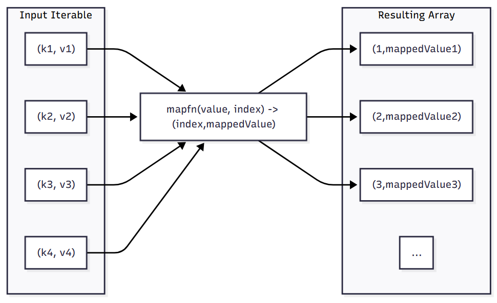
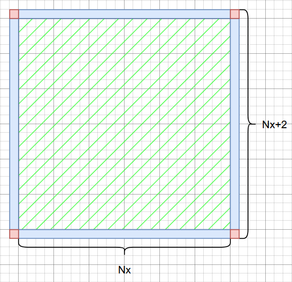

---
categories:
- Phase Field
- Programming
tags:
- JavaScript
- TypeScript
- Numerical Analysis
title: "相场模拟，但是用很多语言 III"
description: 让浏览器跑相场！
image: /posts/PF_Note/Impl_Spinodal/Alice-2.png
imageObjectPosition: center 20%
date: 2026-04-09
math: true
mermaid: true
---

*我们已经用了 C++ 和 Python 来进行相场模拟，除了这种典型的 “后端” 语言之外，前端能不能跑相场模拟呢？答案是肯定的！我们这次就试试 鼎鼎大名的 JavaScript 和 TypeScript 吧~*

*为保持系列的统一，头图我们依旧选择了上期出现的，由 [Neve_AI](https://x.com/Neve_AI) 绘制的 AI 爱丽丝。选曲则是最近（怎么这么多最近）很喜欢的 **ラプラスショコラ(Laplace Chocolate)**，由 [Kai](https://space.bilibili.com/3706933947140196) 作词曲，初音未来献唱。活泼可爱，甚至某种程度有点切题（Laplace <-> Laplacian）？希望您也喜欢~*



## 从浏览器讲起

这次我们把目光放在 JavaScript 和 TypeScript 这两门语言上，因为基础的调幅分解的模拟相信在前两期中已经聊得很多了。而要讲 JavaScript 和 TypeScript，就不得不提我们早已熟悉的互联网入口：浏览器。

### 非常好浏览器技术

我们的生活已经充满了各种各样的浏览器了。从大家了解的知名浏览器如 Google Chrome，Microsoft Edge，Mozilla Firefox，Apple Safari 和一些大家也许尝试过的 UC/QQ/360 浏览器，到藏在软件背后的浏览器，如众多的安卓软件，许多的看起来拥有现代 UI 风格的桌面端应用等等，甚至是平时吃饭点单用的小程序，它们都是各式各样的浏览器。笔者写这篇博客使用的 VS Code 就是用 *Electron* 这个桌面应用框架写成的。如果您的电脑上正好有 VS Code，您可以从 `Help->Toggle Developer Tools` 来打开一个和 Google Chrome 的开发者工具别无二致的页面。

> 唉，怎么现在什么服务都在千方百计让用户下载手机应用或者从微信小程序打开呢？真麻烦呀！如果有一个东西能够把这些东西全都统一起来，那该多好呀！（恭喜你重新发明了浏览器）

为什么浏览器如此流行呢？我想这主要得益于浏览器的技术具有众多的优势：

- 技术结构清晰。人们常说 *前端三剑客*（我们稍后会谈到什么是前端，以及对应的后端）：HTML，CSS 和 JavaScript，这三者分别提供了内容描述，界面样式以及交互逻辑，再加上网络与后端服务器的通信，这些让浏览器生态变得 *近乎万能*，让许多想法都得以在它上面实现。这样优秀的结构设计也方便了人们做网络开发，而这带来的第一个大优点便是：
- 好看。这几乎毋庸置疑，当前的浏览器页面近乎百花齐放，许多伟大的平面设计都在浏览器上得到了空前的发挥，而为了支持这些设计的发挥，浏览器前端技术也在持续不断地发展，以支持越来越多的效果。CSS 的神奇效果与 JavaScript 对页面元素近乎绝对的掌控能力让前端三剑客几乎可以实现任何能想到的效果，区别大概只在于难度与延迟。
- 移植性强。几乎没有某个桌面操作系统没法安装浏览器，而只要能安装浏览器，浏览器相关的那些技术就都可以借助诸如 **Node.js** 这样的本地 JavaScript 运行时和诸多 WebApp 框架来在桌面环境运行 JavaScript 代码，成为一个好看好用的应用程序。
- 生态丰富。这点就比较顺理成章了，当一个东西好用的时候，大家自然就都会涌向这个技术，为它添砖加瓦。这意味着，很多功能我们不需要自己去实现，可以用现有的工具去做，尤其是当我们设计 UI 的时候，同时也意味着前端开发的门槛正在逐步降低。再加上 AI 技术的加持，像我这样的小白也敢对着我的博客用 AI 进行魔改了。

太伟大了，浏览器！然而说的是天花乱坠，前端/后端究竟是什么呢？

### 让我前后端旋转

因为笔者对网络开发并不算了解，这里只能浅谈自己的一点愚见，如有疏漏还望不吝赐教。在笔者看来，前端和后端是相对的，它们相互配合来向用户提供完整的服务。其中的前端代表的是 *和用户交互的部分*，一切用户能看到的，摸到的，直接交互的东西，都应该被划分到前端里。而在用户期望获取服务时，比如点击一个按钮之后，负责 *处理按钮背后代表的业务逻辑* 的则成为后端。

在这样的理解下，实际上前端和后端应该是某种逻辑处理的职责模型，且这样的区分可以不局限于网络开发。比如 Python 桌面应用编程，我们可以用 PyQt 来描述应用有哪些组件而不关心它们要具体干什么，只留下一些接口，随后在别处实现点击按钮之后要执行的业务处理，不用关心这个功能要怎么出现在用户面前。我们也不必拘泥于桌面程序，比如设计一个用在命令行中的 TUI （文本用户界面）程序，那么命令行界面就是对应的前端；设计一个像 `gcc` 这样的 CLI（命令行界面）程序，那么如何合理地传入参数并解析就成为对应的前端问题。

但是这很显然不符合我们对平时 *前端开发* 的印象。当我们说前端开发时，我们在谈什么呢？也许我们提到的主要是如何在浏览器上和用户进行交互。这包括如何设计页面的元素（出现什么文字，放入什么图片，有什么按钮文本框），元素应该出现在页面什么位置，以及按下按钮时应该做什么。

这里你也许会问：前两点能理解，第三点是为什么？按下按钮的情况为什么还需要前端去考虑？那不是后端的问题吗？这就要引出在网络开发中后端是什么了。一般在按下某个按钮的时候，大概率有两种情况，一种是在页面中的操作，比如切换一下页面风格，跳转到某个位置之类，第二种则是要 *与服务器进行通信* 的操作。最常见的如用户注册，当一个用户要注册时，填写表单时前端负责将元素漂亮地展示出来，让用户理解应该做什么，并提供最基础的表单检查；而当用户按下 `注册` 的按钮时，前端要负责的事情则是：让用户知道它按下了 `注册` 的按钮（也许可以变灰或者什么样），以及 *通知后端服务器登记这个条目*。在这个情境下，后端则是一个数据库服务。

一般来讲，前端就是 HTML，CSS 和 JavaScript 这三位了，

那么，前端怎么执行诸如 “按钮按下后该做什么” 的逻辑呢？前端如何与后端通信呢？这就要请出今天的主角：**JavaScript** 与 **TypeScript** 了。

## JavaScript 与 TypeScript

不论是从历史角度还是从逻辑关系，我们都应该先来讲讲这个名字奇怪的 JavaScript。

### 神秘的命名与成功的营销

相信许多不了解 JavaScript 的人都或多或少地因为在某些地方听说过 *Java* 而尝试将它和 Java 联系起来或者简称 JavaScript 为 Java。然而这实在是一个非常幽默且有趣的误会。

在 1993 年，网景（Netscape）公司的创立人们开发了图形用户界面的浏览器 Mosaic，这款浏览器和其后继者 Navigator 大获成功，但很快人们对浏览器的需求就不仅限于 “浏览” 了。为了能够让浏览器页面在加载完成后有一些动态相应效果，1995 年网景雇佣了 Brendan Eich，要求他在浏览器中实现 Scheme，一门脚本语言 Lisp 的方言。然而与此同时，网景又计划着与开发了 Java 的太阳微系统（Sun Microsystems，后来被甲骨文 Oracle Corporation 收购）合作，将它们的 Java 嵌入到 Navigator 中，以此来实现网页的动态功能。两方对比竞争下，网景高层最终决定还是选择使用脚本语言来实现，让这门语言扮演 “胶水” 的功能，但需要有与 Java 相似的语法，且轻量，易用。Eich 在 1995 年 5 月花了 *十天* 时间完成了原型设计，并给了它 Mocha 这个名字。随后，网景的市场部门将名字改成了 LiveScript，在当年的十一月正式随 Navigator 推出，但在十二月时又改名为了 JavaScript，蹭上了当时如日中天的 Java 的名头[^1]，从此就用着这个名字直到今天。

所以，很难说 JavaScript 和 Java 一点关系都没有，但是这层关系大概也只到了 JavaScript 曾经参考过 Java，而且为了能够更好地实现商业化，JavaScript 有意地选择了这个名字吧。但是，目前为止似乎 JavaScript 是专供 Navigator 浏览器使用的脚本语言，但现在什么浏览器都在用这个语言，这中间又发生了什么？其实，有关 JavaScript 名字的故事依旧没有结束。

也许你在某些地方看到过 ECMAScript 的名字，或者在 Windows 系统里看到过一个丑丑的图标。实际上，在 JavaScript 随着 Navigator 浏览器迅速风靡全球之后，在 1996 年 11 月网景公司便与欧洲计算机制造联合会（European Computer Manufactures Association, ECMA）举行了会议，着手对这个语言进行标准化，且被定义在标准文件 [ECMA-262](https://www.ecma-international.org/publications-and-standards/standards/ecma-262/) 中。随后该标准也通过 ISO 标准，成为 ISO-16262 [^2]。

作为一份标准，ECMAScript 标准只要求了如何实现这类脚本，因此应该说，如果要实现自己的符合 ECMAScript 标准的脚本引擎（比如 Firefox 的 SpiderMonkey 或者 Chrome 的 V8 引擎）时，我们才需要参考这份标准，而我们常用的 JavaScript 是 ECMAScript 的原型也是一种实现。而其他的实现中，微软实现的那一份叫做 JScript，就是那个丑丑的图标的文件；也有一些别的，比如 Adobe 手上的 ActionScript 等。不过总的来说，应用最广泛的还是 JavaScript，当大家提到 JS 的时候大概率也是提的那位老资历，JavaScript 了。

### TypeScript: JavaScript，但是静态类型

事实上，在人们发现什么地方都能塞个浏览器的时候，JavaScript 就已经自然地流行起来了。谁不想要美丽的 GUI 界面和炫酷的交互逻辑呢？这实在是太酷了！符合我对 21 世纪美丽互联网的想象。但是这带来了一个问题：想要写出一个灵活，好用，功能强大的基于 JavaScript 桌面程序，其代码量是可想而知的庞大的。但是我们亲爱的 JavaScript 是一门动态，弱类型的语言。我们看看这个著名的地狱绘图：


很可怕吗？是的很可怕…… JavaScript 会贴心地帮你做很多的类型转换，同时贴心地告诉你某两个写法完全一样的东西其实是不一样的。非常地伟大。

But, Y？JavaScript 为何？因为 JavaScript 本身就是一个轻量的快捷语言。这样等于或不等于的背后，其实是类型转换系统在发力。但是即便 JavaScript 背后真的有一套类型系统，在这样的神秘转换下，人们也很容易认为这门语言根本没有什么类型可言。这样的小缺点在处理简单逻辑和小型应用时还算 Okay，但要是考虑使用 JavaScript 去写什么特别复杂的应用逻辑，那我相信没有类型提示的结果就是 Bug 四面开花，神秘报错以及崩溃的秃头程序……

但是我们可以想办法让它有类型呀！没错，微软就是这么想的。2012 年的 10 月 1 日，TypeScript 横空出世。它的目标很简单：让 JavaScript 拥有类型标注。它的做法很简单：写的 TypeScript 脚本将会被静态类型检查器会保证代码没有类型问题，随后就会被 *编译* 为对应的 JavaScript 代码，通过把所有的类型标注删掉。但是它的结果很强大：它解放了 JavaScript 缺乏静态检查的桎梏，让前端技术能够进一步应用在更大体量的程序中。

### Node.js，`pnpm` 与 React

太棒了。那么我怎么才能够运行 JavaScript 和 TypeScript 代码呢？既然它和浏览器有千丝万缕的联系，是不是我可以在浏览器里直接运行 JavaScript？没错，是这样的，但也不完全是。在浏览器中运行 JavaScript 代码的方式是在网页中插入 `<script></script>` 这样的标签，然后在里面运行。但这样的方式多少是有点别扭了。也可以通过开发者工具的 Debug Console 来写两句，但这应该更别扭了……有没有什么可以像 Python 解释器那样的工具来在电脑上不依赖浏览器地运行 JavaScript 代码呢？

有的，兄弟！有的！向您介绍 **Node.js**，一款免费开源跨平台的 JavaScript 运行时环境。Node.js 让 JavaScript 得以独立于浏览器运行，赋予了 JavaScript 作为后端开发语言的能力。要用 Node.js 运行 JavaScript 代码，只需要 `node hello_world.js` 即可！就像 `python hello_world.py` 那样，甚至少写两个字母！

此外，Node.js 还拥有现代包管理系统，`npm`，来为 Node.js 或者任何 JavaScript 项目提供包管理支持。`npm` 提供了现代的 file locking 机制，用以确定项目的依赖版本并允许通过 `npm install` 来自动识别并安装项目依赖。更重要的是，`npm` 是默认将依赖安装在项目文件夹而非全局的。这自动地提供了环境分隔，避免了依赖冲突，与必须手动创建虚拟环境的 Python 相比 Node.js 的做法更显优雅。

不过，我们并不打算使用最传统的 `npm`，而是使用更先进的包管理器 `pnpm`，它提供了更优秀的包管理和依赖解析，让依赖的安装速度更快且支持通过符号链接节省包占据的空间。另外就是我因为某些我也忘了的原因安装了 `pnpm`，而 `npm` 则只装了一个 `pnpm`，那我们干脆就让他依旧单纯下去吧~

而要运行 TypeScript 代码，我们采用 `pnpm` 来安装 `typescript` 包并安装 `tsx` 这个工具。`tsx` 可以直接运行 TypeScript 代码，不需要先 “编译” 为对应的 JavaScript 代码。最后，为了在本地能够打开临时端口观察渲染情况，我们再安装 `vite` 这个工具。

我们前面聊了这么多前端与 JavaScript，那么用 JavaScript 跑出来的模拟结果肯定应该用漂亮的前端漂亮地展现出来漂亮的结果吧！就这么干！我们介绍 **React**，一款 JavaScript 前端组件库，用来搭建美丽的用户界面。React 允许用户使用可复用的组件来设计用户界面，并提供了多种钩子（Hook）来管理控件状态与副作用等。虽然笔者不会 React，但是笔者会让 AI 写 React 呀！再加上美丽群友 [開源 lib](https://ex-tasty.com/) 已有的 React 实例代码，我的评价是：

> 前端，易如反掌口牙！！！

行了，别废话了，赶快进入今天的正题吧！

## JavaScript 的实现

我们照旧，第一版就直接复刻 C++ 的初版程序，用来熟悉这门语言的基础写法吧！

### 好用的语法真不错！

首先我们还是设计一个周期网格循环的函数：

```javascript
function mesh_periodic(u, ker_fun, Nx, Ny, dx, dy, A, kappa) {
  let new_mesh = new Array(u.length).fill(0);
  const inv_dx2 = 1 / (dx * dy);

  for (let j = 0; j < Ny; j++) {
    for (let i = 0; i < Nx; i++) {
      const left = u[j * Nx + ((i - 1 + Nx) % Nx)];
      const right = u[j * Nx + ((i + 1) % Nx)];
      const down = u[((j - 1 + Ny) % Ny) * Nx + i];
      const up = u[((j + 1) % Ny) * Nx + i];
      const center = u[j * Nx + i];
      new_mesh[j * Nx + i] = ker_fun(
        left,
        right,
        up,
        down,
        center,
        inv_dx2,
        A,
        kappa,
      );
    }
  }

  return new_mesh;
}
```

可以看到我们声明函数的时候使用了 `function` 关键字。且依旧没有添加任何的类型。我偶尔还是挺喜欢这种不需要写类型的做法的，特别是清楚每个参数具体是在做什么的时候。而一个 `function` 关键字就能够很清晰地说明这是个函数，真不错。

另外就是 JavaScript 的流程控制语句写法和 C/C++ 真的是一模一样！我很喜欢，这种写法结构清晰逻辑严密，非常好设计。而它进一步超越 C/C++ 的点在于：语句最后的分号 `;` 不是必须的。这实在是非常好的消息，特别是对我这种经常忘记写分号的笨蛋。更好的消息是，VS Code 可以聪明地自己帮你把分号加上，只要在设置中打开这个开关即可，不过我这里就不开了，因为默认是不开的（）

其次，在 JavaScript 中的数组使用的是 `Array` 关键字，且创建新数组需要使用 `new` 关键字，后带对象的构造函数列表。这一点我就不是特别喜欢了：这让我想到了 C/C++ 中的同名关键字 `new`，但在 C/C++ 中是用来在堆上创建对象，而在现代 C++ 中我们是不推荐使用 `new` 关键字而是使用更符合 RAII 的方式去管理资源。也许是因为 JavaScript 诞生的时候已经约定俗成这么写吧？不过问题不大。

接下来值得注意的是声明变量使用的关键字。这里我们使用了 `let` 和 `const` 两种写法，第一种是一般的变量声明写法，而第二种则是常量。这么写的主要目的是方便让引擎做代码优化。然而，更推荐的其实是将 `Array` 声明为 `const` 变量。你也许会好奇为什么这样一个频繁变动的变量反而需要用 `const` 来定义，但是这里的 `const` 实际上表示的是这个 *名称* 不能被绑定在别的变量上，而并不影响变量内部的变动。也就是说，我们现在创建的这个 `Array` 如果用 `let new_mesh` 声明的话，我们下一行就可以让 `new_mesh` 变成 `1` 这么个数字；而如果我们用 `const new_mesh` 的话，`new_mesh = 1` 就会出错了，因为我们尝试将新的值绑定在这个名字上。

最后我们利用了一些小巧思。这里可以看到我们没有用边界判断的语法，而是执行了一次取模运算，这是利用了取模的性质，让内部值取模后不变，右边界右侧的下标在取模后自动成为 `0`，而 `-1` 在加上网格长度后取模就得到右边界的值。最后我们依旧用核函数进行运算并返回运算的结果。

计算 Laplacian 和能量求导的函数我们就不赘述了，我们看看怎么将结果输出到文件里。Node.js 为我们提供了 `fs` 这个模块，我们只需要 `import fs from "node:fs"` 就可以了。而 `write_VTK` 函数我们则这么写成：

```javascript
function write_VTK(mesh, istep, Nx, Ny, dx, dy, folder_name) {
  const vtkContent = `# vtk DataFile Version 3.0
Spinodal Decomposition Step ${istep}
ASCII
DATASET STRUCTURED_GRID
DIMENSIONS ${Nx} ${Ny} 1
POINTS ${Nx * Ny} float
${Array.from({ length: Ny }, (_, j) =>
    Array.from({ length: Nx }, (_, i) => `${i * dx} ${j * dy} 0`).join("\n"),
  ).join("\n")}
POINT_DATA ${Nx * Ny}
SCALARS CON float
LOOKUP_TABLE default
${mesh.join("\n")}
`;

  fs.writeFileSync(`${folder_name}/step_${istep}.vtk`, vtkContent);
}
```

你也许会惊讶，怎么这份代码这么短？其实是我们大量应用了 `.join` 函数来取代了传统的二重循环。在 JavaScript 中存在三种字符串写法，其中 `'` 与 `"` 的效果相似，而当需要使用多行文本时可以 用 `` ` `` 来开启多行文本。而要是需要进行格式化输出，我们可以直接使用 `${}`，在里面写入表达式。这里我们就把输出格点的逻辑用一个表达式写出：

```javascript
Array.from({ length: Ny }, (_, j) =>
    Array.from({ length: Nx }, (_, i) => `${i * dx} ${j * dy} 0`).join("\n"),
  ).join("\n")
```

这一句乍一看有点难懂，是因为我们利用了 JavaScript 的两个有趣的特性。

- （几乎）一切皆对象！

  首先我们介绍 `Array` 这个数据结构。你也许好奇，一个数组有什么好介绍的，但是在 JavaScript 里，数组也是从 *对象* 来的，是一类对象包装起来的语法糖。我们可以用 `console.log(typeof([]));` 来检验，它返回的是 `object`，而不是 `List` 或者 `Array` 之类的。JavaScript 里的对象是什么呢？而 `Array` 是什么样子的对象呢？

  在 JavaScript 里，对象其实就是一个字典。它有许多的键值对，每个键都是独一无二的。而 `Array` 则是 *以 `0` 开始的整数为键，且拥有 `length` 属性的对象*。所以，`{length: 5}` 就已经是一个没有被初始化的，长度为 `5` 的 `Array` 了。

  那 `Array.from()` 又是什么，为什么里面出现了 `=>` 这样的符号？

- 一等公民：函数

  事实上，`Array.from()` 从字面意思能感觉出，它应该是从某个源头来创建的函数。查看它的帮助信息，可以看到：

  ```javascript
  (method) ArrayConstructor.from<any, string>(iterable: Iterable<any> | ArrayLike<any>, mapfn: (v: any, k: number) => string, thisArg?: any): string[] (+3 overloads)
  ```

  前面的 `{ length: Ny }`，按照我们之前说的，应该是符合 `ArrayLike<any>` 的类型的那个 `iterable`，而后面的 `mapfn` 从名字来看应该是个函数。没错，这里我们使用了 JavaScript 的第二种函数声明方法，又称为 *箭头*，或者用另一个名字，Lambda 表达式。

  在 JavaScript 中，箭头这么定义：`(param1, param2) => {statement1; statement2; return value;}`，另外还添加了一些语法糖，比如当参数列表只有一个非临时对象的参数时，可以不写括号（临时对象的话要写上括号来区分后面的大括号），或者当函数只需要执行一行计算并返回时，可以不写大括号和 `return` 关键字，直接写出值即可。JavaScript 作为一门支持并鼓励使用函数式编程的语言，箭头的使用远比目前您可能看到的更广泛。这里只是一个简单的示例。

  那么，`Array.from()` 这个函数应该怎么理解它的参数列表呢？实际上它接受的三个参数中，最后一个带了问号，说明是可选参数，我们这里用不到所以不管了；另外两个参数里，`iterable` 这个参数将会被调用 `.map()` 方法，而 `.map()` 方法接受的回调函数则是之类的 `mapfn`，而 `mapfn` 的类型要求接受 `v` 和 `k`，分别对应 `iterable` 中的值和这个值的键，最后这个回调函数需要返回一个字符串。

  也就是说，我们需要在 `iterable` 中填入我们生成 `Array` 的源，然后通过 `mapfn` 的回调函数定义从这个 `iterable` 的每个键值对生成新 `Array` 中的值的方法。大致逻辑如下图所示：

  

  回到我们的输出逻辑，可以看到这里的映射函数 `mapfn` 选择了从 `(_,j)` 映射到新 `Array` 的写法，而我们只需要返回这个新的 `Array` 所以没有写大括号和 `return`，直接用同样的方法创建了一个 `Array`，新 `Array` 中每个位置都是一个字符串，而字符串的内容则用到了两个下标 `i`，`j`和 `dx` 与 `dy`，最后我们通过 `.join()` 方法将每个位置的字符串用 `\n` 换行符串起来，填入外层列表元素，再将外层的所有值再用 `\n` 再串起来，就得到了一个巨大的字符串。

  这里 `(_,j)` 中 `_` 的含义是我们不需要用这个值，因为我们主要关注的是列表的下标，或者说我们其实只是想生成从 `0` 开始到 `Ny` 前结束的整数序列罢了。另外这个写法并不是我自己写的，而是 AI 帮我做的。非常好写法，让我头脑旋转，也算是见识到了 JavaScript 回调的强大吧。

  事实上，JavaScript 是明确将函数对象作为 *一等公民*，与其他对象平起平坐的。这样的优点在于我们可以更自由地将函数作为参数传递给别的函数。其他语言也可以做到这一点，但是它们的应用方式或者语法限制方面还是不如 JavaScript 来的方便。

我们回到正题，接下来便是写我们的计算逻辑了。这一步可聊的不多，主要在于 JavaScript 自带的数学库 `Math` 和性能检查工具 `performance` 便于我们实现随机数噪声与记录计算用时。这里我们的主网格 `con_mesh` 的定义再一次用到了回调函数：

```javascript
let con_mesh = new Array(Nx * Ny)
  .fill(0)
  .map(() => con_init + 2 * dcon * (Math.random() - 0.5));
```

这里我们先 `.fill(0)` 的原因是要先填好这个网格后再考虑进行映射，而映射规则也很简单，就是不管传入的参数，直接填入数值即可。

第一版的完整代码可以从 [这里](/attachments/Impl_Spinodal/JS/JS_impl_v1.js) 得到，欢迎尝试运行。笔者使用的 Node.js 版本是 v24.14.0，计算时间大概是 1420 毫秒左右。可以看到这份代码的运行速度还是相当不错的。谢谢你，V8 (Node.js 使用的是谷歌的 V8 引擎)！

### 品尝面向对象

接下来我们品尝一下 JavaScript 的面向对象写法。JavaScript 中的类声明很特别，其中的所有方法都不用 `function` 关键字即可定义，且拥有一个特殊方法 `constructor` 作为构造函数。为类定义属性则需要使用 `this.attribute` 这样的写法。另外，我们这次打算做一点小改变，使用面向对象中的 *继承*，让某些类作为 *基类* 并派生出 *子类*，子类可以继承基类的属性和方法，也可以改写基类的方法。这样做的好处在于可以提取一些对象的公共部分，且在传入对象的时候可以限定只对某些公共性质做操作。

在 JavaScript 里继承使用 `extends` 关键字，使用 `super()` 来调用基类的构造函数。我们就用边界条件来做示范：

```javascript
class BoundaryCondition {
  constructor(pos, type) {
    this.type = type;
    this.pos = pos;
  }
}

class PeriodicBC extends BoundaryCondition {
  constructor(pos) {
    super(pos, "periodic");
  }
  apply(mesh) {
    const stride = mesh.Nx + 2;
    if (this.pos === "north") {
      for (let idx = 0; idx < mesh.Nx; idx++) {
        mesh.data[(mesh.Ny + 1) * stride + idx + 1] =
          mesh.data[1 * stride + idx + 1];
      }
    }
    if (this.pos === "south") {
      for (let idx = 0; idx < mesh.Nx; idx++) {
        mesh.data[idx + 1] = mesh.data[mesh.Ny * stride + idx + 1];
      }
    }
    if (this.pos === "east") {
      for (let idx = 0; idx < mesh.Ny; idx++) {
        mesh.data[(idx + 1) * stride + (mesh.Nx + 1)] =
          mesh.data[(idx + 1) * stride + 1];
      }
    }
    if (this.pos === "west") {
      for (let idx = 0; idx < mesh.Ny; idx++) {
        mesh.data[(idx + 1) * stride] = mesh.data[(idx + 1) * stride + mesh.Nx];
      }
    }
  }
}
```

可以看到，我们提取了边界条件最重要的性质，即我们要赋予的边界的方向，并且将边界类型也一并记录在 `BoundaryCondition` 内部，随后让 `PeriodicBC` 继承 `BoundaryCondition`，给它一个新的方法 `apply()`来赋予边界条件。注意到这里我们使用了 `stride = mesh.Nx + 2`，这是为了方便我们在网格内部计算 Laplacian。下面有一个示意图：



可以看到，在主网格（绿色）部分的四周我们加上了蓝色的部分，这部分作为 *边界* 使用，在每次进行网格范围的计算之后单独按照对应规则进行赋值。这样的做法能保证在绿色部分的时候可以直接按照既定计算流程直接计算，避免了边界判断。不过坏处就是我们必须用 `stride` 这样的方式来跨行取点，且做循环的时候需要多考虑一点循环的起始点和结束条件，写起来稍微费一点功夫就是了。

那么，我们能够再在这个 `BoundaryCondition` 的基础上派生出新的边界条件吗？当然可以！我们这里再实现一个固定边界条件，`FixedBC`，作为例子。

```javascript
class FixedBC extends BoundaryCondition {
  constructor(pos, value) {
    super(pos, "fixed");
    this.value = value;
  }
  apply(mesh) {
    const stride = mesh.Nx + 2;
    if (this.pos === "north") {
      for (let idx = 0; idx < mesh.Nx; idx++) {
        mesh.data[(mesh.Ny + 1) * stride + idx + 1] = this.value;
      }
    }
    // Other three boundaries
  }
}
```

可以看到，这次我们的 `consturctor` 多了一个参数，`value`，用来存储边界的固定值。然而有趣的是，我们拥有同样只接受一个 `mesh` 的边界赋值函数 `apply()`，这保证了调用方式的统一。

实际上，我们其实只是想定义一些赋予边界的函数，而这些函数有的不需要参数，有的需要一两个数字作为参数，有一些可能需要别的更复杂的类型作为参数。我们通过将它们打包成类并暴露统一的接口的方式，成功实现了先 *设定边界条件*，随后不用关心具体的边界条件，只需要用 *统一方式* 去应用边界条件即可。随后我们会再次见到这个设计模式。

为了方便统一边界赋值，我们设计了 `BoundaryConditions` 这个类，用来装载边界条件并统一赋值。接下来我们将给网格赋予初始值的过程抽象为初始几何结构 `InitGeometry`，并从它派生出 `RandomInit` 的随机赋值方法，方式类似于上面的边界条件。再下来就是设计网格，它包含的信息其实和之前的大差不差。我们直接来看能量设计：

```javascript
class BulkFreeEnergy {
  constructor(type, params) {
    this.type = type;
    this.params = params;
  }
}

class DoubleWellBulk extends BulkFreeEnergy {
  constructor(A) {
    super("double_well", { A });
  }
  dbulk_dc() {
    return (center_val) =>
      2 * this.params.A * center_val * (1 - center_val) * (1 - 2 * center_val);
  }
}

```

还是一样，我们设计了基类 `BulkFreeEnergy` 并让 `DoubleWellBulk` 继承自它，在初始化时添加参数 `A` 并设计 `dbulk_dc` 函数作为统一接口。这里值得注意的是，`dbulk_dc` 返回的不是单纯的值，而是返回了一个 *箭头*。这么做的目的其实很简单，因为最后参与计算的应该是核函数，而我们如果直接传入 `dbulk_dc` 的话，就必须提前设计函数要接收的参数列表。通过让它返回一个函数对象（箭头），我们可以直接将这个函数的调用结果放在后面的求解器初始化步骤中。

最后的求解器，我们就不再做进一步抽象了，`CH_Solver` 的定义如下：

```javascript
class CH_Solver {
  constructor(mesh, M, dbulk_dc, dint_dc, others = undefined, dt) {
    this.mesh = mesh;
    this.M = M;
    this.dbulk_dc = dbulk_dc;
    this.dint_dc = dint_dc;
    if (others !== undefined) {
      this.others = others;
    }
    this.dt = dt;
  }
  dF_dc() {
    return this.mesh.output_mesh(
      (left_val, right_val, up_val, down_val, center_val, inv_dxdy) => {
        const dbulk = this.dbulk_dc(center_val);
        const dint = this.dint_dc(left_val,right_val,up_val,down_val,
          center_val,inv_dxdy,
        );
        let dF = dbulk + dint;
        if (this.others !== undefined) {
          dF += this.others(left_val,right_val,up_val,down_val,
          center_val,inv_dxdy,
          );
        }
        return dF;
      },
    );
  }
  step() {
    const dF = this.dF_dc();
    const dc = dF.output_mesh(
      (left_val, right_val, up_val, down_val, center_val, inv_dxdy) =>
        (left_val + right_val + up_val + down_val - 4 * center_val) * inv_dxdy,
    );
    for (let j = 1; j <= this.mesh.Ny; j++) {
      for (let i = 1; i <= this.mesh.Nx; i++) {
        const idx = j * (this.mesh.Nx + 2) + i;
        this.mesh.data[idx] += this.M * dc.data[idx] * this.dt;
      }
    }
    this.mesh.boundCons.applyAll(this.mesh);
  }
}
```

可以看到我们设计了两个函数，一个是用来承接能量求解结果的 `dF()`，一个是用来进行单步计算的 `step()`。所有的计算信息都通过构造函数装载进求解器内部。

到了最后的计算步骤，我们的初始化过程就很简单了：

```javascript

const Nx = 64;
// Define numbers ...

const folder_name = "output";
fs.mkdir(folder_name, { recursive: true }, (err) => {
  if (err) console.error("Error creating folder:", err);
  else console.log(`Folder '${folder_name}' is ready.`);
});

const con_mesh = new Mesh(Nx, Ny, dx, dy);
con_mesh.load_boundary_conditions([
  new PeriodicBC("north"),
  new PeriodicBC("south"),
  new PeriodicBC("east"),
  new PeriodicBC("west"),
]);
con_mesh.init_geometry(new RandomInit(con_init, -dcon, dcon));
con_mesh.boundCons.applyAll(con_mesh);

const bulk = new DoubleWellBulk(A);
const interfacial = new GradientEnergy(kappa);

const solver = new CH_Solver(
  con_mesh,
  M,
  bulk.dbulk_dc(),
  interfacial.dint_dc(),
  undefined,
  dt,
);

```

计算过程更是简化为

```javascript
for (let istep = 0; istep < Nstep + 1; istep++) {
  solver.step();

  if (istep % 100 === 0) {
    con_mesh.write_VTK(istep, folder_name);
    if (istep % 500 === 0) {
      console.log(`Step: ${istep}`);
    }
  }
}
```

没错，就是让 `solver` 一直调用 `step()` 函数就可以了。所有的计算逻辑都被分层隐藏起来，到调用环节只需要使用 `step()` 来步进，这实在是太酷了，很符合……

我们看看第二版的运行速度。平均下来竟然只需要 860 毫秒左右！？非常好 JavaScript，使我（）这版的程序您依旧可以从 [这里](/attachments/Impl_Spinodal/JS/JS_impl_v2.js) 找到，欢迎尝试运行！

### 从文件读取数据吧！

然而，一个成熟的程序，肯定不能止步于从内部直接定义各类变量并运行。我们希望实现能够从外部以文件形式传入参数，并让程序读取文件后开始运行。为了实现这一点，我们需要设计解析文件的函数。好消息是，JavaScript 有一个非常标准，且您一定或多或少见过的对象文件格式：*JSON*，即 JavaScript Object Notation。它是开放的数据交换格式，也是许多配置文件会使用的格式之一。如果您和笔者一样使用 VS Code，那您一定见过 `.vscode/settings.json`  或者 `.vscode/launch.json` 这些文件，它们就是用来配置 VS Code 行为的一些配置文件。

另外，因为笔者深受 `Nan` 所困，每次在计算结束后才发现程序往结果里偷偷塞 `Nan`，很讨厌，因此设计了个小函数用来检查计算结果有没有出现 `Nan`，出现的时候就会立刻停止运行并告诉我哪行哪列出现了问题。不过因为这个功能挺消耗性能的，因此我们选择性打开它，可以通过输入文件进行控制。

其次，因为我们的程序变得越来越长（第二版有足足 330 多行），我们考虑将这个大的文件分写成三个部分，分别用来存储 *数据读取*，*数据类型设计* 和 *实际运行* 三个部分。第三版程序以及示例输入文件我们打包放在了 [这里](/attachments/Impl_Spinodal/JS/JS_impl_v3.7z)，欢迎解压后食用。（哦天哪就这点文本有必要压缩吗（））

这个版本的代码跑起来性能波动有点严重，但基本不会超过 1.1 秒，也算是相当快的结果了。

## TypeScript 的实现

品鉴过 JavaScript 之后，能感觉到它的之处在于相对灵活的语法以及不用写明类型的美妙。然而正如我们之前所提到过的那样，当程序体量变大，使用类型检查能够帮助我们更好地写出健康的代码。因此我们下面就再来品鉴一下 TypeScript，看看它能不能给我们带来一些新东西。

### 建立在 JavaScript 之上

我们第一版就直接复刻 JavaScript 的最后一版程序，且我们选择让 AI 代劳。AI 这么好用，且给代码标记上类型也不难，何乐而不为呢？我们这次就不分开写了，直接把代码放在 [这里](/attachments/Impl_Spinodal/TS/TS_impl_v1.ts) 吧，方便您查看并运行。

对比 JavaScript 的实现，可以看到 TypeScript 的实现中有很多的 `type` 关键字定义的形如类定义或者运算的代码，比如

```typescript
type BoundaryPosition = "north" | "south" | "east" | "west";
type BoundaryType = "periodic" | "fixed";

type ParsedBoundaryConfig = {
    position?: unknown;
    type?: unknown;
    value?: unknown;
};
```

这实际上是在规定符合类型的内部应该有一些什么。这里 `BoundaryPosition` 就表示只接受四种字符串，否则类型检查会报错，而 `ParsedBoundaryConfig` 则要求这个类型的对象拥有三个可能存在的属性，且三个属性的类型，为了安全起见，都设置为了 `unknown`，用来在后面进行处理。

此外，一些类内部也发生了变化。变化最大的也许就是构造函数了。我们以用来接收网格信息的 `MeshConfig` 类为例：

```typescript
class MeshConfig {
    constructor(
        public readonly Nx: number,
        public readonly Ny: number,
        public readonly dx: number,
        public readonly dy: number,
        public readonly minVal: number,
        public readonly maxVal: number,
        public readonly boundaryConditions: ParsedBoundaryConfig[],
    ) { }
    // other methods...
}
```

可以看到我们不再从参数列表里定义好参数之后，再在函数体内使用 `this.attribute = attribute` 这样的写法定义里面有什么属性，而是直接将它们写在参数列表里并让函数体里什么都没有，这样就已经完成了类的初始化了。如果要定义别的属性，可以参考后面的数据类 `Mesh`：

```typescript
class Mesh {
    readonly inv_dxdy: number;
    readonly data: number[];
    readonly boundCons: BoundaryConditions;

    constructor(
        public readonly Nx: number,
        public readonly Ny: number,
        public readonly dx: number,
        public readonly dy: number,
        data?: number[],
        boundCons?: BoundaryConditions,
    ) {
        this.inv_dxdy = 1 / (dx * dy);
        this.data = data ?? new Array((Nx + 2) * (Ny + 2)).fill(0);
        this.boundCons = boundCons ?? new BoundaryConditions();
    }
    // other methods...
}
```

可以看到，这里除了 `constructor` 的参数列表外，还有两个位置与之前不同。一个是在构造函数前面就声明了一些 `readonly` 的属性，它们则像往常那样用 `this` 定义在构造函数体内部用来赋值。总体而言，这样的设计方便我们进行访问控制，避免意外改变数据。

最后值得一提的是，我们可以真的定义某个函数的类型！定义的方式则和箭头的写法类似：

```typescript
type DBulkDC = (centerVal: number) => number;
```

这里我们就定义了 `DBulkDC` 这个类型，它应该是接受一个数字并返回另一个数字的函数。这样的设计方便了我们将函数参数传入别的函数内部的操作。

这版代码的运行速度如何呢？经过几次测试，运行速度稳定在约 1030 毫秒左右。这个结果我算是相当满意了，一秒多就跑完还要什么自行车是吧？

### 受不了了，我要在浏览器跑它！

结果，我们写了这么多版本的代码，竟然没有任何一个是在浏览器上运行的，都是在 Node.js 上跑的……这实在是和这些前端技术的应用场景不符呀。那么最后，我们就借助 Vite 的力量以及伟大群友 [開源 lib](https://ex-tasty.com/) 在我博客内嵌入的神秘力量，来实现它在浏览器的运行吧！

我们选择的库是 React，它的优点我们之前也已经介绍过了。为了让 Vite 能够直接运行，我们让 AI 搓了一个 HTML 文件，在里面使用 `<script type="module" src="./TS_impl_v2.ts"></script>` 的方式来将我们的代码结果放在浏览器上。TypeScript 代码和 HTML 代码放在了


[^1]: 来源自 [Speaking JavaScript, Chapter 4. How JavaScript Was Created](https://exploringjs.com/es5/ch04.html)
[^2]: 来源自 [JavaScript and the ECMAScript specification](https://developer.mozilla.org/en-US/docs/Web/JavaScript/Guide/Introduction#javascript_and_the_ecmascript_specification)