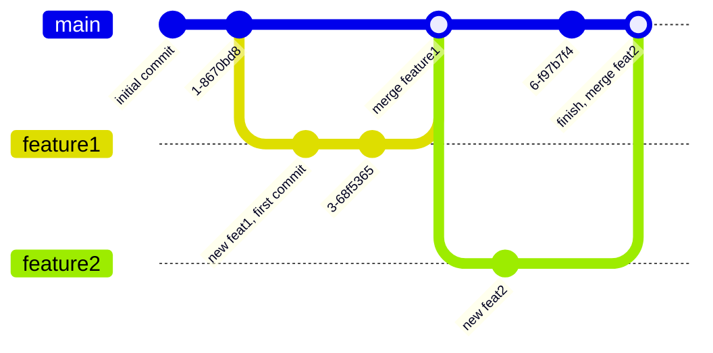

---
categories:
# - Mathematics
- Programming
# - Phase Field
# - Others
tags:
- Shell
- Tools
- Notes
- VCS 
title: "Git，你能帮帮我吗？其二"
description: "看看 Git 分支（branch）吧！"
date: 2025-07-28T22:49:16+08:00
image: /posts/Shell_Note/Git_How/Tatara Kogasa.jpg
math: true
license: 
hidden: false
comments: true
draft: true
mermaid: true
---

*上一节已经介绍了平时会怎么用 Git 进行单分支仓库的管理，这一节就来讲讲 Git 要怎么进行多分支协作吧！*

*头图信息请参考上一节内容，谢谢~*



## 分支，是那个分支吗？

我们上一节已经了解过 Git 在单分支下的日常工作流了。值得注意的是，我们说的是 “单分支”，那么自然，Git 是支持，同时鼓励使用多分支的。那么分支是什么呢？

也许有过 Galgame 经验，或者玩过有分支剧情游戏的你已经想到所谓的 “分支” 是什么东西了。没错，很像这么回事儿，不过功能更丰富一些，因为你不止是体验若干个分支的剧情，Git 甚至可以允许你在没有冲突的前提下合并两个分支！如果有一款游戏支持用 Git 来操控分支的话，也许就可以手动后宫了……

咳咳，不开玩笑了。我们来看看分支具体是什么样的。先来个分支图：

### 一个也许简单的 Git 分支示意图



（嘶，mermaid 竟然直接有 gitGraph 的功能，NB）

那么可以看到，我们这里有三条分支：一条 `main`， 一条 `feature1` 以及一条 `feature2`。有时我们开启了一个分支，有时我们又将两个分支进行了合并。上面的图是怎么生成的呢（双关意）？下面是用到的代码：
```
gitGraph
    commit id: "initial commit"
    commit
    branch feature1
    checkout feature1
    commit id: "new feat1, first commit"
    commit
    checkout main
    merge feature1 id: "merge feature1"
    branch feature2
    checkout feature2
    commit id: "new feat2"
    checkout main
    commit
    merge feature2 id: "finish, merge feat2"
```
Mermaid 的 gitGraph 很有趣的地方在于，上面的代码几乎就是为了实现这样的提交树/分支形状所需要的 Git 命令。我们可以不管 `id` 后面的部分，因为这些在实际 `commit` 的时候应该是用 `-m` 来指定的提交信息才对。

那么，这些命令都干嘛了？要怎么用命令来操控分支？

## 和分支相关的命令们

下面来讲讲上面出现的（和没出现的一些）命令吧~

- `git checkout`

    说实在的，这个命令真的是个很大的坑。`git checkout` 从 Git 诞生之初就已经存在，它是集创建、管理、变更分支或提交等功能为一体的一个命令。造成这个情况的主要原因在于 `git checkout` 实际上不是在我们现有的对 Git 存储模型的理解上进行操作，而是在 Git 更贴近实现层面的操作，即移动 “指针”。

    然而，我们这里先不打算介绍这么深入/详细。我们还是从实用角度来聊聊这个命令。观察上面的 Mermaid 图，我们可以看到，好像 `git checkout` 的功能没有直接体现在图上。然而仔细观察的话可以猜到，`git checkout` 在这里的作用是更换分支。比如，`git checkout main` 就是告诉 Git “现在我要切换分支到 main 分支上”。这是 `git checkout` 的主要用途之一。另外我们还可以用 `git checkout -` 来像 `cd -` 一样切换到上一个分支。

    我们还可以对这个命令多讲一些。如果给它带上 `-b` 的参数则可以用来创建一个新分支。比如 `git checkout -b new-branch` 就可以创建一个新的名为 `new-branch` 的分支，同时你还会直接切换到该分支上。而如果你在后面带的参数是某个文件或者单纯的 `.`，则是要让 Git 该文件/所有文件里没有暂存的更改。

    上面说的都是比较老派的做法。相信你也一定从上面的 Mermaid 图中猜到了新式的创建新分支的方法，那就是：

- `git branch`

    这个命令是用来管控和单个分支相关的操作的。我们简要介绍一下。
    
    如果后面不带任何的参数，则是会打印出可用分支。如果要创建一个新的分支，就可以用 `git branch <another-branch>`, 就是让 Git 尝试创建一个名为 `<another-branch>` 的分支。当这个分支已经存在的时候，Git 就会报错，告诉你已经有了叫这个名字的分支了。

    要注意的是，`git branch <branch-name>` 只会创建分支，并不会把当前分支更改到这个新分支上。要想在创建分支后切换分支，除了传统方式 `git checkout` 外，还可以使用更现代（？）的命令：`git switch -c <branch-name>`。我们后面会介绍到。

    除了创建分支以外，我们肯定还希望能实现查看/删除/重命名分支。我们干脆都列在下面吧。如果不想看可以跳过这一段。

    - 要查看分支，可以直接 `git branch`。如果要看所有的分支（包括远程的），可以使用 `git branch -a` 来查看。你还可以使用 `-v` 来输出上次提交的信息。
    - 要创建分支，就像上面说的，在后面补上你要的分支名称，即 `git branch <branch-name>`。如果这个分支已经存在则会报错，另外这个命令只会创建，并不会切换过去。
    - 如若要从某个提交上创建分支，还可以在 `<branch-name>` 后面添加上 `<commit-hash>`。至于 `<commit-hash>` 是什么，我们在后面关于 Git 的一些概念里进行介绍。
    - 想要删除分支，可以用 `git branch -d <branch-name>` 来删掉它。要是你要删除当前分支，请先切换到别的分支哦。
    - 要是打算重命名分支，可以考虑像操作文件一样 *移动* 它：`git branch -m <branch-name> <new-name>`。依旧，这个命令也只能更改别的分支。

    So, that's it! Git 针对单分支的操作都可以用 `branch` 子命令来做到。那么，我们要怎么切换分支呢？除了 `checkout` 以外，“比较现代”（存疑）的方法是使用：

- `git switch`

    这个命令是相对较新的用来切换分支的命令。可以通过 `git switch <branch-name>` 来简单地实现切换。有趣的是，我们还可以用 `git switch -c <branch-name>` 来创建新分支的同时切换过去。也就是说，`git switch -c` 命令和 `git checkout -b` 几乎是等价的。另外我们可以使用 `git switch -` 来直接跳回上一个分支。

    另外还可以考虑使用 `git switch -m <branch-name>` 来在切换分支的同时把当前分支合并到要切换的分支上。这一点还是相当不错的，因为我们经常会遇到这样的情形：在 `dev` 分支上完成某个特性之后，经过测试希望能合并到 `main` 分支上。如果没有这条命令的话，我们可能需要先 `git checkout main` 之后再 `git merge dev`，而有了这条命令我们就可以简单地 `git switch -m main` 了。

    总之，如果你需要切换分支，你就可以使用 `switch` 这个命令。语义很明确，不是吗？

- `git merge`
    
    这个命令，如它的名字一样，是用来合并分支的，或者，不那么明显地，*合并到当前分支*。它的使用方式相对而言比较简单，就是单纯的 `git merge <branch-name>`。

    这个命令的主要问题是，合并过程中会出现恶魔般的 *冲突*。解决冲突实在是一件令人头痛的事情（在我看来）。为了避免（逃避）合并冲突后的麻烦，你可以考虑 `--abort` 参数来告诉 Git 如果合并失败就什么都别动。然而，要是你真想合并，到底还是要解决冲突的。

    其实解决冲突就是一个 “选择应用谁的代码” 的过程。Git 会在发生冲突的地方用箭头标出来本分支和被合并分支的内容，你要做的就是把你不要的那个部分删掉然后保存。另外，合并会创建一个新的提交。如果你不喜欢默认提交信息，可以考虑使用 `-e` 参数来告诉 Git 你打算自己编辑合并产生的提交的提交信息。

    最后就是 Git 合并时有不同的策略。我们这里不多介绍，大部分情况可以使用 `ff` 模式，即 *Fast Forward* 模式。这个模式会让你的提交树看起来是一条直线，即如果历史提交相同的话就让两个分支有同样的提交了。

分支命令就先聊到这里吧。因为我们说 “分支协作”，协作也很重要呀。我们应该在这里引入一下和其他人协作时会用到的，以及和远程仓库交互时会用到的一些操作及命令。


## 后记

我必须立刻承认我这篇文章离不开 `tldr`，准确来说是 `tealdeer` 的帮助。很难想象没有 `tldr` 我要怎么介绍可用命令。唉，还是对 Git 不够熟悉。