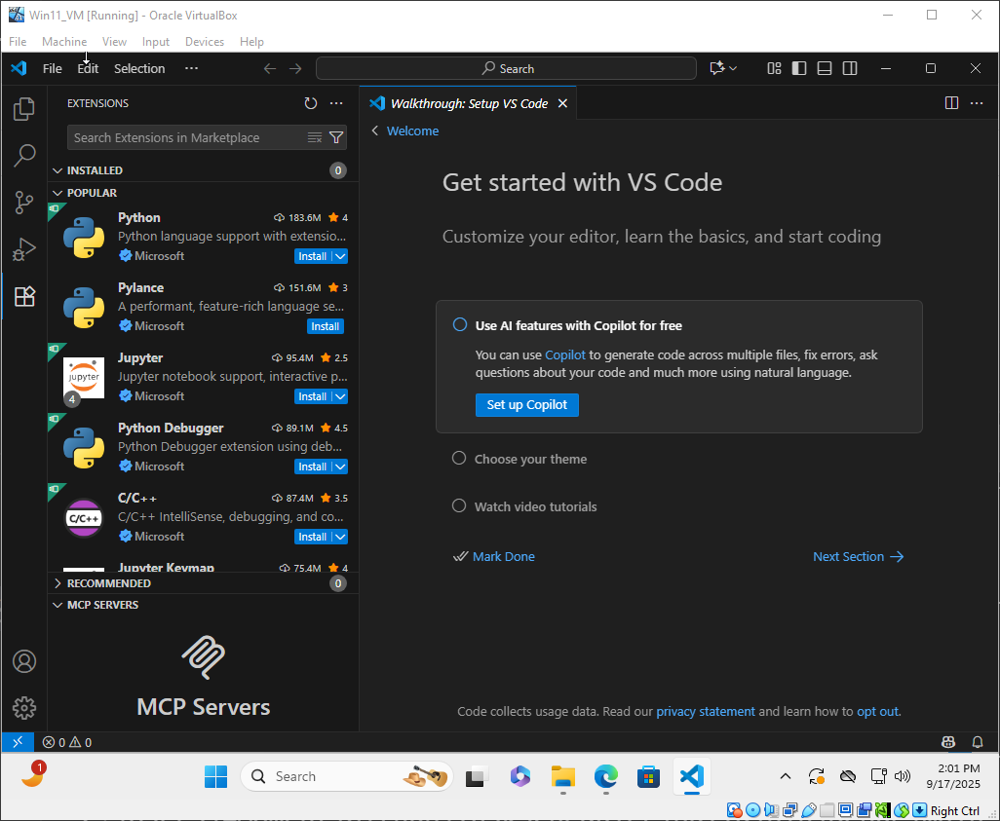
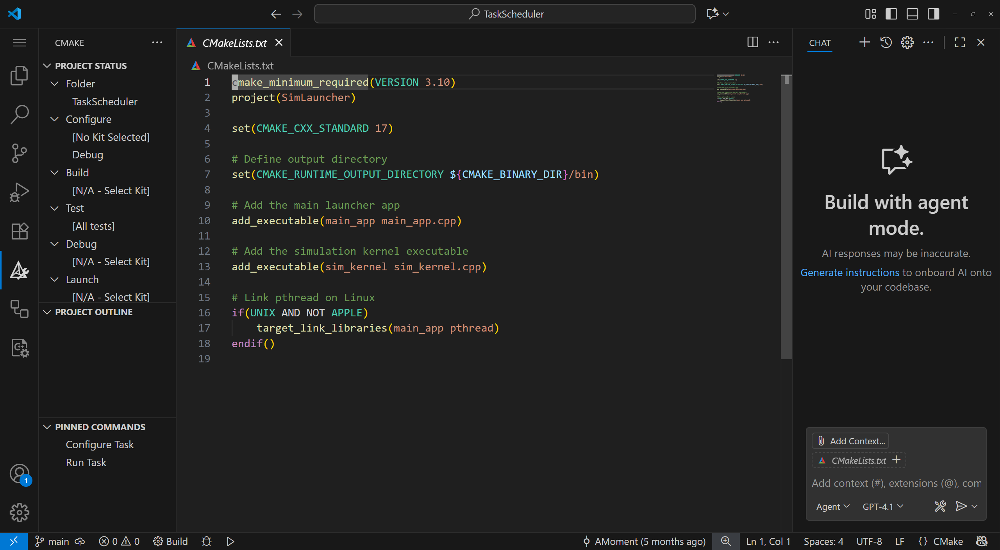

---
categories:
# - Mathematics
- Programming
# - Phase Field
# - Others
tags:
- Note
- VS Code
- Software
- Document
title: "VS Code 也许其实是 IDE"
description: "怎么用 VS Code 当 IDE：以 C++ 为例"
date: 2025-09-17T14:35:38+08:00
image: 猛独が襲う.png
imageObjectPosition: center 20%
math: true
hidden: false
comments: true
---

*虽然 VS Code[^1] 严格来讲是编辑器（Editor），然而其实它更像是一个伪装起来的集成开发环境（IDE，Integrated Development Environment）。而且，它最强大的功能其实在于它强大的远程功能。这次我们就来聊聊怎么把 VS Code 配置成一个堪比 Visual Studio 的多用途 IDE 吧*

*本次挑选的歌曲是光受好评，翻唱无数，且我自己很喜欢的一首术曲：由 P主 [一二三](https://twitter.com/hihumi_v) 做词曲的 **猛独が襲う**。中午偶然听到了这首，感觉非常不错，就选择是她了。头图就顺手选择同样很好看的这首歌的 MV，由 [休符](https://twitter.com/kyu_fu) 所绘，实在是非常好看~ 另外还要特别指出，这首歌无敌的吉他是由 [じゅみ](https://twitter.com/junjun_mimi03) 演奏的。我必须立刻承认这首歌的吉他是我最喜欢的部分（）*



## 介绍一下先

VS Code，一款备受瞩目的编辑器，由 Eric Gamma 于 2011 年开始开发，并于 2015 年 4 月 29 号正式发布[^2]。这款基于 Electron 框架（或者，浏览器）的编辑器目前已经成为几乎所有程序开发者工具库中必不可少的一部分了。它除了有美观、现代化的界面以外，开放的态度（VS Code 的基础功能是开源的，其开源打包称为 *Code-OSS*）更是吸引了许多开源爱好者的目光。而他杀手锏级别的特点，则是其极其丰富的插件市场以及生态环境，我只能说伟大，无需多言（可惜也只能伟大一点儿，因为插件市场很多插件是微软的版权，可惜）。

VS Code 其本体已经提供了许多的功能了：好用的集成终端、输出窗口、调试台等，标签式的页面，丰富的侧边栏功能，集成的文件浏览器等等，甚至提供了原生的 JavaScript / TypeScript 支持（因为这个编辑器就是用它们写成的）。而有了插件的加持，它真的就已经几乎成为一款 IDE 了。比如装上微软的 C/C++ 插件，你就可以使用 VS Code 编写 C++ 代码的同时，直接运行与调试 C++ 代码。而装上 CMake 插件之后，你就可以使用 CMake 管理整个项目了，右侧侧边栏会提供比较详细的配置项。我们后面就来以此为例，配置如何使用 GCC + CMake + VS Code。

<details>
<summary>编辑器，编译器和 IDE，它们到底是啥？</summary>

某种程度上，这也是一个老生常谈的问题了。

我们先说说（文本）**编辑器**，英文是 Editor。我们都不陌生，在电脑上写东西的时候经常会用到它们。它主要是为了编辑文本内容而生，最基础的功能就是换行，退格，保存等等这些也许你早已经习以为常的东西。我们介绍几个编辑器：VS Code，Vim，Emacs，微软记事本等等。总之，编辑器就是让你用来编辑文档的。除了文本编辑器之外，我们可能还会用到二进制编辑器以及其他的一些编辑器，它们的核心功能都是为了让用户编辑内容。

而**编译器**就是一个完全不一样的东西了。编译器的英文是 Compiler，它的功能是把程序（文本文件）根据语法规则编译成二进制文件，来让机器读取。编译的产物可能是一个可执行的文件，也有可能是不可执行的东西，但是它们的特点都是没法直接用文本编辑器等打开，或者你得用专用的二进制编辑器打开并编辑。编译器也有很多种，就拿 C/C++ 这门语言来讲，著名的三大编译器就分别是 `gcc`/`g++` （同属 GCC 编译器工具链），`clang`/`clang++` （LLVM 的编译器前端，后端同为 `llvm`），`cl` + `MSVC`（从名字就能看出来，是微软的家伙）。而别的编译型语言几乎也都有自己的编译工具。有趣的地方是，大多数的编译器都是依托于 GNU 的 `GCC` 工具链 （GNU Compiler Collection）或者依托于 LLVM 后端的。不过这都是后话了。

最后就是 **IDE**。全称是 *集成开发环境*，英文全称则是 *Integrated Development Environment*。它是编辑器和编译器以及其他许多工具比如调试器，性能分析，静态检查工具的集合体（*集成*一词的说法）。C/C++ 最著名的 IDE 就是传说中的宇宙第一 IDE：Visual Studio 了，或者是同样备受赞誉的 JetBrains 家的 Clion。另外 JetBrains 开发了多款 IDE，几乎所有主流语言 JetBrains 都有对应的 IDE 可用。

了解这些概念，在讨论相关话题的时候表述会清晰很多。不过即便不清楚，问题也不太大就是了（）这也是由于现在很多编辑器正朝着 IDE 的方向发展了，比如本期的主角，VS Code。所以也有开发者认为，VS Code 就是一款 IDE，我表示理解。

</details>

## 首先当然是下载咯

其实关于 VS Code 的下载问题，我在 [这篇文章]() 中已经提过了。不过如果你不想翻那里的内容，那也可以跟着下面的内容来。

### 我们先下载程序本体

我们仅考虑 Windows 端的使用，请使用 GNU/Linux 的朋友自行选择自己家的包管理器以及想安装的版本（毕竟，使用以开源著称的 Linux 的你可能不希望使用 Microsoft 的专有软件：Visual Studio Code）。这里介绍两种下载方式，一种是从官网下载，点[这个链接](https://code.visualstudio.com/download) 就会直达下载页面。


我们可以注意到这里有一个大大的下载按钮，底下还有几个选项，什么用户安装，系统安装，x64 啊 ARM 啊的。如果你不知道该选哪个，点那个大按钮。它会下载用户版的。如果你清楚自己需要什么版本，请自便。这里简单提一下用户安装和系统安装的区别。如果你的电脑只有你一个账户使用，用户安装方便又快捷，不会出错；如果你的电脑有多个账户且你想让每个账户都可以用上 VS Code，请使用系统安装版本。但是这样会有 UAC (User Access Control)的烦恼，且很多时候你修改个什么文件都会让你用管理员权限搞 （即会弹出 UAC）。

下好安装包之后打开安装包，先同意它的用户协议，然后是路径（可以不改），要不要添加开始菜单（可以不管），随后会遇到这个页面：


这里我推荐选择把 `使用 Code 打开` 集成到文件浏览器的选项。不过如果你觉得你的文件管理器右键菜单栏已经够凌乱了，那就算了吧。之后就会让你确定你的安装选项，没问题就安装吧。

另一种下载方式我个人不是特别地推荐，即使用 Windows 的包管理器下载。较新的 Windows 版本搭载了一款还不错的包管理器，`WinGet`，你可以使用 `winget install Microsoft.VisualStudioCode` 来直接使用 `winget` 的命令行安装，但是这样的安装方式有个问题：它没有文件浏览器集成（即右键菜单的 “以 VS Code 打开” 这样的选项）。WinGet 给了解决方案，但是有点丑陋：`winget install Microsoft.VisualStudioCode --override '/SILENT /mergetasks="!runcode,addcontextmenufiles,addcontextmenufolders"'`，而这个问题的原因竟出奇地搞笑：传给 WinGet 的默认命令行参数里写错了，把 `MERGETASKS` 写成了 `MERGETAKS` （少写个 S）。以上信息来自 [这个讨论串](https://github.com/microsoft/winget-cli/discussions/1798)，感兴趣可以看看。

不过无论如何，你这时应该已经安装好了。激动的心，颤抖的手，点开软件准备大展身手的你也许会发现：界面全是英文的。也许你觉得英文界面全对，但是这样还是比较小众的（）那怎么汉化呢？这么牛逼的软件应该有不错的本地化才对呀？别急，解决方案在下面：

### 必须立刻开始安装插件

考虑到我们是第一次装 VS Code，应该不需要考虑从账户同步安装的插件。所以，我们的第一件事就是，点击左边的插件市场图标，或者快捷键 `Ctrl+Shift+X`，打开插件市场。



如果你需要中文插件，请安装 **Chinese (Simplified)（简体中文）Language Pack for Visual Studio Code** 的插件（搜索 Chinese Language Pack 就会出来）。是的，VS Code 的所有本地化都是通过微软发布的这个本地化插件实现的。如果你喜欢异域风情，你也可以试试其他语言的本地化插件。

下载插件时，如果你是第一次下载某个人/组织打包的插件， VS Code 会问你要不要信任这个插件作者。一般而言，不要瞎装的前提下，这些作者都是可信的。VS Code 的插件是有过投毒历史的，还是请小心行事。

下来就是我们的主题了，我们需要在 VS Code 上开发 C++ 项目，为此我们需要下载 **C/C++ Extension Pack** 这个插件包，它算是微软的 C++ 插件全家桶，里面有 **CMake Tools**（用于集成 CMake 项目管理），**C/C++**（微软家实现的 C/C++ Language Server Protocol，包括代码高亮，连接编译器/调试器等），以及让你的代码有好看的语义高亮样式的 **C/C++ Themes**。有了它们，你就可以愉快地在 VS Code 里写 C++ 了！

最后，注意到我们还需要在远程做开发，为此我们还得安装 **Remote - SSH**，**Remote - SSH: Editing Configuration Files** 以及 **Remote Explorer** 这三个插件。当这些都安装好之后，我们就可以开始准备工作啦。

## 先在本地试试 C/C++ 开发吧！

在直接开始在远程进行开发前，我们最好先熟悉怎么在本地进行 C/C++ 开发。原因很简单：远程配置我们还没搞，而 C/C++ 开发不管在本地还是在远程都是差不多的。

实际上，VS Code 在它的官网上写了很多指南，比如这篇 [C/C++ for Visual Studio Code](https://code.visualstudio.com/docs/languages/cpp) 就大概介绍了一下怎么用 VS Code 编写、调试简单的 C/C++ 代码。而后面更是有专门的一部分（从在上面这篇文章的左侧栏就能找到）用多篇指南文章来介绍各个平台、各个编译器下的 C/C++ 开发配置。详细到我觉得我单独写一遍完全是画蛇添足，是没有必要的。

那么，我们这里写什么呢？我们介绍一下 CMake。不过在这之前，我们不得不介绍一点点 C/C++ 项目构建这件事的历史。

### C/C++ 项目构建的小小历史

虽然在最最最开始的时候，一切都很简单：我们写好源码之后，告诉编译器 “你给我编译了” 就行了。拿我们亲爱的老牌编译器 `gcc`（或者 `g++`，这个是 C++ 专用的）来说吧，当我们要编译写好的程序的时候，我们只需要 `gcc source-code.c` 或者 `g++ source-code.cpp` 就可以编译出来一个 `a.out` 的文件了。

然而，随着工程越来越复杂，我们已经没法让 `gcc` 一个个地编译这些文件了。也许我们可以用 Shell 的一些功能来批量选择文件编译，那要选择性编译的时候呢？对不同的对象要采用不同的编译选项的时候呢？如何自动处理大型项目里的依赖关系？这些问题当时就给出了一些解决方案，在 Linux 上这个方案是使用构建工具 Make。人们在项目文件夹里添加一个 `Makefile` 文件，在里面像是写脚本一样告诉编译器应该怎么编译文件夹中的文件，对它们中的哪些要做什么处理，等等。而当写好之后，只需要在命令行里使用 `make` 命令，就会自动读取 `makefile` 然后调用对应的工具，使用设定好的编译选项以及正确的编译顺序进行编译（或者从项目的角度，项目构建）了。

那 CMake 又是怎么回事呢？是这样的，C/C++ 代码在设计上是能在多种架构的机器上都能运行的，但是需要有对应的编译方式。而且，Makefile 的语法还是有一点难学。为了实现一份代码、到处编译的这样崇高的理想，自然地就诞生了 CMake，这样一个 “调用 Makefile 这样构建工具的构建系统生成器”。为了适应不同平台的各种构建工具，它必须有一套独立的配置方式。而又由于它是通过调用平台已有的构建器来编译代码的，你需要告诉它你要用哪个。如果是 Windows 平台，你也许会使用 MSVC 或者 微软打包的 NMake；如果你在 Linux 发行版上，你大概率会使用 Makefile；如果你想尝鲜，或者你的项目尤其庞大，希望提高构建速度，你可能会使用 Google 出品的 Ninja …… 但是你需要告诉 CMake 你要用哪个。

在你告诉 CMake 你要使用的构建工具后，CMake 就可以为你生成一个让你或者它用来构建项目的 `build` 文件夹，里面就是 CMake 生成好的用来描述你的项目的一大堆构建文件。这时候你可以使用构建工具从这个文件夹里进行构建，也可以让 CMake 帮你调用对应构建工具进行构建。我们简单说一下这几步用命令行怎么搞。

### CMake 怎么（手动）构建？

首先我们介绍老派方法。我们用一行但是多个命令来做这件事，在我们的项目根目录下使用

```shell
mkdir build; cd build; cmake ..; make -j
```

就可以生成构建文件并构建项目了。我们一步步来：通常我们会新建一个 build 文件夹来让 CMake 把所有的构建文件相关的内容都放在里面；之后我们进入这个文件后告诉 CMake 我们要构建的项目是项目根目录，CMake 就会读取根目录的 CMakeLists.txt 后把构建文件统统写入当前的工作目录（也就是 `build`）。最后在构建文件生成结束之后，我们就调用构建工具来进行项目构建了。这里我们演示的是 `make -j`，会让 Make 以多线程方式进行编译工作。

然而这一套体操实在是太丑陋了。我们得手动进入一个新建的 build 文件夹后进行构建，怎么想都很奇怪。虽然这样确实很灵活：不想起名叫 `build` 也是完全没问题的，但是总觉得不够现代。

新派的方法是这样的，我们在项目文件夹下执行：

```shell
cmake -S . -B build
cmake --build build
```

这第一行代码是说，我们首先用项目文件夹里的 CMakeLists.txt 来进行项目配置，把项目配置放在 `build` 文件夹里。其中 `-S` 就是指明项目根目录在哪里，这里选择当前目录；`-B` 是指明我们要把配置内容放在哪里，我们选择了 `build` 文件夹。这个命令会在有 `build` 文件夹的情况下直接放进去，在没有这个文件夹的条件下会自己乖乖创建一个出来。而第二行代码，就是告诉 CMake，我要构建这个项目了，你帮我读取 `build` 文件夹里已经有的项目配置，然后给我构建吧。可以看到这个方法是比较符合我们对 CMake 这个工具的预期的。至少它不需要外部命令来帮它做一些事了。不过如果你喜欢老方法，也没问题，CMake 的前向兼容还是不错的。

### CMake 其实是老油条（

CMake 目前已经逐渐成为事实标准：各大知名库都会提供 CMake 的模块来方便调用它们，而各大包管理器（没错，C++还是有一点包管理的，虽然不多且不统一）通常也提供了 CMake 的集成。虽然 CMake 的语法十分难评（怎么 if-elseif-endif 都像是用函数实现的？！？？！？），但是目前而言，受广泛检验的，比较好用的项目构建工具，还得是它。

CMake 也是有在尝试变得好用的。比如 Presets 可以让我们快速应用某些构建选项，而 AI 的出现几乎完美解决了 `CMakeLists.txt` 难写的顽疾。所以，还是用吧。有 VS Code 的集成和 AI 的帮助，构建项目就是点点鼠标而已，还是挺方便的啦。然而有人说：我就是不用 AI！这又该如何呢？我们就再简单谈谈 CMakeLists.txt 的基本写法吧。

### CMakeLists.txt 怎么写？

首先这个文件特别奇葩的一点是，名字一点儿不能差，不是 CMakeList，不是 CMakeList.txt，它就得是 **CMakeLists.txt**，注意大小写哦。如果你按照上面说的，安装了 **C/C++ Extension Pack** 的话，你的 CMakeLists.txt 应该是有语法高亮的。

对于简单的项目，我们主要是要告诉 CMake 项目名称，编译对象以及输出的结果。我们首先在项目根目录创建这个文件，底下是一个简单的示例：

```cmake
cmake_minimum_required(VERSION 3.15)
project(HelloCMake VERSION 1.0 LANGUAGES CXX)

# Set C++ standard
set(CMAKE_CXX_STANDARD 17)
set(CMAKE_CXX_STANDARD_REQUIRED ON)

# Define the executable
add_executable(hello src/main.cpp)
```

上面的内容，首先先告诉 CMake 这个 CMakeLists.txt 对 CMake 版本的最低要求。这是为了兼容性考虑的：有些平台可能并没有较新的 CMake 版本可用。这个东西自然是越低越好了，因为越低的话兼容性自然更强；但是你也可以使用很高的版本，强制要求使用高版本可以让你更放开手脚用新版本里更好用的配置。

接下来是定义我们的项目属性。它得有个名字，放在第一个位置；得有个版本，用 `VERSION` 打头后面跟上具体版本号。这个版本号你自己决定，测试用的案例这个不是很重要；最后告诉 CMake 我这是个什么语言的项目，用 `LANGUAGE` 打头后面接上 `CXX` 作为语言类型，告诉它是 C++ 项目。为什么不是 CPP, C++ 而是 CXX 呢？这大概涉及到 C++ 诞生之初的一些设计名称的扯皮，不太重要。有趣的地方是，`CXX` 也是推荐的 C++ 源文件拓展名之一。希望这能让你接受这里使用 `CXX` 这一点。如果你的项目还要用上 `C` 的话，在 `LANGUAGE` 后面补上，用空格分开就好。

接下来就要设置和 C++ 相关的内容了。我们首先指明要用的 C++ 标准版本，这里使用了 C++17 标准；其次我们在下一行表示这个标准是必须的。注意到我们用的是 `set` 这个很像函数的东西。实际上我们是在设置一些变量，这些变量会传递给 CMake 来控制 CMake 的配置和编译时的行为。

最后我们就是告诉 CMake 这个项目里面的目标（target）了。我们说我们要给项目里加一个可执行文件，它的名字叫做 `hello` 而它的源码有 `src/main.cpp` 这些文件（好吧其实只有一个）。这样一来 CMake 就知道哪些东西要编译成谁了。这时我们把源码放在相对于根目录的 `src/main.cpp` 里，用上面的命令行跑一下，就能编译出一个可执行文件了。这个文件一般被放在 `build` 文件夹里的某个子文件夹下，可能是 `Debug` 或者 `Release` 等。按照你的需要来做就好。不过如果你是按照这个教程来的话，CMake 的默认编译模式是采用的 Debug 的。如果你需要编译出 Release 版本，请在项目配置的命令后面加上选项：`-DCMAKE_BUILD_TYPE=Release`，然后在执行项目构建的命令（较新的方式的第二个）时在后面补充选项 `--config Release`。这样就能保证你编译出来的是 Release 版本啦。

我们多一点补充：注意到我们这个项目实在是非常地简单，但是麻雀虽小，五脏还是全的。它集齐了项目本身的配置内容，项目构建相关的配置内容，以及项目构建时的执行方式。首先我们声明和 CMake 息息相关的内容们，接着我们描述项目的全局配置，比如我们采用的语言标准。这里我们还可以准备好我们的项目需要使用的外部库，使用 `find_package` 在括号里按照需求写上库的名字就可以了。后面我们开始定义 target 们，它们用什么头文件，要编译哪些东西，以及用 `target_xxxxx` 等函数来指定某个目标需要的一些配置，比如 `target_include_directories` 呀，`target_compile_definitions`，`target_link_libraries` 之类。在这里我们得指明是给哪个目标的设置，以及这个配置会不会被使用它的项目继承，最后进行相应配置。最后我们可能还希望使用 CTest 或者 CPack 来进行测试和打包，我们这里就不再介绍了。

唉，CMakeLists.txt 的写法确实是需要一些功夫学的，所以我的建议还是使用 AI，然而如果你能熟练掌握 CMakeLists.txt 的写法的话，那肯定也会成为团队不可多得的人才。我们关于项目配置这里就先到这里，因为我们的主要目的其实并不是对着 CMake 一顿操作就成了，我们还得上远程进行开发呢。

## 试试连接远程服务器吧！

连接远程服务器，其实是一个比较大的话题。一般来讲，我们默认连接的是一台 GNU/Linux 设备，比如红帽家的 CentOS，Rocky Linux，RHEL 等；Debian 系的 Ubuntu 等等。总之，很少是 Windows Server。不同 Linux 发行版之间的区别主要在于包管理以及一些些文件系统组织结构、系统配置上的区别。基本的 GNU 工具套件在使用层面上应该是没有什么大区别的。特别是我们要使用的，用来从终端上远程连接的工具，OpenSSH，几乎各个平台都是统一的（包括 Windows 哟）。

我们先来介绍下 SSH 吧，后面再聊怎么用 VS Code 的插件来简单地做到这件事。不过还是有先后顺序的：在第一部分完成后，VS Code 用起来会更方便。

### SSH: Secure Shell

SSH 是目前终端远程登录的金标准。你也许能看到很多的终端远程工具，比如（我知道的唯一一个）MobaXTerm，它其实也就是一个 SSH 的 GUI 包装。它在 1995 年被开发出来，用于在那个互联网的洪荒时代建立起一个值得信任的，用来连接两台设备的通道。

使用 SSH 自然是需要有两台设备的，一台是你的本地设备，一台是你要连接上的远程设备。我们简单地称它们俩为本地机和服务器吧。服务器上肯定是要有安装上 `sshd` 的服务的（SSH Deamon，SSH 守护进程/服务进程），而且我们默认我们的服务器有一个稳定的公网 IP 可供我们连接。我们记这个 IP 为 `<server_ip>` 这样。请根据使用情况修改它（不要带那个尖括号）。最后，我们假定亲爱的服务器管理员已经告诉了你服务器的 SSH 端口是哪个（记作 `<port>` 如果没说就是 22），贴心地给你创建了一个账户，名称为 `<user>` 且你知道它的密码，这样你就可以使用自己的账户进行远程连接了。如果没有这样一个账户的话，请压力你的服务器管理员，或者你要是有 root 权限，请创建一个普通用户来让自己 SSH 上去。我们不推荐 SSH 到管理员账户，毕竟网络还是太危险，管理员账户被攻破就等于服务器烂掉。你也不想看到，服务器被坏蛋攻陷之后四处破坏吧（）

那么我们开始吧。

### 让我连连

其实连接要用的命令相当简单。

```shell
ssh <user>@<server_ip> -p <port>
```

也就是说，告诉 SSH 你要走哪个端口链接哪个服务器上的谁。还是挺直观的，对吧？如果你是第一次连接这个服务器的话，你的终端会告诉你，这个服务器我不认识，你要信任这个服务器吗？你得明确地写 yes 来把这个服务器的信息添加到你信任的服务器列表里，不然你就是不信任它，不会连上去的。后面一切顺利的话，你需要输入你要登录的账户的密码。要特别强调的是，你在输入密码的时候是看不到密码的（什么都不显示的），打密码时看不到任何的结果是正常现象。当你输入好密码之后，按下回车，密码正确就会把你放在远程服务器上啦。你可以用 `who` 或者 `hostname` 来确定你现在在哪里，这两个命令分别会告诉你你的账户名以及你的主机名分别是什么。

在成功连接后，你可以试试别的命令，但是你也可以想办法绕过密码登录：改为使用密钥登录。

### 用密钥让我连连

我们保持上面的会话不要关掉，另外打开一个窗口，此时新打开的窗口应该是我们自己电脑上的终端会话。此时我们使用命令：`ssh-keygen` 然后回车，就会进入 SSH 密钥生成的步骤。虽然这里的信息还是有点重要的，但是如果你嫌麻烦，就一路回车就行了。它会问你你想采用什么加密方式，一般有 RSA 或者 ED25519 之类的方式，默认一般就不错；另外它还会问你你要不要使用口令，也就是使用这个密钥时通过口令验证是不是你本人生成的密钥，如果你不输入任何东西直接回车则代表你不需要口令。最后它会显示出一大堆东西，什么图片指纹什么的，不太用管。总之这里就是已经生成了一对密钥了。

此时我们进入家目录下的 `.ssh` 文件夹里：`cd ~/.ssh`，里面就有你刚刚生成好的密钥对，我们以采用 ED25519 加密方式生成的密钥为例，你会看到有 `id_ed25519` 和 `id_ed25519.pub` 两个文件，其中 `id_ed25519` 是你的私钥，一定要保护好不要给别人看，它代表了你的身份；`id_ed25519.pub` 则是对应的公钥，你应该把它交给你信任的服务器上。具体做法是：使用 `cat ~/.ssh/id_ed25519.pub` 来把你的公钥打印到屏幕上，然后用鼠标，或者什么方式，把它记录下来；随后我们到远程登录的那个会话，找到 `~/.ssh/authorized_keys` 这个文件（没有就创建一个），打开它，把你的公钥放在最后，就 OK 啦。这样操作后，以后在登录这个服务器时，SSH 会让服务器验证你的签名，如果发现你对应的私钥能对上它存在 `authorized_keys` 里的公钥，那你就可以直接登录上服务器，无需输入密码了。甚至有的服务器强制要求你使用密钥登录，在第一次密码登录后就会要求你上传公钥后，关闭使用密码登录，只保留使用密钥验证登录。

不管怎么说，在上传公钥后，你可以尝试重新打开一个窗口来连接服务器了。**注意：先别急着关那个你已经打开的窗口**，因为如果操作有问题导致没有成功配置密钥登录的话，你就得重新用密码登录了；如果你的服务器有上面说的安全设置，那么你可能就得找系统管理员帮帮你了。所以，不要轻易关闭已经打开的会话窗口。

如果连接成功了，恭喜你，你的连接过程变顺利了一些！但是每次连接的时候，都得像念咒语一样念自己的名字，念IP地址甚至念自己要连接的端口号，太麻烦了。有什么更方便的办法吗？有的，兄弟，有的。

### 配置服务器别名

我们可以把服务器 IP 地址、端口号和自己要登录的账户名等都打包起来，做成一个服务器别名。这样我们就可以直接用服务器别名来一次性填入这些预设。

要实现这个，我们在 `~/.ssh` 文件夹下创建一个 `config` 文件，在里面添加如下内容：

```
Host the_server
    Hostname <server_ip>
    User <user>
    Port <port>

```

要记得把这些带尖括号的内容都换成你应该填的信息哦。上面的信息就让我们成功创建了一个服务器别名，名字叫 `the_server`，我们要连接这个服务器时我们就只需要：`ssh the_server` 就可以啦。

为什么我们说它是 *服务器别名* 呢？实际上，我们确实 **只** 设定了服务器的别名，也就是给那一串 IP 或者某个域名起了一个自己的名字而已。那么那些 `User`，`Port` 之类呢？这些实际上是我们的默认配置。比如，如果我们还有一个用户 `<user_2>` 在这个服务器上，那我们临时起意，要登录这个账户时，我们只需要 `ssh <user_2>@the_server` 就行啦。

我们现在已经了解怎么使用 SSH 了，也了解过怎么使用 CMake 了，那？是时候试试把它们和 VS Code 结合起来了！

## VS Code + CMake + SSH

虽说如此，其实真的就是点点点…… 我就大概敷衍一下吧（）

### CMake 集成

下面是我维护项目的 CMake 集成工具栏的截图页面：



先看最左边：侧边栏有个 CMake 的 Logo，它就是 CMake 集成工具的入口，从这里就可以开始点点点了。左边的 `PROJECT STATUS`，它描述了现在 CMake 的一些配置。这个项目的文件夹是 TaskScheduler，选择的配置和构建选项我们都还没有选。

中间的大页面就是我们的 CMakeLists 了。这个项目中我要编译两个程序：一个 `main_cpp`，一个 `sim_kernel`，而且下面还有条件编译：如果是 UNIX 平台且不是 APPLE 平台的话，要给 `main_cpp` 这个程序链接上 `pthread` 这个库。另外我们给项目起名为 `SimLauncher`，要求标准是 C++17，输出文件夹我们指定了是 `build/bin` 这个文件夹。这些都是比较一目了然的。

为了编译这个项目，我们需要选择项目配置和编译配置。我们鼠标放在右边栏 `Configure` 里的那个 `[No Kit Selected]`，会有一个铅笔图标出现，点它，就会弹出一个顶部对话框，让你选择你要用什么编译套件：


由于我们是在 Windows 上且我安装了 VS，自然我有一套 MSVC 的编译套件。这里第一和第二个选项是让扫描一下看看还有没有别的套件；第三个是不手动指定，不知道的话选它也行，我不推荐选就是了；底下四个里，他们的区别主要在于编译的平台架构不一样：`amd64`（有时你会看到所谓 `x64`，可以当作一个意思）就是说你的 CPU 架构是 64 位的架构，一般我们就选它没问题。而 `x86` 则是所谓的 Intel 8086 架构处理器，即 32 位处理器架构。我们不考虑这个，64 位挺好的；可以看到还有两个选项，里面两个都出现了，比如 `amd64_x86`，意思是自己的机器是 64 位架构，而编译目标则是 32 位架构。我们用不上这么高级的功能啦。

选择好之后，CMake 就会开始进行配置了，结果默认会放在 `build` 文件夹里，顺带会把构建、调试和运行目标都设置为了 `ALL_BUILD`，即所有的目标都会进行，不止选择某一个。当然，鼠标放上去也会出现小铅笔，自己选就可以。`build` 文件夹中的内容我们就不用多管了，感兴趣的话可以自己查一查。

配置结束后，我们就可以构建项目啦。鼠标放在 `PROJECT OUTLINE` 上就会出现一个小图标：


旁边的小虫子是启动调试的按钮，最左边则是配置所有的目标。我们点这个像是往箱子里装东西的图标，它就是我们要的项目构建按钮。点了之后右边 `OUTPUT` 窗口就会出来一堆信息，告诉你你的构建过程执行得怎么样了：


当你看到最底下出现了 `[build] Build finished with exit code 0` 的时候，就像许多程序以返回 0 表示执行无误那样，说明你的构建成功了。由于我们 `Configure` 那里选择了 `Debug`，以及我们的 `CMakeLists.txt` 中我们的编译结果设置在了 `build/bin` 文件夹中，我们可以在 `build/bin/Debug` 里找到我们的编译结果。

当然，我们也可以不手动执行，毕竟手动执行的话得学会手动用调试器调试，我们还是借助 VS Code 集成的功能吧。点刚刚提到的那个小虫子，就可以进行调试了，调试前记得先打个断点，不然程序不会停下来等的。

最后可以提一下，你的页面左下角的几个按钮也有个 `Build`，小虫子和一个播放键一样的东西，它们分别代表构建、调试和运行，是和 CMake 连着的。你也可以使用底边栏进行这些操作。


介绍完 CMake 集成，我们下来就尝试连接到远程服务器吧！

### Remote 功能

实际上 VS Code 的远程功能很像预载的一样。记得上面的那个底边栏吗？最左边的那个蓝色的按钮就是启动远程链接的按钮。我们点击它就会出现类似这样的窗口：


由于我的机子上有 WSL（Windows Subsystem Linux）所以这个页面多出来了链接 WSL 的选项。我们选择 `Connect to Host...`，会出现


我已经有 5 个选项了，这是因为我的 `.ssh/config` 里有这 5 个配置：这个插件实际上会读取这个文件并放在这里。请选择你要连接的服务器，这样就会开始连接了。

由于我们是用 VS Code 进行的连接，我们需要先等服务器那边装好 VS Code 的服务端程序，可能需要等一会儿。这个过程取决于网速，一般几分钟就搞好了。连接上了之后就会打开一个新的 VS Code 窗口，但是左下角那里会显示你登录的服务器的名称（别名），而你打开的远程的文件夹也会在标题栏显示服务器的名称（别名）。

然后？然后就结束啦。你在本地的 VS Code 上怎么做开发，就怎么在远程的 VS Code 上面做开发咯。

那么至此，希望你已经成功配置好了你的 VS Code，且能正常使用它来进行远程开发。

## 后记

这篇文章实际上算是那篇关于 VS Code 和 Python 配置的升级版，在安装步骤上更详细了，且加入了 CMake 的一些介绍。上周刚刚在我手上的远程计算服务器上进行了本地编译，感觉挺好的，就记录了一下。毕竟程序这个东西还是本地编译的产物，在计算效率上更高吧（感觉上）。

另外这个文章的诞生过程还产生了一个副产物，也许你已经发现了：我的一些截图是在 Windows 11 的虚拟机上截下来的。因为我自己用的版本已经充斥着各种各样的我自己的配置了，如果要聊怎么安装、怎么从零开始做配置的话，用我自己的电脑肯定是不合适的。

然而在虚拟机上安装 Windows 比我想象中的麻烦的多：各种神秘小 Bug。一开始是安装在 Orcale VirtualBox 上的，开机经常黑屏，结果群友推荐说 Win 上装 Win 可以试试 Hyper-V；搞到 Hyper-V 上之后，虚拟机经常断联：不一会儿就会登出账户，很是恼火。最后经过一番努力（以及一些时间），终于是在 VirtualBox 上装好了，但是网络又不太对，后面网络又玄学般的好了。

一想到搞了这么多只为了在干净的环境里装一个 VS Code 而已，就感觉很难绷……不过，结果总归是好的吧。一点碎碎念，希望博您一笑。

那么一如既往地，祝您生活愉快，顺祝工作顺利吧。

[^1]: 这款软件的全称应该叫做 *Visual Studio Code*，而日常我们会将它简称为 *VS Code*，*VSCode*，*vscode* 或者 *VSC*。我个人还是倾向于使用 *VS Code* 这样的写法。
[^2]: 消息来源：[The Untold Story of Visual Studio Code: A Revolution in Software Development ](https://dev.to/rajeshkumaryadavdotcom/the-untold-story-of-visual-studio-code-a-revolution-in-software-development-44pp)，讲了 VS Code 的故事，挺有意思的。