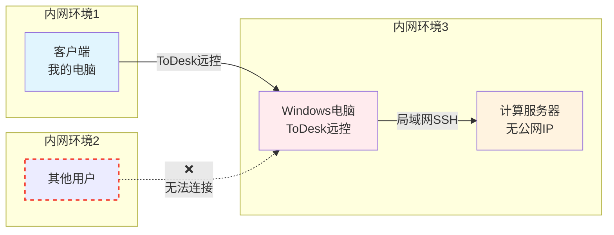
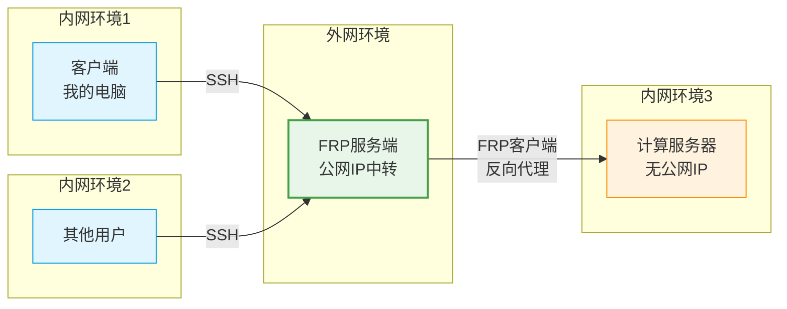
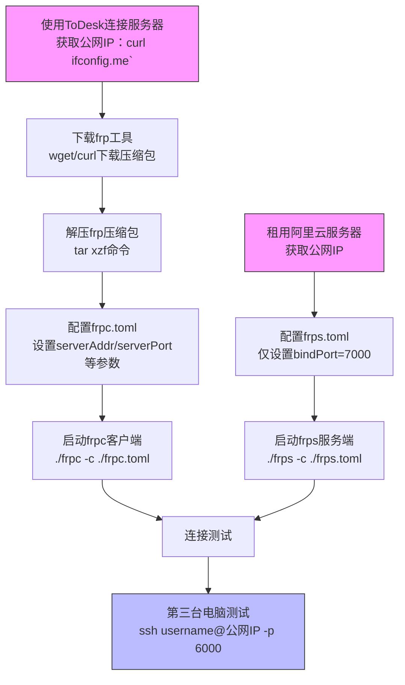

---
categories:
# - Mathematics
# - Programming
# - Phase Field
- Others
tags:
- Linux
- Software
- Server
title: "搭建 FRP 服务"
description: 简单记录一下自己搭建 FRP 服务的过程
date: 2025-07-23T13:26:16+08:00
image: BagPipe.jpg 
math: false
mermaid: true
license: 
hidden: false
comments: true
draft: false
---

*怎么连接个服务器还得先用 ToDesk 连上个 Windows 电脑，再从这个电脑上 ssh 进服务器呀！？受不鸟，自己搭个 FRP 服务吧*
<<<<<<< HEAD
=======

*图为可爱的风笛小姐，据不可靠消息，应该是来自于画师 [Liyu黎](https://weibo.com/u/5979033109) 老师画的 2022 音律联觉的贺图。既然如此，就配一首风笛小姐的个人 EP：《故乡的风》吧。*


>>>>>>> 93290f6 (Finish FRP Deploy, add new Encrypt and Secret)

## 引子：为什么要跳板机

为了方便提交任务，做相场计算，组里配了一台计算服务器，一个管理节点+两个计算节点，劲呀！然而坏消息是：组里没有多余的空间放置服务器了，只能托管到另一个老师那里。

OK，没什么关系，给服务器配个公网IP，那不就和在自己组里一样咯？可是实际上并没有那样的好事，公网IP也不是想申请就申请的。课题组内貌似对网络配置这块不了解，也不打算了解，所以就只能交给装机的小哥处理。而他和那边老师协商后，决定采用的方案是：使用 ToDesk 连接到和服务器处于同一公网下的 Windows 电脑，再用那个 Windows 电脑 SSH 到服务器上。整体过程大概是这样的：



这个方案，说实在的感觉很蠢。一个服务器，搭载着多用户操作系统，竟然必须用 Windows 做跳板然后跳过去！？这不就意味着，如果有两个人同时使用服务器，我就会和对方产生会话冲突？而且如果有人盯着那台 Windows 电脑的屏幕，我的操作不就暴露地清清楚楚了！？怎么想都是很愚蠢的做法，不过也能理解：这应该（也许）是一个临时的解决方案。而后面谁来解决这个问题呢？

那必须是我了！我们可以搭建一个 FRP（快速反向代理） 服务，让流量通过一个跳板服务器转发到计算服务器上，不再蠢蠢地堵在同一台 Windows 设备上。这样一来，每个人都可以自己自由地连接上这个服务器，只需要把流量交给反代服务器（跳板服务器），让它处理转发端口之类的，就可以啦。搞好之后的示意图大概是：



嗯哼，那就开始吧~

## 搭建：也许需要个 TL;DR

我觉得也许应该先写一下 FRP 技术是什么以及介绍一下这中间的网络通信过程是什么样的，然而我相信，来看这个博文的朋友应该都是需要一份切实可行的执行过程的。所以下面的第一步是：

### TL;DR
*下面的流程大量参考自开源教程：[Frp内网穿透搭建教学](https://github.com/CNFlyCat/UsefulTutorials/)，内容非常详细，感觉这里不清楚的可以去看看*

下面是我的解决过程：

1. 租个服务器：在阿里云用学生认证白嫖三个月的便宜服务器，有个公网IP就行，待会儿会用这个IP
2. 先用 ToDesk 连到远程计算服务器上，然后用 `curl ifconfig.me` 得到服务器所在公网的公网IP，待会儿会用到
3. 在计算服务器上下载 frp: 

```sh
#  如果有 wget 的话：
wget https://github.com/fatedier/frp/releases/download/v0.61.1/frp_0.61.1_linux_amd64.tar.gz
#  如果没有 wget，可以试试 curl：
curl -LO https://github.com/fatedier/frp/releases/download/v0.61.1/frp_0.61.1_linux_amd64.tar.gz
```

4. 用 `tar` 解压压缩包：`tar xzf frp_0.61.1_linux_amd64.tar.gz`
5. 进入文件夹，配置 `frpc.toml`，内容为：

```toml
# 服务端地址（这里要填你有公网IP的服务器的IP或者是服务器的域名）
serverAddr = "192.xxx.x.x"
# 服务器端口（Frp 服务端监听的端口）
serverPort = 7000

# 连接协议
transport.protocol = "tcp"

# 代理配置
[[proxies]]
# 代理名称（标识该代理的名称，根据你的喜好填写）
name = "comp_server"
type = "tcp"
localIP = "127.0.0.1" #这里就是这个，代表本机IP
localPort = 22 # 这个是 SSH 的默认端口
remotePort = 6000 # 告诉 frps 把它收到的哪个端口流量转过来
```

6. 启动 frpc：`./frpc -c ./frpc.toml`
7. 在公网服务器上进行类似操作，这里我没有改 `frps.toml`，其中内容只有一行：

```toml
bindPort = 7000
```

8. 启动 frps: `./frps -c ./frps.toml`

9. 从第三台电脑测试链接：`ssh username@192.xxx.x.x -p 6000`, 这会让你通过公网服务器的 `6000` 端口把访问转发到计算服务器上。

整个流程大概就是这样啦，看起来挺长的，实际上只需要寥寥几步就OK了。需要注意的是，这样的服务器端配置显得有些简陋，不过目前来讲是完全够用的。然而如果你需要更详细的配置，或者更完善的配置的话，可以参考上述的开源教程。另外还有，这个地方的 `7000` 完全是默认的一个值，而这个值是可以自己选择的。一般来讲端口号会尽量选择比较大的数字（高位端口），目的主要是为了安全着想。如果这个地方你在上面的客户端使用的 `ServerPort` 是别的端口号，请在下面的 `bindPort` 中保持一致。

### 流程图

~这个人在尝试过 Mermaid 之后就什么都想画个图了，原谅他吧。~


~（感觉上面的流程描述还是不如图清晰呀，还是图好）~

所以，大概就是这样啦。如果你是误打误撞进了这个博客，正好想搭建一个 FRP 服务，上面的内容应该就足够啦。希望可以帮到你~

## 解说环节

有了 TL;DR，也许你可以从这些步骤上看到整个搭建过程的轮廓。然而这样或许还是不能解答一些疑惑：为什么这样这样再这样，就好了？所以这里简单讲解一下，每一步都是在干什么，以及要注意的点。虽然说这里要做解说，实际上也只是拾人牙慧，再对上面的内容进行一些简单的补充而已。还望大佬手下留情。

### So，什么是 FRP？

当遇到一个奇怪的，有着英文缩写的概念时，最应该从这个缩写的含义来展开。FRP，全称 Fast Reverse Proxy，也就是 “快速反向代理”。也许有人要问了，什么是代理，什么是反向代理，什么又是 “快速反向代理”？

很可惜，我也是超级小白，只能斗胆分享一下自己的看法。代理这个词，一听就知道大概是什么样的过程：代替某个东西来受理某项业务。实际上在我的理解里，就是这么回事。不过在谈 “反向代理” 前，还是先聊聊可能大家更熟一些的 *正向代理* 吧。它是指把流量交给某个服务，让所有服务的流量都从这里出去。大概就是：


这里正向代理服务器就是中间的一层马甲，代替客户端进行访问，访问后再把内容反传给客户端。这样一来，目标网站就不太容易知道代理服务器的背后是谁，形成了一定的匿名性。

那么反向代理呢？与正向代理正好相反，正向代理是由代理服务器做客户端的马甲，而反向代理则是让代理服务器给目标服务器打工。反代服务器会接收到客户端的请求再告诉服务端，反代服务器会负责把内容转发到对应的位置，交给服务端，而服务端后面要与客户端通信，还是得走反代服务器。图形表示的话就是这样的：


也就是说，正向代理的情况下，目标网站只知道有个服务器在访问它；反向代理情况下，客户端不直接连到后端服务器，而是直接连接到反代服务器上。我们的需求，是让自己的电脑能跨过计算服务器的内网屏障，用 SSH 连接上去。因此，我们要做的是让服务器想办法把我的请求告诉计算服务器，也就是采用反向代理，让反代服务器从一个端口接收我的请求流量，然后走另一个端口，把流量转发给计算服务器负责监听 SSH 请求的端口，就可以了。

那么 “快速反向代理” 又是啥？就我浅薄的认知而言，“反向代理” 不是一个特别特殊的东西，很多人都可以尝试自己的实现方式。而 “FRP” 是其中一个非常受欢迎的选择。至于 “快速”， 应该是说它速度快？由于我只知道这么一个，所以咱们还是不要深究了。

当你下载好 FRP 的包后，你应该会看到里面没有多少文件。两个可执行文件：一个 `frpc` 作为客户端，一个 `frps` 作为服务端，以及对应的配置文件，几乎就这样，内容很简单。它的工作方式，就是在让 `frps` 接收流量，然后转发到拥有 `frpc` 的设备上。请注意，虽然这里说是 “客户端”，但实际上是那个计算服务器，而非本地的电脑。本地电脑要做的几乎只有保证自己能 `ssh` 上别的机器，这就可以了。

### 来个服务器

首先是租用服务器。只需要最低配置的服务器就可以运行 FRP 服务了（我猜，因为这个转发过程我很难想象需要多大的内存和多么强大的算力）。在租用的时候可以注意看看各家云服务器厂商都怎么提供的优惠，特别是学生优惠。一般来讲，学生都有一些不错的优惠或者白嫖额度，可以先用着试试看。服务器的密码要注意**使用强密码**，不要用什么个人信息之类的。因为公网服务器毕竟是暴露在危险的公网上的，简单的密码很容易被强行爆破，如果密码里面有一些个人信息（生日，电话，QQ什么的），那就一锅端了。总之，公网上一切小心，密码要搞复杂点，记在什么纸上或者什么密码服务器里都可以。

配好服务器之后，可以考虑只使用 SSH 加密钥来登录。密钥最大的好处有两个，一个是可以免密码，另一个就是安全。由于 SSH 只会允许拥有通过验证的机器来登录，验证方式是查看是否具有可以匹配的私钥。本来想在这里大谈特谈 “加密，私钥与 SSH”，后来想了想，几乎没什么太大关系呀！干脆算了，能正常登录，就是大成功！具体操作就是，首先先用服务器供应商提供的方式登录进去，然后打开一个叫 `authorized_keys` 的文件，它的路径是 `~/.ssh/authorized_keys`（如果没有，也很正常，自己创建一个是对的），待会儿会往里面写你的公钥。接下来就是在你日常使用的电脑上进行操作，打开终端使用 `ssh-keygen`，然后一路回车，就可以创建一份独属于你的密钥对。这里一路默认会创建一个没有口令的，使用默认加密方式的密钥。

接下来我们打开 **公钥** 的内容，比如用 `cat ~/.ssh/id_ed25519.pub` 等方式，把内容输出出来。要注意的是，你要打开的是 **公钥**，也就是文件后缀带个 `.pub` 的文件。走网络传递的信息应该是公钥这样即便被大家知道也没什么所谓的东西，而非你重要的，只能单向证明你身份的私钥。文件内容应该是好长的一行甚至好几行，大体结构应该是三段：`<type> <key> <user>@<machine>` 的形式。第一个 `<type>` 指明了是什么加密协议，中间是最主要的部分，而最后是为了方便用户辨认 “这是从哪里来的公钥” 的字段。如果你觉得最后一段说明力不强，可以大胆修改。然而当务之急，应该是把这段内容复制下来，然后粘贴在服务器端的 `authorized_keys` 文件里。

这样就算搞定啦，可以试着从自己电脑来 `ssh` 上服务器了。如果没有问你要密码的话，那就一切 OK 了。不过要注意的是，如果你是第一次登录的话，你电脑端的 `ssh` 客户端会告诉你，你从来没有连接过这个主机，你是否要信任它？并且会让你输入 `yes`或`no`，或者是打印 `finger print`。作为安全保险，可以仔细思考一下你登录的位置对不对。没啥问题的话 **输入 `yes`** 来确认。这里默认的值是 `no` 哦，如果你手快/以为默认是 `yes` 的话，那就只能重连一次并且记得输入 `yes` 了。

总之，服务器这块主要是要能搞到。登录什么的其实不太难，`ssh` 算是配置相对容易的，对用户比较友好的工具了。当前的最后一个要在服务器上做的事则是获取服务器的公网 IP。一般你的管理面板会告诉你对外 IP 是哪个。你可以记住它或者怎么样，总之待会儿要用。如果你喜欢命令行操作，那也可以试试 `curl ifconfig.me` 这个命令。`ifconfig.me` 提供了显示访问者公网 IP 的服务，你可以通过这个脚本拿到服务器的公网IP。那么，在能保证方便快捷地连接到跳板服务器之后，我们就要开始下一步：

### 计算服务器配置

我们来配置好计算服务器。上面说可以用远控软件来操作远程服务器，其实那是我们一开始的工作方式。理论上来讲，我们是不需要计算服务器 *被* 外界访问到，而是通过搭建的 FRP 服务来 *访问外界*，再让外界传到别的地方，从而建立数据通路。所以，你只要能把 `frpc` 的客户端以及对应的配置文件塞到计算服务器上能上网且你喜欢的位置，就可以了。

由于我们的目的就是通过 FRP 来通过跳板机访问计算服务器，因此自然不会考虑直接 `ssh` 上去。这里的做法是先走原来的老方法，用 ToDesk 来对远程服务器进行配置。这个商业软件我就不介绍了，总之就是一路操作到进入远程服务器。

在这之后，就是要下载 FRP 了。我很难说下载方式简单，因为 `curl` 和 `wget` 命令我到现在还没有搞明白具体是个怎么个事儿…… 不过，这两行命令都是没有问题的，也就是：

```sh
#  如果有 wget 的话：
wget https://github.com/fatedier/frp/releases/download/v0.61.1/frp_0.61.1_linux_amd64.tar.gz
#  如果没有 wget，可以试试 curl：
curl -LO https://github.com/fatedier/frp/releases/download/v0.61.1/frp_0.61.1_linux_amd64.tar.gz
```

其中的 `wget` 根据 `man wget` 的回答，它是 

> Wget - The non-interactive network downloader

，即非交互式的网络下载器。它的参数就相对简单了，后面跟上要下载的内容的网址就可以了。而 `curl` 就更复杂一些。根据 `man curl`，它是 

> curl - transfer a URL

，是传输 URL 连接的。默认情况下，它会把获取到的东西直接输出在屏幕上。而由于我们是要下载文件，所以需要指定 `-O` 参数来表示 *把内容下载到本地的同名文件中*。而这里的 `-L` 参数则是告诉 `curl` 跟随连接的重定向，因为可能这个连接实际上指向的资源不是这里，而是另一个地方。顺带一提，如果指定 `-o` （小写的 o）的话则是 *把内容下载到下面这个文件里* 的意思，也就是 `-o` 后面应该跟上一个自己指定的文件名。

再下来就是解压缩。下载好的东西是一个由 `tar` 打包好并经过 `gzip` 压缩的文件。所以我们应该先解压缩为一个单纯的 `.tar` 文件，再解包开变成真实的内容。然而，好消息是，`tar` 这个命令已经内置了调用包括 `gzip` 在内的压缩/解压缩软件，我们只需要使用 `tar -xzf frp_0.61.1_linux_amd64.tar.gz` 就可以了。其中的 `-xzf` 分别代表 *提取*，*调用*`gzip`*工具* 以及 *指定文件路径*。

随后我们就可以进入解包得到的文件夹内，里面的 `frpc` 就是我们要使用的软件，而 `frpc.toml` 则是对应的配置文件。剩下的内容可以删掉，也可以想办法提取出来一会儿挪给反代服务器。在计算服务器上我们只需要用到 `frpc` 和它的配置文件就可以了。

上面的配置文件里有一些注释，其实写的挺详细的了。我也是只提供了最基础的信息，告诉 `frpc` 它对应的要连的 `frps` 在哪里，走哪个端口通信；`frps` 应该从哪里接收转发向这儿的流量，流量是什么类型的，转发给哪个端口，然后给这个小配置写个名字方便辨认。就是这样。

到这里，计算服务器端基本就配置好了。我们可以暂时搁置，然后转向反代服务器（公网服务器）端的配置。

### 反代服务器配置，以及尝试链接

一开始还是一样咯，下载好 `frp` 的包，然后解包出来，准备设置 `frps.toml`。然而对于 `frps` 来讲，它的设置就相对简单很多了。这里只有一行，告诉 `frps` 它应该监听用哪个端口和 `frpc` 进行通信，就可以了。是不是很简单？

在这之后，我们就可以试着来启动这两个程序了。请先在反代服务器端启动 `frps`，命令是：
```sh
./frps -c ./frps.toml
```
这时候你应该能看到一些输出的内容，先不用管。紧接着在计算服务器端启动 `frpc`，命令是：
```sh
./frpc -c ./frpc.toml
```
这里的 `-c` 都是用来指定配置文件路径的。这时候如果顺利的话，你会看到计算服务器这里显示连接成功的信息，并且不会退出了。而反代服务器那边则同样会显示连接成功，同样，也不会退出。这样一来，就基本宣布大功告成了。

然而，事事如意可太难了。最常见的问题就是 frpc 告诉你它连不上。这个时候请先检查反代服务器的防火墙设置。有很大的可能反代服务器屏蔽了 FRP 的通信端口，或者把你的地址排除在外了。这个时候请先把防火墙的规则放宽一些。

如果 `frpc` 和 `frps` 连接成功了，我们就可以尝试用 `ssh` 访问反代服务器的对应端口，来尝试链接计算服务器了。参考上面的配置，我们要求反代服务器把它从 `6000` 端口接收到的流量转发给计算服务器。因此，我们使用

```
ssh <username>@<frps_ip> -p 6000
```

即可进行连接。其中的 `-p` 就是告诉 `ssh` 你要连接的是哪个端口，否则 `ssh` 会默认走 `22` 端口进行连接。这时候连接可能依然会让你输入密码，随后配置好密钥连接就可以了。至此，基本就已经是配置好 FRP 了。

## 一点额外工作

### 把 FRP 注册为服务

然而这还是有一些问题。比如，当 `frpc` 没有连接上 `frps` 的时候，它会直接罢工，甚至不愿意尝试重连一下。而且，作为系统层面的一个应用，我们希望它持续挂载在后台运行。上面的方式会让 `frpc` 和 `frps` 占住当前的 shell，什么别的操作都不行了。考虑多种方案后，我认为最好的方式就是给二者注册 systemd 服务（如果两个机器都支持 systemd 的话）。下面是我给 `frpc` 写的 systemd 服务：

```
[Unit]
Description=Frp Client Service
After=network.target

[Service]
Type=simple
User=root
Restart=on-failure
RestartSec=5s
ExecStart = /root/frpc/frp_0.61.0_linux_amd64/frpc -c /root/frpc/frp_0.61.0_linux_amd64/frpc.toml
ExecReload = /root/frpc/frp_0.61.0_linux_amd64/frpc reload -c /root/frpc/frp_0.61.0_linux_amd64/frpc.toml
LimitNOFILE=65535


NoNewPrivileges=true
PrivateTmp=true

[Install]
WantedBy=multi-user.target
```

上面的内容基本就是在说，这个服务显示的名字是什么，启动前置需要什么，服务的类型，启动服务的用户，重启服务的条件和间隔时间，启动时要用什么命令；重启服务时要用什么命令，等等等等。这些内容被保存在了 `/etc/systemd/system/frpc.service` 中。为了方便管理，可以用 `ln -s /etc/systemd/system/frpc.service <destination of link>` 来把这个服务文件软连接到 `frpc` 所在的文件夹下。此处的 `-s` 是说创建的链接类型是软链接，否则 `ln` 默认创建的是硬链接，这就没什么必要了。

写好了之后可以通过 `systemctl enable --now <destination of link>` 来启动这个服务。其中 `enable` 是说你要把这个服务注册进去，让系统启动的时候顺带启动这个服务，而 `--now` 的含义则是让 `systemd` 立刻启动这个服务。平时检查连接状态可以使用 `journalctl -u frpc.service -f` 来查看实时日志（也会打印出最近的几行），也可以使用 `-a` 参数替换 `-f` 参数来打开所有记录下的日志。

在反代服务器上也类似，可以写这么一个服务然后启动。注意要把里面对应的内容替换掉，比如软件路径等。这时候再试试登录，应该没有什么阻碍。

### 设置防火墙规则

上面这套默认的配置，应该是会允许 **所有的IP** 来访问公网 FRP 服务器的 **所有的端口** 的。如果你像我一样，这个服务只是自用来连接个内网服务器的，请对防火墙进行合理的设置，防止被暴力扫描端口并尝试密码爆破。具体设置方法请参考你租赁服务器的服务器提供商，不过大概都是让你选择某个 IP 给它禁止掉，或者允许它。

现在的防火墙几乎都是支持白名单模式的。你可以像我一样，先禁用掉所有的 IP 访问任何一个端口，再允许任何的 IP 访问 SSH 的通信端口，再接着允许计算服务器的 IP 访问它与反代服务器交换信息的端口，按上面的例子的话就是 `7000` 端口，以及允许你平时尝试访问计算服务器的 IP 来访问 `6000` 端口，如果你是让 `frps` 用 `6000` 向 `frpc` 转发流量的话。

这样配置好之后会把访问权限控制到近乎最小化。虽然会带来一定的麻烦（比如 IP 变动的话就需要上控制台修改防火墙规则），但是安全性上会很有保障。

## 结尾

这个 FRP 服务我是在五一假期期间搭建起来的。本来说，一边搭建，一边写这个博客的。结果却变成了搭好之后懒得写，直到现在（7月23日，暑假）才想起写。唉，拖延症。

实际上，FRP 的使用方式远不局限于我上面写的这些。甚至如果你愿意点进上面贴出的那个教程连接，就会发现他写的会更加详细，配置项会更加复杂。不过，因为我的需求足够简单，所以我的配置也相对简单很多。

要提醒的是，防火墙其实也许不用设置得像我这里写的，这么严格。然而一定要留个心眼，毕竟网上坏人真的很多。比如我搭建好 FRP 服务的当天晚上就遭到了大洋彼岸朋友的亲切扫描，扫出端口之后就是一通尝试，用了什么 root，admin，user 等的账户名以及一先干就知道的一大堆弱密码来尝试连接进服务器。好消息是没有试出来，被我用防火墙给 ban 了。但还是给我惊出了一身冷汗。害人之心不可有，防人之心不可无呀。

还有要说的是，有一些场景是不可以使用 FRP 服务或者类似的远程访问的服务的。没错，向日葵，ToDesk 这类也不行。网上是有使用类似服务结果酿成大祸的情况的。在使用这类服务前，还是要先三思呀。

<<<<<<< HEAD
最后，一如既往地，辛苦你看到这里。感谢您的支持，也同时祝您生活愉快~
=======
最后，一如既往地，辛苦你看到这里。感谢您的支持，也同时祝您生活愉快~
>>>>>>> 93290f6 (Finish FRP Deploy, add new Encrypt and Secret)
