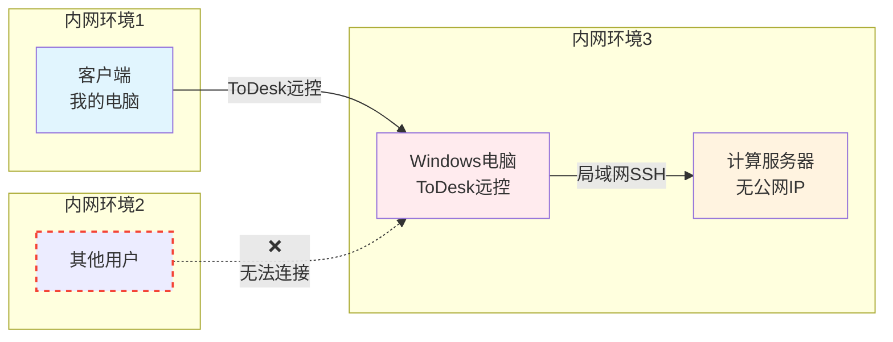
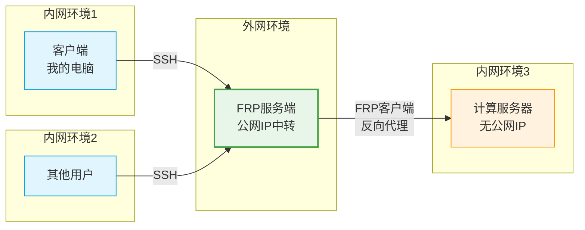
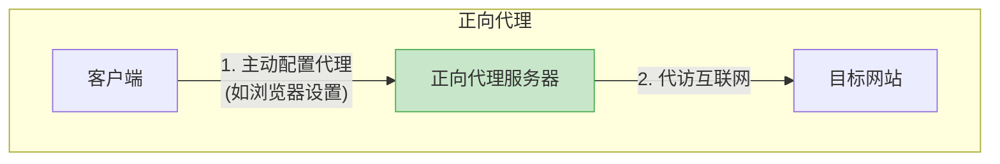
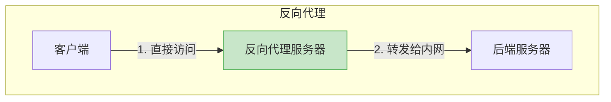

---
categories:
# - Mathematics
# - Programming
# - Phase Field
- Others
tags:
- Linux
- Software
- Server
title: "搭建 FRP 服务"
description: 简单记录一下自己搭建 FRP 服务的过程
date: 2025-05-23T09:26:16+08:00
image: 
math: false
mermaid: true
license: 
hidden: false
comments: true
draft: true
---

*美妙的五一假期，怎么可能只给自己笔记本装个 Arch Linux 就收手？就自己搭个 `frp` 服务咯*

## 引子：为什么要跳板机

为了方便提交任务，做相场计算，组里配了一台计算服务器，一个管理节点+两个计算节点，劲呀！然而坏消息是：组里没有多余的空间放置服务器了，只能托管到另一个老师那里。

OK，没什么关系，给服务器配个公网IP，那不就和在自己组里一样咯？可是实际上并没有那样的好事，公网IP也不是想申请就申请的。课题组内貌似对网络配置这块不了解，也不打算了解，所以就只能交给装机的小哥处理。而他和那边老师协商后，决定采用的方案是：使用 ToDesk 连接到和服务器处于同一公网下的 Windows 电脑，再用那个 Windows 电脑 SSH 到服务器上。整体过程大概是这样的：



这个方案，说实在的感觉很蠢。一个服务器，搭载着多用户操作系统，竟然必须用 Windows 做跳板然后跳过去！？这不就意味着，如果有两个人同时使用服务器，我就会和对方产生会话冲突？而且如果有人盯着那台 Windows 电脑的屏幕，我的操作不就暴露地清清楚楚了！？怎么想都是很愚蠢的做法，不过也能理解：这应该（也许）是一个临时的解决方案。而后面谁来解决这个问题呢？

那必须是我了！我们可以搭建一个 FRP（快速反向代理） 服务，让流量通过一个跳板服务器转发到计算服务器上，不再蠢蠢地堵在同一台 Windows 设备上。这样一来，每个人都可以自己自由地连接上这个服务器，只需要把流量交给反代服务器（跳板服务器），让它处理转发端口之类的，就可以啦。搞好之后的示意图大概是：



嗯哼，那就开始吧~

## 搭建：也许需要个 TL;DR

我觉得也许应该先写一下 frp 技术是什么以及介绍一下这中间的网络通信过程是什么样的，然而我相信，来看这个博文的朋友应该都是需要一份切实可行的执行过程的。所以下面的第一步是：

### TL;DR
*下面的流程大量参考自开源教程：[Frp内网穿透搭建教学](https://github.com/CNFlyCat/UsefulTutorials/)，内容非常详细，感觉这里不清楚的可以去看看*

下面是我的解决过程：

1. 租个服务器：在阿里云用学生认证白嫖三个月的便宜服务器，有个公网IP就行，待会儿会用这个IP
2. 先用 ToDesk 连到远程计算服务器上，然后用 `curl ifconfig.me` 得到服务器所在公网的公网IP，待会儿会用到
3. 在计算服务器上下载 frp: 

```sh
#  如果有 wget 的话：
wget https://github.com/fatedier/frp/releases/download/v0.61.1/frp_0.61.1_linux_amd64.tar.gz
#  如果没有 wget，可以试试 curl：
curl -LO https://github.com/fatedier/frp/releases/download/v0.61.1/frp_0.61.1_linux_amd64.tar.gz
```

4. 用 `tar` 解压压缩包：`tar xzf frp_0.61.1_linux_amd64.tar.gz`
5. 进入文件夹，配置 `frpc.toml`，内容为：

```toml
# 服务端地址（这里要填你有公网IP的服务器的IP或者是服务器的域名）
serverAddr = "192.xxx.x.x"
# 服务器端口（Frp 服务端监听的端口）
serverPort = 7000

# 连接协议
transport.protocol = "tcp"

# 代理配置
[[proxies]]
# 代理名称（标识该代理的名称，根据你的喜好填写）
name = "comp_server"
type = "tcp"
localIP = "127.0.0.1" #这里就是这个，代表本机IP
localPort = 6000

remotePort = 6000
```

6. 启动 frpc：`./frpc -c ./frpc.toml`
7. 在公网服务器上进行类似操作，这里我没有改 `frps.toml`，其中内容只有一行：

```toml
bindPort = 7000
```

<!-- 这样的服务器端配置显得有些简陋了，不过目前来讲是完全够用的。然而如果你需要更详细的配置，或者更完善的配置的话，可以参考上述的开源教程。需要注意的是，这个地方的 `7000` 完全是默认的一个值，而这个值是可以自己选择的。一般来讲端口号会尽量选择比较大的数字（高位端口），目的主要是为了安全着想。如果这个地方你在上面的客户端使用的 `ServerPort` 是别的端口号，请在下面的 `bindPort` 中保持一致。 -->

8. 启动 frps: `./frps -c ./frps.toml`

9. 从第三台电脑测试链接：`ssh username@192.xxx.x.x -p 6000`, 这会让你通过公网服务器的 `6000` 端口把访问转发到计算服务器上。

整个流程大概就是这样啦，看起来挺长的，实际上只需要寥寥几步就OK了。

### 解说环节~

有了 TL;DR，也许你可以从这些步骤上看到整个搭建过程的轮廓。然而这样或许还是不能解答一些疑惑：为什么这样这样再这样，就好了？所以这里简单讲解一下，每一步都是在干什么，以及要注意的点。虽然说这里要做解说，实际上也只是拾人牙慧，再对上面的内容进行一些简单的补充而已。还望大佬手下留情。

#### So，什么是 FRP？

当遇到一个奇怪的，有着英文缩写的概念时，最应该从这个缩写的含义来展开。FRP，全称 Fast Reverse Proxy，也就是 “快速反向代理”。也许有人要说了，什么是代理，什么是反向代理，什么又是 “快速反向代理”？

很可惜，我也是超级小白，只能斗胆分享一下自己的看法。代理可能大家更熟一些，就是指把流量交给某个服务，让所有服务的流量都从这里出去。大概就是：



这里正向代理服务器就是中间的一层马甲，代替客户端进行访问，访问后再把内容反传给客户端。这样一来，目标网站就不太容易知道代理服务器的背后是谁，形成了一定的匿名性。

那么反向代理呢？与正向代理正好相反，正向代理是由代理服务器做客户端的马甲，而反向代理则是让代理服务器给目标服务器打工。反代服务器会接收到客户端的请求再告诉服务端，反代服务器会负责把内容转发到对应的位置，交给服务端，而服务端后面要与客户端通信，还是得走反代服务器。图形表示的话就是这样的：



#### 来个服务器

首先是租用服务器。只需要最低配置的服务器就可以运行 FRP 服务了（我猜，因为这个转发过程我很难想象需要多大的内存和多么强大的算力）。在租用的时候可以注意看看各家云服务器厂商都怎么提供的优惠，特别是学生优惠。一般来讲，学生都有一些不错的优惠或者白嫖额度，可以先用着试试看。服务器的密码要注意**使用强密码**，不要用什么个人信息之类的。因为公网服务器毕竟是暴露在危险的公网上的，简单的密码很容易被强行爆破，如果密码里面有一些个人信息（生日，电话，QQ什么的），那就一锅端了。总之，公网上一切小心，密码要搞复杂点，记在什么纸上或者什么密码服务器里都可以。

配好服务器之后，可以考虑只使用 SSH 加密钥来登录。密钥最大的好处有两个，一个是可以免密码，另一个就是安全。由于 SSH 只会允许拥有通过验证的机器来登录，验证方式是查看是否具有可以匹配的私钥。本来想在这里大谈特谈 “加密，私钥与 SSH”，后来想了想，几乎没什么太大关系呀！干脆算了，能正常登录，就是大成功！具体操作就是，首先先用服务器供应商提供的方式登录进去，然后打开一个叫 `authorized_keys` 的文件，它的路径是 `~/.ssh/authorized_keys`（如果没有，也很正常，自己创建一个是对的），待会儿会往里面写你的公钥。接下来就是在你日常使用的电脑上进行操作，打开终端使用 `ssh-keygen`，然后一路回车，就可以创建一份独属于你的密钥对。这里一路默认会创建一个没有口令的，使用默认加密方式的密钥。

接下来我们打开 **公钥** 的内容，比如用 `cat ~/.ssh/id_ed25519.pub` 等方式，把内容输出出来。要注意的是，你要打开的是 **公钥**，也就是文件后缀带个 `.pub` 的文件。走网络传递的信息应该是公钥这样即便被大家知道也没什么所谓的东西，而非你重要的，只能单向证明你身份的私钥。文件内容应该是好长的一行甚至好几行，大体结构应该是三段：`<type> <key> <user>@<machine>` 的形式。第一个 `<type>` 指明了是什么加密协议，中间是最主要的部分，而最后是为了方便用户辨认 “这是从哪里来的公钥” 的字段。如果你觉得最后一段说明力不强，可以大胆修改。然而当务之急，应该是把这段内容复制下来，然后粘贴在服务器端的 `authorized_keys` 文件里。

这样就算搞定啦，可以试着从自己电脑来 `ssh` 上服务器了。如果没有问你要密码的话，那就一切 OK 了。不过要注意的是，如果你是第一次登录的话，你电脑端的 `ssh` 客户端会告诉你，你从来没有连接过这个主机，你是否要信任它？并且会让你输入 `yes`或`no`，或者是打印 `finger print`。作为安全保险，可以仔细思考一下你登录的位置对不对。没啥问题的话 **输入 `yes`** 来确认。这里默认的值是 `no` 哦，如果你手快/以为默认是 `yes` 的话，那就只能重连一次并且记得输入 `yes` 了。

总之，服务器这块主要是要能搞到。登录什么的其实不太难，`ssh` 算是配置相对容易的，对用户比较友好的工具了。当前的最后一个要在服务器上做的事则是获取服务器的公网 IP。一般你的管理面板会告诉你对外 IP 是哪个。你可以记住它或者怎么样，总之待会儿要用。如果你喜欢命令行操作，那也可以试试 `curl ifconfig.me` 这个命令。`ifconfig.me` 提供了显示访问者公网 IP 的服务，你可以通过这个脚本拿到服务器的公网IP。那么，在能保证方便快捷地连接到跳板服务器之后，我们就要开始下一步：

#### 计算服务器配置

我们先来配置好计算服务器。上面说可以用远控软件来操作远程服务器，其实那是我们一开始的工作方式。理论上来讲，我们是不需要计算服务器 *被* 外界访问到，而是通过搭建的 frp 服务来 *访问外界*，再让外界传到别的地方，从而建立数据通路。所以，你只要能把 `frpc` 的客户端以及对应的配置文件塞到计算服务器上能上网且你喜欢的位置，就可以了。

由于我们的目的就是通过 frp 来通过跳板机访问计算服务器，因此自然不会考虑直接 `ssh` 上去。因为服务器没有公网 IP，为了 *有办法* 连上这个服务器，采用了很神奇的做法：把服务器和一台 Windows 机器放在同一局域网下，这样这个 Windows 机器就可以走局域网内部 ssh 上计算服务器。而因为 Windows 侧这种远控软件实在太多，随便选择了 `ToDesk` 来供该局域网外的设备连接进这个 Windows 机器。就像上面的示意图那样，必须要绕个弯才能连上，而且远程桌面几乎就是独占的，一个人上线的时候，别人就等着排队吧。这太不符合 Linux 一开始的设计初衷：多人多工分时系统。

所以为了解决这个问题，一个不错的方法就是绕过可恶的 Windows，用什么东西把计算服务器半暴露在公网环境下，进而让用户就像普通地 `ssh` 一台远程服务器那样，连上这个内网里的计算服务器。但是这就引出一个问题：

<!-- 诶~！那既然聊到这里了，就简单说说密钥和加密是怎么个事儿吧。

#### 加密，非对称式加密和密钥

加密是什么？也许这个问题很蠢，但是我们可以把它的几个特点抽象出来：加密不能摧毁原有的信息（不能加密完东西没了\/不全了）；加密不能没法解密（得有还原方法）；加密的信息不希望他人能轻易解密（恢复所需要的东西具有复杂性且难以被摸透）。

那么有了上面的几个特点，我们起码可以说什么不是加密。比如，内容哈希不是加密，因为会摧毁原有信息；使用一个用完就扔随机数对内容搞个什么可逆算法捏一起也不是加密，因为恢复不回来也会烂完。把信息随便用个什么简单密码套一下，是加密，但是是很烂的加密：如果有人对这个信息感兴趣，随便爆破一下都能找出来答案，那不是烂完是什么。也许你对密码爆破没有什么概念，但是长度一般的纯数字密码使用哈希碰撞进行爆破的时间在一台家用电脑上基本不会超过一天。即便稍微复杂一些的密码，只要长度不够且攻击者有兴趣，花个几天也能攻破。不要太相信自己的密码。

下面我们讲讲加密算法。现行的加密算法非常的多，不过一般用户不需要太关心加密算法具体怎么工作，只需要知道哪些算法应用广泛，哪些算法安全性好，加密时的哪些东西重要，就可以了。使用 `ssh-keygen` 时默认使用的算法应该是 ed25519，这个名字奇怪的算法有很不错的安全性，且也算应用广泛，只要不是很老的机器基本都可以接受通过这个加密算法进行通信。另外还有所谓的 RSA 等算法，这里就不一一介绍，默认的基本就是最合适的选择了。这里要特别指出的是，这里的算法都是所谓的非对称加密算法。

非对称加密算法是一种很神奇的算法，用来加密的口令\/密钥和用来解密的口令\/密钥是不一样的。加密时将使用公开的密钥进行加密，被称为*公钥*，而解密时则需要用户使用非公开的*私钥*。它主要是区别于所谓的对称加密，也就是加密和解密使用统一口令\/密钥的算法。为什么要有非对称加密搞两套密钥呢？主要原因是为了避免中间人攻击。简单解释，就是说为了防止传递消息（特别是传递密钥）的过程出现篡改内容的情况。如果使用对称加密，想解密消息的人就必须拥有密钥的原文，这个密钥原文必须通过危险的网络进行传输，传输过程中第三者对密钥进行篡改后，消息接受者是无法验证密钥是原本的密钥还是攻击者提供的密钥。而使用非对称加密就避免了这样的问题：只能使用公钥加密，用私钥解密，被加密的消息是否被篡改只需要观察能否使用私钥进行解密即可。

最后我们再来解释一下什么是密钥。所谓密钥，其实和密码，口令什么的一模一样，有了这么个东西，你就能做些什么；没有它或者不知道它，那就不行。不过在 SSH 的语境下，密钥、密码、口令三个的区别在于：密钥是机器负责自动验证的，你的机器上有这个密钥，对方的机器在被 SSH 时就会读取并自动进行验证；密码是在没有密钥的时候为了登录而输入的账户的密码，说白了就是账户对应的密码；口令则是在使用密钥的时候的另外一层保险，也就是说密钥验证成功之后还需要认为输入一次口令进行验证，以此来增强安全性。

一般私人电脑登录远程服务器，有个密钥就可以了，不太需要再设个口令难为自己。不过在公用电脑上，设置口令是个好选择：防止有人方便地登录你的账户。不推荐密码的主要原因是密码是不管从哪个机器进行登录的，弱密码一旦攻破谁也救不了，而密钥因为要绑定机器，会安全很多，至少陌生的机器是没法登录你的账户的。

####  -->
