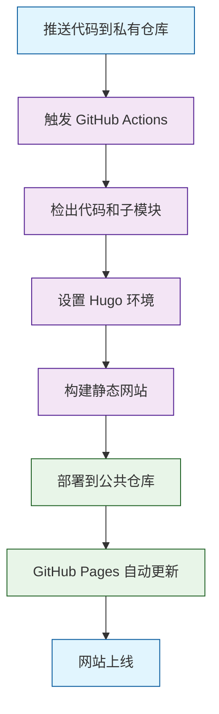
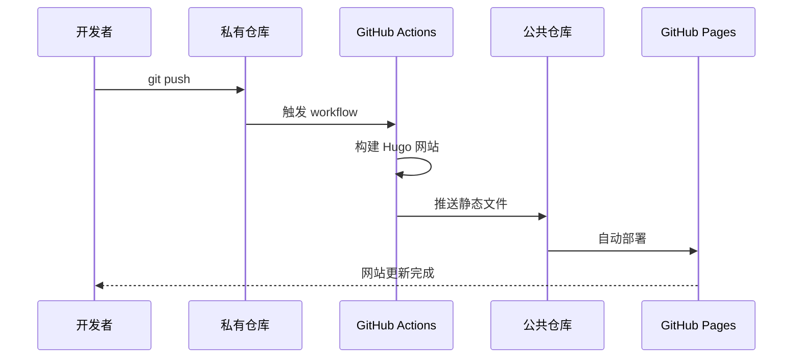
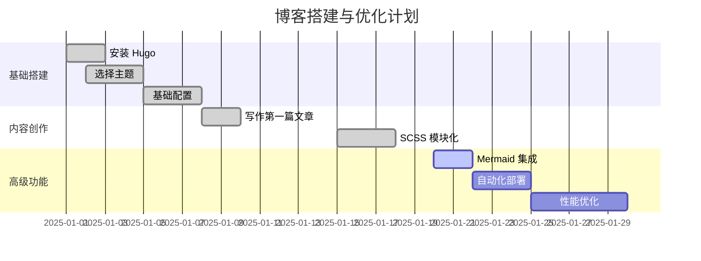
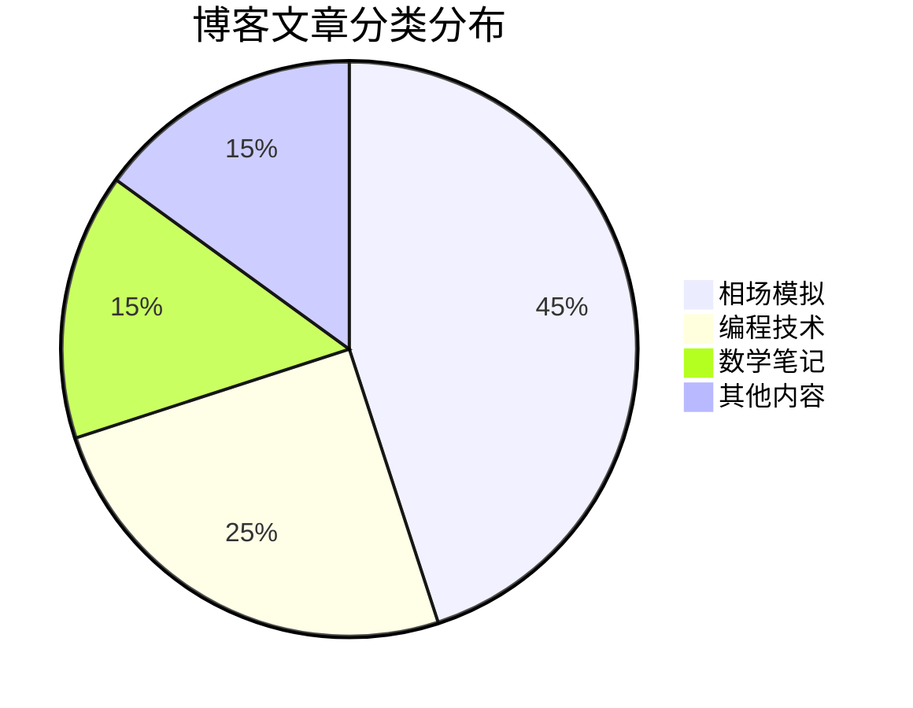

这个页面展示了博客中 Mermaid 图表的各种使用方式。

## 流程图 (Flowchart)


## 序列图 (Sequence Diagram)


## 甘特图 (Gantt Chart)



## 类图 (Class Diagram)

```mermaid {title="Hugo 项目结构类图"}
classDiagram
    class HugoSite {
        +config.toml
        +content/
        +layouts/
        +static/
        +build()
        +serve()
    }
    
    class Theme {
        +layouts/
        +assets/
        +static/
        +config.yaml
    }
    
    class Content {
        +posts/
        +pages/
        +frontmatter
        +markdown
    }
    
    class Deployment {
        +GitHub Actions
        +peaceiris/actions-gh-pages
        +DEPLOY_TOKEN
        +deploy()
    }
    
    HugoSite ||--o{ Content : contains
    HugoSite ||--|| Theme : uses
    HugoSite ||--|| Deployment : deploys with
```

## 饼图 (Pie Chart)



## 使用方法

### 1. 在文章 Front Matter 中启用 Mermaid

```yaml
---
title: "你的文章标题"
mermaid: true
---
```

### 2. 使用 Shortcode

```markdown

graph TD
    A[开始] --> B[结束]

```

### 3. 支持的图表类型

- **流程图 (Flowchart)**: `graph TD` 或 `graph LR`
- **序列图 (Sequence)**: `sequenceDiagram`
- **甘特图 (Gantt)**: `gantt`
- **类图 (Class)**: `classDiagram`
- **状态图 (State)**: `stateDiagram`
- **饼图 (Pie)**: `pie`
- **用户旅程图 (User Journey)**: `journey`
- **Git 图 (Git Graph)**: `gitGraph`

### 4. 样式特性

- ✅ **响应式设计**: 图表自动适应屏幕尺寸
- ✅ **深色模式**: 自动切换深色/浅色主题
- ✅ **优雅样式**: 与 Stack 主题完美集成
- ✅ **图表说明**: 支持添加图表标题和说明
