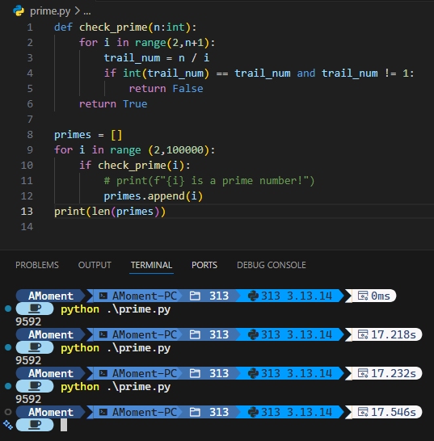
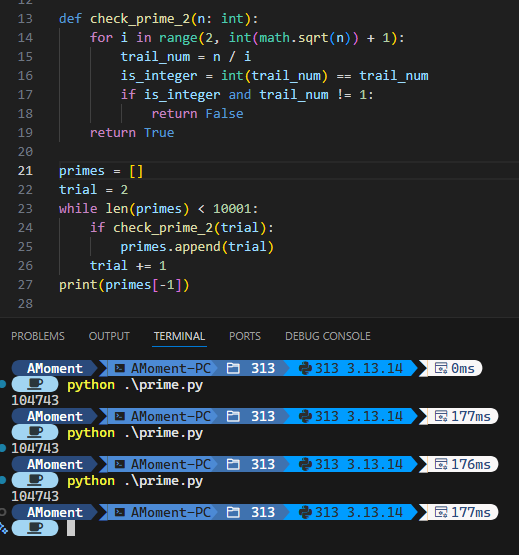

---
categories:
- Mathematics
- Programming
# - Phase Field
# - Others
tags:
- Number Theory
- Python
title: "怎么找到第 n 个素数？"
description: 一道从 Project Euler 而来的题目
date: 2026-09-15T11:03:57+08:00
image: /images/ヨヒラ.jpg
imagePosition: bottom  # 可选值: top, bottom, left, right, center, top-left, top-right, bottom-left, bottom-right
imageObjectPosition: "center 30%"  # 自定义 object-position 值，会覆盖 imagePosition 设置
math: true
license: 
hidden: false
comments: true
draft: true
---

## 欧拉计划

25 年 9 月的某天，机缘巧合之下我发现了 [Project Euler](https://projecteuler.net/archives)（欧拉计划） 这个网站，一个将数学和编程结合起来的刷题网站。它的上面有很多（[截至目前，1008 个](https://projecteuler.net/recent)）问题，基本都要求使用编程进行计算并给出结果。

这个玩具实在是太棒啦！完美满足了去年的我那小小的爱好，既能搞搞数学又能写写代码。于是，我一口气解决了很多（截至目前，10个）问题，还狠狠下决心要写两篇博客来记录那几天搞的数学问题。当时除了 Project Euler 之外，还有一个有趣的问题，问 2025 的阶乘的最后一位数字是什么。2025 的阶乘问题我当时很快啊！8 月 25 我就写了一篇 [2025! 非零的最后一位数字是多少？](/zh/posts/math_note/factorial_last_digits)，然后计划写这篇第 n 个质数的问题， 再然后就没再继续了…… 啊，怠惰之罪……

在美丽群友 [柴（oneis2much）](https://oneis2much.github.io/) 的友好提醒之下，一年后的今天，我想起这篇文章根本没有写！的事实，于是决定填上这个一年的坑。不过在开始神秘的算法/代码之前，我们先来看看 Project Euler 上的问题。

### Project Euler Problem 7

在 Project Euler 的第七个问题中，题目问到：

> [!QUESTION] 7
>
> By listing the first six prime numbers: $2,3,5,7,11,$ and $13,$ we can see that the 6th prime is $13$.
>
> What is the $10\,001$st prime number?

去掉第一段的废话，说白了就是第 $10001$ 个质数是什么。这个问题，就它的长度来看，就一定很难，毕竟题目越短难度越高嘛（）难点自然不难发现：质数好像没有通项公式，因此没法把 $10001$ 带入到某个魔法公式里就给出这个结果。更进一步地，要验证某个数是质数等于说要检查它能不能被比它小的所有质数所整除。就这一点来看我们不得不从第一个质数开始，一点点向后，从而拿到目标质数，这个过程不存在什么跳跃的可能：没有以前的质数信息就难以判断当前数字是否是质数。

虽然是第七个问题，但我个人感觉强度这一块已经是上来了。所以，我们要怎么解决这个问题呢？在聊这个问题之前，我想还是先介绍一下质数是什么。

## 质数：整数的根基

我们很早便接触了自然数与乘法。最早作为 “重复加法简记” 的乘法在剥离开原本含义，成为单纯的抽象运算后，它十分引人注目的特点就出现了：与只需要 $0$ 和 $1$ 就能构建整个自然数的加法不同，对乘法而言简单的只有 $0$ 这个黑洞以及 $1$ 这个单位元，要想只用乘法就构建整个自然数（整数正半轴）就必须得无穷多个自然数。

试想我们用来尝试通过乘法形成整个自然数集的集合为 $P$，里面目前只有 $0$ 和 $1$ 两个数。此时，就这个 $P$ 而言，不论里面怎么做乘法，我们都没办法得到除了他俩以外的数，因此我们不得不向里面添加新的数，比如 $4$。但这样又会带来一个问题，有了 $0$，$1$ 和 $4$ 之后我们能得到的只有除了它仨之外 $4$ 的幂次，比如 $16$， $4\times 4\times 4 = 64$ 以及别的数，这也远不是我们所需要的 *所有* 自然数。我们可以尝试再添加一些别的数，比如 $6$，这样会多一些数，但依旧不是所有，而更令人头大的是，如果此时我们尝试向里面添加 $2$ 和 $3$，就会发现之前添加的 $4$ 和 $6$ 所能覆盖（生成）的数已经被 $2$ 和 $3$ 所生成的数包含了，比如 $4$ 本身就可以表达为 $2 \times 2$，而 $6$ 更是可以被表达为 $2\times 3$。但 $2$ 和 $3$ 是比较特殊的：它没法表达为别的数相乘，或者严谨地讲，只能表达为 $1$ 乘以它本身。

上面叽里咕噜一大堆，有点太啰唆，我们给上面讲的东西一些简称和记号。我们给这样的 “表达为某数与某数相乘” 起一个名字，叫这个数的 *乘法分解*，而分解得到的结果叫做它的 *因数*。顺着这个名称，$2$ 和 $3$ 做乘法分解得到的因数都 *只* 有 $1$ 和它自身。我们暂时给这个性质记作 $\mathfrak{p}$，称 $2$ 和 $3$ 是满足性质 $\mathfrak{p}$ 的数，自然 $4$，$6$，$64$ 等则是不满足性质 $\mathfrak{p}$ 的数，因为它们都有除了 $1$ 和它本身以外别的因数。

那如果向这个集合 $P$ 里添加的数都是具有特殊性质 $\mathfrak{p}$ 的，那在它内部做乘法时，就能 “不重复地” 表达出自然数了，或者说，如果想要有一个在里面做乘法能得到所有自然数的数集，它最大可以是 *自然数集*，而它最小的情况就是只包含那些满足性质 $\mathfrak{p}$ 的数，以及 $0$ 和 $1$。相信您一定意识到了这个性质的特殊意义所在，因此我们给满足这个性质 $\mathfrak{p}$ 的数单独起名，称之为 **素数**，或者 **质数**。以下是它的定义。

> [!DEF] 质数
>
> 若自然数 $p$ 满足以下性质：
>
> 1. $p > 1$;
> 2. $p$ 具有唯一的乘法分解：$p = p \times 1$,
>
> 则称自然数 $p$ 为一个 *质数*，或称素数。

需要注意的是，由于笔者可能喝的有点多，在本文中会随机使用 “素数” 和 “质数” 这两个名字。

您也许已经看累了：这玩意儿小学五年级就学过了[^1]！还在这儿废话半天…… 请您稍安勿躁，实际上上面的内容已经给我们指出了寻找质数的几种方法了。

## 寻找质数

最符合直觉的方法自然是使用无敌的定义法，即检查每个自然数的因数分解，如果的确只有 $1$ 和它本身，那它就是质数了。我们先来详细介绍这个方法：

### 依定义寻找质数

这个方法在小范围内其实很能打，或者说它应该是手算检验小数是否是质数的最方便的办法，比如跟着质数概念出现时一同出现的 100 以内的质数表，用这个方法就挺合适的。下面是一个简单的 Python 示例：

```python
def check_prime(n:int):
    for i in range(2,n+1):
        trail_num = n / i
        if int(trail_num) == trail_num and trail_num != 1:
            return False
    return True
```

这个程序的逻辑很简单，利用了一点 Python `int` 的特性：如果一个数 `m` 是整数，那么 `int(m) == m` 为 `True`，而如果为 `False` 则说明 `m` 不是整数。我们用 `n` 除以 `i` 得到 `trail_num`，如果它是整数，那么说明 `i` 是 `n` 的因数，而如果这个因数不是 `1`，就说明 `n` 有非 $1$ 或它本身的因数，进而 `n` 不是一个质数。如果它通过了所有的从 `2` 到 `n+1` 的测试都没有返回 `False`，就说明这个数的确是一个质数。

这个算法很容易能判断小范围内的自然数是否是质数。在检查所有的从 $2$ 到 $100 000$ 里有哪些数字是素数时花费时间为大约 17 秒：



对这个代码稍加改动就可以解决这次的问题：

```python
def check_prime(n:int):
    for i in range(2,n+1):
        trail_num = n / i
        is_integer = (int(trail_num) == trail_num)
        if  is_integer and trail_num != 1:
            return False
    return True

primes = []
trial = 2
while len(primes) < 10001:
    if check_prime(trial):
        primes.append(trial)
    trial += 1
print(primes[-1])
```

最终花了大约 18 秒多一点差不多 19 秒就给出了答案：$104743$。我个人来讲还算是满意的，毕竟它的时间也没有很长，而且属于是一次计算之后前 10001 个质数都是清楚的了（毕竟是 `append` 到了列表后面，将列表 dump 到某个文件中之后就只需要查表即可了），对解决这个问题而言是可接受的。另外关键的一点是，Project Euler 对算法没有任何要求，甚至其实你可以不使用算法，因为它是个填空题。你只要输入正确数字 `104743` 即可完成这道题目了。

然而这样的结果，从纯算法的角度来看，还是不够能打的。这个计算能如此之快，多多少少还是得到了硬件的极大加速[^2]，如果没有这样强大的硬件，那是否会花费 1 分钟的时间来求解这个问题呢？这个算法本身也有可以提高的地方。想必您一定已经发现了有一可改进之处。

### 简单的小改进

观察这个做除法的过程，很容易就能发现：如果一个数 $n$ 能分解为 $p_1\times p_2\times \dots \times p_n$，其中 $p_1, p_2,\dots p_n$ 为排列好的从小到大的质数，那它们一定 “配对” 的，也就是某个大质数必定得与对应的若干小质数相乘才能得到原数。因此，检查任何大于 $\sqrt{n}$ 的整数都是没有意义的：因为大于 $\sqrt{n}$ 的数必须乘以一个小于 $\sqrt{n}$ 的数来得到 $n$ 本身，若小于 $\sqrt{n}$ 的检查都全部表明不是 $n$ 的因数，那么大于 $\sqrt{n}$ 的数也更不可能是 $n$ 的因数了。

所以，我们没必要傻傻的检测所有小于 $n$ 的数，只需要检查小于 $\sqrt{n}$ 就可以了。代码如下：

```python
def check_prime_2(n: int):
    for i in range(2, int(math.sqrt(n)) + 1):
        trail_num = n / i
        is_integer = int(trail_num) == trail_num
        if is_integer and trail_num != 1:
            return False
    return True

primes = []
trial = 2
while len(primes) < 10001:
    if check_prime_2(trial):
        primes.append(trial)
    trial += 1
print(primes[-1])
```

这次算法快太多了，三次尝试平均下来只需要 177 毫秒便可以完成计算：



这个结果还是能预见到的，毕竟我们少计算了 $n-\sqrt{n}$ 个数字，提升还是很大的。然而，还有没有别的，更好的算法呢？

### 再加一点小改进

其实上个算法我们还可以继续改进，因为我们很容易意识到，对一个数进行乘法分解时，分解到最后里面的所有因数都会是素数。因此，要检测某个情况未知的数是否是素数，只需要检查它有没有比它小的质数为因数就行了。这个算法实现起来也很简单：

```python
def check_prime_3(n: int, prime_list: list):
    if n == 2:
        return True
    boundary = int(math.sqrt(n))
    for p in prime_list:
        if p >  boundary:
            break

        trail_num = n / p
        is_integer = int(trail_num) == trail_num
        if is_integer and trail_num != 1:
            return False
    return True

primes = []
trial = 2
while len(primes) < 10001:
    if check_prime_3(trial,primes):
        primes.append(trial)
    trial += 1
print(primes[-1])
```

新的算法思想便是利用已经计算过并得到的质数表去辅助检测大质数的计算。但第一个素数从哪里来？我们只能直接告诉函数，`2` 就是素数，以此为基准。这个算法也算够快，但它不是很稳定（其实之前的算法也不算很稳定，或者，很 *鲁棒*），比如遇到非法输入时函数的行为是未定义的，另外作为一个判断是否为质数的函数，其不能做到独立判断，必须依赖外部输入的 `prime_list` 列表也存在隐式依赖：默认它的最后一位数大于输入数 $n$ 的平方根。

然而，我们这个线路的探索就到此为之。因为接下来我们要使用的是另一个原理相同但思路有所差异的算法：*筛法*。

## 埃拉托色尼筛法

这个算法冠以古希腊数学家埃拉托色尼的名字，是一个非常古老但实用的算法。顾名思义，筛法的核心思路就是用已有的素数做 *筛*，去筛选手上已有的自然数，从而得到新的素数，核心原理其实和上面的算法别无二致。但区别在于，上面的算法总是一个个去检查当前的素数是否是情况未知的数 $n$ 的一个因数，而筛法的思想是直接批量处理一批数字，逐次筛去素数的倍数，在最后留下的数即为新的素数了。


[^1]: 信息来自于 人民教育出版社小学数学教材五年级下册 2022 版（ISBN 978-7-107-37173-8）的第二章，[在线阅读](https://book.pep.com.cn/1221001502141/mobile/index.html)
[^2]: 本设备采用 Intel(R) Core(TM) i9-14900K，个人认为算是消费级 CPU 里比较先进的一块了。