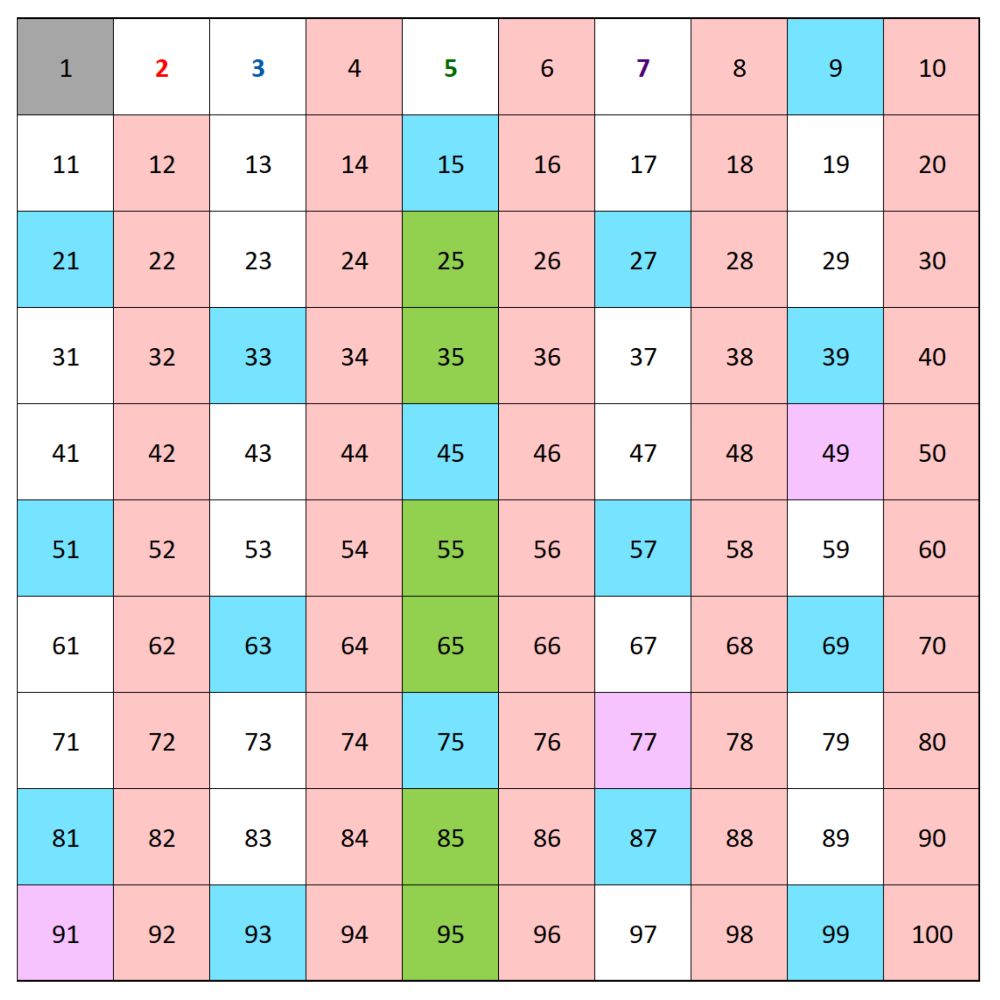

---
categories:
- Mathematics
- Programming
# - Phase Field
# - Others
tags:
- Number Theory
- Python
title: "怎么找到第 n 个素数？"
description: 一道从 Project Euler 而来的题目
date: 2026-09-19T11:03:57+08:00
image: /images/ヨヒラ.jpg
imagePosition: bottom  # 可选值: top, bottom, left, right, center, top-left, top-right, bottom-left, bottom-right
imageObjectPosition: "center 30%"  # 自定义 object-position 值，会覆盖 imagePosition 设置
math: true
license: 
hidden: false
comments: true
draft: true
---

*素数，一个神奇的概念，重要但难以预测，直到我们有了计算机。那么要怎么找到第 $n$ 个素数呢？又要怎么找出 $n$ 以下的所有素数呢？*

*头图选自 [白い雪](https://www.pixiv.net/en/users/96825901)老师所绘的 [ヨヒラ](https://www.pixiv.net/en/artworks/128484858)，其实是拿不拿的“曲绘”。太好了，快把 **ヨヒラ** 这首歌端上来吧！*



## 欧拉计划

25 年 9 月的某天，机缘巧合之下我发现了 [Project Euler](https://projecteuler.net/archives)（欧拉计划） 这个网站，一个将数学和编程结合起来的刷题网站。它的上面有很多（[截至目前，1008 个](https://projecteuler.net/recent)）问题，基本都要求使用编程进行计算并给出结果。

这个玩具实在是太棒啦！完美满足了去年的我那小小的爱好，既能搞搞数学又能写写代码。于是，我一口气解决了很多（截至目前，10个）问题，还狠狠下决心要写两篇博客来记录那几天搞的数学问题。当时除了 Project Euler 之外，还有一个有趣的问题，问 2025 的阶乘的最后一位数字是什么。2025 的阶乘问题我当时很快啊！8 月 25 我就写了一篇 [2025! 非零的最后一位数字是多少？](/zh/posts/math_note/factorial_last_digits)，然后计划写这篇第 n 个质数的问题， 再然后就没再继续了…… 啊，怠惰之罪……

在美丽群友 [柴（oneis2much）](https://oneis2much.github.io/) 的友好提醒之下，一年后的今天，我想起这篇文章根本没有写！的事实，于是决定填上这个一年的坑。不过在开始神秘的算法/代码之前，我们先来看看 Project Euler 上的问题。

### Project Euler Problem 7

在 Project Euler 的第七个问题中，题目问到：

> [!QUESTION] 7
>
> By listing the first six prime numbers: $2,3,5,7,11,$ and $13,$ we can see that the 6th prime is $13$.
>
> What is the $10\,001$st prime number?

去掉第一段的废话，说白了就是第 $10001$ 个质数是什么。这个问题，就它的长度来看，就一定很难，毕竟题目越短难度越高嘛（）难点自然不难发现：质数好像没有通项公式，因此没法把 $10001$ 带入到某个魔法公式里就给出这个结果。更进一步地，要验证某个数是质数等于说要检查它能不能被比它小的所有质数所整除。就这一点来看我们不得不从第一个质数开始，一点点向后，从而拿到目标质数，这个过程不存在什么跳跃的可能：没有以前的质数信息就难以判断当前数字是否是质数。

虽然是第七个问题，但我个人感觉强度这一块已经是上来了。所以，我们要怎么解决这个问题呢？在聊这个问题之前，我想还是先介绍一下质数是什么。

## 质数：整数的根基

我们很早便接触了自然数与乘法。最早作为 “重复加法简记” 的乘法在剥离开原本含义，成为单纯的抽象运算后，它十分引人注目的特点就出现了：与只需要 $0$ 和 $1$ 就能构建整个自然数的加法不同，对乘法而言简单的只有 $0$ 这个黑洞以及 $1$ 这个单位元，要想只用乘法就构建整个自然数（整数正半轴）就必须得无穷多个自然数。

试想我们用来尝试通过乘法形成整个自然数集的集合为 $P$，里面目前只有 $0$ 和 $1$ 两个数。此时，就这个 $P$ 而言，不论里面怎么做乘法，我们都没办法得到除了他俩以外的数，因此我们不得不向里面添加新的数，比如 $4$。但这样又会带来一个问题，有了 $0$，$1$ 和 $4$ 之后我们能得到的只有除了它仨之外 $4$ 的幂次，比如 $16$， $4\times 4\times 4 = 64$ 以及别的数，这也远不是我们所需要的 *所有* 自然数。我们可以尝试再添加一些别的数，比如 $6$，这样会多一些数，但依旧不是所有，而更令人头大的是，如果此时我们尝试向里面添加 $2$ 和 $3$，就会发现之前添加的 $4$ 和 $6$ 所能覆盖（生成）的数已经被 $2$ 和 $3$ 所生成的数包含了，比如 $4$ 本身就可以表达为 $2 \times 2$，而 $6$ 更是可以被表达为 $2\times 3$。但 $2$ 和 $3$ 是比较特殊的：它没法表达为别的数相乘，或者严谨地讲，只能表达为 $1$ 乘以它本身。

上面叽里咕噜一大堆，有点太啰唆，我们给上面讲的东西一些简称和记号。我们给这样的 “表达为某数与某数相乘” 起一个名字，叫这个数的 *乘法分解*，而分解得到的结果叫做它的 *因数*。顺着这个名称，$2$ 和 $3$ 做乘法分解得到的因数都 *只* 有 $1$ 和它自身。我们暂时给这个性质记作 $\mathfrak{p}$，称 $2$ 和 $3$ 是满足性质 $\mathfrak{p}$ 的数，自然 $4$，$6$，$64$ 等则是不满足性质 $\mathfrak{p}$ 的数，因为它们都有除了 $1$ 和它本身以外别的因数。

那如果向这个集合 $P$ 里添加的数都是具有特殊性质 $\mathfrak{p}$ 的，那在它内部做乘法时，就能 “不重复地” 表达出自然数了，或者说，如果想要有一个在里面做乘法能得到所有自然数的数集，它最大可以是 *自然数集*，而它最小的情况就是只包含那些满足性质 $\mathfrak{p}$ 的数，以及 $0$ 和 $1$。相信您一定意识到了这个性质的特殊意义所在，因此我们给满足这个性质 $\mathfrak{p}$ 的数单独起名，称之为 **素数**，或者 **质数**。以下是它的定义。

> [!DEF] 质数
>
> 若自然数 $p$ 满足以下性质：
>
> 1. $p > 1$;
> 2. $p$ 具有唯一的乘法分解：$p = p \times 1$,
>
> 则称自然数 $p$ 为一个 *质数*，或称素数。

需要注意的是，由于笔者可能喝的有点多，在本文中会随机使用 “素数” 和 “质数” 这两个名字。

您也许已经看累了：这玩意儿小学五年级就学过了[^1]！还在这儿废话半天…… 请您稍安勿躁，实际上上面的内容已经给我们指出了寻找质数的几种方法了。

## 寻找质数

最符合直觉的方法自然是使用无敌的定义法，即检查每个自然数的因数分解，如果的确只有 $1$ 和它本身，那它就是质数了。我们先来详细介绍这个方法：

### 依定义寻找质数

这个方法在小范围内其实很能打，或者说它应该是手算检验小数是否是质数的最方便的办法，比如跟着质数概念出现时一同出现的 100 以内的质数表，用这个方法就挺合适的。下面是一个简单的 Python 示例：

```python
def check_prime(n:int):
    for i in range(2,n+1):
        trail_num = n / i
        if int(trail_num) == trail_num and trail_num != 1:
            return False
    return True
```

这个程序的逻辑很简单，利用了一点 Python `int` 的特性：如果一个数 `m` 是整数，那么 `int(m) == m` 为 `True`，而如果为 `False` 则说明 `m` 不是整数。我们用 `n` 除以 `i` 得到 `trail_num`，如果它是整数，那么说明 `i` 是 `n` 的因数，而如果这个因数不是 `1`，就说明 `n` 有非 $1$ 或它本身的因数，进而 `n` 不是一个质数。如果它通过了所有的从 `2` 到 `n+1` 的测试都没有返回 `False`，就说明这个数的确是一个质数。

这个算法很容易能判断小范围内的自然数是否是质数。在检查所有的从 $2$ 到 $100 000$ 里有哪些数字是素数时花费时间为大约 17 秒：


对这个代码稍加改动就可以解决这次的问题：

```python
def check_prime(n:int):
    for i in range(2,n+1):
        trail_num = n / i
        is_integer = (int(trail_num) == trail_num)
        if  is_integer and trail_num != 1:
            return False
    return True

primes = []
trial = 2
while len(primes) < 10001:
    if check_prime(trial):
        primes.append(trial)
    trial += 1
print(primes[-1])
```

最终花了大约 18 秒多一点差不多 19 秒就给出了答案：$104743$。我个人来讲还算是满意的，毕竟它的时间也没有很长，而且属于是一次计算之后前 10001 个质数都是清楚的了（毕竟是 `append` 到了列表后面，将列表 dump 到某个文件中之后就只需要查表即可了），对解决这个问题而言是可接受的。另外关键的一点是，Project Euler 对算法没有任何要求，甚至其实你可以不使用算法，因为它是个填空题。你只要输入正确数字 `104743` 即可完成这道题目了。

然而这样的结果，从纯算法的角度来看，还是不够能打的。这个计算能如此之快，多多少少还是得到了硬件的极大加速[^2]，如果没有这样强大的硬件，那是否会花费 1 分钟的时间来求解这个问题呢？这个算法本身也有可以提高的地方。想必您一定已经发现了有一可改进之处。

### 简单的小改进

观察这个做除法的过程，很容易就能发现：如果一个数 $n$ 能分解为 $p_1\times p_2\times \dots \times p_n$，其中 $p_1, p_2,\dots p_n$ 为排列好的从小到大的质数，那它们一定 “配对” 的，也就是某个大质数必定得与对应的若干小质数相乘才能得到原数。因此，检查任何大于 $\sqrt{n}$ 的整数都是没有意义的：因为大于 $\sqrt{n}$ 的数必须乘以一个小于 $\sqrt{n}$ 的数来得到 $n$ 本身，若小于 $\sqrt{n}$ 的检查都全部表明不是 $n$ 的因数，那么大于 $\sqrt{n}$ 的数也更不可能是 $n$ 的因数了。

所以，我们没必要傻傻的检测所有小于 $n$ 的数，只需要检查小于 $\sqrt{n}$ 就可以了。代码如下：

```python
import math
def check_prime_2(n: int):
    for i in range(2, int(math.sqrt(n)) + 1):
        trail_num = n / i
        is_integer = int(trail_num) == trail_num
        if is_integer and trail_num != 1:
            return False
    return True

primes = []
trial = 2
while len(primes) < 10001:
    if check_prime_2(trial):
        primes.append(trial)
    trial += 1
print(primes[-1])
```

这次算法快太多了，三次尝试平均下来只需要 177 毫秒便可以完成计算：


这个结果还是能预见到的，毕竟我们少计算了 $n-\sqrt{n}$ 个数字，提升还是很大的。然而，还有没有别的，更好的算法呢？

### 再加一点小改进

其实上个算法我们还可以继续改进，因为我们很容易意识到，对一个数进行乘法分解时，分解到最后里面的所有因数都会是素数。因此，要检测某个情况未知的数是否是素数，只需要检查它有没有比它小的质数为因数就行了。这个算法实现起来也很简单：

```python
import math
def check_prime_3(n: int, prime_list: list):
    if n == 2:
        return True
    boundary = int(math.sqrt(n))
    for p in prime_list:
        if p >  boundary:
            break

        trail_num = n / p
        is_integer = int(trail_num) == trail_num
        if is_integer and trail_num != 1:
            return False
    return True

primes = []
trial = 2
while len(primes) < 10001:
    if check_prime_3(trial,primes):
        primes.append(trial)
    trial += 1
print(primes[-1])
```

新的算法思想便是利用已经计算过并得到的质数表去辅助检测大质数的计算。但第一个素数从哪里来？我们只能直接告诉函数，`2` 就是素数，以此为基准。这个算法也算够快，但它不是很稳定（其实之前的算法也不算很稳定，或者，很 *鲁棒*），比如遇到 $0.1$ 等非法输入时，函数的行为是未定义的，另外作为一个判断是否为质数的函数，其不能做到独立判断，必须依赖外部输入的 `prime_list` 列表也存在隐式依赖：默认它的最后一位数大于输入数 $n$ 的平方根。

然而，我们这个线路的探索就到此为之。因为接下来我们要使用的是另一个原理相同但思路有所差异的算法：*筛法*。

## 埃拉托色尼筛法

这个算法冠以古希腊数学家埃拉托色尼的名字，是一个非常古老但实用的算法。顾名思义，筛法的核心思路就是用已有的素数做 *筛*，去筛选手上已有的自然数，从而得到新的素数，核心原理其实和上面的算法别无二致。但区别在于，上面的算法总是一个个去检查当前的素数是否是情况未知的数 $n$ 的一个因数，而筛法的思想是直接批量处理一批数字，逐次筛去素数的倍数，在最后留下的数即为新的素数了。

### 100 以内的素数图示

下面是这个算法的一个简单图示：

{width="50%"}

图中，灰色的 $1$ 代表它不参与这个过程（只是为了图好看是个正方形），而 $2$ 是我们根据定义得到的最小的质数，因此给这个数字标红。由 $2$ 是质数，我们可以得到其余的 $2$ 的倍数都是合数，因此它们的格子被标记了红色，而从 $2$ 到 $2^2 = 4$ 之间没被标记的数就一定是质数，即下一个质数：$3$，此时我们给 $3$ 标蓝，然后给所有 $3$ 的倍数格子都标蓝。注意到这个过程中有一些重复的情况，比如 $12$ 既是 $2$ 的倍数也是 $3$ 的倍数，这里就不重复标记，另外我们在标记时有一个情况不用考虑，比如标记 $3$ 的倍数时，不需要考虑 $2 \times 3$，因为这个情况已经在标记 $2$ 的倍数时覆盖了，我们直接从 $3 \times 3$ 出发。随后我们就可以得知，从 $3$ 到 $3^2 = 9$ 之间没被标记的数就是质数，即 $5$ 和 $7$。我们如法炮制，到了标记完 $7$ 的倍数之后，我们发现：$7$ 到 $7^2 = 49$ 之间没被标记的数都是质数了，下一个质数是 $11$，而 $11$ 的平方就已经是 $121$ 了，大于我们的目标 $100$，自此检查剩余格子没有标颜色的数字，它们就都是质数了。

那么要怎么实现求 $n$ 以下的所有素数呢？

### Python 实现

其实实现方法很简单，我们要运用的工具是一个长为 $n-1$ 的布尔数组，用来标记这个值是否是质数。具体算法代码如下：

```python
import math
def prime_less_than(n: int):
        sieve = [True] * (n + 1)
        sieve[0] = sieve[1] = False
        for p in range(2, math.isqrt(n) + 1):
            if sieve[p] == True:
                for j in range(p * p, n + 1, p):
                    sieve[j] = False
        prime_list = [i for i, is_prime in enumerate(sieve) if is_prime]
        return prime_list

prime_list = prime_less_than(100)
print(len(prime_list))
```

这个算法还是挺短小精干的，并且我们用到了一些特殊的手法。首先，我们创建一个从 `0` 到 `n` 的，长为 `n+1` 的布尔值数组并全部初始化为 `True`。这里使用这样的乘法也是 Python 特有的一种写法吧。随后我们使用连续赋值：`a = b = 1` 会让 `1` 先赋值给 `b`，再赋值给 `a`，相当于我们手动标记了 `0` 和 `1` 不是质数。接下来我们只需要遍历 `2` 到 `math.isqrt(n)+1`，标记整个数组中所有的合数为 `False`，便可以得到一个用来判断下标是否是质数的布尔值数组。由于我们开方时其实总是需要它的整数部分， 因此与其使用之前的 `math.sqrt()` 然后转为整数，不如干脆使用专门为此的 `math.isqrt()`，反而会方便很多，可能内部有优化，也省去我们用 `int()` 把结果包起来的功夫。

那么要怎么标记呢？其实手法很简单：我们要检查的数现在都是以下标的形式存在的，而 `2` 就是第一个质数，因此只要从 `2` 的平方（`4`）开始，然后以 `2` 为步长，不断标记它们的值为 `False`，便实现了标记 `2` 的倍数为合数的功能。随后我们寻找下一个质数时，只要停在 `sieve[p] == True` 的位置就行了（这里还是显式写出来了，实际上直接判断 `sieve[p]` 会方便很多）。

最后我们就需要把结果取出来。问题是我们用数组存储的都是布尔值，实际的数都放在了下标上。有没有什么办法把下标和值放在一起？`enumerate` 这个函数提供了这个方法。我们可以使用 `enumerate()` 函数则能把单纯的列表转换为迭代器，这里所谓的迭代器实际上是一份键值对表，不过必须通过 `for` 循环迭代才能查找里面的内容。举个简单的例子：

```python
str_list = ['a','b','c','d','e']
enum_str_list = enumerate(str_list)
print(enum_str_list)
for kv_pair in enum_str_list:
    print(kv_pair)
```

第三行的 `print` 不会给出具体的东西，它只会告诉我们 `<enumerate object at 0x00000286AF06E340>` 这样的鬼东西。想要查看内部的数据还就只能用 `for` 迭代取出，即第四五行的操作。得到的结果是：
```output
(0, 'a')
(1, 'b')
(2, 'c')
(3, 'd')
(4, 'e')
```
如您所见，是一个个的键值对，键为下标而值为原来 `str_list` 中下标对应的值。`enumerate` 的含义解决了，那这里的方括号内部包起来的东西是什么意思呢？这个是 Python 的列表构造器语法，或者叫 List Comprehension，它的语法其实读起来有点像数学上的集合，第一个部分我们写代表元，而 `for item in list if cond` 的写法就是说对 `list` 中的每个元素（用 `item` 代表）进行条件 `cond` 的判断，如果条件通过则将 `item` 里的什么东西放到前面的代表元中，否则就跳过。因此，这个函数的最后返回的东西可以理解为：返回一份列表，里面的值作为 `sieve` 的下标时所对应的列表的值必须为真。

通读这个代码，实际上它就是把我们前面描述的埃拉托色尼筛法的计算方式搬运到 Python 里而已。但是，虽然看着不起眼，它的效率还真不是盖的。我们对比一下它和我们用老办法计算 `1e6` 以内所有质数的速度：

```python
import math
from time import perf_counter as pc


def sieve_method(n: int):
    sieve = [True] * (n + 1)
    sieve[0] = sieve[1] = False
    for p in range(2, math.isqrt(n) + 1):
        if sieve[p] == True:
            for j in range(p * p, n + 1, p):
                sieve[j] = False
    prime_list = [i for i, is_prime in enumerate(sieve) if is_prime]
    return prime_list


def by_definition_method(n: int):
    p_list = []
    is_prime = True
    for i in range(2, n + 1):
        if i == 2:
            is_prime = True
        boundary = math.isqrt(i)
        for p in p_list:
            if p > boundary:
                is_prime = True
                break

            trail_num = i / p
            is_integer = int(trail_num) == trail_num
            if is_integer and trail_num != 1:
                is_prime = False
                break
        p_list.append(i) if is_prime == True else 1
        is_prime = True

    return p_list


big_n = int(1e6)

start_sieve = pc()
prime_list_sieve = sieve_method(big_n)
end_sieve = pc()
print(f"sieve method with n = {big_n} time consuming: {end_sieve - start_sieve}")

start_naive = pc()
prime_list_naive = by_definition_method(big_n)
end_naive = pc()
print(f"Naive method with n = {big_n} time consuming: {end_naive - start_naive}")

assert prime_list_sieve == prime_list_naive
```

上面的代码中，`by_definition_method` 是把前面的 `check_prime_3` 改编为了算 $n$ 以内素数的算法。另外我们用了 `time.perf_counter` 来计算运行时间，方便比较。最后运行的结果如下：

```output
sieve method with n = 1000000 time consuming: 0.07576959999278188
Naive method with n = 1000000 time consuming: 0.736862099962309
```

看似是 10 倍时间差，实则不然。我尝试过用 `1e8` 来测试，结果是筛法很快（十秒不到大概）就给出结果了，而老办法跑的快累死了还没出结果…… 筛法就是强口牙！

那，速度还能不能再快一点？有的，兄弟，有的！我们手上的牌可太多啦！

## 将筛法改进把！

改进方法分为两派，首先我们可以考虑语言层面，其次算法本身也可以再改进。我们先来看一个新东西：`bytearray`。

### `bytearray` 替代 `list[bool]`

Python 里一切皆对象可不是吹的，把布尔值存储进 `list` 列表中，内部的内存依旧不算连续。然而，Python 还提供了一个更 “底层” 的工具：`bytearray`。我们可以直接往里面存 `b"\x00"` 和 `b"\x01"`，它们会被自动解释为 `0` 和 `1`，而在 `bytearray` 中这个东西存储方式就是连续的：

```python
print(bytearray(b"\x01")*5)
```

将会给出：

```output
bytearray(b'\x01\x01\x01\x01\x01')
```

而我们依旧还可以用下标来取出里面的值。此外，作为正牌 *数组*，它可以被切片赋值：

```python
ba = bytearray(b"\x01\x01\x01\x01\x01")
ba[0:5:2] = b"\x00" * 3
print(ba)
```

则会给出：

```output
bytearray(b'\x00\x01\x00\x01\x00')
```

可以看到我们成功地隔一个元素给另一个元素赋值为 `b"\x00"` 了。这个赋值方法会比一个个遍历然后赋值要快得多。这样改进后的算法给出的结果如下：

```python
def prime_lt_byte(n: int):
    if n < 2:
        return []

    sieve = bytearray(b"\x01") * (n + 1)
    sieve[:2] = b"\x00\x00"

    for p in range(2, math.isqrt(n) + 1):
        if sieve[p]:
            start = p * p
            sieve[start : n + 1 : p] = b"\x00" * ((n - start) // p + 1)

    return [i for i in range(2, n + 1) if sieve[i]]
```

这里出现了个新东西：`//`，这个和 `math.isqrt` 有点像，也是负责对两个整数做除法后只取整数部分。在这里它负责计算往 `sieve` 里填充（标记）的数字的个数，具体为什么这么算我们就不展示了，简单验证即可。您也许好奇，`sieve[i]` 给出的不是 `b"\x00"` 就是 `b"\x01"`，怎么直接 `if` 就能判断了它的结果呢？我们可以尝试取一下 `bytearray` 中的值：

```python
ba = bytearray(b"\x00\x01")
print(ba[0])
print(ba[1])
```

它们返回的是 `0` 和 `1`，我们再尝试一下下面的代码：

```python
print("Yes") if True == 1 and False == 0 else print("No")
```

输出的是 `Yes`，很神奇吧 Python。这是因为 Python 的布尔类型是从整数类型特化而来的[^3]，当然也可以解释为数字类型可以被隐式转换为布尔值。那么它的计算速度如何呢？我们做个简单的比较：

```python
import time
import math


def bench_prime_less_than(func, n):
    start = time.perf_counter()
    prime_list = func(int(n))
    end = time.perf_counter()
    print(f"num of primes less than {n}: {len(prime_list)}, time consumed: {end-start}")


def prime_lt(n: int):
    sieve = [True] * (n + 1)
    sieve[0] = sieve[1] = False
    for p in range(2, math.isqrt(n) + 1):
        if sieve[p] == True:
            for j in range(p * p, n + 1, p):
                sieve[j] = False
    prime_list = [i for i, is_prime in enumerate(sieve) if is_prime]
    return prime_list


def prime_lt_byte(n: int):
    if n < 2:
        return []

    sieve = bytearray(b"\x01") * (n + 1)
    sieve[:2] = b"\x00\x00"

    for p in range(2, math.isqrt(n) + 1):
        if sieve[p]:
            start = p * p
            sieve[start : n + 1 : p] = b"\x00" * ((n - start) // p + 1)

    return [i for i in range(2, n + 1) if sieve[i]]


big_n = int(1e8)
bench_prime_less_than(prime_lt, big_n)
bench_prime_less_than(prime_lt_byte, big_n)
```

结果如下：

```output
num of primes less than 100000000: 5761455, time consumed: 6.420462900074199
num of primes less than 100000000: 5761455, time consumed: 2.5747377001680434
```

可以看到它的提升相当大，而我们只是更改了高频数据结构而已。那么修改算法逻辑本身能提供什么新的改进呢？

### 分段算法

在之前我们聊筛法原理的时候，您也许已经注意到了：我们只需要得到 $\sqrt{n}$ 以内的所有质数，用它们就可以将小于 $n$ 的所有合数都找出来了。目前我们的算法需要从小到大一个个找质数并删掉对应的倍数形成的合数，每找到一个就标记掉这个范围内所有的合数。我们能不能先直接得到 $\sqrt{n}$ 以内的所有质数，然后用现成的质数删掉后续 $n-\sqrt{n}$ 个数字内的所有合数？这个思路就是我们要实现的分段算法。

它的实现还挺简单的，就是需要依赖一下我们已有的函数罢了：

```python
import math
def prime_lt(n: int):
    sieve = [True] * (n + 1)
    sieve[0] = sieve[1] = False
    for p in range(2, math.isqrt(n) + 1):
        if sieve[p] == True:
            for j in range(p * p, n + 1, p):
                sieve[j] = False
    prime_list = [i for i, is_prime in enumerate(sieve) if is_prime]
    return prime_list


def prime_lt_seg(n: int):

    if n < 2:
        return []

    seg_len = math.isqrt(n)
    base_primes = prime_lt(seg_len)
    prime_list = base_primes.copy()

    low = seg_len
    while low <= n:
        high = min(low + seg_len - 1, n)
        sieve = [True] * (high - low + 1)

        for p in base_primes:
            start = max(p * p, ((low + p - 1) // p) * p)
            for j in range(start, high + 1, p):
                sieve[j - low] = False

        prime_list.extend(
            [prime + low for prime, is_prime in enumerate(sieve) if is_prime]
        )
        low += seg_len

    return prime_list
```

整体上来讲，计算过程被分为了两部分，首先用 `prime_lt` 经典筛法计算出 $\sqrt{n}$ 以内的素数，接下来将整个 $[\sqrt{n}, n]$ 之间的数按 $\sqrt{n}$ 的长度划分为若干段，对每一段都用提前计算好的质数来标记内部的合数，最后把每一段合起来。注意到我们这里使用了列表的 `extend` 方法，它和 `append` 方法类似，不同之处在于 `append` 只能补充单个元素，而 `extend` 则是把新列表拼接到原列表上。由于 Python 的列表并不完全是数组（数组 Array 要求内部类型一致，而列表 List 没有要求），因此使用 `append` 还是 `extend` 还是需要注意一下的。

那，这样改进之后的算法，效果如何？我们来看 benchmark：

```python
import time
import math


def bench_prime_less_than(func, n):
    start = time.perf_counter()
    prime_list = func(int(n))
    end = time.perf_counter()
    print(f"num of primes less than {n}: {len(prime_list)}, time consumed: {end-start}")


def prime_lt(n: int):
    sieve = [True] * (n + 1)
    sieve[0] = sieve[1] = False
    for p in range(2, math.isqrt(n) + 1):
        if sieve[p] == True:
            for j in range(p * p, n + 1, p):
                sieve[j] = False
    prime_list = [i for i, is_prime in enumerate(sieve) if is_prime]
    return prime_list


def prime_lt_seg(n: int):

    if n < 2:
        return []

    seg_len = math.isqrt(n)
    base_primes = prime_lt(seg_len)
    prime_list = base_primes.copy()

    low = seg_len
    while low <= n:
        high = min(low + seg_len - 1, n)
        sieve = [True] * (high - low + 1)

        for p in base_primes:
            start = max(p * p, ((low + p - 1) // p) * p)
            for j in range(start, high + 1, p):
                sieve[j - low] = False

        prime_list.extend(
            [prime + low for prime, is_prime in enumerate(sieve) if is_prime]
        )
        low += seg_len

    return prime_list


big_n = int(1e8)
bench_prime_less_than(prime_lt, big_n)
bench_prime_less_than(prime_lt_seg, big_n)
```

（有代码折叠就是爽口牙，直接复制完整代码进来就好了嘿嘿嘿 x）运行结果如下：

```output
num of primes less than 100000000: 5761455, time consumed: 6.454583399929106
num of primes less than 100000000: 5761455, time consumed: 8.172357000177726
```

何意味……为什么反而变慢了……

### 分段真的对吗？

要理解为什么变慢，我们需要考虑计算过程中究竟发生了什么。首先计算 $\sqrt{n}$ 的过程毋庸置疑是快的，问题在于后续分段处理的部分。每一段中我们都要重复读取小质数列表，然后对段内的数据进行标记。这样一遍遍的来回读取实际上有点没什么必要，因为标记的动作次数没有发生变化，反而徒增了很多读取素数列表的额外开销。

虽然很蠢但我们还是这么搞了，除非它有什么特殊的优势，比如？比如并行计算！

### 分段并行

这就是饺子醋的感觉吗…… Anyway，我们看看采用并行能有什么样的提升。既然我们已经有了更快的 `bytearray` 方法，我们就顺手把它也加进来。分段并行的代码如下：

```python
import math
from concurrent.futures import ProcessPoolExecutor


def prime_lt_byte(n):
    if n < 2:
        return []

    sieve = bytearray(b"\x01") * (n + 1)
    sieve[0:2] = b"\x00\x00"

    for p in range(2, math.isqrt(n) + 1):
        if sieve[p]:
            start = p * p
            count = (n - start) // p + 1
            sieve[start : n + 1 : p] = b"\x00" * count

    return [i for i, is_prime in enumerate(sieve) if is_prime]


def _sieve_segment_byte(args):
    low, high, small_primes = args

    sieve = bytearray(b"\x01") * (high - low + 1)

    for p in small_primes:
        start = max(p * p, ((low + p - 1) // p) * p)

        if start > high:
            continue

        start_idx = start - low
        count = (high - start) // p + 1

        sieve[start_idx::p] = b"\x00" * count

    return [i + low for i, is_prime in enumerate(sieve) if is_prime]


def prime_lt_seg_byte_parallel(n: int, workers: int = 8):
    if n < 2:
        return []

    seg_len = math.isqrt(n)

    small_primes = prime_lt_byte(seg_len)
    prime_list = small_primes.copy()

    low = seg_len + 1
    tasks = []

    while low <= n:
        high = min(low + seg_len - 1, n)

        tasks.append((low, high, small_primes))

        low = high + 1

    with ProcessPoolExecutor(max_workers=workers) as executor:
        for primes in executor.map(_sieve_segment_byte, tasks):
            prime_list.extend(primes)

    return prime_list


if __name__ == "__main__":
    big_n = int(1e8)

    primes = prime_lt_seg_byte_parallel(big_n, workers=8)

    print(len(primes))
```

这份代码稍微复杂一些。我们依旧定义了经典筛法的函数，另外还多出来一个函数 `_sieve_segment_byte`，这个函数的作用在于作为 *worker* 被 `executor.map` 调用从而实现多进程并行计算，实际上这个函数内部没有增加什么新东西。至于它的名字最前面的下划线，这是标明这个函数是 *非公开* 的，当这个文件被作为模块引入其他代码中时，`_sieve_segment_byte` 不会暴露给引用它的文件。毕竟它只是一个工具函数，只提供给 `prime_lt_seg_byte_parallel` 使用而已。好啦，快把 benchmark 端上来吧。我们的 benchmark 操作和之前一模一样，所以就只写对比部分的代码了：

```python
big_n = int(1e8)
bench_prime_less_than(prime_lt_byte, big_n)
bench_prime_less_than(prime_lt_seg_byte_parallel, big_n)
```

结果如下：

```output
num of primes less than 100000000: 5761455, time consumed: 2.5913493998814374
num of primes less than 100000000: 5761455, time consumed: 1.8554056999273598
```

有了新的提升！并行就是好口牙！可是不分段是不是也能并行？是否不分段直接并行能获得更好的效果？这里笔者不打算尝试了，因为不分段就并行会遇到一个问题，即违反一写多读原则。我们先计算 $\sqrt{n}$ 以下所有素数时只有一次写入操作，而在这之后就停止写入从而让每个进程都读取这份素数列表。然而，如果 *直接* 并行，我们必须面对写入和读取同时进行的问题，这样数据很有可能会出错。

您也许还发现，是否在计算 $\sqrt{n}$ 以下的质数时就套用这套方法。答案显而易见的是没问题，但是否值得这么做也是需要考虑的一环。如果我们需要计算 $10^{16}$ 以内的所有质数，那在计算 $\sqrt{10^{16}} = 10^{18}$ 的时候为了效率就应该使用这套分段并行方法了。但如果是计算 $10^{8}$ 以内的质数，那在计算 $\sqrt{10^8} = 10000$ 的时候完全没必要套多进程并行，这么做反而有点繁琐了，因为经典方法，甚至不使用筛法就已经能很快给出结果了，完全犯不上用并行计算这么小的数值。

然而，即便如此，这个算法能奏效的主要原因还是有了多进程并行，不依靠硬件的力量的话，似乎分段本身完全是负优化。有没有算法层面的正优化？有的，兄弟，有的！我们介绍 2-wheel 算法。

### 2-wheel 算法

其实这个算法的思想很简单：全世界的人都应该知道 $2$ 的倍数，即偶数，除了 $2$ 本身以外都是合数。既然如此，我们为什么还要在内存里把所有的自然数都存好再一个个地标记所有的偶数？因此，干脆一开始就直接不考虑除 $2$ 以外的偶数。

我们来看实现：

```python
def prime_lt_byte_2wheel(n: int):
    if n < 2:
        return []

    size = (n + 1) // 2
    sieve = bytearray(b"\x01") * size
    sieve[:1] = b"\x00"

    for i in range(1, math.isqrt(n) // 2 + 1):
        if sieve[i]:
            p = 2 * i + 1
            start = 2 * i * i + 2 * i
            count = (size - 1 - start) // p + 1
            sieve[start:size:p] = b"\x00" * count

    return [2] + [2 * i + 1 for i in range(1, size) if sieve[i]]
```

算法思想其实很简单，关键是里面的下标计算等究竟要怎么处理。首先，由于我们要排除偶数，随后的指标和实际数字之间的关系是需要我们人为映射的，因此我们没有必要再从 `0` 开始作为第一个数了。我们规定这样的映射，让 `bytearray` 的第一个下标（`0`）代表的数字为数字 `1`，第二个下标（`1`）代表数字 `3`，进而得到下标和代表的数之间的映射：`p = 2 * i + 1`，其中 `p` 是我们要检查的数字，而 `i` 是数组下标，从 `0` 开始。

那么在这套映射关系下，要检查数字 `n` 以下的所有奇数，需要的数组长度则应该表示为 `(n + 1) // 2`。这是因为如果 `n` 是偶数则在 `n + 1` 后再尝试除以 `2` 其整数部分和 `n // 2` 的结果是一样的，而若 `n` 是奇数则 `n + 1` 补全为偶数后除以 `2` 依然能给出正确的奇数个数。我们给数组长度以临时变量 `size`，自然我们的素数筛就定义为拥有这个长度。最后我们将第一位人为标记为 `0`，让循环从 `i = 1` 处能正确开始。

接下来便是比较麻烦的地方了。我们要在筛中跳着选择正确的并进行判断和标记。第一个问题便是循环的终点，在原来的计算中我们的循环终点是简单的 `math.isqrt(n) + 1`，因为我们要取到 `math.isqrt(n)` 以防它本身是质数的可能。而在这里由于我们只取奇数，因此需要给它除以 `2`，同样为了避免在下标 `math.isqrt(n) // 2` 处对应的值是质数，我们给它加 `1` 从而包含它是质数的情况。

接下来便是计算跳跃标记需要的值。为了方便我们给下标对应的原数以临时变量 `p = 2 * i + 1`。首先需要确定赋值的起始点，在原算法中起始点从 $p^2$ 即 `p * p` 处开始，而新算法下我们要解析 `p * p` 的下标，即：

$\frac{(2i + 1)^2 - 1}{2} = 2 i^2 + 2i,$

由此得到起点 `start = 2 * i * i + 2 * i`。由于终点自然是整个筛，因此直接让 `size` 变量代劳。而中间有多少个点需要标记为合数呢？我们先观察两个合数之间下标的距离。

原本我们每次要向 `p * p` 不断地加 `p` 以得到所有 `p` 的倍数，而由于我们删掉了所有的偶数，这意味着加一次 `p` 就一定得到被我们删了的偶数，必须再加一次 `p` 才能回到筛中，即每次要加 `2 * p`。然而，有趣的是，我们的下标和筛中代表的数之间正好是 `2` 倍的关系。因此，在代表的数上加 `2 * p` 实际上就是在下标上加 `p`！兜兜转转，还是需要加 `p`，这也是一开始我们定义临时变量 `p` 的原因。自然，筛中要替换的值的切片就可以用 `sieve[start:size:p]` 来表示，问题是这中间究竟有多少值？

为了确定要替换的下标的个数，我们考虑这样的数列：$s, s+p, s+2p, \dots, s+mp, l, s+(m+1)p$，其中每个值都从小到大排列。那么这个数列里，$l$ 前面共有多少项呢？很简单，我们数也能数出来是 $m+1$ 个，或者 $\frac{s + mp - s}{p} + 1$ 个。如果我们用 $l$ 和 $s$ 来表示，可以用 $\lfloor \rfloor$ 来表示取整，即为 $\lfloor\frac{l - s}{p}\rfloor + 1$。那么这套逻辑搬到我们的程序里，即为 `(size - 1 - start) // p + 1`。为什么是 `size - 1`？很简单，长度为 `size` 的数组的最后一个下标就是 `size - 1`。

最最后，我们需要把下标提取出来成为素数列表。这里主要的改动有两个，一个是我们要人为补充 `[2]` 到最前面，因为我们预先舍弃掉了所有的偶数；另外我们得把下标还原回正确的素数，即在代表元部分做简单的计算。List Comprehension 里的判断部分是没必要改的，毕竟依旧是检查每个位置是否是 `True` / `1` / `b"\x01"`。

好啦，啰嗦了一大堆，效率究竟怎么样？我们还是来算算 $10^8$ 以内的素数个数看看：

```python
big_n = int(1e8)
bench_prime_less_than(prime_lt_byte_2wheel, big_n)
bench_prime_less_than(prime_lt_seg_byte_parallel, big_n)
```

结果是：

```output
num of primes less than 100000000: 5761455, time consumed: 1.4086269000545144
num of primes less than 100000000: 5761455, time consumed: 1.6918540999758989
```

我说并行不如好算法有没有懂的？只能说薄纱口牙！不过换成 $10^9$，结果就反转了：

```output
num of primes less than 1000000000: 50847534, time consumed: 14.793046300066635
num of primes less than 1000000000: 50847534, time consumed: 9.964562800014392
```

唉，我错了……原谅我吧。但是我说强强结合必有更强结果！

### 大杂烩的美味

好了，快把大杂烩端上来吧：

```python

import math
from concurrent.futures import ProcessPoolExecutor


def prime_lt_byte_2wheel(n: int):
    if n < 2:
        return []

    size = (n + 1) // 2
    sieve = bytearray(b"\x01") * size
    sieve[0] = 0

    for i in range(1, math.isqrt(n) // 2 + 1):
        if sieve[i]:
            p = 2 * i + 1
            start = 2 * i * i + 2 * i
            if start >= size:
                break
            count = (size - 1 - start) // p + 1
            sieve[start:size:p] = b"\x00" * count

    return [2] + [2 * i + 1 for i in range(1, size) if sieve[i]]


def _sieve_segment_byte_2wheel(args):
    low, high, small_primes = args

    low_odd = low if low % 2 else low + 1

    if low_odd > high:
        return []

    size = (high - low_odd) // 2 + 1
    sieve = bytearray(b"\x01") * size

    for p in small_primes:
        if p == 2:
            continue
        if p * p > high:
            break

        start = max(p * p, ((low_odd + p - 1) // p) * p)

        if start % 2 == 0:
            start += p
        if start > high:
            continue

        start_idx = (start - low_odd) // 2
        count = (size - 1 - start_idx) // p + 1
        sieve[start_idx:size:p] = b"\x00" * count

    return [low_odd + 2 * i for i, is_prime in enumerate(sieve) if is_prime]


def prime_lt_seg_byte_2wheel_parallel(n: int, workers: int = 8):
    if n < 2:
        return []

    seg_len = math.isqrt(n)
    small_primes = prime_lt_byte_2wheel(seg_len)

    prime_list = small_primes.copy()

    low = seg_len + 1

    tasks = []

    while low <= n:
        high = min(low + seg_len - 1, n)

        tasks.append((low, high, small_primes))

        low = high + 1

    with ProcessPoolExecutor(max_workers=workers) as executor:

        for primes in executor.map(_sieve_segment_byte_2wheel, tasks):
            prime_list.extend(primes)

    return prime_list
```

有一个值得注意的点，就是我们在这里新的 `prime_lt_byte_2wheel` 里加入了提前返回的机制：`if start >= size: break`。这能进一步让我们少做一些无用的运算，虽然帮助可能不算很大。我们来看看两种并行算法的对比，这次就用 $10^9$ 来进行比较：

```python
big_n = int(1e9)
bench_prime_less_than(prime_lt_seg_byte_parallel, big_n)
bench_prime_less_than(prime_lt_seg_byte_2wheel_parallel, big_n)
```

得到结果为：

```output
num of primes less than 1000000000: 50847534, time consumed: 9.495299000060186
num of primes less than 1000000000: 50847534, time consumed: 9.037478000158444
```

竟然是不分伯仲吗……不过我感觉这个算法的进化到这里基本就到头了，下一步升级会更困难，也脱离了这篇文章的初衷。

但是这篇文章的初衷是什么来着？

## 其实是要解题

感觉工具发展到这里，解决欧拉计划的第 7 题已经绰绰有余了。不过我们还可以看到第 10 题也是和质数相关的：

> [!QUESTION] 10
>
> The sum of the primes below $10$ is $2+3+5+7 = 17$.
>
> Find the sum of all the primes below two million.

（唉屋檐了怎么题干老喜欢先给一句废话）所以这道题使用筛法是非常合适的，在我们现有的工具下这道题算起来也不算困难：

```python
print(prime_lt_seg_byte_2wheel_parallel(2*10**6).sum())
```

仅用时 0.2 秒便给出答案：`142913828922`，当然它也是正确答案。现有的工具对付这类问题还是有点杀鸡用牛刀了，但若是要找更大的质数，我们手头的算法可能依旧不太够。好在，目前寻找素数的算法的思路不外乎提前消去部分合数以及使用分段并行，可以看到并行就还挺朴素的，比较困难的点在于提前消去合数时如何保持下标和代表的数之间的映射关系。比如加入 $3$ 和 $5$ 形成的 *30-wheel* 算法，虽然能将待操作的数从 2-wheel 的 50% 降到 20% 多一点，但其复杂度会很麻烦不好实现。因此我们止步于此，毕竟还就是那个够用就行。

## 后记

正如本文最开始所说，这篇最早是去年大概这个时候就应该写出来了，兜兜转转拖来拖去，最后到了最近这个时间点才想起来有这么个东西没写，进而一点点补回来，其实还是挺不好意思的（绝对不是为了赶在博客过生日前水一篇出来）。古老的算法在今天依旧能起到如此大的作用，一来让我感到古人的智慧不容小觑，二来也是让人感慨这样一个算法竟然还能有如此之多的花样与变体。特别是当我知道 2-wheel 算法的时候，除了惊叹于简单的思想就能提高如此多的效率，也是被复杂的下标映射给震惊了。本文的代码已经以 Jupyter Notebook 和 Python 脚本的形式上传了，您可以通过 [primes.ipynb](/attachments/Sieve_Method/primes.ipynb) 和 [multi_process_prime.py](/attachments/Sieve_Method/multi_process_prime.py) 这两个链接来下载并查看。请注意由于 Jupyter 的限制，多进程代码只能在外部运行或者作为模块被导入运行。

寻找素数除了做题，其实它的意义还有很多。最为人津津乐道的必有密码学中对素数的应用，比如诸多加密算法与保障通信安全的各种协议，而这也离不开数论中素数的诸多神奇特点。这里我们介绍了一点点，但甚至不及皮毛，如果您对素数的性质感兴趣的话，不妨看看美丽群友 OneIs2Much 写的两篇数论相关的博客：[生日作 来点算法嘉豪](https://oneis2much.github.io/2026/06/30/segment-tree-and-euler-function/) 和 [【DLC】宝宝你是一个很难学的数论啊啊啊啊啊啊啊](https://oneis2much.github.io/2026/08/28/explorations%E2%80%91in%E2%80%91number%E2%80%91theory/)（他的这两篇也是连着的，哈哈哈哈哈）。

按照我的计划，本来应该还会有一篇和数雪相关的神秘文章（比如继续推进我们的线性代数），但看这个时间，估计没法赶在 22 号前完成了。如果可能的话？我会再推进一下线性代数的部分，毕竟开了头又不往后写，实在是有点不太好。不过更重要的是，敬请期待本人的二周年回顾！在这里提前感谢各位读者了，嘿嘿。

那么，一如既往，祝您身心愉快，工作顺利！入秋小心着凉哟~


[^1]: 信息来自于 人民教育出版社小学数学教材五年级下册 2022 版（ISBN 978-7-107-37173-8）的第二章，[在线阅读](https://book.pep.com.cn/1221001502141/mobile/index.html)
[^2]: 本设备 CPU 采用 Intel(R) Core(TM) i9-14900K，个人认为算是消费级 CPU 里比较先进的一块了。
[^3]: [... In addition, Booleans are a subtype of integers.](https://docs.python.org/3.12/library/stdtypes.html#numeric-types-int-float-complex)