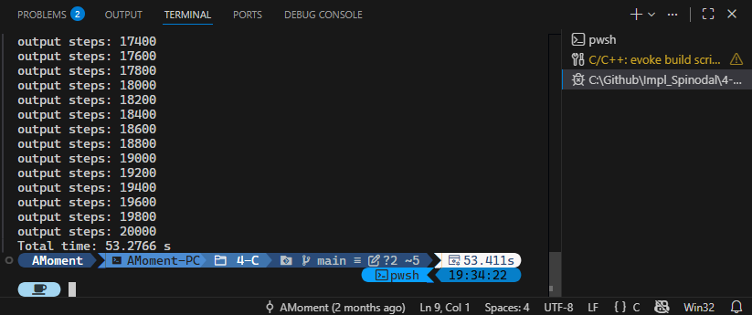
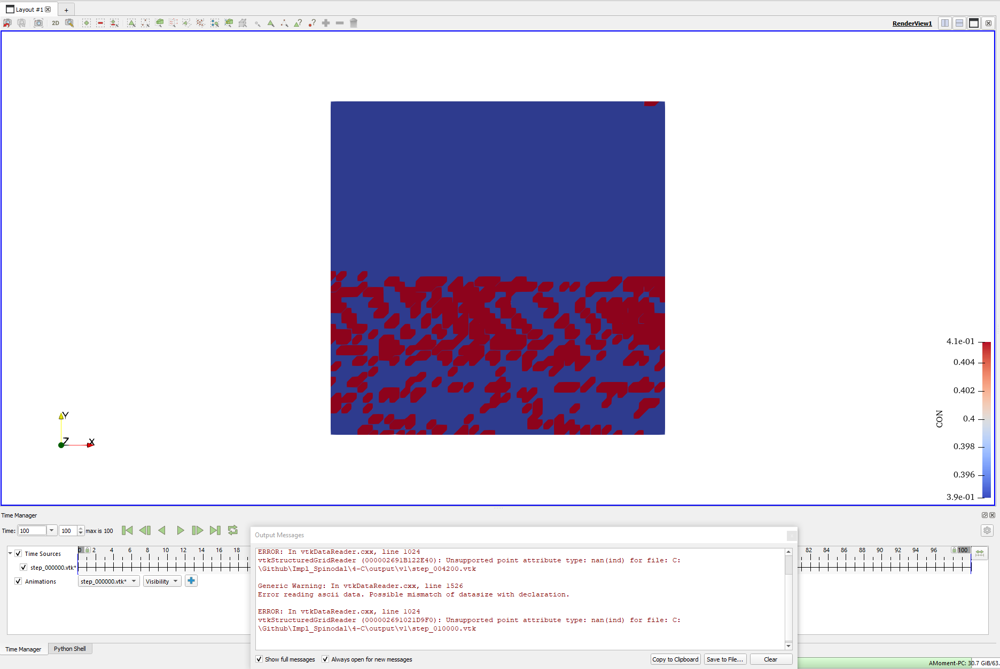
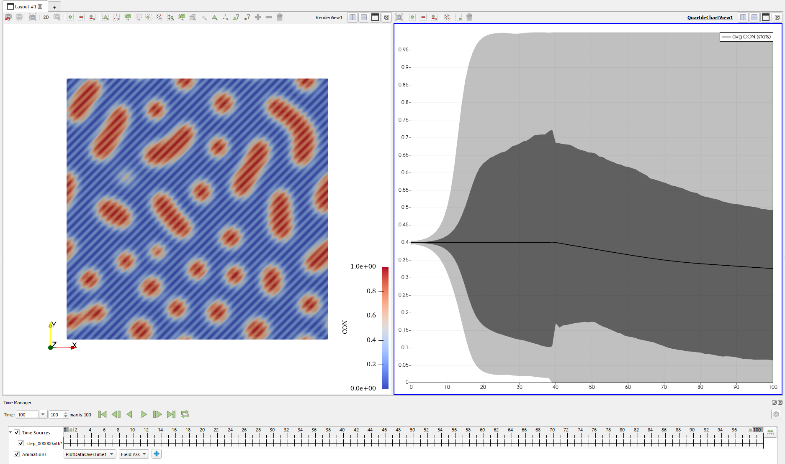
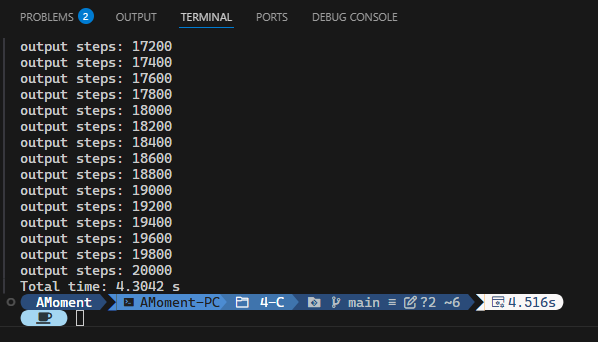
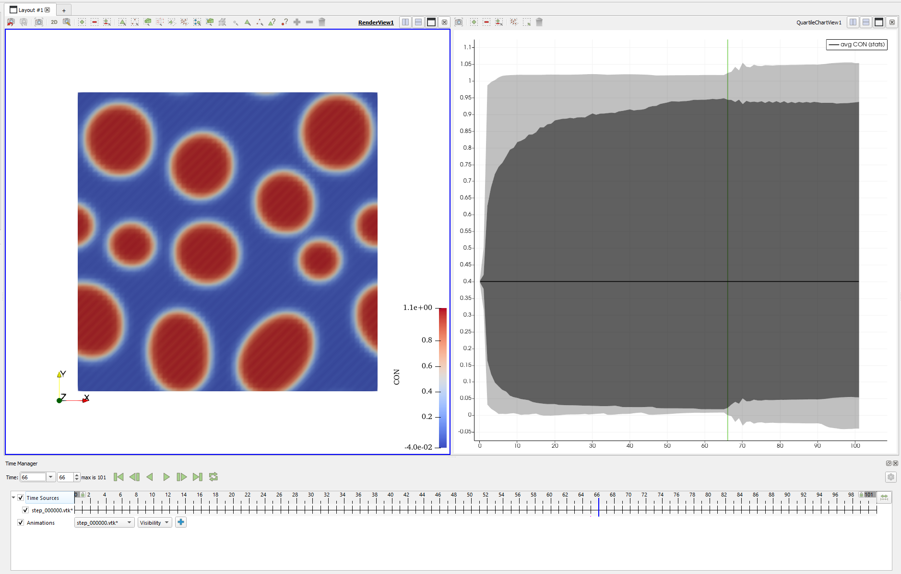
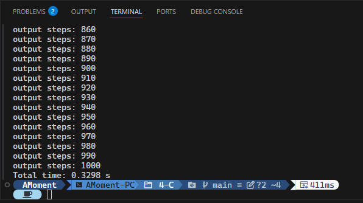
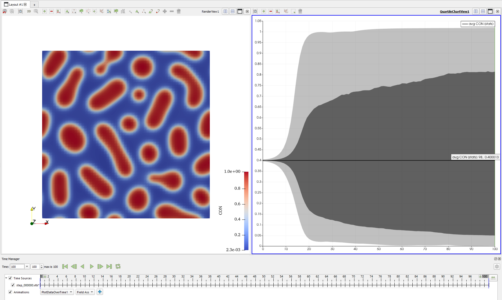
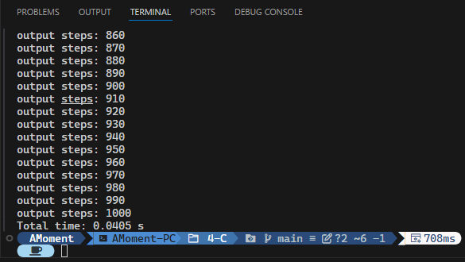
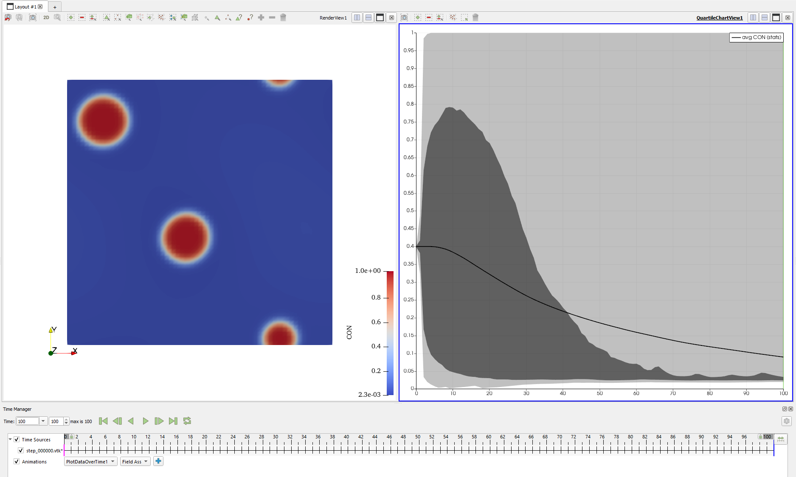

---
categories:
- Phase Field
- Programming
tags:
- C
- Fourier Spectrum
- Fourier Transformation
- FFT
- Spinodal Decomposition
- Numerical Analysis
title: "相场模拟，但是用很多语言 IV"
description: 半隐式傅里叶谱方法！
image: /images/Alice-2.png
imageObjectPosition: center 20%
date: 2026-06-22
math: true
---

*谈到编程，稍早一些的时候大家几乎都会提到 C 语言。本期我们就来试试之前番外中使用过的 C 语言吧！用它来跑调幅分解看看~*

*为保持系列的统一，头图我们依旧选择了上期出现的，由 [Neve_AI](https://x.com/Neve_AI) 绘制的 AI 爱丽丝。选曲则是最近（……）[Ayase](https://space.bilibili.com/400813602/) 上传到 B 站的 [シネマ(CINEMA)](https://www.bilibili.com/list/ml1197098078)，由初音未来献唱。很有 Ayase 味道的一首歌，也算是一代神曲了，希望您能喜欢~*



## 古老的传说……

某种程度上，C 语言已经成为了传统编程的代名词了：复杂且庞大的代码库，庞杂的依赖项，强大的内存控制能力，以及各方 C 语言大神……不得不承认，C 语言即便不是那个最古老的高级编程语言，也是各个传统编程语言中最为人所知的那个。那么，为什么它如此出名呢？这就不得不提到现代计算机的操作系统了。

### 一次失败的尝试

上世纪 60 年代的美国，计算机操作系统的发展如火如荼，当时由 Bell 实验室，MIT 和通用电气三方共同合作的大型操作系统项目 *Multics* (*Multiplexed Information and Computer Services*) 正在推进中[^1]。Multics 项目有诸多创新之处：它是分时操作系统，实现了单层存储，且支持动态链接[^2] [^3] [^4]。当时 Multics 计划使用一个尚未实现的语言，PL/I，来进行开发，且在 1969 年，Doug McIlroy 等人实现了 TMG，一款高级编程语言，并用它成功实现了 PL/I 的编译器。

然而也许是因为项目管理混乱，又可能是当时的技术水平没法顺利推进这个项目，就在这一年，Bell 实验室的管理层和员工们觉得这个项目前景不足，纷纷退出该项目[^1] [^3] [^4]，这个项目就这样失败了。其中一批退出该项目的员工有 Ken Thompson, Dennis Ritchie，Douglas McIlroy, Joe Ossanna 等人。他们转而尝试一个更加小型化的操作系统项目，为了与 Multics 相对，他们给新项目起名为 *Unics*，即 *Uniplexed Information and Computing Service* [^3]。相比起 Multics，Unics 并非分时操作系统，但也吸取了许多从 Multics 上获得的经验。随后，Unics 的名字被改成发音相似的 *Unix*[^2]，这就是 Unix 的诞生。

### Unix 的诞生

在 1969 年的夏天，Ken Thompson 的妻子带着刚刚出生的宝宝去了祖父母家，而他也因此得以拥有了四周的时间。在这四周里，他在 PDP-7，一台老旧的设备上实现了内核，Shell，编辑器和汇编器，这就是第一代的 Unix [^4]。实现这些功能的过程也颇为传奇：他没有直接在 PDP-7 上编程，而是先在 GE-635 上通过交叉编译获得了能被 PDP-7 读取的纸带，纸带上记录的是能被 PDP-7 使用的汇编器。在这之后，就可以在 PDP-7 上使用汇编开发各种实用工具，随后的开发工作便得以直接在 PDP-7 上进行[^1]。

然而，PDP-7 不是一个好的平台，使用汇编开发也并非易事。在 PDP-7 的初次运行后没过多久，用来实现 PL/I 编译器的语言 TMG 被实现出来了，随后 Multics 使用的 PL/I 的编译器也被开发出来。但 PL/I 这门语言并不合 Unix 开发者的心意，而用它开发的 Multics 的失败让 Ken Thompson 下定决心，Unix 一定要有一款自己的系统编程语言[^1]。

### B 语言，与 NB

在尝试使用 TMG 编译 Fortran 编译器未果后，Ken Thompson 在 BCPL 的基础上实现了一款更小型化的编程语言编译器，称为 B 语言。（据 Ritchie 所说，*it's BCPL squeezed into 8K bytes of memory and filtered through Thompson’s brain.*）[^1] Ken Thompson 使用它来代替 PDP-7 上的汇编语言，成为了 Unix 的系统编程语言。B 和 BCPL 在很多地方都是相似的，比如它们都是无类型语言。但 B 语言中加入了一些好用的特性，比如 `++`，`--`，`+=` 运算符等等，且 B 不允许在程序段（procedures，也就是现在的 *函数*）中定义新的程序段 [^1]。

然而 B 语言也有它的问题，特别是当他们尝试把 Unix 从 PDP-7 移植到 PDP-11 上的时候，这些问题就暴露出来了。PDP-11 的字长是 16 比特，而最初开发 Unix 的 PDP-7 是 18 比特的，这意味着两个机器一个字（word）的长度并不相等。而 B 语言是字地址（word-addressed）而非字节地址（byte-addressed）的，且所有的数据都是一个 *cell*，没有所谓的字符类型 (*char*)，只有被整存在一个 cell 中的字符串，这就导致 B 语言编译器就很难处理单个字符；另外，浮点计算在一些老机器上是刚好能放进一个字里的，因为字长比较长，但这不再适用于字长更短的 PDP-11；还有指针的问题，B 语言继承了 BCPL 的指针模型，它以字为单位移动，而非字节。这在以字为地址单元的机器上没有问题，但在 PDP-11 这个以字节为地址的机器上时，就会需要额外的操作来把字地址转换成字节地址[^1]。

总体上来讲，问题主要在于以 *字* 为基本单元的 B 语言不再适用于不同字长的处理器。为此，Dennis Ritchie 在 1971 年开始向 B 语言添加字符类型，且重写了 B 的编译器来在 PDP-11 上生成机器码，而非以前的 threaded code，一种需要进一步解释运行的压缩代码。Dennis Ritchie 将略微修改的 B 语言称为 NB，意为 *new B*[^1] [^5]（意味深）。

### 从 NB 到 C

NB 后来又有了一些新的特性，比如有了类型系统（`int`，`char`，数组，指针等），再后来，在 Dennis Ritchie 的实验过程中，他发现这个版本的 NB 不方便创建复合数据结构，因此又引入了 `struct` 结构体；另外他又让 NB 拥有了完整的类型系统，支持指针的数组，数组的指针，函数等复杂的类型，而使用该类型的变量的方式正好与声明该变量的方式相同。

在拥有了以上的一切新东西之后，Dennis Ritchie 决定给这个语言一个单字母的名称，这就是 C 语言的开端。在 1971 到 1973 年间，C 语言不断完善，可以被移植到其他的机器上，而在 1973 年，Unix 系统成功使用 C 语言重写，标志着 C 语言成功成为了 Unix 系统的系统编程语言，也让 Unix 操作系统成为了可移植的操作系统。后来，由 Dennis Ritchie 和 Brian Kernighan 编著的 *The C Programming Language* 在 1978 年出版，C 语言自此有了参考标准[^1] [^4] [^5]。

### ANSI C，及后来

随后，C 语言不断发展，ANSI（American National Standards Institute，美国国家标准局）在 1989 年发布了 ANSI C 标准，添加了 `volatile`，`enum`，`void`，`const` 等关键字，成为 C89 版本；ISO（国际标准化组织）也在 1990 年接受 ANSI C 标准，被称为 C90，此后所有的版本都以年份后两位命名。C95 中添加了宽字符支持，对流式 IO 做出一些变更，而 C99 则添加了许多新的特性，如 `bool` 类型，`long long` 类型，`inline` 修饰符，使用 `//` 开启注释等等，成为了所谓的 *现代 C 语言*，这也是支持最为广泛的 C 语言标准。

C 语言至今仍然不断发展，最近的 C23 标准在弃用了许多特性（如 `ctime`）的同时，增加了许多新的语言特性，如属性标识（`[[deprecated]]`，`[[noreturn]]`），数位分隔符，新的预处理器指令，添加 `nullptr` 常量 和 `nullptr_t` 类型，让 `true` 和 `false` 成为关键字等等。

与此同时，C 语言也伴随着 Unix 操作系统走遍了大江南北。想要进行 Unix 系统开发，就绝对绕不开 C 语言，而不进行系统开发的程序员们或多或少也都写过一点 C 代码，许多现代基础设施都使用 C 语言写成（如大名鼎鼎的 Python，其“标准解释器”就是用 C 语言写成的 *CPython*），而许许多多的大学生在本科期间也都要学一学 C 语言，美其名曰提高技能，学习程序思维。C 语言已经成为了现代计算机科学不得不品尝的一部分了。

## C 语言速览

本系列已经介绍了这么多的语言了，相比之下 C 语言的语法规则就像是这些语言的某种原型一样。甚至更进一步地说，后来的这些语言应该都或多或少地借鉴了 C 语言的语法特性。比如 JavaScript，它是明确且有意让语法靠近 C 语言的，而 C++ 就更不必多说，本就是从 C 拓展而来（尽管现在也很难说，它的新东西太多了），还有诸如 Java，Objective C，Swift 等等。

那么，既然如此，为什么我们还要再介绍它的语法呢？正是因为 C 语言*简单*。相信下面的几个小例子就已经能让你快乐地写一些 C 代码了。

### 注释

C 语言有两种注释方式，一种是使用 `//` 双斜杠开启行注释，注释掉这一行在它后面的内容，另一种则是用 `/* ... */`，块注释来注释掉中间的任意多内容，且支持跨行。灵活的注释可以让我们玩很多花活，但一般还是推荐在文件头使用块注释，而在代码内使用行注释。

### 数据类型

C 的基础数据类型尤其简单。字符 `char`，整数 `int`，无符号整数 `unsigned`，单/双精度浮点 `float` 和 `double`，布尔类型（虽然是后来才有的）`bool`，在不考虑指明数据位数等的特殊（扩展）数据类型外，它们就是 C 语言几乎所有的基础数据类型，可以说是非常地简单，甚至简陋了。

在基础数据类型之上，我们可以再拓展它们，比如 *指针* 和 *数组*，其中指针用来指向保存该类型变量的地址，数组则是一组同类型的，定长的数据。比如一个整数指针的类型可以写作 `int*`，而一个字符数组可以写成 `char variable[N]`。我们还可以添加一些修饰符，比如 `const`，`volatile` 等，用来向编译器提示该变量在代码运行过程中不会发生变化或者会被外部程序改变。通过它们的组合，您可以组合出非常复杂的数据类型。

然而，过于复杂的数据类型会阻碍使用和阅读，所以 C 语言支持我们使用 *结构体* `struct` 来创建复杂数据类型，或者使用 `typedef` 关键字来给复杂类型以新的名称。通过结构体我们可以更方便地管理复合数据，而 `typedef` 能让代码更清晰。不过您也当然可以手撕 C 语言的数据类型，如果您对这个话题感兴趣，欢迎查看以前的这篇文章：[如何解析 C/C++（比较）复杂的类型？](/posts/Simple_Type_Parsing)。

您也许发现上面的这些数据类型中没有 *字符串*，这是因为在 C 语言中，字符串其实是以 `\0` 结尾的字符指针。这是某种历史遗留问题，但换个角度来看，也是 C 语言的特色：存在许多特殊的规则，需要对它们熟悉才能更好地写 C 代码。我们后面会进一步了解。

### 变量与函数

有了数据类型，我们自然想要知道怎么定义一个变量。其实前面的数据类型部分已经有了一些提醒，比如 `char var[N]`，就是一个长度为 `N` 的字符串数组，变量名为 `var`。尽管这么说有失偏颇，但总体来讲，C 语言的变量声明遵循 `type name;`，而在声明变量时也可以用等号直接进行初始化：`type name=init_val;`。如果要考虑指针、数组和复杂修饰符的话，就 C 语言的设计来讲，变量声明遵循 *怎么使用就怎么声明*。比如如果我们要声明指向整数的指针，我们就使用 `int *var;` 来声明这个指针，意思是如果我们后面使用 `*var` 的话，就会得到 `int`。

而这个规则如果我们再加入函数，就显得更加明显了。在 C 语言中，我们可以前置声明一个函数，如 `int my_func(int a, double b);`，这样就声明了我们有一个函数名叫 `my_func`，它接受一个整数和一个双精度浮点作为参数，结束时返回一个整数值。如果我们的函数不返回任何值，则可以使用 `void` 来表明该函数没有返回值。在声明的同时，我们也可以不加分号结束该语句，而是使用大括号来开启一个代码块，用来定义该函数。由于 C 语言中的一切都按值传递，如果我们不想拷贝，或者希望函数能修改外部变量的值，我们可以让函数接受指针而非值作为参数，这样就可以在不修改地址的前提下，直接修改地址上的值，从而改变外部变量的值了。这一点我想也体现了 C 语言 *利用一切已有工具* 的思想吧。

为什么说变量的声明规则和函数有关系呢？因为在 C 语言中调用函数，也是像声明函数那样使用它：`my_func(42,11.4514)`。可以看到通过这样的方式调用函数后，它将会返回，或者说得到，一个 `int` 值。另外，虽然函数和变量在 C 语言中有极为明显的差别，但我们可以声明指向函数的指针，如 `int *p_func(int, double)`，此时 `p_func` 就可以指向函数，`*p_func` 就相当于是被指函数的函数名，后面可以使用括号按照本来的方法调用该函数。从这个角度更是能说明 C 语言关于变量声明的规则。

最后值得注意的是，C 语言的程序一定从一个特殊函数 `main` 开始执行，也可以说它是程序的入口。这一点是一些脚本语言，如 Python，JavaScript 等所不具有的。而且 C 语言中只能调用前面已经声明过的函数，这一点和 JavaScript 不同，JavaScript 允许先调用后声明/定义。

### 控制语句

一个完整的程序语言，除了变量和函数定义以外，掌握控制流语句写法就相当于掌握了这门语言的基本用法了。这一点对于 C 而言尤为如此。在 C 语言中，循环可以使用 `for` 语句来实现：`for(decl;cond;post){...}` 就可以定义一个 `for` 循环，其中括号内是三个语句，分别是循环前声明，继续循环的条件，循环结束时的处理，括号中便是循环中要做的事。这一点很多编程语言都有这样的写法，很难不认为它们都借鉴了 C 语言的写法。除了 `for` 循环外，还有 `while` 和 `do while` 循环，它们的写法也类似很多别的语言，这里就不赘述了。

除了循环，通常还需要判断语句。C 语言除了基础的 `if (cond) {...} else if(cond2) {...} else {...}` 的写法外，还有 `switch case` 语句以及三目运算符 `cond?yes-do:no-do`，不过现在大多不推荐使用后两种写法，因为可读性较弱且容易出问题。但是总体来讲，`for` 循环和 `if else` 语句就已经能解决 C 语言的循环与判断问题了，没有什么花里胡哨的迭代器之类的，从语法上讲非常清晰。

### 其他

有了上面的内容，理论上讲我们已经可以写出想要的各种 C 语言代码了。但完整的 C 语言程序往往需要一些预处理指令，它们往往以 `#` 开头，最基础的比如`#include` 用来 *复制粘贴* 某个文件中的内容来替换这里的内容（其实大多数时候是用来包含系统或用户头文件），`#define` 用来定义宏命令等。宏在 C 语言编程中有很特殊的地位，它可以在预处理阶段进行文本替换，从而让一些复杂且重复的命令得以通过若干个宏来简单地替换它们，减轻负担，也可以被用作某种编译开关，用来启用一些语言特性或者功能。

### 小结

啰嗦了这么多，总的来说，C 语言的语法规则并不繁琐，就是这样的几条最基础的规则，便可以让程序员实现诸多想要实现的目的。然而，上面只是最基础的语法规则，要使用这门语言还需要掌握许多的标准库函数使用方法，且由于 C 语言的抽象层级贴近硬件，还需要一些程序运行过程的知识才能更好地编写 C 语言的代码。这一切又让 C 语言变得很难精通。就笔者个人而言，C 语言作为程序编写入门来讲不是特别好的选择：有 Python 这样语法更亲民，使用更简便的语言，但想要写出好的程序，C 语言还是推荐去了解的，简单（简陋）的语法更能让人了解背后究竟发生了什么。

回到本系列的主题，我们要怎么用 C 来跑调幅分解呢？这样一门古老的语言能让我们方便地实现调幅分解的模拟吗？

## C 的实现

答案自然是肯定的，且实际上我们在上一期就给出了答案：我们要使用 *半隐式傅里叶谱方法*（以下简称傅里叶谱法）来求解调幅分解问题。在上一期的番外：[傅里叶全家桶](/posts/Impl_Spinodal_Fourier) 中，我们已经介绍了傅里叶级数、离散/连续傅里叶变换、快速傅里叶算法等内容，且我们自己实现了一个简单的快速傅里叶变换的蝶形算法。自然，我们是要在这节使用它的。

不过，新方法，新气象，我们先在傅里叶谱方法的背景下来看看调幅分解问题吧。

### 问题简述

依旧，我们有化简后的演化方程：

$$ \frac{\partial c}{\partial t} =  M \nabla^2\left( 2Ac(1-c)(1-2c)-\kappa\nabla^2c\right), $$

如果您忘记了的话，我们要求解的变量是 $c$ 即浓度，而 $M$，$A$，$\kappa$ 都是已知的材料相关常数，$t$ 自然是时间，$\nabla^2$ 则是拉普拉斯算符，可以理解为对空间求二阶导。

要求解这个偏微分方程，之前我们都使用了差分法来处理拉普拉斯算符，用向前欧拉法处理对时间的求导。而这次，我们则计划使用傅里叶谱方法求解这个问题，即先将方程变换到傅里叶空间中，把求导变换成傅里叶空间中的乘法，并在该空间进行四则运算得到代求变量的傅里叶空间中的表达式，再将方程变换回原空间中从而得到方程的解。这个方程有对时间的偏导和空间上的二阶导，这里我们选择依旧使用欧拉法处理时间求导（时域上我们没有特别好的办法），而让傅里叶变换处理空间求导过程。

因此，我们有这样的计划：

1. 对方程两边做关于空间的傅里叶变换（变换后记为 $\{\cdot\}_{\mathbf{k}}$）:
   - 左边因空间变换与时间无关，因此得到变换后的浓度对时间的偏导 $$\frac{\partial \{c\}_\mathbf{k}}{\partial t};$$
   - 方程右边，由于傅里叶变换的线性性，从外往内变换后 $\nabla^2 F$ 被变换为 $\mathbf{k}^2 \{F\}_\mathbf{k}$：
   $$ - M \mathbf{k}^2 \left(\{2Ac(1-c)(1-2c)\}_\mathbf{k} + \kappa \mathbf{k}^2 \{c\}_{\mathbf{k}} \right);$$
2. 重新排列方程，得到 $\{c\}_{\mathbf{k}}$ 的表达式；
3. 做傅里叶逆变换，得到原空间中的浓度结果。

这个计划还挺不错的，直到我们要处理 $2Ac(1-c)(1-2c)$ 的时候。这样一个乘法，在傅里叶变换下，会变成卷积。而卷积在计算时需要遍历整个网格，这样反而让计算变慢了。要怎么解决呢？这就是所谓 *伪谱法* 发挥作用的地方了。我们在计算傅里叶变换时，不将这个部分逐个做变换，而是在原空间中计算出一个整体的结果后再进行傅里叶变换通过这种方式就可以很好地解决 $2Ac(1-c)(1-2c)$ 变成卷积后不好算的问题。这样我们的第一步前面可以加上：

0. 计算 $2Ac(1-c)(1-2c)$，在做傅里叶变换时作为整体被变换到傅里叶空间。

这样我们就可以根据这个计划来写代码了！

### 品尝傅里叶伪谱法

我们要用的傅里叶变换库除了鼎鼎大名 FFTW 之外，自然还有自己实现的 MyFFT 了。MyFFT 的代码放在了 [这里](/page/attachments)，您可以下载下来自行编译。我们先来尝试使用自己写的版本，源码放在了这里：[platform.h](/attachment/Impl_Spinodal/C/platform.h)，[create_directory.h](/attachment/Impl_Spinodal/C/create_directory.h) 和 [C_impl_fft_v1.c](/attachment/Impl_Spinodal/C/C_impl_fft_v1.c)。

诶？这次怎么有这么多文件？主要原因是我们希望其中一些 API 可以跨平台。因此有了 `platform.h` 这个文件，里面是一些和平台相关的代码。而更进一步地，由于打开文件夹这个操作在各个操作系统和桌面环境下都不太一样，因此我们再单独给它一个头文件，即 `create_directory.h`。这两个文件只提供了方便的两个工具，一个用来计时，另一个用来打开文件夹，并没有包含核心的计算逻辑。我们这里就不细究它们了。我们直接看主要逻辑。

#### 神秘文件头

```C
#include "platform.h"

#include <math.h>
#include <stdio.h>
#include <stdlib.h>
#include <string.h>
#define M_PI 3.14159265358979323846 /* pi */
#define TRUNCATE_REAL 1e-6

#define OUTPUT_VTK // whether output the vtk files
#define MY_FFT_USE_RECURSIVE // whether use the recursive version of fft
#include "C_my_fft.h"
// my_fft_forward_2d(in,out,N0,N1) = fftw_plan_dft_2d(N0,N1,in,out,FFTW_FORWARD,_)
// my_fft_backward_2d(in,out,N0,N1) = fftw_plan_dft_2d(N0,N1,in,out,FFTW_BACKWARD,_) / (N0*N1)
```

首先我们依旧包含一些头文件，其中 `<math.h>` 自然是数学函数库，`<stdio.h>` 当然是输入输出了。比较有趣的是 `<stdlib.h>` 和 `<string.h>` 两个头文件，前一个是为了使用 `malloc`、`free` 等内存操作，这也挺合理的，内存操作和 `<stdlib.h>` 的名字就很搭。但是有趣的是，`<string.h>` 也是为了管理内存而引入的。`mem*` 系列的函数，比如我们用到的 `memcpy`，就是包含在 `<string.h>` 里而不在 `<stdlib.h>` 里。

为什么呢？这背后和 `string` 这个类型有关。C 语言并没有 `string`，人们常说的 `string` 实际上就是 C 语言中的一串字符，可以使用数组，也可以使用指向字符串开头的指针。因为在 C 中操作字符串就相当于操作一段连续内存，所以干脆就把操作一段连续内存的函数都放在了 `<string.h>` 中。不得不说，很有极客的风格。

然后我们用 `#define` 定义了一些宏。最引人注目的也许是 `M_PI`，我们手动定义了 $\pi$ 的值。可能看到这里有个很自然的问题：为什么 $\pi$ 这么一个数学常数需要我们手动定义，而不是在 `#include <math.h>` 之后就自动导入呢？原因有点难评：`<math.h>` 的确有这些数学常数，甚至有很多个版本，涵盖双精度和单精度的。但是开启它们需要使用特性宏，也就是在 `#include` 它们之前就得先定义一些宏以打开某些功能。然而鸡肋的是，我们不需要那么多功能。我们只需要最基础的，不管是多老的版本都应该定义的那些老掉牙的数学函数，以及一个小小的 $\pi$。那么既然如此，为什么我们不直接自己定义好呢？所以这个常数我就从 `<math.h>` 里抄了过来。不过某种角度上，正确的做法其实是在编译的时候通过编译器指令来定义特性宏，从而开启这些功能。但是这样做的话 IDE 又会抽风。算是一种妥协的做法吧。

接下来我们定义了某个截断值。这个值是用来做数值截断用，当浓度出现异常，超出 $[0,1]$ 的区间时，我们就把它截断。暂时设了个 `1e-6`，相对来说是一个比较小的值。

接下来我们就定义了我们自己的一些特性宏。特性宏作用在编译过程，如果某些宏打开了，编译后的产物就会有这些特性。宏的这一特性可以让我们做选择性的编译，尤其是一些版本选择的开关，选择如何具体地实现某些功能等。咱们这里也是现学现用了。最后我们引入自己实现的 FFT 头文件，头文件的设置就完成了。

#### 依旧先定义函数

一如既往地，我们要定义几个函数用来辅助后面的计算。首先自然是我们在前面的步骤中就提到的 $2Ac(1-c)(1-2c)$，我们让它成为函数 `df_dc`：

```c
double df_dc(double A, double c) {
    return 2.0 * A * c * (1.0 - c) * (1.0 - 2.0 * c);
}
```

简直是最无聊的例子了。不过下面的 `write_VTK` 就显得更有趣一些。依旧我们计划将结果输出为 *VTK* 格式，不过因为我们要传入的数据是复数，因此我们需要做一些特殊的处理。这个函数的定义如下：

```C
void write_VTK(my_complex *con, size_t N0, size_t N1, const char *folder_path, size_t istep, double dx) {
    size_t N_full = N0 * N1;

    size_t name_len = strlen(folder_path) + strlen("step_") + 6 + strlen(".vtk") + 1;
    char *file_name = (char *)malloc(name_len);
    if (!file_name) {
        perror("malloc failed");
        exit(1);
    }

    snprintf(file_name, name_len, "%sstep_%06zu.vtk", folder_path, istep);

    FILE *f = fopen(file_name, "w");
    free(file_name);
    if (!f) {
        perror("fopen failed");
        exit(1);
    }

    fprintf(f,
            "# vtk DataFile Version 3.0\n"
            "Spinodal Decomposition Step %zu\n"
            "ASCII\n"
            "DATASET STRUCTURED_GRID\n"
            "DIMENSIONS %zu %zu 1\n"
            "POINTS %zu float\n",
            istep, N0, N1, N_full);

    for (size_t j = 0; j < N1; j++) {
        for (size_t i = 0; i < N0; i++) {
            fprintf(f, "%04.1f\t%04.1f\t0\n", (double)i * dx, (double)j * dx);
        }
    }

    fprintf(f,
            "POINT_DATA %zu\n"
            "SCALARS CON float\n"
            "LOOKUP_TABLE default\n",
            N_full);

    for (size_t i = 0; i < N_full; i++) {
        fprintf(f, "%07.5f\n", con[i][0]);
    }

    fclose(f);
}
```

由于 C 缺乏现代的字符串处理函数，我们需要用比较原始的 `strlen` 来先计算字符串长度，然后再用 `malloc` 动态分配一个字符串用来承载文件的完整路径。值得注意的是我们的实现里出现了一些魔数：`6` 和 `1` 这些。其中的 `6` 是指我们会将时间步以总共 6 位的含 0 整数的形式输出，而 `1` 则是字符串末尾的 `\0`，因为 `strlen` 不会计算字符串末尾的 `\0`，但是合法的字符串后面又需要它。这一点也有很多 C 语言使用者吐槽：为什么非得用 `\0` 表示字符串结束……我也表示不太理解。

另外值得注意的是，我们在使用 `malloc` 之后立刻就使用了 `if` 逻辑来判断是否成功分配这块内存。这里 `!file_name` 是一种常见写法，当我们分配内存成功时，`file_name` 就应该是某个具体的地址值，此时给它求逻辑非的结果时会先将这个值转成布尔类型，即 `true`，然后再进行逻辑非。简单总结就是说，当成功分配内存到地址上时，指针名的隐式转换结果是 `true`。当这样的倒霉事情发生的时候，我们让系统抛出一个错误信息，然后使用 `exit` 来以某个错误码结束程序。注意当程序正常退出时将会返回 `0`，而不正常的运行结果将会返回非 `0` 的值，根据需要程序员可以自行定义退出码的含义，以便定位错误原因。

随后我们要将字符串拼接起来。这里有几种方法可用，我们采用了 `snprintf`，通过格式化输出的方式将结果输出到字符串 `file_name` 中，同时也要指定写入的字符数目。`snprintf` 的优势在于可以使用 C 的字符串格式化，比如 `%s` 代表字符串，`%06zu` 代表以开头的 `0` 补足位数的无符号整数类型变量。

在这些工作完成之后，我们就得到了可以使用的文件路径，此时就要借助 C 语言提供的文件抽象 `FILE` 了。`FILE` 是一个结构体，我们通常用它来打开一个文件，`FILE` 类型的指针就负责管理这个文件。打开文件时我们需要通过 `fopen` 的第二个参数来指定文件的打开方式，我们要写文件所以使用 `"w"`。在打开文件后我们立刻释放了不会再用的 `file_name` 变量，然后同样的技巧通过判断 `f` 这个指针的状态来判断文件是否成功打开。

接下来就可以给文件写入内容了。`fprintf` 就负责这么将字符串输出到文件中。这里值得注意的是数字的格式输出，这里 `%04.1f` 代表输出结果一共 4 位，小数点后有 1 位，不足的部分用 `0` 补充。由于我们要输出的是浮点数，因此要先从 `size_t` 类型转换为 `double` 再进行操作。

最后就是关闭文件了。这一步和 `free` 有类似的作用，不过 `fclose` 是专门为了文件设计的。

那么至此，我们设置好了两个辅助函数，接下来就是主逻辑了。

#### 然后设置常数

白天想，夜里哭，终于是到了实现这个算法的时候了。不过依旧我们设置几个常数，几个待会儿要用的东西：

```C
int main(void) {
    const double total_time = 100., dt = 5. * 1e-3; // 100 seconds, compute per 0.005 seconds; 1e-2 is instable!

    const size_t num_total_output = 100,                     // need 100 results
        num_total_compute = (size_t)(total_time / dt),       // auto-compute total computation steps
        output_every = num_total_compute / num_total_output; // auto-compute output interval

    const size_t N = 64, N_full = N * N;

    const double dx = 1.0;
    const double A = 1.0, M = 1.0, kappa = 0.5;

    const double c_min = 0.395, c_max = 0.405; // c_0 = 0.4, delta_c = 0.005

    const char *output_directory_path = "./output/v1/";
    if (create_directories(output_directory_path) != 0) {
        perror("failed when creating directory");
        exit(1);
    }
    /* ... */
}
```

不过这次在时间控制上我们做了一些小的修改。以往我们是通过设置总时间步数量以及时间步输出间隔的方式来控制总模拟时长的，但这里我们采用了更加科学的 $$
\text{总时间} / \text{时间步长} = \text{总时间步数}$$ 的方式来控制整个计算过程，而输出方式也从规定每多少步输出一次变成我们要总共输出多少个结果。相信查阅了代码的您一定很快就理解了整个计算逻辑是什么样的。

设置完模拟参数，选择好我们要输出的文件夹路径（由于我们函数的限制，必须要在最后加上 `/` 来与文件名分隔，就这样吧（）），然后用 `create_directories` 来创建这个文件夹，通过返回值判断是否创建成功，我们就完成了模拟输出的准备了。

接下来我们初始化网格和计时器：

```C
    /* ... */
    my_complex *con = alloc_complex(N_full); // alloc_complex is zero-initialize
    for (size_t i = 0; i < N_full; i++) {
        double uniform_rand_0_1 = (double)rand() / ((double)RAND_MAX);
        con[i][0] = c_min + uniform_rand_0_1 * (c_max - c_min);
    }

    my_complex *con_trans = alloc_complex(N_full);
    my_complex *mesh_df_dc = alloc_complex(N_full);
    my_complex *mesh_df_dc_trans = alloc_complex(N_full);

    bench_init();
    bench_time_t t_start, t_end;
    bench_now(&t_start);
    /* ... */
```

我们有个方便的函数，可以快速分配需要长度的复数数组并对数组的每个元素实部和虚部都进行零初始化。然后就需要用 `rand()` 函数来生成噪音。关于 `rand()` 的问题，很多人表示它的随机数生成方式可能会和自己的需求有所出入，且有人提议采用拒绝采样方式来提高随机数的质量。然而我们只需要生成一个 $[0,1]$ 之间的实数即可，后续可以在这里生成的结果上继续操作，因此我们的问题就没那么复杂，直接除以 `rand()` 函数所可能取到的最大值即可，这样除完的结果就一定是从 $0$ 到 $1$ 均匀分布的实数来。

后来我们还多定义来几个数组，它们是用来在后面参与计算作为中间变量的数组：`con_trans` 用来存储傅里叶变换过的浓度；`mesh_df_dc` 存储计算得到的 `df_dc` 的网格，而它的 `*_trans` 版本自然也是傅里叶变换后的结果了。

在进入主循环之前，我们使用我们自己写的计时器来准备对计算过程进行计时。在这一切的繁文缛节结束后，我们终于要迎来真正的计算流程了。

#### 来吧！谱方法！

Talk is cheap, I'll show you the code:

```C
for (size_t istep = 0; istep <= num_total_compute; istep++) {
        my_fft_forward_2d(con, con_trans, N, N);
        // fill/refill mesh_df_dc
        for (size_t i = 0; i < N_full; i++) {
            mesh_df_dc[i][0] = df_dc(A, con[i][0]);
        }

        // get transformed mesh_df_dc
        my_fft_forward_2d(mesh_df_dc, mesh_df_dc_trans, N, N);

        for (size_t j = 0; j < N; j++) {
            for (size_t i = 0; i < N; i++) {
                size_t k_pos = i + j * N;

                // Correct FFT frequency mapping (fftshift-equivalent)
                double fi = (i < N / 2) ? (double)i : (double)i - (double)N;
                double fj = (j < N / 2) ? (double)j : (double)j - (double)N;

                double kx = 2.0 * M_PI * fi / ((double)N * dx);
                double ky = 2.0 * M_PI * fj / ((double)N * dx);
                double k2 = kx * kx + ky * ky;
                double k4 = k2 * k2;

                my_complex neg_k2_df_dc, kappa_neg_k4_c;

                neg_k2_df_dc[0] = -1.0 * k2 * mesh_df_dc_trans[k_pos][0];
                neg_k2_df_dc[1] = -1.0 * k2 * mesh_df_dc_trans[k_pos][1];

                kappa_neg_k4_c[0] = -1.0 * kappa * k4 * con_trans[k_pos][0];
                kappa_neg_k4_c[1] = -1.0 * kappa * k4 * con_trans[k_pos][1];

                // con_trans += dt * (k2_term + k4_term)
                con_trans[k_pos][0] += dt * M * (neg_k2_df_dc[0] + kappa_neg_k4_c[0]);
                con_trans[k_pos][1] += dt * M * (neg_k2_df_dc[1] + kappa_neg_k4_c[1]);
            }
        }

        my_fft_backward_2d(con_trans, con, N, N);

        if (istep % output_every == 0 || istep == num_total_compute) {
            printf("output steps: %zu\n", istep);
#ifdef OUTPUT_VTK
            write_VTK(con, N, N, output_directory_path, istep, dx);
#endif
        }
    }
```

首先可以看到主循环（时间循环）的设置和之前有所不同。之前我们的终止条件都使用了 `istep < num_total_compute + 1`，用来将最后一步也输出出来，这次我们使用更合适的 `istep <= num_total_compute`，一样的效果，但是语义上更明确。

进入时间循环内，第一步便是用我们包装好的函数来计算傅里叶变换了：

```C
    for (size_t istep = 0; istep <= num_total_compute; istep++) {
        my_fft_forward_2d(con, con_trans, N, N);
        // fill/refill mesh_df_dc
        for (size_t i = 0; i < N_full; i++) {
            mesh_df_dc[i][0] = df_dc(A, con[i][0]);
        }

        // get transformed mesh_df_dc
        my_fft_forward_2d(mesh_df_dc, mesh_df_dc_trans, N, N);

        for (size_t j = 0; j < N; j++) {
            /* ... */
        }
        /* ... */
    }
```

然而，如果您使用了 IDE 来打开这份 C 源码的话，您可能会发现这里我们使用的 `my_fft_forward_2d` 并没有被染成函数的颜色，而是 *宏* 的颜色。这是为什么呢？因为我们使用了宏来包装我们实际上写的函数。还记得最开始的那行 `#define MY_FFT_USE_RECURSIVE` 吗？这行宏让头文件 `C_my_fft.h` 中的函数调用都使用 `_v1` 后缀的函数，也就是使用递归算法来计算傅里叶变换。这样做的另一个“好处”是，我们可以隐藏起来函数的参数表（这是哪门子好处……）。

另外值得注意的是，我们这次使用的是 `my_fft_forward_2d`，而不是 `my_fft_forward` 两次。其实也差不多是做两次一维变换，但一次是在 $x$ 方向进行变换，另一次则是在 $y$ 方向进行变换。

可是，我们的 `my_fft_forward` 只能在矩阵的一个方向上进行变换。因此，在进行第二次变换的时候，我们需要对矩阵做一下转置：

```C
/* From C_my_fft.c */
void my_fft_2d_v1(
    my_complex *in,
    my_complex *out,
    size_t N0,
    size_t N1,
    int sign) {

    // N0 and N1 must be power of 2
    // row major: [i,j] = j+i*N0
    size_t N_full = N0 * N1;

    // transform row first
    my_complex *row_transformed_in = (my_complex *)malloc(sizeof(my_complex) * N_full);
    if (!row_transformed_in) {
        free(row_transformed_in);
        return;
    }
    for (size_t i = 0; i < N_full; i += N0) {
        my_fft_1d_v1(&(in[i]), &(row_transformed_in[i]), N0, sign);
    }
    // then transform column

    // perform inplace transpose from row-major to column-major
    my_fft_util_transpose(row_transformed_in, row_transformed_in, N0, N1);

    for (size_t i = 0; i < N_full; i += N1) {
        my_fft_1d_v1(&(row_transformed_in[i]), &(out[i]), N1, sign);
    }

    my_fft_util_transpose(out, out, N1, N0);

    free(row_transformed_in);
    return;
}
```

这样就可以对二维数据进行傅里叶变换了，别忘了最后再转置回来就是。

接下来就是逐点处理了。然而在进入每一点之后，我们的第一个操作并不是计算，而是做了些判断和赋值：

```C
        /* ... */
        for (size_t j = 0; j < N; j++) {
            for (size_t i = 0; i < N; i++) {
                size_t k_pos = i + j * N;

                // Correct FFT frequency mapping (fftshift-equivalent)
                double fi = (i < N / 2) ? (double)i : (double)i - (double)N;
                double fj = (j < N / 2) ? (double)j : (double)j - (double)N;

                double kx = 2.0 * M_PI * fi / ((double)N * dx);
                double ky = 2.0 * M_PI * fj / ((double)N * dx);
                double k2 = kx * kx + ky * ky;
                double k4 = k2 * k2;
                /* ... */
            }
            /* ... */
        }
```

为什么呢？这也算是使用傅里叶变换的一个小小的坑点吧。FFT 的计算结果并不是按照频率从小到大的顺序存储的，而是有一种特殊的布局：

```
[ zero frequency, possitive frequency, negative frequency ]
```

而在每一段中都是从小到大的顺序。这样的计算结果是为了方便计算而设计的（Cooley-Tukey 算法自动会形成这样的数据布局），但是却不太适合我们做数值计算，因为它的结果对应的频率需要重新进行计算。不过好在这个计算过程非常简单：只需要重新把结果的布局变为：

```
[ negative frequency, zero frequency, possitive frequency ]
```

就可以了。如果是二维结果，那就在两个方向上都做这样的变换。这也就有了我们最开始的 `fi` 和 `fj`，它们是用来计算频率而将被使用的临时频率。

然后计算频率的部分，我们根据公式：

$$ \mathbf{k} = \frac{2\pi \mathbf{n}}{N * \Delta x} $$

就可以得到需要的频率，最后用它做点乘就得到了 $k^2$ 和 $k^4$，在代码中我们记为 `k2` 与 `k4`。需要注意的是，这里我们需要做的是点乘，而不是普通的乘法。这是因为在二维条件下，两个方向的频率是相互独立的，傅里叶变换得到的结果是一个向量而非一个普通的数。

接下来只要把对应的部分组合起来就可以了：

```C
/* ... */
my_complex neg_k2_df_dc, kappa_neg_k4_c;
neg_k2_df_dc[0] = -1.0 * k2 * mesh_df_dc_trans[k_pos][0];
neg_k2_df_dc[1] = -1.0 * k2 * mesh_df_dc_trans[k_pos][1];

kappa_neg_k4_c[0] = -1.0 * kappa * k4 * con_trans[k_pos][0];
kappa_neg_k4_c[1] = -1.0 * kappa * k4 * con_trans[k_pos][1];

// con_trans += dt * (k2_term + k4_term)
con_trans[k_pos][0] += dt * M * (neg_k2_df_dc[0] + kappa_neg_k4_c[0]);
con_trans[k_pos][1] += dt * M * (neg_k2_df_dc[1] + kappa_neg_k4_c[1]);
/* ... */
```

这里为了方便了解各部分的组成，我们使用了两个临时变量，用来保存浓度变化表达式的前半部分和后半部分。这里的计算基本就是把公式翻译成代码而已，只不过要对实部和虚部分别进行计算就是了。

在遍历每个格点的计算结束后，使用二维傅里叶逆变换将结果重新变换回原空间中，就完成了一个时间步的计算了。最后再根据时间和是否输出结果进行后处理后，计算便完成了：

```C
        /* ... */
        my_fft_backward_2d(con_trans, con, N, N);

        if (istep % output_every == 0 || istep == num_total_compute) {
            printf("output steps: %zu\n", istep);
#ifdef OUTPUT_VTK
            write_VTK(con, N, N, output_directory_path, istep, dx);
#endif
        }
        /* ... */
```

在程序的最后，我们将计时结果打印在屏幕上，然后释放所有使用到的资源，就完成了这个程序。所以结果如何？

#### 唉，丑态……

我们跑了 20000 步，足足跑了 53 秒！这实在是太慢了……哦我们打开了 VTS 输出，关掉之后试试。说不定是文件 IO 太慢了呢？对吧？（心虚）



难绷，我到底在期待些什么……为什么会这样呢？等一下，怎么跑了 20000 步？哦我们的计算步数是根据总时间与单步时间来控制的，那为什么把 `dt` 设的这么小？我们试试改成 `1e-2` 看看效果。这次应该要快一些吧？

没错，计算时间降低到了 27 秒左右。我们再来看看结果：



什……怎么计算失稳了？通过检查结果，我们可以看到从第 39 步开始，模拟中出现了神秘的条纹，而到了第 42 步，结果就爆炸了，浓度直接飙升到了 `9.9e-23` 这么个不可能的值。这明显是有问题吧。诶？那我们加上数值截断，在看到苗头不对的时候就立马掐断，让浓度始终保持在合理范围内，不就可以解决这个问题了？

OK，我们塞入这么几行代码：

```C
/* ... 
my_fft_backward_2d(con_trans, con, N, N);
*/

for (size_t j = 0; j < N; j++) {
    for (size_t i = 0; i < N; i++) {
        int pos = j * N + i;
        con[pos][0] = con[pos][0] > 1.0 - TRUNCATE_REAL ? 1.0 - TRUNCATE_REAL : con[pos][0];
        con[pos][0] = con[pos][0] < TRUNCATE_REAL ? TRUNCATE_REAL : con[pos][0];
    }
}

/* 
if (istep % output_every == 0 || istep == num_total_compute) {
... */
```

编译运行，结果变成了这样：


虽然这次数值没有崩溃导致计算无法正常进行，但这还是不太对吧……怎么一直有条纹出现，而且右边的总浓度怎么随时间变化越来越小了？不行，这个办法肯定不行。那就只能使用原来的时间步长，也就是 `dt = 5. * 1e-3` 了。那这套算法的优势究竟在哪里呢？

哦对了，我们没有更换到更快的迭代算法，而是还在用老旧的递归算法。切到迭代算法试试吧！要更换为迭代算法很简单：只需要把前面的特性宏 `MY_FFT_USE_RECURSIVE` 改成 `MY_FFT_USE_ITERATIVE` 或者干脆删掉这个宏就行了，我们的这个库默认是使用更快的迭代算法的。我们将步长调回 `dt = 5. * 1e-3`，再看看结果。



？！强强！？只用了 3 秒就跑完了！但是我们之前的那些算法比这个傅里叶谱方法要更快吧？归根结底还是因为我们的计算中每一步的步长太短，导致计算步数增加。而如果我们不用这么短的步长，计算又会崩溃……这实在是太烦人了。有没有什么办法能让它不要崩溃呢？

### 半隐式算法

我们隆重介绍：*半隐式算法*！之前计算不稳定的根本原因，在于我们在时间尺度上的积分是显式算法。这种算法好实现，但是问题就在于它的稳定性并不好。要解决这个问题，我们必须从迭代公式下手。

> [!NOTE]
>
> 下面的两节有比较麻烦的数雪内容，如果您只想看实现的细节以及结果，请跳过接下来的三个小节。

#### 解法的稳定性

然而要讨论稳定性，我们必须知道稳定性的定义。我们在进行数值计算的过程中，每一步的计算都会给系统引入一部分的误差。我们自然希望误差不要越计算越大，最起码不应该大过最开始的误差，这就引入了数值方法稳定性的最基本思想。我们这样定义稳定性：

> [!DEF] 数值方法的稳定
> 
> 设采用一种数值方法在计算初值问题 $n$ 步之后得到的结果是 $y_n$，对 $y_n$ 增加一个扰动 $\delta$。若该扰动对后来的计算造成的误差都小于 $\delta$，则称这个数值方法是稳定的。

稳定性理论上是受到数值方法、步长选取和问题本身三个方面影响的。为了只研究数值方法（以及步长选取）对稳定性的影响，我们可以取一个“参考问题”来应用多种数值解法。这个微分方程就是我们非常熟悉的：$$y'(t) = \lambda y(t),$$ 其中的 $\lambda$ 是复数，这也是为了后续推广到线性方程组问题。然而在这个语境下，有个特殊的名称：*Dahlquist（达赫奎斯特）测试方程*。它的解也挺好求，就是 $ y(t) = C \mathrm{e}^{\lambda t} $，其中 $C$ 是某个常数。

您也许想问，为什么要选择这个函数？这是由于给出任意一个 *非线性问题*：$$ y'(t) = f(t,y(t)),$$ 我们都可以对右侧进行泰勒展开后进行线性化，得到 $u' = \lambda u$ 的形式，这里的 $\lambda$ 就是 $\frac{\partial f}{\partial y}$ 在展开点的值。也就是说我们可以将非线性问题在局部进行线性化，从而套用 Dahlquist 测试方程得到的稳定性判定结果。如果问题是常微分方程组 $$\mathbf{y}' = \mathbf{f}(t,\mathbf{y}),$$ 我们可以通过线性化得到 $$\mathbf{y}' = \mathbf{A} \mathbf{y},$$ 其中 $\mathbf{A}$ 是 $\mathbf{f}$ 对 $\mathbf{y}$ 的雅克比矩阵，照样可以套用 Dahlquist 测试方程的结果。

那么我们就来看看之前的显式方法下 Dahlquist 测试方程的稳定性结果吧。$y'(t) = \lambda y(t)$ 的显式欧拉公式为：$$ y_{n+1} = (1+h\lambda)y_n,$$ 我们进而设在节点处的值 $y_n$ 上有一个扰动 $\varepsilon_n$，它让输入的实际值变成了 $y_n^* = y_n + \varepsilon_n$，它通过数值解法传播到 $n+1$ 步时造成的误差，或者扰动，为 $\varepsilon_{n+1}$。假设显式欧拉法在这一步不会再引入任何新的误差，则扰动就满足 $$ \varepsilon_{n+1} = (1+h\lambda)\varepsilon_{n}. $$

可以看到，新的误差是旧误差的 $(1+h\lambda)$ 倍。如果我们不希望误差增大，那么这个值就得小于等于 $1$，于是就有：$$ \lvert 1+h\lambda \rvert \leq 1.$$ 如果解法满足这个条件，我们就称这个方法是 *绝对稳定* 的，而满足这个条件的复数 $\mu = h\lambda$ 组成的复平面上的区域被称为 *绝对稳定域*，它与实轴的交称为 *绝对稳定区间*。

从上面的结果来看，显式解法的稳定性并不好。如果 $\lambda$ 碰巧是个绝对值很大的值，那 $h$ 就得选得很小。那么我们上一小节采用的算法，它的 $\lambda$ 是多大呢？

#### 显式法干了

受到时间步长控制的主要是在最后的时间步更新，好消息是在这一步的时候我们可以认为就是在解一个常微分方程了。整理一下这一步的方程，有：

$$
\frac{\partial \{c\}_{\mathbf{k}}}{\partial t} = - 2AM\mathbf{k}^2 \{c(1-c)(1-2c)\}_{\mathbf{k}} - \kappa M \mathbf{k}^4 \{c\}_{\mathbf{k}}
$$

这里我们遇到了一点小困难：由于我们采用的是傅里叶伪谱法，$c(1-c)(1-2c)$ 是整体处理的，这反而对稳定性分析造成了一些困难。我们把它展开并记为 $g(c)$:

$$ g(c) = c - 3c^2 + 2c^3 $$

那么给它一个扰动 $\varepsilon$ 后得到：

$$ \delta g = g(c+\varepsilon) - g(c) = (1-6c + 6c^2) \varepsilon = g'(c) \varepsilon $$

那么在傅里叶变换后，这个部分造成的扰动则为：

$$ \delta \{g(c)\}_{\mathbf{k}} = \{g'(c)\}_{\mathbf{k}} * \{\varepsilon\}_{\mathbf{k}} = \sum_\mathbf{q} \{g'(c)\}_{\mathbf{k-q}} \{\varepsilon\}_{\mathbf{q}},$$

其中 $\mathbf{q}$ 也是傅里叶空间中的波矢。这个结果看起来更吓人了，但是好在一些傅里叶分析的结论可以告诉我们，这个误差在傅里叶空间的值绝对不会大过 $\max_{\mathbf{x}} \lvert g'(c) \rvert \cdot \lVert \{\varepsilon\}_{\mathbf{k}} \rVert$，所以我们可以直接将 $g'(c)$ 固定为它的最大值。简单的计算可知它的最大值可以取到 $1$。这样一来，我们套用上面的稳定性分析过程，就有了：

$$ \{\varepsilon\}_{\mathbf{k}}^{(n+1)} = (1 + (- 2AM\mathbf{k}^2 - \kappa M \mathbf{k}^4)\Delta t ) \{\varepsilon\}_{\mathbf{q}}^{(n)},$$

那么这个方程在使用显式欧拉法的时候，就有：$$ \lambda_{\mathrm{max}} =  -2AM\mathbf{k}^2 - \kappa M \mathbf{k}^4. $$ 现在问题是怎么计算 $\mathbf{k}^2$ 和 $\mathbf{k}^4$ 的最大值。就这个问题，我们的实现中关于它们的代码如下：

```C
for (size_t j = 0; j < N; j++) {
    for (size_t i = 0; i < N; i++) {
        size_t k_pos = i + j * N;
        // Correct FFT frequency mapping (fftshift-equivalent)
        double fi = (i < N / 2) ? (double)i : (double)i - (double)N;
        double fj = (j < N / 2) ? (double)j : (double)j - (double)N;

        double kx = 2.0 * M_PI * fi / ((double)N * dx);
        double ky = 2.0 * M_PI * fj / ((double)N * dx);
        double k2 = kx * kx + ky * ky;
        double k4 = k2 * k2;
        /* ... */
    }
}
```

可以看到 `fi` 或 `fj` 的绝对值最大可以取到 `N/2`, 也就是 `32`。本算法中的 `dx = 1.0`，则 $\mathbf{k}^2$ 和 $\mathbf{k}^4$ 可能的最大值为：

$$ \mathbf{k}^2_{\mathrm{max}} = 2 \times (\frac{2\times\pi \times 32}{64\times1.0})^2 = 2 \pi^2, $$

$$ \mathbf{k}^4_{\mathrm{max}} = (\mathbf{k}^2_{\mathrm{max}})^2 = 4 \pi^4, $$

那么 $\lambda_{\mathrm{max}} = -2AM\mathbf{k}^2 - \kappa M \mathbf{k}^4_{\mathrm{max}} = -2 \times 2 \pi^2 - 2 \pi ^4 \approx - 234.297$, 带入 $\lvert 1+h\lambda \rvert \leq 1$ 中进行计算，可以得到 $h$ 的合理取值范围为：

$$ h \leq \frac{2}{\lambda_{\mathrm{max}}} = 8.536 \times 10^{-3}.$$

所以，我们最合理的取值应该在 $0.0085$ 以下，而以往取到的 $0.01$ 明显是大于这个值的。这里笔者也做了一些测试，实际上在 $h = 0.009$ 的时候，计算 100 秒的结果依旧是不失真的。实际上，它计算到 650 秒左右都是不会发生失真的，但是在这之后结果就会有问题了，条纹状图样会再次出现：



这已经说明这步开始计算就失稳了。总的来说，`0.005` 是个非常保守的计算步长，我们实际上可以取到 `0.008` 左右也能保证计算是稳定的。

那么，半隐式法能带给我们什么样的结果呢？

#### 半隐式能带来的是……

在半隐式法中，我们将上面式子的第二项用下一步的结果替代上一步结果，也就是：

$$
\frac{\{c\}_{\mathbf{k}}^{(n+1)} - \{c\}_{\mathbf{k}}^{(n)}}{\Delta t} = - 2AM\mathbf{k}^2 \{g(c)\}_{\mathbf{k}}^{(n)} - \kappa M \mathbf{k}^4 \{c\}_{\mathbf{k}}^{(n+1)}
$$

重新整理式子之后会得到：

$$
\{c\}_{\mathbf{k}}^{(n+1)} = \frac{ \{c\}_{\mathbf{k}}^{(n)} - \Delta t \mathbf{k}^2 M \{g(c)\}_{\mathbf{k}}^{(n)}}{1+\Delta t \mathbf{k}^4 M \kappa}
$$

它的稳定性情况怎么判断呢？我们依旧采用之前对 $g(c)$ 的分析手法，这部分的误差被 $g'(c)$ 控制，其最大值为 $\lvert g'(c) \rvert \varepsilon$，进而得到它的误差迭代公式为：

$$
\{\varepsilon\}_{\mathbf{k}}^{(n+1)} = \frac{ 1 - \Delta t \mathbf{k}^2 M \lvert g'(c) \rvert }{1+\Delta t \mathbf{k}^4 M \kappa} \{\varepsilon\}_{\mathbf{k}}^{(n)}
$$

则我们得到了这样的结果：要想误差至少不扩大，则有 

$$
\lvert E \rvert = \lvert \frac{ 1 - \Delta t \mathbf{k}^2 M \lvert g'(c) \rvert }{1+\Delta t \mathbf{k}^4 M \kappa} \rvert \leq 1,
$$

为方便讨论，我们记 $P_k = \mathbf{k}^2 M$, $Q_k = \mathbf{k}^4 M \kappa$，$a = \lvert g'(c) \rvert$，$h = \Delta t$，则上式变为：

$$
\lvert \frac{ 1 - P_k a h }{1+ Q_k h} \rvert \leq 1
$$

解这个关于 $h$ 的不等式，可以看到有两个条件：上界为 $ E \leq 1$，即 $ a \geq -Q_k/P_k $。这个结果中不含有 $h$，意味着这个条件和步长选取无关，仅与该问题有关。下界则为 $ E \geq -1$，可以解得 $$ h \leq \frac{2}{P_k a - Q_k}$$。我们记这个分母为 $\Phi (\mathbf{k})$，则 $ h \leq 2/\Phi (\mathbf{k})$。

我们重点考察这个 $\Phi$，最坏的情况下 $\Phi$ 应该取到最大值。由于 $\mathbf{k}^4 = (\mathbf{k}^2)^2$，实际上 $\Phi$ 是一个关于 $\mathbf{k}^2$ 的开口向下的二次函数，其最大值取在 $\mathbf{k}^2_* = (A a) / \kappa$ 处，其值为：

$$
\Phi_{\mathrm{max}} = \frac{A^2 M a^2}{\kappa}
$$

则我们只需要让 $a$ 也取到最大值，就能得到 $\Phi$ 的最大值，而在之前的讨论中我们已经得到了 $a = \lvert g'(c) \rvert$ 的最大值为 $1$，带入其余的值，得到：$$Phi_{\mathrm{max}} = \frac{1^2 \times 1\times 1^2}{0.5} = 2,$$ 则保持数值解稳定的 $h = \Delta t$ 的上界为：

$$ \Delta t = h \leq \frac{2}{\Phi_{\mathrm{max}}} = \frac{2}{2} = 1.$$

所以，我们可以取到的最大的 $\Delta t$ 是……**1** ！？没错，这就是半隐式方法的魅力：我们可以极大地放宽解法的步长，同时又能保持解的稳定。

行了，我们扯了这么多，已经完全感受到半隐式的魅力了，所以究竟要怎么实现？其实也很简单，我们依旧翻译公式即可：

#### 半隐式算法的实现

半隐式算法的代码放在了 [C_impl_fft_v2.c](/attachment/Impl_Spinodal/C/C_impl_fft_v2.c)，另外因为使用了自实现的 `libmyfft`，因此需要用到之前用来编译这个库的代码。这份代码大部分和上一版是一样的，区别之处主要在于使用了默认的迭代快速傅立叶变换算法，替代了缓慢的递归算法；默认关闭了结果输出，因为结果没有区别；计算步长改为了 `dt = 1e-1`；采用了半隐式算法。

为什么结果完全没有区别？不知道您是否注意到我们的几次运行结果都是一模一样的，这是由于我们没有设定随机数种子，因此每次的随机数种子都采用了默认种子 `0`，从而生成出一样的初始结构，最终给出一样的演化结果。这里将 `dt` 设为 `0.1` 也算是比较保守的做法，不过这样的计算结果应该也足够快了。我们把目光放到具体实现上。

由于采用了半隐式方法，我们的迭代计算公式就发生了些许变化。其主循环逻辑如下：

```C
/* ... */
// use semi-implicit method
for (size_t j = 0; j < N; j++) {
    for (size_t i = 0; i < N; i++) {
        size_t k_pos = i + j * N;

        // Correct FFT frequency mapping (fftshift-equivalent)
        double fi = (i < N / 2) ? (double)i : (double)i - (double)N;
        double fj = (j < N / 2) ? (double)j : (double)j - (double)N;

        double kx = 2.0 * M_PI * fi / ((double)N * dx);
        double ky = 2.0 * M_PI * fj / ((double)N * dx);
        double k2 = kx * kx + ky * ky;
        double k4 = k2 * k2;

        // numerator = {c} - delta t k^2 M {df/dc}
        my_complex numerator;
        numerator[0] = con_trans[k_pos][0] - dt * k2 * M * mesh_df_dc_trans[k_pos][0];
        numerator[1] = con_trans[k_pos][1] - dt * k2 * M * mesh_df_dc_trans[k_pos][1];

        // denominator = 1 + delta t k^4 M kappa
        double denominator = 1. + dt * k4 * M * kappa;

        // con_trans = numerator / denominator
        con_trans[k_pos][0] = numerator[0] / denominator;
        con_trans[k_pos][1] = numerator[1] / denominator;
    }
}
/* ... */
```

在前面准备 `k2` 和 `k4` 的部分都是完全相同的，主要的不同点在后面的计算，我们首先计算得到分子 `numerator`，然后再计算得到分母 `denominator`，最后让下一步的浓度更新为这个分数的值就可以了。注意到分母并不是复数，而是一个实数，因此我们可以直接用一个 `double` 就好，也省去了麻烦的复数除法计算。

真是朴实无华的算法呀，如果没有前面的稳定性分析这一部分真是足够无聊（心虚）。不过说了这么多，让我们赶快看看它的计算速度吧！



！强强！不过也是可以预见的快就是了：我们比第一版程序的计算步数少了 20 倍，比使用差分法的计算步数少了 10 倍，它就应该有这样的计算效果！这是关掉结果输出的用时，我们可以打开结果输出来检查一下计算的情况：



没啥问题，又快又好！不过如果采用我们自己实现的傅里叶变换算法都是这样的速度的话，那如果用上了真正的 *FFTW*，究竟会有多快呢？

### 上 FFTW！

我们在 [番外](/posts/Impl_Spinodal_Fourier) 已经简单介绍过 FFTW 了，这里我们就不要多废话了，直接上代码吧。您同样可以从这里查看源码：[C_impl_fft_v3.c](/attachment/Impl_Spinodal/C/C_impl_fft_v3.c)。

与第二版代码相比，这一版的主要变化就是从 `libmyfft` 迁移到了 `libfftw`。因此最开始我们要使用 `libfftw` 提供的头文件：

```C
#include "platform.h"

#include <math.h>
#include <stdio.h>
#include <stdlib.h>
#include <string.h>
#define M_PI 3.14159265358979323846 /* pi */
#define TRUNCATE_REAL 1e-6

// #define OUTPUT_VTK // whether output the vtk files
#ifdef _WIN32
#include "include/windows/fftw3.h"
#else
#include "include/linux/fftw3.h"
#endif
```

这里我们使用了 `_WIN32` 这个宏来判断面向的目标平台。如果是在 Windows 平台进行编译运行，则使用提供给 Windows 的头文件，否则我们默认是编译给 Linux 平台，并使用对应的头文件。对不起 MacOS 用户，但是主包手上没有搭载 MacOS 的电脑，也没折腾出来 MacOS 的虚拟机，就只能牺牲一下了……

经过如出一辙的函数定义、变量初始化与文件夹创建后，我们就需要操作 FFTW 了：

```C
/* ... */
fftw_complex *con = fftw_alloc_complex(N_full); // alloc_complex is zero-initialize
fftw_complex *con_trans = fftw_alloc_complex(N_full);
fftw_complex *mesh_df_dc = fftw_alloc_complex(N_full);

fftw_plan con_2_con_trans = fftw_plan_dft_2d((int)N, (int)N, con, con_trans, FFTW_FORWARD, FFTW_PATIENT);
fftw_plan con_trans_2_con = fftw_plan_dft_2d((int)N, (int)N, con_trans, con, FFTW_BACKWARD, FFTW_PATIENT); // need manually normalize
fftw_plan trans_mesh_df_dc = fftw_plan_dft_2d((int)N, (int)N, mesh_df_dc, mesh_df_dc, FFTW_FORWARD, FFTW_PATIENT);
```

我们解释一下这里的做法。首先我们定义了待求解的初始浓度场 `con`，变换后的浓度场 `con_trans` 以及待计算的 `mesh_df_dc`。为什么没有对它们进行初始化？有这样几点原因。首先，`fftw_alloc_complex` 是默认零初始化的，另外就是在后面创建 `fftw_plan` 的时候会摧毁掉这些数组里的数据，因此现在进行初始化也是徒劳。另一个问题可能是为什么我们没有提供一个 `trans_mesh_df_dc` 的临时变量呢？这是因为我们的计算过程中只需要变换后的 `mesh_df_dc`，即在计算得到当前步的 `mesh_df_dc` 后会立刻进行傅里叶变换，此后就只使用傅里叶变换后的结果了。因此我们选择让变换后的结果就直接存储在 `mesh_df_dc` 中，方便节省内存，也有利于缓存命中。

值得注意的是，我们当然也可以使用比较原始的 `malloc` 来分配内存，当然也可以使用我们自己的 `alloc_complex` 函数，因为说到底 `fftw_complex` 就是一个长度为 `2` 的数组，而数组的内存是保证连续的，因此只要想办法把足够长度的内存分配进去就可以了。

接下来就是创建 `fftw_plan` 了，这里我们也有三个：`con_2_con_trans` 用来将原空间浓度转到傅里叶空间上；`con_trans_2_con` 来把傅里叶空间中的浓度转回原空间；`trans_mesh_df_dc` 用来对 `mesh_df_dc` 进行傅里叶变换。由于要进行的是二维傅里叶变换，我们需要使用 `fftw_plan_dft_2d` 这个函数，依次输入行数和列数，变换前的数组，变换后的目标数组，变换方向以及寻找最优变换的策略。我们给三个 `fftw_plan` 都设置了 `FFTW_PATIENT` 这个策略，它可以让 FFTW 多花费一些时间来寻找到计算傅里叶变换可能的最优方式。另一个值得注意的点是 FFTW 采用行优先数据排列，比如一个三行两列的 $3\times 2$ 矩阵 $A$，它的第 1 行第 2 列的元素可以表示为 `A[0*2 + 1] = A[1]`，这里 `2` 是每行的元素个数（列数），`0` 代表第一行，`1` 代表第二行。坏消息（或者是好消息）是，我们的求解区域长和宽都是相同的，因此直接输入两个 `N` 就可以了。这里进行强制类型转换也是避免编译器瞎叫唤，`fftw_*` 系列的函数默认使用 `int` 而非 `size_t`，如果我们不自己强制类型转换编译器就会（在打开 `-Wall` 的时候）提醒我们。

注意到这里的注释：`// need manually normalize`，这是因为 FFTW 并不提供自动归一化，因此在每次反变换后要除以归一化系数。我们稍后还会提到。

创建好 `fftw_plan` 之后，经过浓度初始化，我们就进入了主循环：

```C
for (size_t istep = 0; istep <= num_total_compute; istep++) {
    // my_fft_forward_2d(con, con_trans, N, N);
    fftw_execute(con_2_con_trans);
    // fill/refill mesh_df_dc
    for (size_t i = 0; i < N_full; i++) {
        mesh_df_dc[i][0] = df_dc(A, con[i][0]);
        mesh_df_dc[i][1] = 0.0;
    }

    // get transformed mesh_df_dc
    // my_fft_forward_2d(mesh_df_dc, mesh_df_dc, N, N);
    fftw_execute(trans_mesh_df_dc);
    /* ... */
}
```

首先当然是将浓度 $c$ 和 $\mathrm{d} f / \mathrm{d} c$ 变换到傅里叶空间。浓度我们可以直接进行变换，因为已经初始化过了：`fftw_execute` 这个函数可以选择执行之前声明的 `fftw_plan`，这里直接执行 `con_2_con_trans` 即可。随后我们根据浓度计算填充好 `mesh_df_dc` 后就可以执行 `trans_mesh_df_dc` 这个 `fftw_plan`，将变换后的结果重新填回 `mesh_df_dc`。

然后依旧是进行和上一版一样的计算流程，这里就不再赘述，在遍历过每个格点，计算得到下一步的 `con_trans` 后，我们执行 `con_trans_2_con` 将浓度变换回原空间，但是要注意的是我们还需要进行归一化：

```C
/* ... */
// my_fft_backward_2d(con_trans, con, N, N);
fftw_execute(con_trans_2_con);

for (size_t i = 0; i < N_full; i++) {
    con[i][0] /= (double)N_full;
    // image part is zero, no need to normalize
}
/* ... */
```

由于实值在经过傅里叶变换和反变换后依旧是实数值，因此我们可以从数学上保证 `con` 的虚部一定是 `0`，因此不需要对它进行归一化。而对于实部，我们直接让每一项都除以总长度即可，或者说，两次一维傅里叶变换均需要进行归一化，因此每次都要除以一维傅里叶变换的长度 `N`，则两次变换后就要除以 `N*N = N_full` 了。

最后我们要销毁前面声明的指针。对于 `fftw_plan`，我们需要使用 `fftw_destroy_plan` 来销毁；对于使用 `fftw_alloc_complex` 的指针，我们则使用 `fftw_free` 进行销毁即可。笔者很不幸尝试过使用基础的 `free` 对二者进行销毁，结果是程序在退出时会出现奇怪的报错，这是因为没有正确选择销毁方法导致的库函数报错。唉，RAII，最想念你的一集！

那么，它的速度如何？我们来编译运行试试看。

等一下，怎么运行没有反应！？这是因为动态运行库发力了。您可能需要将 `libfftw3-3.dll` 或者 `libfftw3-3.so` 复制到构建产物的文件夹下，然后再运行。否则程序会因为找不到运行库而停止运行。我们复制到对应文件夹之后，编译运行，它的计算时间为：



{width="25%"}

之前是我僭越了，不该挑衅 FFTW 大人的。FFTW 真的是太快了，只用了 0.0405 秒就计算结束了。当然这依旧是不进行文件 IO 的结果，我们打开文件 IO 之后，速度降低到了 0.2787 秒，不过这也是因为文件 IO 拖慢了整体的运行时间。结果就不放出来了，和之前的一模一样，没啥好看的。

总的来说，如果使用了比较先进的傅里叶变换算法库（没错，就是 FFTW），在使用 *半隐式傅里叶伪谱法* 的情况下，能显著节约问题的计算时间。节约计算时间的方式是双向的：算法本身效率极高，保证计算稳定的时间步长也足够大。根据我们之前推出的最大稳定步长，我们甚至可以设为 `1`，我们这里就不尝试了。

### 所以，数值截断在哪？

最后我们解答一个之前遗留的问题：使用 `TRUNCATE_REAL` 这个宏进行数值截断到底为什么会引起这些问题？

这是因为每当我们进行数值截断，就实际上抛弃了一部分的边界值。而傅里叶变换后的结果会将原空间中的所有结果都编码进每个频率上的值，因此对边界点的裁切在经过傅里叶变换与反变换之后会导致整个空间内的物质整体下降。我们在第三版程序中也插入这段截断代码，然后将模拟时间调整到 1000 秒，结果如下：



可以看到，由于不断进行数据截断，模拟域内的浓度在经过一小段时间的平稳状态后很快就下降到了一个很低的水平。因此，在使用傅里叶谱方法的时候，我们不能对模拟域内的值进行数值截断。那么要怎么保证整个模拟过程中数值不会超过合理范围呢？

其实没法保证。我们上面的计算过程中浓度的最大值并不是完美的 *1*，而是不断变化的。观察之前那些成功的模拟，右侧随时变化图的灰色区域代表着整个模拟区域的浓度变化，而它的上边界并不是平直的。好消息是，归功于双势阱的特点，平衡状态下的浓度总不会偏离 $0$ 或 $1$ 太远。那么我们要进行数值截断吗？我的看法是不需要，因为自由能已经对体系的浓度做出了良好的约束，不需要再额外添加一个浓度截断，显得画蛇添足。

所以其实每个文件中的 `TRUNCATE_REAL` 是鄙人偷懒留下的。

## 后记

其实本文用到的模拟代码在很早的时候就已经写好了。然而因为要写中间的番外篇就拖了很久很久，直到去了德国才完成了番外，而后就接着立刻开始了本篇，原计划在 6 月 10 日就能完成的稿子，结果是到了现在才刚刚写好。

C 语言的考据部分真的令我受益匪浅，翻看这些论文和文档的过程也非常有趣。其实这几个人的记述上还是有一些小的差别的，主包也是一番比较之后选择了一个个人认为比较合理的故事线。另外，我也没想到真的有 B 语言这么个东西，不过由于太过古董，这里就不深入考古了。C 语言的发明和 Unix，或者说 Linux 的关系之密切也是我始料未及的，了解过这段往事后也是刷新了我对 Linux 的看法。希望您喜欢 C 语言的故事！

傅里叶伪谱法这个方法就目前来看非常有潜力，它对周期性问题的处理能力极强，这可能主要因为它能降低计算过程中对数值稳定性的要求，从而使用较大的时间步长进行积分。另外就是使用先进的开源傅里叶变换库也从某种角度上极大地提高了代码的整体质量吧。这个方法也有一些潜在的问题，比如对非周期性边界的问题处理起来比较棘手，但这一点可以通过一些特殊的处理（比如补充一个镜像区域用来满足周期性）来解决这个问题，就是这样的做法会牺牲很多计算资源去计算重复的部分。

另外想要提醒读者的是，这个 [Github 仓库](https://github.com/A-moment096/Impl_Spinodal/) 里存放了这个系列用到的所有源代码。这一篇用到的代码在 `4-C` 中，里面有完整的 VS Code 工作流配置。如果您使用了这里的配置，那么在要编译的代码页面按下 `F5` 键后，VS Code 会询问您要使用 Release 还是 Debug 模式去构建项目，选择好之后就会调用放在 `script` 文件夹中的脚本进行编译，最后由 VS Code 的 `launch.json` 调用编译好的产物并运行。若您要编译 `libmyfft`，也可以如法炮制，会自动调用另一个脚本用来编译，无须担心。如果您的编译器设置之类和主包不一样，可能需要看一下脚本的配置，进行简单的修改。主包个人对这个流程还是比较满意的，一大原因也是这样能脱离 CMake 的束缚，充分利用 VS Code 本身的功能。这让我更加确信 VS Code 就是伪装成编辑器的 IDE 了。

这篇完成之后，主包可能要休息一阵子。一来一直拖着的论文到底是没有完成，总不能一直拖到下个学期；二来主包想把写过的这些文章翻译成英文，也算是做一做 i18n，说不定有更多人会愿意看；再者这个系列靠着不同的编程语言驱动，而编程语言也需要学习掌握，每一期想要推出除了语言以外的新东西也需要一定的功夫。目前的候选语言有 *Rust*，*Go*，*Fortran*，*C#*，*Java*，这里面主包现在掌握了的个数是 0。而加新的东西，目前的想法是从自由能入手，或者是从能量耦合的角度，或者是模拟域的几何形状，又或者是模拟多晶中的调幅分解，这里面每一个都不是什么善茬。希望主包能打赢复活赛，继续连载这个系列吧。

话虽如此，这个系列连更了四期（外加一期番外），就算读者您没有审美疲劳，主包也已经想换一个话题了。就比如继续去年的天坑：线性代数系列，或者聊一聊各个系统包管理器，又或者是开个新坑：晶体塑性有限元，之类的。关于晶体塑性，这也是主包去德国学习交流的主要内容，最近也计划整理学习的成果。下一篇很有可能就是这个了，敬请期待~ 当然如果更新了别的内容，也希望您能继续支持！

那么最后，一如既往，祝您工作顺利，生活愉快，心想事成！

[^1]: Ritchie, Dennis M. (January 1993). ["The Development of the C Language"](https://www.nokia.com/bell-labs/about/dennis-m-ritchie/chist.pdf)
[^2]: [Wikipedia: Multics #Novel ideas](https://en.wikipedia.org/wiki/Multics#Novel_ideas)
[^3]: [Wikipedia: Unix #History](https://en.wikipedia.org/wiki/Unix#History)
[^4]: [Master Thesis of Nils Fredrik Gjerull: 4.3 Multics, Unix and AT&T](https://www.gjerull.net/site_media/static/html/masterthesis/masterthesisse12.html)
[^5]: [cppreference: History of C](https://en.cppreference.com/c/language/history)